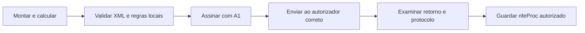

# Montagem e emissão da NF-e

[Manual](README.md) · [NFe](NFe.md) · [API](API.md)

A montagem cria o documento e seus grupos; a autorização acontece depois, na SEFAZ. Comece pela [identificação](NFe/infNFe/ide.md), que determina modelo, ambiente, finalidade, operação, emissão e referências. Escolha o regime e os dados fiscais com base na operação real; os valores dos exemplos são sintéticos.

## Grupos e dependências

| Etapa | Objeto / página | Cuidados |
|---|---|---|
| Identificar a nota | [ide](NFe/infNFe/ide.md), `nfe_ide_new` | UF, município, modelo, série, número, data/fuso, cNF, ambiente e versão do emissor |
| Identificar emitente/destinatário | [emit](NFe/infNFe/emit.md), [dest](NFe/infNFe/dest.md) | Documento e endereço; IE e condição cadastral não se inferem só do comprimento |
| Criar itens | [det](NFe/infNFe/det.md), `nfe_det_new`, `nfe_nfe_add_det` | nItem de 1 a 990; transferir produtos/impostos conforme os contratos |
| Informar mercadorias | [prod](NFe/infNFe/det/prod.md) | Código, descrição, NCM, CFOP, unidades, quantidades, valores; DI, rastreabilidade e outros subgrupos quando aplicáveis |
| Informar tributos | [imposto](NFe/infNFe/det/imposto.md) | Ramo ICMS/CSOSN, PIS/COFINS, IPI, ISSQN, II, IBS/CBS/IS conforme a operação; campos decimais não calculam o imposto |
| Referenciar documentos | [NFref](NFe/infNFe/ide/NFref.md), [DFeReferenciado](NFe/infNFe/det/DFeReferenciado.md) | Nota inteira e item são contextos diferentes, sujeitos às regras atuais de referenciamento |
| Totalizar | [total](NFe/infNFe/total.md) | `nfe_nfe_calcular_totais` soma ICMSTot; os demais totais, inclusive RTC, ficam com a aplicação |
| Transporte e pagamentos | [transp](NFe/infNFe/transp.md), [pag](NFe/infNFe/pag.md), [cobr](NFe/infNFe/cobr.md) | Modalidade do frete, volumes, vencimentos, meios e troco têm condições próprias |
| Complementar | [infAdic](NFe/infNFe/infAdic.md), [infRespTec](NFe/infNFe/infRespTec.md) e demais grupos do [índice](INDICE.md) | Criar apenas as estruturas pertinentes à operação |

Objetos ligados à nota são liberados por `nfe_nfe_free`. Não os reutilize em outra nota nem libere duas vezes. Observe os limites de itens e listas, e trate todos os retornos antes de continuar.

## Chave, totalização e XML

`nfe_nfe_chave` forma a chave a partir dos campos e atualiza cDV. `nfe_nfe_xml` serializa a nota; seu buffer pertence ao chamador. A ordem de grupos/elementos vem do leiaute e dos writers, não da ordem em que você preencheu os dados. Confira o contrato de [nfe_nfe.h](api/nfe_nfe.md), especialmente a exigência dos objetos obrigatórios e o comportamento de grupos opcionais vazios.

O [programa gerar_nfe.c](../../examples/gerar_nfe.c) monta uma **NFC-e sintética** e mostra transferência de posse, chave, totalização e XML. O [programa nfe_ibscbs.c](../../examples/nfe_ibscbs.c) monta uma **NF-e de regime normal** com RTC. Use o segundo para estudar esses grupos; o primeiro não serve como modelo fiscal para toda NF-e 55.

```sh
make exemplos
./obj/gerar_nfe
./obj/nfe_ibscbs
```

Esses programas não enviam notas. Os XMLs e instruções de reprodução por grupo estão nas páginas do [índice XML](INDICE.md). As alterações de valores líquidos e ICMS de pagamento antecipado anunciadas na NT 2026.008 ainda não estão no XSD/API desta revisão: consulte [bases e transições](BASES.md).

## Da nota montada ao arquivo autorizado



Siga [validação](VALIDACAO.md), [assinatura](ASSINATURA.md) e [serviços](SERVICOS.md). Depois de assinar, não modifique o XML: a assinatura cobre infNFe. Um retorno de transporte 0 ou um lote processado não bastam para declarar a nota autorizada. Grave o nfeProc associado ao protocolo da chave correta e registre rejeições para corrigir a causa antes de reenviar.

Anterior: [API](API.md) | Próximo: [Validação](VALIDACAO.md)
