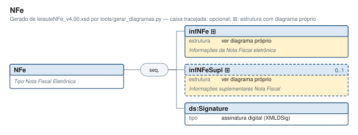

# NFe — Tipo Nota Fiscal Eletrônica

[Manual](README.md) › NFe

<!-- estado-xsd:inicio -->
> **Estado: documentado.** Estrutura conferida contra a base XSD registrada.
>
> `Base atual e revisada: c537394250f913b591f3984f1de2e9d1a1ec94d334a0086e7a41f9850f5f7917`
<!-- estado-xsd:fim -->

| Informação | Base conferida |
|---|---|
| Caminho XML | `NFe` |
| Leiaute / pacote XSD | NF-e/NFC-e 4.00 / PL010f v1.04, 31/08/2026 |
| Biblioteca conferida | libnfe 1.0.0-rc4, commit `1dd412eebca80dd80d884b3f03a1a31cfaf42279` |
| Revisão | 2026-10-05 |
| Contexto no leiaute | `1..1` no pai, sujeito às sequências e escolhas abaixo |

## Finalidade e quando preencher

A NF-e reúne os dados fiscais, a identificação e os itens em infNFe. O XML montado deve ser validado antes de ser assinado. A assinatura e o protocolo de autorização pertencem a etapas próprias; gerar um XML não representa sua autorização.

Descrição e observações do XSD adotado: Tipo Nota Fiscal Eletrônica. A estrutura e as restrições são as do pacote indicado; notas históricas de uso devem ser lidas junto às atualizações listadas nas referências.

## Estrutura, ordem e escolhas



[Abrir o diagrama](../diagramas/NFe.svg).

Uma ocorrência `1..1` dentro de uma alternativa exige o campo quando essa alternativa é selecionada; não obriga selecionar esse ramo em toda nota. Grupos opcionais podem conter filhos obrigatórios. Os elementos de sequência seguem a ordem indicada.

- **Sequência** `1..1`
  - `infNFe` `1..1`
  - `infNFeSupl` `0..1`
  - `ds:Signature` `1..1`

## Campos e atributos

| Tag / atributo | Significado e observações | Tipo XML | Ocorrência | Formato / limites | Condição no contexto |
|---|---|---|---|---|---|
| [`infNFe`](NFe/infNFe.md) | Informações da Nota Fiscal eletrônica | `complexType anônimo` | `1..1` | Grupo estruturado | Obrigatório no contexto |
| [`infNFeSupl`](NFe/infNFeSupl.md) | Informações suplementares Nota Fiscal | `complexType anônimo` | `0..1` | Grupo estruturado | Opcional no contexto |
| `ds:Signature` | Campo ds:Signature do grupo NFe | `assinatura digital (XMLDSig)` | `1..1` | Restrições do tipo assinatura digital (XMLDSig) | Obrigatório no contexto |

Campos decimais usam o separador `.` e a precisão indicada pelo tipo; preservar a representação textual evita perda por ponto flutuante. Ausência, texto vazio e zero são valores distintos. Padrões, comprimentos e enumerações precisam ser atendidos em conjunto; valores de códigos com zeros significativos devem conservar esses zeros. Campos de mesmo nome em outros pais têm contexto próprio.

## API C, integração e memória

Este grupo usa os objetos e funções específicos do módulo `nfe_nfe.h`. O contrato completo abaixo identifica os argumentos, a ligação ao pai, a serialização e a liberação. O exemplo indicado usa essas funções; o motor genérico não é um substituto automático para esse objeto.

[Contrato público de nfe_nfe.h](api/nfe_nfe.md) apresenta assinaturas, argumentos, retornos e limitações. [Convenções de memória e erros](API.md) explica cópia, empréstimo e transferência de posse.

Ao usar um grupo emprestado, libere o objeto proprietário, nunca o grupo separadamente. Os setters de texto copiam seus valores; getters retornam texto interno emprestado. A escolha de outro ramo válido pode apagar o anterior. Os campos obrigatórios do motor são conferidos na escrita; validar um valor isolado não prova completude do grupo. Os contratos específicos prevalecem quando a função indicada não usa o motor.

## Exemplo C conferido

[Fonte completo do cenário main](../../tests/test_validar.c) contém o preenchimento, a conferência dos retornos e a liberação dos recursos. O cenário integra o programa de testes indicado, com os headers e apoios do repositório. O XML foi observado na serialização desse cenário e validado, não deduzido de um desenho.

```sh
make obj/test_validar
./obj/test_validar tests
```

A função abaixo é o cenário completo do teste, incluindo tratamento dos retornos e eventuais verificações de erros. O XML publicado foi observado na validação da linha **120** do fonte indicado; a função pode exercitar outras alterações antes/depois desse ponto.

<details>
<summary>Função C completa do cenário main</summary>

```c
int main(int argc, char **argv)
{
	char dir[1024], *xml = NULL, *ruim;
	nfe_validador *v;
	nfe_erros *erros = nfe_erros_new();
	nfe_nfe *nfe;
	size_t tam = 0;

	if (argc < 2) {
		fprintf(stderr, "uso: %s <diretório tests>\n", argv[0]);
		return 2;
	}
	snprintf(dir, sizeof dir, "%s/schemas/nfe", argv[1]);
	v = nfe_validador_new(dir);
	VERIFICA(v != NULL);
	VERIFICA(erros != NULL);
	if (!v || !erros)
		TESTE_FIM();

	/* Diretório sem schemas */
	VERIFICA(nfe_validador_new("/nao/existe") == NULL);
	VERIFICA(nfe_dir_schemas() != NULL);

	/* Nota gerada pela biblioteca: válida (sem assinatura ainda) */
	nfe = nota(NFE_MODELO_NFCE);
	VERIFICA_INT(nfe_nfe_xml(nfe, &xml, &tam), 0);
	VERIFICA_INT(nfe_validar_xml(v, xml, tam, erros), 0);
	VERIFICA_INT(nfe_erros_qtd(erros), 0);
	/* Reaproveitando o validador, e sem lista de erros */
	VERIFICA_INT(nfe_validar_xml(v, xml, tam, NULL), 0);

	/* Campo fora da ordem do leiaute */
	ruim = troca(xml, "<natOp>VENDA</natOp><mod>65</mod>",
	             "<mod>65</mod><natOp>VENDA</natOp>");
	VERIFICA(ruim != NULL);
	if (ruim) {
		VERIFICA_INT(nfe_validar_xml(v, ruim, strlen(ruim), erros),
		             E_VALOR);
		VERIFICA(nfe_erros_qtd(erros) > 0);
		VERIFICA(tem_erro_no_campo(erros, "mod"));
	}
	free(ruim);

	/* Valor fora do padrão */
	ruim = troca(xml, "<cMunFG>3550308</cMunFG>", "<cMunFG>355</cMunFG>");
	VERIFICA(ruim != NULL);
	if (ruim) {
		VERIFICA_INT(nfe_validar_xml(v, ruim, strlen(ruim), erros),
		             E_VALOR);
		VERIFICA(tem_erro_no_campo(erros, "cMunFG"));
	}
	free(ruim);

	/* Regras da SEFAZ além do schema */
	VERIFICA_INT(nfe_erros_codigo(erros, 0), 0);
	/* Chave: dígito verificador errado (e cDV diferente) */
	regra(v, erros, xml, "123456784\"", "123456785\"", 236, "infNFe", 2);
	VERIFICA(tem_regra(erros, 502, "infNFe"));
	/* Chave não corresponde ao número da nota */
	regra(v, erros, xml, "<nNF>1</nNF>", "<nNF>2</nNF>", 502, "infNFe", 1);
	/* Totais diferentes da soma dos itens */
	{
		char *t = troca(xml, "<vProd>30.00</vProd>",
		                "<vProd>31.00</vProd>");

		VERIFICA(t != NULL);
		if (t)
			regra(v, erros, t, "<vNF>30.00</vNF>",
			      "<vNF>31.00</vNF>", 564, "vProd", 1);
		free(t);
	}
	regra(v, erros, xml, "<vNF>30.00</vNF>", "<vNF>29.00</vNF>", 610, "vNF",
	      1);
	regra(v, erros, xml, "<vBC>0.00</vBC>", "<vBC>1.00</vBC>", 531, "vBC",
	      1);
	regra(v, erros, xml, "<vST>0.00</vST>", "<vST>1.00</vST>", 534, "vST",
	      2); /* vST também entra em vNF */
	VERIFICA(tem_regra(erros, 610, "vNF"));
	/* UF e municípios fora de cUF */
	regra(v, erros, xml, "<UF>SP</UF>", "<UF>RJ</UF>", 0, "UF", 1);
	regra(v, erros, xml, "<cMunFG>3550308</cMunFG>",
	      "<cMunFG>3304557</cMunFG>", 0, "cMunFG", 1);
	/* NFC-e */
	regra(v, erros, xml, "<tpNF>1</tpNF>", "<tpNF>0</tpNF>", 706, "tpNF",
	      1);
	regra(v, erros, xml, "<idDest>1</idDest>", "<idDest>2</idDest>", 707,
	      "idDest", 1);
	regra(v, erros, xml, "</verProc>",
	      "</verProc><NFref><refNFe>35261012345678000195550010000000011"
	      "123456784</refNFe></NFref>",
	      708, "NFref", 1);
	regra(v, erros, xml, "<tpImp>4</tpImp>", "<tpImp>1</tpImp>", 709,
	      "tpImp", 1);
	regra(v, erros, xml, "<finNFe>1</finNFe>", "<finNFe>4</finNFe>", 715,
	      "finNFe", 1);
	regra(v, erros, xml, "<indFinal>1</indFinal>", "<indFinal>0</indFinal>",
	      716, "indFinal", 1);
	/* Não presencial: também sem o indicativo do intermediador */
	regra(v, erros, xml, "<indPres>1</indPres>", "<indPres>2</indPres>",
	      717, "indPres", 2);
	VERIFICA(tem_regra(erros, 434, "indIntermed"));
	regra(v, erros, xml, "<indPres>1</indPres>",
	      "<indPres>1</indPres><indIntermed>0</indIntermed>", 435,
	      "indIntermed", 1);
	/* Série reservada ao Fisco (a chave também deixa de corresponder) */
	regra(v, erros, xml, "<serie>1</serie>", "<serie>890</serie>", 244,
	      "serie", 2);
	regra(v, erros, xml, "<procEmi>0</procEmi>", "<procEmi>1</procEmi>",
	      451, "serie", 1);
	/* Contingência (tpEmis muda a chave: 502 em todos) */
	regra(v, erros, xml, "</verProc>",
	      "</verProc><dhCont>2026-10-03T05:00:00-03:00</dhCont>"
	      "<xJust>SEM CONEXAO COM A SEFAZ AUTORIZADORA</xJust>",
	      556, "dhCont", 1);
	regra(v, erros, xml, "<tpEmis>1</tpEmis>", "<tpEmis>9</tpEmis>", 557,
	      "tpEmis", 2);
	regra(v, erros, xml, "<tpEmis>1</tpEmis>", "<tpEmis>3</tpEmis>", 570,
	      "tpEmis", 2);
	regra(v, erros, xml, "<tpEmis>1</tpEmis>", "<tpEmis>5</tpEmis>", 714,
	      "tpEmis", 3);
	VERIFICA(tem_regra(erros, 557, "tpEmis"));
	regra(v, erros, xml, "<tpEmis>1</tpEmis>", "<tpEmis>7</tpEmis>", 783,
	      "tpEmis", 2);
	{
		/* Off-line com dhCont e xJust: só a chave */
		char *t = troca(xml, "</verProc>",
		                "</verProc>"
		                "<dhCont>2026-10-03T05:00:00-03:00</dhCont>"
		                "<xJust>SEM CONEXAO COM A SEFAZ AUTORIZADORA"
		                "</xJust>");

		VERIFICA(t != NULL);
		if (t)
			regra(v, erros, t, "<tpEmis>1</tpEmis>",
			      "<tpEmis>9</tpEmis>", 502, "infNFe", 1);
		free(t);
	}
	/* NF-e com o que é próprio da NFC-e */
	{
		char *t = troca(xml, "<mod>65</mod>", "<mod>55</mod>");

		VERIFICA(t != NULL);
		if (t) {
			/* mod também está na chave; tpImp 4 e indPres 1 */
			regra(v, erros, t, "<tpEmis>1</tpEmis>",
			      "<tpEmis>9</tpEmis>", 711, "tpEmis", 4);
			VERIFICA(tem_regra(erros, 710, "tpImp"));
			regra(v, erros, t, "<indPres>1</indPres>",
			      "<indPres>4</indPres><indIntermed>0</"
			      "indIntermed>",
			      794, "indPres", 3);
		}
		free(t);
	}
	VERIFICA_INT(nfe_erros_codigo(NULL, 0), 0);

	/* XML malformado e documento que não é NF-e */
	VERIFICA_INT(nfe_validar_xml(v, "<NFe>", 5, erros), E_XML);
	VERIFICA(nfe_erros_qtd(erros) > 0);
	VERIFICA_INT(nfe_validar_xml(v, "<a/>", 4, erros), E_XML);
	VERIFICA_INT(nfe_erros_qtd(erros), 1);
	VERIFICA_INT(nfe_validar_xml(NULL, xml, tam, erros), E_ISNULL);
	VERIFICA(nfe_erros_msg(erros, 99) == NULL);
	VERIFICA(nfe_erros_campo(NULL, 0) == NULL);
	VERIFICA_INT(nfe_erros_linha(erros, -1), 0);

	/* Validador de um schema qualquer, sem as regras da NF-e */
	{
		static const char cons[] =
		        "<consSitNFe "
		        "xmlns=\"http://www.portalfiscal.inf.br/nfe\" "
		        "versao=\"4.00\"><tpAmb>2</tpAmb><xServ>CONSULTAR"
		        "</xServ><chNFe>35261000000000000000650010000000011000"
		        "000010</chNFe></consSitNFe>";
		char caminho[1100];
		nfe_validador *x;

		VERIFICA(nfe_validador_xsd(NULL) == NULL);
		VERIFICA(nfe_validador_xsd("/nao/existe.xsd") == NULL);
		snprintf(caminho, sizeof caminho, "%s/consSitNFe_v4.00.xsd",
		         dir);
		x = nfe_validador_xsd(caminho);
		VERIFICA(x != NULL);
		if (x) {
			VERIFICA_INT(nfe_validar_xsd(x, cons, sizeof cons - 1,
			                             0, erros),
			             0);
			/* A assinatura de mentira não cabe nesta mensagem */
			VERIFICA_INT(nfe_validar_xsd(x, cons, sizeof cons - 1,
			                             1, erros),
			             E_VALOR);
			VERIFICA_INT(nfe_validar_xsd(x, "<a", 2, 0, erros),
			             E_XML);
			VERIFICA(nfe_erros_qtd(erros) > 0);
		}
		nfe_validador_free(x);

		/* NF-e pelo schema geral: sem assinatura, só completando */
		snprintf(caminho, sizeof caminho, "%s/nfe_v4.00.xsd", dir);
		x = nfe_validador_xsd(caminho);
		VERIFICA(x != NULL);
		if (x) {
			VERIFICA_INT(nfe_validar_xsd(x, xml, tam, 1, erros), 0);
			VERIFICA_INT(nfe_validar_xsd(x, xml, tam, 0, erros),
			             E_VALOR);
			VERIFICA_INT(nfe_validar_xsd(NULL, xml, tam, 0, erros),
			             E_ISNULL);
		}
		nfe_validador_free(x);
	}

	free(xml);
	nfe_nfe_free(nfe);
	nfe_erros_free(erros);
	nfe_validador_free(v);
	nfe_validador_free(NULL);
	nfe_erros_free(NULL);
	xmlCleanupParser();
	TESTE_FIM();
}
```

</details>

## XML correspondente

Trecho do cenário acima, com namespace preservado. [XML completo do cenário](exemplos/grupos/test_validar-0001.xml) permite conferir valores e ancestrais. Dados sintéticos; este exemplo comprova estrutura e uso da API, sem transmissão, autorização ou validação de enquadramento fiscal.

```xml
<NFe xmlns="http://www.portalfiscal.inf.br/nfe" xmlns:ns1="http://www.w3.org/2000/09/xmldsig#">
  <infNFe versao="4.00" Id="NFe35261012345678000195650010000000011123456784">
    <ide>
      <cUF>35</cUF>
      <cNF>12345678</cNF>
      <natOp>VENDA</natOp>
      <mod>65</mod>
      <serie>1</serie>
      <nNF>1</nNF>
      <dhEmi>2026-10-03T05:00:00-03:00</dhEmi>
      <tpNF>1</tpNF>
      <idDest>1</idDest>
      <cMunFG>3550308</cMunFG>
      <tpImp>4</tpImp>
      <tpEmis>1</tpEmis>
      <cDV>4</cDV>
      <tpAmb>2</tpAmb>
      <finNFe>1</finNFe>
      <indFinal>1</indFinal>
      <indPres>1</indPres>
      <procEmi>0</procEmi>
      <verProc>tooldoce</verProc>
    </ide>
    <emit>
      <CNPJ>12345678000195</CNPJ>
      <xNome>EMPRESA EXEMPLO LTDA</xNome>
      <enderEmit>
        <xLgr>RUA DAS FLORES</xLgr>
        <nro>123</nro>
        <xBairro>CENTRO</xBairro>
        <cMun>3550308</cMun>
        <xMun>SAO PAULO</xMun>
        <UF>SP</UF>
        <CEP>01001000</CEP>
      </enderEmit>
      <IE>123456789012</IE>
      <CRT>1</CRT>
    </emit>
    <det nItem="1">
      <prod>
        <cProd>001</cProd>
        <cEAN>SEM GTIN</cEAN>
        <xProd>CANETA AZUL</xProd>
        <NCM>96081000</NCM>
        <CFOP>5102</CFOP>
        <uCom>UN</uCom>
        <qCom>10</qCom>
        <vUnCom>1.50</vUnCom>
        <vProd>15.00</vProd>
        <cEANTrib>SEM GTIN</cEANTrib>
        <uTrib>UN</uTrib>
        <qTrib>10</qTrib>
        <vUnTrib>1.50</vUnTrib>
        <indTot>1</indTot>
      </prod>
      <imposto>
        <ICMS>
          <ICMSSN102>
            <orig>0</orig>
            <CSOSN>102</CSOSN>
          </ICMSSN102>
        </ICMS>
        <PIS>
          <PISNT>
            <CST>08</CST>
          </PISNT>
        </PIS>
        <COFINS>
          <COFINSNT>
            <CST>08</CST>
          </COFINSNT>
        </COFINS>
      </imposto>
    </det>
    <det nItem="2">
      <prod>
        <cProd>002</cProd>
        <cEAN>SEM GTIN</cEAN>
        <xProd>CANETA AZUL</xProd>
        <NCM>96081000</NCM>
        <CFOP>5102</CFOP>
        <uCom>UN</uCom>
        <qCom>10</qCom>
        <vUnCom>1.50</vUnCom>
        <vProd>15.00</vProd>
        <cEANTrib>SEM GTIN</cEANTrib>
        <uTrib>UN</uTrib>
        <qTrib>10</qTrib>
        <vUnTrib>1.50</vUnTrib>
        <indTot>1</indTot>
      </prod>
      <imposto>
        <ICMS>
          <ICMSSN102>
            <orig>0</orig>
            <CSOSN>102</CSOSN>
          </ICMSSN102>
        </ICMS>
        <PIS>
          <PISNT>
            <CST>08</CST>
          </PISNT>
        </PIS>
        <COFINS>
          <COFINSNT>
            <CST>08</CST>
          </COFINSNT>
        </COFINS>
      </imposto>
    </det>
    <total>
      <ICMSTot>
        <vBC>0.00</vBC>
        <vICMS>0.00</vICMS>
        <vICMSDeson>0.00</vICMSDeson>
        <vFCP>0.00</vFCP>
        <vBCST>0.00</vBCST>
        <vST>0.00</vST>
        <vFCPST>0.00</vFCPST>
        <vFCPSTRet>0.00</vFCPSTRet>
        <vProd>30.00</vProd>
        <vFrete>0.00</vFrete>
        <vSeg>0.00</vSeg>
        <vDesc>0.00</vDesc>
        <vII>0.00</vII>
        <vIPI>0.00</vIPI>
        <vIPIDevol>0.00</vIPIDevol>
        <vPIS>0.00</vPIS>
        <vCOFINS>0.00</vCOFINS>
        <vOutro>0.00</vOutro>
        <vNF>30.00</vNF>
      </ICMSTot>
    </total>
    <transp>
      <modFrete>9</modFrete>
    </transp>
    <pag>
      <detPag>
        <tPag>01</tPag>
        <vPag>30.00</vPag>
      </detPag>
    </pag>
  </infNFe>
  <ns1:Signature>
    <ns1:SignedInfo>
      <ns1:CanonicalizationMethod Algorithm="http://www.w3.org/TR/2001/REC-xml-c14n-20010315" />
      <ns1:SignatureMethod Algorithm="http://www.w3.org/2000/09/xmldsig#rsa-sha1" />
      <ns1:Reference URI="#NFe">
        <ns1:Transforms>
          <ns1:Transform Algorithm="http://www.w3.org/2000/09/xmldsig#enveloped-signature" />
          <ns1:Transform Algorithm="http://www.w3.org/TR/2001/REC-xml-c14n-20010315" />
        </ns1:Transforms>
        <ns1:DigestMethod Algorithm="http://www.w3.org/2000/09/xmldsig#sha1" />
        <ns1:DigestValue>AAAA</ns1:DigestValue>
      </ns1:Reference>
    </ns1:SignedInfo>
    <ns1:SignatureValue>AAAA</ns1:SignatureValue>
    <ns1:KeyInfo>
      <ns1:X509Data>
        <ns1:X509Certificate>AAAA</ns1:X509Certificate>
      </ns1:X509Data>
    </ns1:KeyInfo>
  </ns1:Signature>
</NFe>
```

O fragmento é validado no contexto que o declara no leiaute, com namespace e ancestrais. O wrapper tipos_v4.00.xsd, quando usado nos testes, extrai essas declarações do schema oficial e é identificado como apoio de testes, sem substituir o pacote oficial.

## Validação, erros e limites

| Situação | Etapa / resultado | Tratamento |
|---|---|---|
| Ponteiro obrigatório nulo | API: `E_ISNULL` (-1), conforme contrato da função | Conferir criação e argumentos |
| Texto fora do comprimento | Setter/motor: `E_TAMANHO` (-2) | Usar os limites do tipo e do argumento C |
| Domínio, padrão ou caminho inválido/ambíguo | Setter/motor: `E_VALOR` (-3) | Corrigir o valor e usar caminho completo |
| Campo obrigatório ou escolha incompleta | Escrita do motor: `E_VALOR`; XSD rejeita | Completar o ramo selecionado |
| Falha de escrita XML | Writer: `E_XML` (-4) | Descartar saída parcial e tratar a falha |
| Falta de memória | Criação: NULL; operações que alocam podem retornar `E_MALLOC` (-101) | Encerrar com limpeza dos recursos ainda próprios |
| Regra fiscal, cadastro, cálculo ou vigência | Pode ser aceito lexicalmente; depende da regra e do autorizador | Conferir fontes e contratos; não confundir 0 com autorização |

Os códigos negativos são da biblioteca, não códigos cStat. [Validação e regras implementadas](VALIDACAO.md) distingue XSD, verificações locais e retorno da SEFAZ. A referência da API identifica exceções aos comportamentos gerais desta tabela.

## Referências e grupos relacionados

- XSD atual: [leiaute](../../tests/schemas/nfe/leiauteNFe_v4.00.xsd), [tipos básicos](../../tests/schemas/nfe/tiposBasico_v4.00.xsd) e [tipos DFe/RTC](../../tests/schemas/nfe/DFeTiposBasicos_v1.00.xsd).
- MOC 7.0, Anexo I: A, p. 8. [Fontes oficiais, versões e transições](BASES.md) relaciona atualizações posteriores, com vigência separada da publicação.
- API: [nfe_nfe.h](../../include/libnfe/nfe_nfe.h) e [referência das funções](api/nfe_nfe.md).
- Filhos: [infNFe](NFe/infNFe.md), [infNFeSupl](NFe/infNFeSupl.md).

Anterior: [índice](README.md) | Próximo: [infNFe](NFe/infNFe.md)
