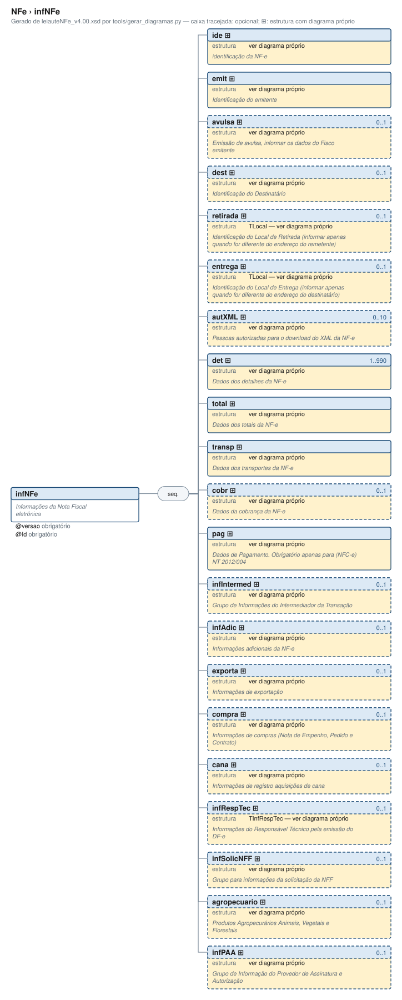

# infNFe — Informações da Nota Fiscal eletrônica

[Manual](../README.md) › [NFe](../NFe.md) › infNFe

<!-- estado-xsd:inicio -->
> **Estado: documentado.** Estrutura conferida contra a base XSD registrada.
>
> `Base atual e revisada: c537394250f913b591f3984f1de2e9d1a1ec94d334a0086e7a41f9850f5f7917`
<!-- estado-xsd:fim -->

| Informação | Base conferida |
|---|---|
| Caminho XML | `NFe/infNFe` |
| Leiaute / pacote XSD | NF-e/NFC-e 4.00 / PL010f v1.04, 31/08/2026 |
| Biblioteca conferida | libnfe 1.0.0-rc4, commit `1dd412eebca80dd80d884b3f03a1a31cfaf42279` |
| Revisão | 2026-10-05 |
| Contexto no leiaute | `1..1` no pai, sujeito às sequências e escolhas abaixo |

## Finalidade e quando preencher

A NF-e reúne os dados fiscais, a identificação e os itens em infNFe. O XML montado deve ser validado antes de ser assinado. A assinatura e o protocolo de autorização pertencem a etapas próprias; gerar um XML não representa sua autorização.

Descrição e observações do XSD adotado: Informações da Nota Fiscal eletrônica. A estrutura e as restrições são as do pacote indicado; notas históricas de uso devem ser lidas junto às atualizações listadas nas referências.

## Estrutura, ordem e escolhas



[Abrir o diagrama](../../diagramas/NFe/infNFe.svg).

Uma ocorrência `1..1` dentro de uma alternativa exige o campo quando essa alternativa é selecionada; não obriga selecionar esse ramo em toda nota. Grupos opcionais podem conter filhos obrigatórios. Os elementos de sequência seguem a ordem indicada.

- **Sequência** `1..1`
  - `ide` `1..1`
  - `emit` `1..1`
  - `avulsa` `0..1`
  - `dest` `0..1`
  - `retirada` `0..1`
  - `entrega` `0..1`
  - `autXML` `0..10`
  - `det` `1..990`
  - `total` `1..1`
  - `transp` `1..1`
  - `cobr` `0..1`
  - `pag` `1..1`
  - `infIntermed` `0..1`
  - `infAdic` `0..1`
  - `exporta` `0..1`
  - `compra` `0..1`
  - `cana` `0..1`
  - `infRespTec` `0..1`
  - `infSolicNFF` `0..1`
  - `agropecuario` `0..1`
  - `infPAA` `0..1`

## Campos e atributos

| Tag / atributo | Significado e observações | Tipo XML | Ocorrência | Formato / limites | Condição no contexto |
|---|---|---|---|---|---|
| `@versao` | Versão do leiaute (v4.00) | `TVerNFe` | `1..1` | Padrão: `4\.00`<br>Tratamento de espaços: preserve | Obrigatório |
| `@Id` | PL_005d - 11/08/09 - validação do Id | `ID` | `1..1` | Padrão: `NFe[0-9]{6}[0-9A-Z]{12}[0-9]{26}` | Obrigatório |
| [`ide`](infNFe/ide.md) | identificação da NF-e | `complexType anônimo` | `1..1` | Grupo estruturado | Obrigatório no contexto |
| [`emit`](infNFe/emit.md) | Identificação do emitente | `complexType anônimo` | `1..1` | Grupo estruturado | Obrigatório no contexto |
| [`avulsa`](infNFe/avulsa.md) | Emissão de avulsa, informar os dados do Fisco emitente | `complexType anônimo` | `0..1` | Grupo estruturado | Opcional no contexto |
| [`dest`](infNFe/dest.md) | Identificação do Destinatário | `complexType anônimo` | `0..1` | Grupo estruturado | Opcional no contexto |
| [`retirada`](infNFe/retirada.md) | Identificação do Local de Retirada (informar apenas quando for diferente do endereço do remetente) | `TLocal` | `0..1` | Grupo estruturado | Opcional no contexto |
| [`entrega`](infNFe/entrega.md) | Identificação do Local de Entrega (informar apenas quando for diferente do endereço do destinatário) | `TLocal` | `0..1` | Grupo estruturado | Opcional no contexto |
| [`autXML`](infNFe/autXML.md) | Pessoas autorizadas para o download do XML da NF-e | `complexType anônimo` | `0..10` | Grupo estruturado | Opcional no contexto |
| [`det`](infNFe/det.md) | Dados dos detalhes da NF-e | `complexType anônimo` | `1..990` | Grupo estruturado | Obrigatório no contexto |
| [`total`](infNFe/total.md) | Dados dos totais da NF-e | `complexType anônimo` | `1..1` | Grupo estruturado | Obrigatório no contexto |
| [`transp`](infNFe/transp.md) | Dados dos transportes da NF-e | `complexType anônimo` | `1..1` | Grupo estruturado | Obrigatório no contexto |
| [`cobr`](infNFe/cobr.md) | Dados da cobrança da NF-e | `complexType anônimo` | `0..1` | Grupo estruturado | Opcional no contexto |
| [`pag`](infNFe/pag.md) | Dados de Pagamento. Obrigatório apenas para (NFC-e) NT 2012/004 | `complexType anônimo` | `1..1` | Grupo estruturado | Obrigatório no contexto |
| [`infIntermed`](infNFe/infIntermed.md) | Grupo de Informações do Intermediador da Transação | `complexType anônimo` | `0..1` | Grupo estruturado | Opcional no contexto |
| [`infAdic`](infNFe/infAdic.md) | Informações adicionais da NF-e | `complexType anônimo` | `0..1` | Grupo estruturado | Opcional no contexto |
| [`exporta`](infNFe/exporta.md) | Informações de exportação | `complexType anônimo` | `0..1` | Grupo estruturado | Opcional no contexto |
| [`compra`](infNFe/compra.md) | Informações de compras (Nota de Empenho, Pedido e Contrato) | `complexType anônimo` | `0..1` | Grupo estruturado | Opcional no contexto |
| [`cana`](infNFe/cana.md) | Informações de registro aquisições de cana | `complexType anônimo` | `0..1` | Grupo estruturado | Opcional no contexto |
| [`infRespTec`](infNFe/infRespTec.md) | Informações do Responsável Técnico pela emissão do DF-e | `TInfRespTec` | `0..1` | Grupo estruturado | Opcional no contexto |
| [`infSolicNFF`](infNFe/infSolicNFF.md) | Grupo para informações da solicitação da NFF | `complexType anônimo` | `0..1` | Grupo estruturado | Opcional no contexto |
| [`agropecuario`](infNFe/agropecuario.md) | Produtos Agropecurários Animais, Vegetais e Florestais | `complexType anônimo` | `0..1` | Grupo estruturado | Opcional no contexto |
| [`infPAA`](infNFe/infPAA.md) | Grupo de Informação do Provedor de Assinatura e Autorização | `complexType anônimo` | `0..1` | Grupo estruturado | Opcional no contexto |

Campos decimais usam o separador `.` e a precisão indicada pelo tipo; preservar a representação textual evita perda por ponto flutuante. Ausência, texto vazio e zero são valores distintos. Padrões, comprimentos e enumerações precisam ser atendidos em conjunto; valores de códigos com zeros significativos devem conservar esses zeros. Campos de mesmo nome em outros pais têm contexto próprio.

## API C, integração e memória

Este grupo usa os objetos e funções específicos do módulo `nfe_nfe.h`. O contrato completo abaixo identifica os argumentos, a ligação ao pai, a serialização e a liberação. O exemplo indicado usa essas funções; o motor genérico não é um substituto automático para esse objeto.

[Contrato público de nfe_nfe.h](../api/nfe_nfe.md) apresenta assinaturas, argumentos, retornos e limitações. [Convenções de memória e erros](../API.md) explica cópia, empréstimo e transferência de posse.

Ao usar um grupo emprestado, libere o objeto proprietário, nunca o grupo separadamente. Os setters de texto copiam seus valores; getters retornam texto interno emprestado. A escolha de outro ramo válido pode apagar o anterior. Os campos obrigatórios do motor são conferidos na escrita; validar um valor isolado não prova completude do grupo. Os contratos específicos prevalecem quando a função indicada não usa o motor.

## Exemplo C conferido

[Fonte completo do cenário teste_nfce](../../../tests/test_nfe.c) contém o preenchimento, a conferência dos retornos e a liberação dos recursos. O cenário integra o programa de testes indicado, com os headers e apoios do repositório. O XML foi observado na serialização desse cenário e validado, não deduzido de um desenho.

```sh
make obj/test_nfe
./obj/test_nfe tests
```

A função abaixo é o cenário completo do teste, incluindo tratamento dos retornos e eventuais verificações de erros. O XML publicado foi observado na validação da linha **103** do fonte indicado; a função pode exercitar outras alterações antes/depois desse ponto.

<details>
<summary>Função C completa do cenário teste_nfce</summary>

```c
static void teste_nfce(void)
{
	nfe_nfe *nfe = nota(NFE_MODELO_NFCE);
	char chave[45];
	char *xml = NULL;
	size_t tam = 0;

	VERIFICA_INT(nfe_nfe_chave(nfe, chave, sizeof chave), 0);
	VERIFICA_INT(strlen(chave), 44);
	VERIFICA(strncmp(chave + 20, "65001000000001", 14) == 0);

	VERIFICA_INT(nfe_nfe_xml(nfe, &xml, &tam), 0);
	VERIFICA(xml != NULL);
	if (xml) {
		char id[128];

		snprintf(id, sizeof id, "<infNFe versao=\"4.00\" Id=\"NFe%s\">",
		         chave);
		VERIFICA_INT(tam, strlen(xml));
		VERIFICA(strncmp(xml,
		                 "<?xml version=\"1.0\" encoding=\"UTF-8\"?>"
		                 "<NFe xmlns=\"" TESTE_NS "\">",
		                 38 + 47) == 0);
		VERIFICA(strstr(xml, id) != NULL);
		VERIFICA(strstr(xml, "<mod>65</mod>") != NULL);
		/* cDV igual ao último dígito da chave */
		{
			char cdv[16];
			snprintf(cdv, sizeof cdv, "<cDV>%c</cDV>", chave[43]);
			VERIFICA(strstr(xml, cdv) != NULL);
		}
		VERIFICA(strstr(xml, "<det nItem=\"1\"><prod><cProd>001") !=
		         NULL);
		VERIFICA(strstr(xml, "<det nItem=\"2\"><prod><cProd>002") !=
		         NULL);
		VERIFICA(strstr(xml, "</emit><det") != NULL); /* sem dest */
		VERIFICA(strstr(xml, "</det><total>") != NULL);
		VERIFICA(strstr(xml, "</total><transp>") != NULL);
		VERIFICA(strstr(xml, "</transp><pag>") != NULL);
		VERIFICA(strstr(xml, "</pag></infNFe></NFe>") != NULL);
		VERIFICA(xml[tam - 1] == '>'); /* sem quebra de linha no fim */
		VERIFICA(strchr(xml, '\n') == NULL);
		VERIFICA_INT(valida_infnfe(xml), 0);
	}
	free(xml);
	nfe_nfe_free(nfe);
}
```

</details>

## XML correspondente

Trecho do cenário acima, com namespace preservado. [XML completo do cenário](../exemplos/grupos/test_nfe-0001.xml) permite conferir valores e ancestrais. Dados sintéticos; este exemplo comprova estrutura e uso da API, sem transmissão, autorização ou validação de enquadramento fiscal.

```xml
<infNFe xmlns="http://www.portalfiscal.inf.br/nfe" versao="4.00" Id="NFe35261012345678000195650010000000011123456784">
  <ide>
    <cUF>35</cUF>
    <cNF>12345678</cNF>
    <natOp>VENDA</natOp>
    <mod>65</mod>
    <serie>1</serie>
    <nNF>1</nNF>
    <dhEmi>2026-10-03T05:00:00-03:00</dhEmi>
    <tpNF>1</tpNF>
    <idDest>1</idDest>
    <cMunFG>3550308</cMunFG>
    <tpImp>4</tpImp>
    <tpEmis>1</tpEmis>
    <cDV>4</cDV>
    <tpAmb>2</tpAmb>
    <finNFe>1</finNFe>
    <indFinal>1</indFinal>
    <indPres>1</indPres>
    <procEmi>0</procEmi>
    <verProc>tooldoce</verProc>
  </ide>
  <emit>
    <CNPJ>12345678000195</CNPJ>
    <xNome>EMPRESA EXEMPLO LTDA</xNome>
    <enderEmit>
      <xLgr>RUA DAS FLORES</xLgr>
      <nro>123</nro>
      <xBairro>CENTRO</xBairro>
      <cMun>3550308</cMun>
      <xMun>SAO PAULO</xMun>
      <UF>SP</UF>
      <CEP>01001000</CEP>
    </enderEmit>
    <IE>123456789012</IE>
    <CRT>1</CRT>
  </emit>
  <det nItem="1">
    <prod>
      <cProd>001</cProd>
      <cEAN>SEM GTIN</cEAN>
      <xProd>CANETA AZUL</xProd>
      <NCM>96081000</NCM>
      <CFOP>5102</CFOP>
      <uCom>UN</uCom>
      <qCom>10</qCom>
      <vUnCom>1.50</vUnCom>
      <vProd>15.00</vProd>
      <cEANTrib>SEM GTIN</cEANTrib>
      <uTrib>UN</uTrib>
      <qTrib>10</qTrib>
      <vUnTrib>1.50</vUnTrib>
      <indTot>1</indTot>
    </prod>
    <imposto>
      <ICMS>
        <ICMSSN102>
          <orig>0</orig>
          <CSOSN>102</CSOSN>
        </ICMSSN102>
      </ICMS>
      <PIS>
        <PISNT>
          <CST>08</CST>
        </PISNT>
      </PIS>
      <COFINS>
        <COFINSNT>
          <CST>08</CST>
        </COFINSNT>
      </COFINS>
    </imposto>
  </det>
  <det nItem="2">
    <prod>
      <cProd>002</cProd>
      <cEAN>SEM GTIN</cEAN>
      <xProd>CANETA AZUL</xProd>
      <NCM>96081000</NCM>
      <CFOP>5102</CFOP>
      <uCom>UN</uCom>
      <qCom>10</qCom>
      <vUnCom>1.50</vUnCom>
      <vProd>15.00</vProd>
      <cEANTrib>SEM GTIN</cEANTrib>
      <uTrib>UN</uTrib>
      <qTrib>10</qTrib>
      <vUnTrib>1.50</vUnTrib>
      <indTot>1</indTot>
    </prod>
    <imposto>
      <ICMS>
        <ICMSSN102>
          <orig>0</orig>
          <CSOSN>102</CSOSN>
        </ICMSSN102>
      </ICMS>
      <PIS>
        <PISNT>
          <CST>08</CST>
        </PISNT>
      </PIS>
      <COFINS>
        <COFINSNT>
          <CST>08</CST>
        </COFINSNT>
      </COFINS>
    </imposto>
  </det>
  <total>
    <ICMSTot>
      <vBC>0.00</vBC>
      <vICMS>0.00</vICMS>
      <vICMSDeson>0.00</vICMSDeson>
      <vFCP>0.00</vFCP>
      <vBCST>0.00</vBCST>
      <vST>0.00</vST>
      <vFCPST>0.00</vFCPST>
      <vFCPSTRet>0.00</vFCPSTRet>
      <vProd>30.00</vProd>
      <vFrete>0.00</vFrete>
      <vSeg>0.00</vSeg>
      <vDesc>0.00</vDesc>
      <vII>0.00</vII>
      <vIPI>0.00</vIPI>
      <vIPIDevol>0.00</vIPIDevol>
      <vPIS>0.00</vPIS>
      <vCOFINS>0.00</vCOFINS>
      <vOutro>0.00</vOutro>
      <vNF>30.00</vNF>
    </ICMSTot>
  </total>
  <transp>
    <modFrete>9</modFrete>
  </transp>
  <pag>
    <detPag>
      <tPag>01</tPag>
      <vPag>30.00</vPag>
    </detPag>
  </pag>
</infNFe>
```

O fragmento é validado no contexto que o declara no leiaute, com namespace e ancestrais. O wrapper tipos_v4.00.xsd, quando usado nos testes, extrai essas declarações do schema oficial e é identificado como apoio de testes, sem substituir o pacote oficial.

## Validação, erros e limites

| Situação | Etapa / resultado | Tratamento |
|---|---|---|
| Ponteiro obrigatório nulo | API: `E_ISNULL` (-1), conforme contrato da função | Conferir criação e argumentos |
| Texto fora do comprimento | Setter/motor: `E_TAMANHO` (-2) | Usar os limites do tipo e do argumento C |
| Domínio, padrão ou caminho inválido/ambíguo | Setter/motor: `E_VALOR` (-3) | Corrigir o valor e usar caminho completo |
| Campo obrigatório ou escolha incompleta | Escrita do motor: `E_VALOR`; XSD rejeita | Completar o ramo selecionado |
| Falha de escrita XML | Writer: `E_XML` (-4) | Descartar saída parcial e tratar a falha |
| Falta de memória | Criação: NULL; operações que alocam podem retornar `E_MALLOC` (-101) | Encerrar com limpeza dos recursos ainda próprios |
| Regra fiscal, cadastro, cálculo ou vigência | Pode ser aceito lexicalmente; depende da regra e do autorizador | Conferir fontes e contratos; não confundir 0 com autorização |

Os códigos negativos são da biblioteca, não códigos cStat. [Validação e regras implementadas](../VALIDACAO.md) distingue XSD, verificações locais e retorno da SEFAZ. A referência da API identifica exceções aos comportamentos gerais desta tabela.

## Referências e grupos relacionados

- XSD atual: [leiaute](../../../tests/schemas/nfe/leiauteNFe_v4.00.xsd), [tipos básicos](../../../tests/schemas/nfe/tiposBasico_v4.00.xsd) e [tipos DFe/RTC](../../../tests/schemas/nfe/DFeTiposBasicos_v1.00.xsd).
- MOC 7.0, Anexo I: A, p. 8. [Fontes oficiais, versões e transições](../BASES.md) relaciona atualizações posteriores, com vigência separada da publicação.
- API: [nfe_nfe.h](../../../include/libnfe/nfe_nfe.h) e [referência das funções](../api/nfe_nfe.md).
- Grupo pai: [NFe](../NFe.md).
- Filhos: [ide](infNFe/ide.md), [emit](infNFe/emit.md), [avulsa](infNFe/avulsa.md), [dest](infNFe/dest.md), [retirada](infNFe/retirada.md), [entrega](infNFe/entrega.md), [autXML](infNFe/autXML.md), [det](infNFe/det.md), [total](infNFe/total.md), [transp](infNFe/transp.md), [cobr](infNFe/cobr.md), [pag](infNFe/pag.md), [infIntermed](infNFe/infIntermed.md), [infAdic](infNFe/infAdic.md), [exporta](infNFe/exporta.md), [compra](infNFe/compra.md), [cana](infNFe/cana.md), [infRespTec](infNFe/infRespTec.md), [infSolicNFF](infNFe/infSolicNFF.md), [agropecuario](infNFe/agropecuario.md), [infPAA](infNFe/infPAA.md).

Anterior: [NFe](../NFe.md) | Próximo: [ide](infNFe/ide.md)
