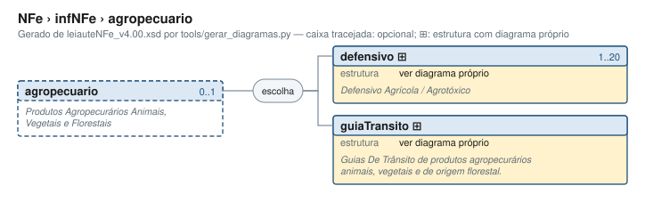

# agropecuario — Produtos Agropecurários Animais, Vegetais e Florestais

[Manual](../../README.md) › [NFe](../../NFe.md) › [infNFe](../infNFe.md) › agropecuario

<!-- estado-xsd:inicio -->
> **Estado: documentado.** Estrutura conferida contra a base XSD registrada.
>
> `Base atual e revisada: c537394250f913b591f3984f1de2e9d1a1ec94d334a0086e7a41f9850f5f7917`
<!-- estado-xsd:fim -->

| Informação | Base conferida |
|---|---|
| Caminho XML | `NFe/infNFe/agropecuario` |
| Leiaute / pacote XSD | NF-e/NFC-e 4.00 / PL010f v1.04, 31/08/2026 |
| Biblioteca conferida | libnfe 1.0.0-rc4, commit `1dd412eebca80dd80d884b3f03a1a31cfaf42279` |
| Revisão | 2026-10-05 |
| Contexto no leiaute | `0..1` no pai, sujeito às sequências e escolhas abaixo |

## Finalidade e quando preencher

Detalha operações agropecuárias nas alternativas de defensivo/agrotóxico e guia de trânsito. Selecione o ramo correspondente ao documento e à operação; não misture alternativas exclusivas na mesma ocorrência.

Descrição e observações do XSD adotado: Produtos Agropecurários Animais, Vegetais e Florestais. A estrutura e as restrições são as do pacote indicado; notas históricas de uso devem ser lidas junto às atualizações listadas nas referências.

## Estrutura, ordem e escolhas



[Abrir o diagrama](../../../diagramas/NFe/infNFe/agropecuario.svg).

Uma ocorrência `1..1` dentro de uma alternativa exige o campo quando essa alternativa é selecionada; não obriga selecionar esse ramo em toda nota. Grupos opcionais podem conter filhos obrigatórios. Os elementos de sequência seguem a ordem indicada.

- **Escolha exclusiva** `1..1`
  - `defensivo` `1..20`
  - `guiaTransito` `1..1`

## Campos e atributos

| Tag / atributo | Significado e observações | Tipo XML | Ocorrência | Formato / limites | Condição no contexto |
|---|---|---|---|---|---|
| [`defensivo`](agropecuario/defensivo.md) | Defensivo Agrícola / Agrotóxico | `complexType anônimo` | `1..20` | Grupo estruturado | Obrigatório no contexto; apenas na alternativa selecionada |
| [`guiaTransito`](agropecuario/guiaTransito.md) | Guias De Trânsito de produtos agropecurários animais, vegetais e de origem florestal. | `complexType anônimo` | `1..1` | Grupo estruturado | Obrigatório no contexto; apenas na alternativa selecionada |

Campos decimais usam o separador `.` e a precisão indicada pelo tipo; preservar a representação textual evita perda por ponto flutuante. Ausência, texto vazio e zero são valores distintos. Padrões, comprimentos e enumerações precisam ser atendidos em conjunto; valores de códigos com zeros significativos devem conservar esses zeros. Campos de mesmo nome em outros pais têm contexto próprio.

## API C, integração e memória

Acesso pela API pública: `nfe_nfe_grupo(nota, "agropecuario")`. O grupo é criado vazio na primeira chamada e pertence à nota. NULL indica nome inválido ou falta de memória; o grupo opcional só é escrito quando há conteúdo.

[Contrato público de nfe_nfe.h](../../api/nfe_nfe.md) apresenta assinaturas, argumentos, retornos e limitações. [Convenções de memória e erros](../../API.md) explica cópia, empréstimo e transferência de posse.

Ao usar um grupo emprestado, libere o objeto proprietário, nunca o grupo separadamente. Os setters de texto copiam seus valores; getters retornam texto interno emprestado. A escolha de outro ramo válido pode apagar o anterior. Os campos obrigatórios do motor são conferidos na escrita; validar um valor isolado não prova completude do grupo. Os contratos específicos prevalecem quando a função indicada não usa o motor.

## Exemplo C conferido

[Fonte completo do cenário teste_grupos_genericos](../../../../tests/test_nfe.c) contém o preenchimento, a conferência dos retornos e a liberação dos recursos. O cenário integra o programa de testes indicado, com os headers e apoios do repositório. O XML foi observado na serialização desse cenário e validado, não deduzido de um desenho.

```sh
make obj/test_nfe
./obj/test_nfe tests
```

A função abaixo é o cenário completo do teste, incluindo tratamento dos retornos e eventuais verificações de erros. O XML publicado foi observado na validação da linha **584** do fonte indicado; a função pode exercitar outras alterações antes/depois desse ponto.

<details>
<summary>Função C completa do cenário teste_grupos_genericos</summary>

```c
static void teste_grupos_genericos(void)
{
	nfe_nfe *nfe = nota(NFE_MODELO_NFE);
	nfe_grupo *g, *dia, *def;
	char *xml = NULL;
	int rc = 0;

	VERIFICA(nfe_nfe_grupo(nfe, "naoexiste") == NULL);
	g = nfe_nfe_grupo(nfe, "avulsa");
	rc |= nfe_grupo_set(g, "CNPJ", "12345678000195");
	rc |= nfe_grupo_set(g, "xOrgao", "SEFAZ");
	rc |= nfe_grupo_set(g, "matr", "123");
	rc |= nfe_grupo_set(g, "xAgente", "FISCAL");
	rc |= nfe_grupo_set(g, "UF", "SP");
	rc |= nfe_grupo_set(g, "repEmi", "CENTRAL");
	g = nfe_nfe_grupo(nfe, "exporta");
	rc |= nfe_grupo_set(g, "UFSaidaPais", "SP");
	rc |= nfe_grupo_set(g, "xLocExporta", "PORTO DE SANTOS");
	g = nfe_nfe_grupo(nfe, "compra");
	rc |= nfe_grupo_set(g, "xPed", "PED-1");
	g = nfe_nfe_grupo(nfe, "cana");
	rc |= nfe_grupo_set(g, "safra", "2026/2027");
	rc |= nfe_grupo_set(g, "ref", "10/2026");
	rc |= nfe_grupo_add(g, "forDia", &dia);
	rc |= nfe_grupo_set(dia, "dia", "3");
	rc |= nfe_grupo_set(dia, "qtde", "1000");
	rc |= nfe_grupo_set(g, "qTotMes", "1000");
	rc |= nfe_grupo_set(g, "qTotAnt", "0");
	rc |= nfe_grupo_set(g, "qTotGer", "1000");
	rc |= nfe_grupo_set(g, "vFor", "100.00");
	rc |= nfe_grupo_set(g, "vTotDed", "0.00");
	rc |= nfe_grupo_set(g, "vLiqFor", "100.00");
	g = nfe_nfe_grupo(nfe, "agropecuario");
	rc |= nfe_grupo_add(g, "defensivo", &def);
	rc |= nfe_grupo_set(def, "nReceituario", "REC-1");
	rc |= nfe_grupo_set(def, "CPFRespTec", "12345678909");
	g = nfe_nfe_grupo(nfe, "infNFeSupl");
	rc |= nfe_grupo_set(g, "qrCode",
	                    "https://www.homologacao.nfce.fazenda.sp.gov.br/"
	                    "qrcode?p=35261012345678000195650010000000011123"
	                    "456784|2|2|1|ABCDEF0123456789ABCDEF0123456789AB"
	                    "CDEF01");
	rc |= nfe_grupo_set(g, "urlChave",
	                    "https://www.homologacao.nfce.fazenda.sp.gov.br/"
	                    "consulta");
	VERIFICA_INT(rc, 0);

	VERIFICA_INT(nfe_nfe_xml(nfe, &xml, NULL), 0);
	VERIFICA(xml != NULL);
	if (xml) {
		VERIFICA(strstr(xml,
		                "</emit><avulsa><CNPJ>12345678000195</CNPJ>") !=
		         NULL);
		VERIFICA(strstr(xml, "</pag><exporta><UFSaidaPais>SP</"
		                     "UFSaidaPais>") != NULL);
		VERIFICA(strstr(xml,
		                "</exporta><compra><xPed>PED-1</xPed>"
		                "</compra><cana><safra>2026/2027</safra>"
		                "<ref>10/2026</ref><forDia dia=\"3\"><qtde>"
		                "1000</qtde></forDia>") != NULL);
		VERIFICA(strstr(xml, "</cana><agropecuario><defensivo>") !=
		         NULL);
		VERIFICA(strstr(xml, "</agropecuario></infNFe><infNFeSupl>"
		                     "<qrCode>") != NULL);
		VERIFICA(strstr(xml, "</infNFeSupl></NFe>") != NULL);
		VERIFICA_INT(valida_infnfe(xml), 0);
	}
	free(xml);
	nfe_nfe_free(nfe);
}
```

</details>

## XML correspondente

Trecho do cenário acima, com namespace preservado. [XML completo do cenário](../../exemplos/grupos/test_nfe-0008.xml) permite conferir valores e ancestrais. Dados sintéticos; este exemplo comprova estrutura e uso da API, sem transmissão, autorização ou validação de enquadramento fiscal.

```xml
<agropecuario xmlns="http://www.portalfiscal.inf.br/nfe">
  <defensivo>
    <nReceituario>REC-1</nReceituario>
    <CPFRespTec>12345678909</CPFRespTec>
  </defensivo>
</agropecuario>

```

O fragmento é validado no contexto que o declara no leiaute, com namespace e ancestrais. O wrapper tipos_v4.00.xsd, quando usado nos testes, extrai essas declarações do schema oficial e é identificado como apoio de testes, sem substituir o pacote oficial.

## Validação, erros e limites

| Situação | Etapa / resultado | Tratamento |
|---|---|---|
| Ponteiro obrigatório nulo | API: `E_ISNULL` (-1), conforme contrato da função | Conferir criação e argumentos |
| Texto fora do comprimento | Setter/motor: `E_TAMANHO` (-2) | Usar os limites do tipo e do argumento C |
| Domínio, padrão ou caminho inválido/ambíguo | Setter/motor: `E_VALOR` (-3) | Corrigir o valor e usar caminho completo |
| Campo obrigatório ou escolha incompleta | Escrita do motor: `E_VALOR`; XSD rejeita | Completar o ramo selecionado |
| Falha de escrita XML | Writer: `E_XML` (-4) | Descartar saída parcial e tratar a falha |
| Falta de memória | Criação: NULL; operações que alocam podem retornar `E_MALLOC` (-101) | Encerrar com limpeza dos recursos ainda próprios |
| Regra fiscal, cadastro, cálculo ou vigência | Pode ser aceito lexicalmente; depende da regra e do autorizador | Conferir fontes e contratos; não confundir 0 com autorização |

Os códigos negativos são da biblioteca, não códigos cStat. [Validação e regras implementadas](../../VALIDACAO.md) distingue XSD, verificações locais e retorno da SEFAZ. A referência da API identifica exceções aos comportamentos gerais desta tabela.

## Referências e grupos relacionados

- XSD atual: [leiaute](../../../../tests/schemas/nfe/leiauteNFe_v4.00.xsd), [tipos básicos](../../../../tests/schemas/nfe/tiposBasico_v4.00.xsd) e [tipos DFe/RTC](../../../../tests/schemas/nfe/DFeTiposBasicos_v1.00.xsd).
- MOC 7.0, Anexo I: leiaute atual. [Fontes oficiais, versões e transições](../../BASES.md) relaciona atualizações posteriores, com vigência separada da publicação.
- API: [nfe_nfe.h](../../../../include/libnfe/nfe_nfe.h) e [referência das funções](../../api/nfe_nfe.md).
- Grupo pai: [infNFe](../infNFe.md).
- Filhos: [defensivo](agropecuario/defensivo.md), [guiaTransito](agropecuario/guiaTransito.md).

Anterior: [infSolicNFF](infSolicNFF.md) | Próximo: [defensivo](agropecuario/defensivo.md)
