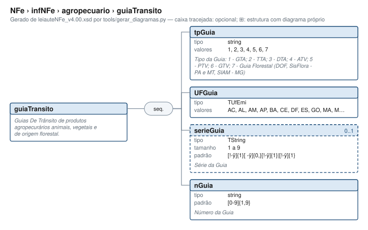

# guiaTransito — Guias De Trânsito de produtos agropecurários animais, vegetais e de origem florestal

[Manual](../../../README.md) › [NFe](../../../NFe.md) › [infNFe](../../infNFe.md) › [agropecuario](../agropecuario.md) › guiaTransito

<!-- estado-xsd:inicio -->
> **Estado: documentado.** Estrutura conferida contra a base XSD registrada.
>
> `Base atual e revisada: c537394250f913b591f3984f1de2e9d1a1ec94d334a0086e7a41f9850f5f7917`
<!-- estado-xsd:fim -->

| Informação | Base conferida |
|---|---|
| Caminho XML | `NFe/infNFe/agropecuario/guiaTransito` |
| Leiaute / pacote XSD | NF-e/NFC-e 4.00 / PL010f v1.04, 31/08/2026 |
| Biblioteca conferida | libnfe 1.0.0-rc4, commit `1dd412eebca80dd80d884b3f03a1a31cfaf42279` |
| Revisão | 2026-10-05 |
| Contexto no leiaute | `1..1` no pai, sujeito às sequências e escolhas abaixo |

## Finalidade e quando preencher

Detalha operações agropecuárias nas alternativas de defensivo/agrotóxico e guia de trânsito. Selecione o ramo correspondente ao documento e à operação; não misture alternativas exclusivas na mesma ocorrência.

Descrição e observações do XSD adotado: Guias De Trânsito de produtos agropecurários animais, vegetais e de origem florestal.. A estrutura e as restrições são as do pacote indicado; notas históricas de uso devem ser lidas junto às atualizações listadas nas referências.

## Estrutura, ordem e escolhas



[Abrir o diagrama](../../../../diagramas/NFe/infNFe/agropecuario/guiaTransito.svg).

Uma ocorrência `1..1` dentro de uma alternativa exige o campo quando essa alternativa é selecionada; não obriga selecionar esse ramo em toda nota. Grupos opcionais podem conter filhos obrigatórios. Os elementos de sequência seguem a ordem indicada.

- **Sequência** `1..1`
  - `tpGuia` `1..1`
  - `UFGuia` `1..1`
  - `serieGuia` `0..1`
  - `nGuia` `1..1`

## Campos e atributos

| Tag / atributo | Significado e observações | Tipo XML | Ocorrência | Formato / limites | Condição no contexto |
|---|---|---|---|---|---|
| `tpGuia` | Tipo da Guia: 1 - GTA; 2 - TTA; 3 - DTA; 4 - ATV; 5 - PTV; 6 - GTV; 7 - Guia Florestal (DOF, SisFlora - PA e MT, SIAM - MG) | `string` | `1..1` | Domínio: `1`, `2`, `3`, `4`, `5`, `6`, `7`<br>Tratamento de espaços: preserve | Obrigatório no contexto |
| `UFGuia` | Campo UFGuia do grupo guiaTransito | `TUfEmi` | `1..1` | Domínio: `AC`, `AL`, `AM`, `AP`, `BA`, `CE`, `DF`, `ES`, `GO`, `MA`, `MG`, `MS`, `MT`, `PA`, `PB`, `PE`, `PI`, `PR`, `RJ`, `RN`, `RO`, `RR`, `RS`, `SC`, `SE`, `SP`, `TO`<br>Tratamento de espaços: preserve | Obrigatório no contexto |
| `serieGuia` | Série da Guia | `TString` | `0..1` | Mínimo: 1<br>Máximo: 9<br>Padrão: `[!-ÿ]{1}[ -ÿ]{0,}[!-ÿ]{1}\|[!-ÿ]{1}`<br>Tratamento de espaços: preserve | Opcional no contexto |
| `nGuia` | Número da Guia | `string` | `1..1` | Padrão: `[0-9]{1,9}` | Obrigatório no contexto |

Campos decimais usam o separador `.` e a precisão indicada pelo tipo; preservar a representação textual evita perda por ponto flutuante. Ausência, texto vazio e zero são valores distintos. Padrões, comprimentos e enumerações precisam ser atendidos em conjunto; valores de códigos com zeros significativos devem conservar esses zeros. Campos de mesmo nome em outros pais têm contexto próprio.

## API C, integração e memória

Acesso pela API pública: `nfe_nfe_grupo(nota, "agropecuario")`. O grupo é criado vazio na primeira chamada e pertence à nota. NULL indica nome inválido ou falta de memória; o grupo opcional só é escrito quando há conteúdo.

[Contrato público de nfe_nfe.h](../../../api/nfe_nfe.md) apresenta assinaturas, argumentos, retornos e limitações. [Convenções de memória e erros](../../../API.md) explica cópia, empréstimo e transferência de posse.

Ao usar um grupo emprestado, libere o objeto proprietário, nunca o grupo separadamente. Os setters de texto copiam seus valores; getters retornam texto interno emprestado. A escolha de outro ramo válido pode apagar o anterior. Os campos obrigatórios do motor são conferidos na escrita; validar um valor isolado não prova completude do grupo. Os contratos específicos prevalecem quando a função indicada não usa o motor.

## Exemplo C conferido

[Fonte completo do cenário caso_000](../../../../../examples/manual/casos.inc) contém o preenchimento, a conferência dos retornos e a liberação dos recursos. [Programa que cria o objeto e obtém o grupo](../../../../../examples/manual_grupos.c) fornece os headers e a execução desse cenário.

```sh
make exemplos
./obj/manual_grupos NFe/infNFe/agropecuario/guiaTransito
```

Recorte do cenário executado (o programa completo define CONFERE e fornece o grupo do objeto proprietário):

```c
static int caso_000(nfe_grupo *g)
{
	int rc = 0;
	CONFERE(nfe_grupo_set(g, "guiaTransito/tpGuia", "1"));
	CONFERE(nfe_grupo_set(g, "guiaTransito/UFGuia", "AC"));
	CONFERE(nfe_grupo_set(g, "guiaTransito/nGuia", "1"));
fim:
	return rc;
}
```

## XML correspondente

Trecho do cenário acima, com namespace preservado. [XML completo do cenário](../../../exemplos/grupos/caso_000.xml) e [nota de contexto validada](../../../exemplos/contextos/caso_000.xml) permitem conferir valores e ancestrais. Dados sintéticos; este exemplo comprova estrutura e uso da API, sem transmissão, autorização ou validação de enquadramento fiscal.

```xml
<guiaTransito xmlns="http://www.portalfiscal.inf.br/nfe">
  <tpGuia>1</tpGuia>
  <UFGuia>AC</UFGuia>
  <nGuia>1</nGuia>
</guiaTransito>

```

O fragmento é validado no contexto que o declara no leiaute, com namespace e ancestrais. O wrapper tipos_v4.00.xsd, quando usado nos testes, extrai essas declarações do schema oficial e é identificado como apoio de testes, sem substituir o pacote oficial.

## Validação, erros e limites

| Situação | Etapa / resultado | Tratamento |
|---|---|---|
| Ponteiro obrigatório nulo | API: `E_ISNULL` (-1), conforme contrato da função | Conferir criação e argumentos |
| Texto fora do comprimento | Setter/motor: `E_TAMANHO` (-2) | Usar os limites do tipo e do argumento C |
| Domínio, padrão ou caminho inválido/ambíguo | Setter/motor: `E_VALOR` (-3) | Corrigir o valor e usar caminho completo |
| Campo obrigatório ou escolha incompleta | Escrita do motor: `E_VALOR`; XSD rejeita | Completar o ramo selecionado |
| Falha de escrita XML | Writer: `E_XML` (-4) | Descartar saída parcial e tratar a falha |
| Falta de memória | Criação: NULL; operações que alocam podem retornar `E_MALLOC` (-101) | Encerrar com limpeza dos recursos ainda próprios |
| Regra fiscal, cadastro, cálculo ou vigência | Pode ser aceito lexicalmente; depende da regra e do autorizador | Conferir fontes e contratos; não confundir 0 com autorização |

Os códigos negativos são da biblioteca, não códigos cStat. [Validação e regras implementadas](../../../VALIDACAO.md) distingue XSD, verificações locais e retorno da SEFAZ. A referência da API identifica exceções aos comportamentos gerais desta tabela.

## Referências e grupos relacionados

- XSD atual: [leiaute](../../../../../tests/schemas/nfe/leiauteNFe_v4.00.xsd), [tipos básicos](../../../../../tests/schemas/nfe/tiposBasico_v4.00.xsd) e [tipos DFe/RTC](../../../../../tests/schemas/nfe/DFeTiposBasicos_v1.00.xsd).
- MOC 7.0, Anexo I: leiaute atual. [Fontes oficiais, versões e transições](../../../BASES.md) relaciona atualizações posteriores, com vigência separada da publicação.
- API: [nfe_nfe.h](../../../../../include/libnfe/nfe_nfe.h) e [referência das funções](../../../api/nfe_nfe.md).
- Grupo pai: [agropecuario](../agropecuario.md).

Anterior: [defensivo](defensivo.md) | Próximo: [infPAA](../infPAA.md)
