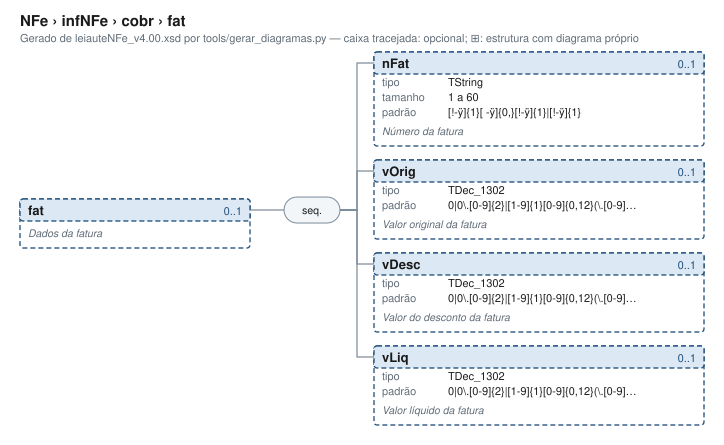

# fat — Dados da fatura

[Manual](../../../README.md) › [NFe](../../../NFe.md) › [infNFe](../../infNFe.md) › [cobr](../cobr.md) › fat

<!-- estado-xsd:inicio -->
> **Estado: documentado.** Estrutura conferida contra a base XSD registrada.
>
> `Base atual e revisada: c537394250f913b591f3984f1de2e9d1a1ec94d334a0086e7a41f9850f5f7917`
<!-- estado-xsd:fim -->

| Informação | Base conferida |
|---|---|
| Caminho XML | `NFe/infNFe/cobr/fat` |
| Leiaute / pacote XSD | NF-e/NFC-e 4.00 / PL010f v1.04, 31/08/2026 |
| Biblioteca conferida | libnfe 1.0.0-rc4, commit `1dd412eebca80dd80d884b3f03a1a31cfaf42279` |
| Revisão | 2026-10-05 |
| Contexto no leiaute | `0..1` no pai, sujeito às sequências e escolhas abaixo |

## Finalidade e quando preencher

A cobrança descreve fatura e parcelas/duplicatas. O valor da duplicata deve ser positivo na API. Cobrança e pagamento representam informações distintas: uma duplicata não cria automaticamente uma forma de pagamento.

Descrição e observações do XSD adotado: Dados da fatura. A estrutura e as restrições são as do pacote indicado; notas históricas de uso devem ser lidas junto às atualizações listadas nas referências.

## Estrutura, ordem e escolhas



[Abrir o diagrama](../../../../diagramas/NFe/infNFe/cobr/fat.svg).

Uma ocorrência `1..1` dentro de uma alternativa exige o campo quando essa alternativa é selecionada; não obriga selecionar esse ramo em toda nota. Grupos opcionais podem conter filhos obrigatórios. Os elementos de sequência seguem a ordem indicada.

- **Sequência** `1..1`
  - `nFat` `0..1`
  - `vOrig` `0..1`
  - `vDesc` `0..1`
  - `vLiq` `0..1`

## Campos e atributos

| Tag / atributo | Significado e observações | Tipo XML | Ocorrência | Formato / limites | Condição no contexto |
|---|---|---|---|---|---|
| `nFat` | Número da fatura | `TString` | `0..1` | Mínimo: 1<br>Máximo: 60<br>Padrão: `[!-ÿ]{1}[ -ÿ]{0,}[!-ÿ]{1}\|[!-ÿ]{1}`<br>Tratamento de espaços: preserve | Opcional no contexto |
| `vOrig` | Valor original da fatura | `TDec_1302` | `0..1` | Padrão: `0\|0\.[0-9]{2}\|[1-9]{1}[0-9]{0,12}(\.[0-9]{2})?`<br>Tratamento de espaços: preserve | Opcional no contexto |
| `vDesc` | Valor do desconto da fatura | `TDec_1302` | `0..1` | Padrão: `0\|0\.[0-9]{2}\|[1-9]{1}[0-9]{0,12}(\.[0-9]{2})?`<br>Tratamento de espaços: preserve | Opcional no contexto |
| `vLiq` | Valor líquido da fatura | `TDec_1302` | `0..1` | Padrão: `0\|0\.[0-9]{2}\|[1-9]{1}[0-9]{0,12}(\.[0-9]{2})?`<br>Tratamento de espaços: preserve | Opcional no contexto |

Campos decimais usam o separador `.` e a precisão indicada pelo tipo; preservar a representação textual evita perda por ponto flutuante. Ausência, texto vazio e zero são valores distintos. Padrões, comprimentos e enumerações precisam ser atendidos em conjunto; valores de códigos com zeros significativos devem conservar esses zeros. Campos de mesmo nome em outros pais têm contexto próprio.

## API C, integração e memória

Este grupo usa os objetos e funções específicos do módulo `cobr.h`. O contrato completo abaixo identifica os argumentos, a ligação ao pai, a serialização e a liberação. O exemplo indicado usa essas funções; o motor genérico não é um substituto automático para esse objeto.

[Contrato público de cobr.h](../../../api/cobr.md) apresenta assinaturas, argumentos, retornos e limitações. [Convenções de memória e erros](../../../API.md) explica cópia, empréstimo e transferência de posse.

Ao usar um grupo emprestado, libere o objeto proprietário, nunca o grupo separadamente. Os setters de texto copiam seus valores; getters retornam texto interno emprestado. A escolha de outro ramo válido pode apagar o anterior. Os campos obrigatórios do motor são conferidos na escrita; validar um valor isolado não prova completude do grupo. Os contratos específicos prevalecem quando a função indicada não usa o motor.

## Exemplo C conferido

[Fonte completo do cenário teste_grupos_opcionais](../../../../../tests/test_nfe.c) contém o preenchimento, a conferência dos retornos e a liberação dos recursos. O cenário integra o programa de testes indicado, com os headers e apoios do repositório. O XML foi observado na serialização desse cenário e validado, não deduzido de um desenho.

```sh
make obj/test_nfe
./obj/test_nfe tests
```

A função abaixo é o cenário completo do teste, incluindo tratamento dos retornos e eventuais verificações de erros. O XML publicado foi observado na validação da linha **441** do fonte indicado; a função pode exercitar outras alterações antes/depois desse ponto.

<details>
<summary>Função C completa do cenário teste_grupos_opcionais</summary>

```c
static void teste_grupos_opcionais(void)
{
	nfe_nfe *nfe = nota(NFE_MODELO_NFE);
	nfe_local *ret = nfe_local_new(), *ent = nfe_local_new();
	nfe_cobr *cobr = nfe_cobr_new();
	nfe_infadic *inf = nfe_infadic_new();
	nfe_resptec *rt = nfe_resptec_new();
	char *xml = NULL;
	int rc = 0;

	rc |= nfe_local_set_cnpj(ret, "12345678000195");
	rc |= nfe_local_set_xnome(ret, "DEPOSITO CENTRAL");
	rc |= nfe_local_set_endereco(ret, endereco());
	rc |= nfe_local_set_email(ret, "deposito@exemplo.com.br");
	rc |= nfe_local_set_ie(ret, "123456789");
	rc |= nfe_local_set_cpf(ent, "12345678909");
	rc |= nfe_local_set_endereco(ent, endereco());
	rc |= nfe_cobr_set_fat(cobr, "FAT-1", "30.00", "0.00", "30.00");
	rc |= nfe_cobr_add_dup(cobr, "001", "2026-11-03", "15.00");
	rc |= nfe_cobr_add_dup(cobr, "002", "2026-12-03", "15.00");
	rc |= nfe_infadic_set_infadfisco(inf,
	                                 "Documento emitido por ME ou EPP");
	rc |= nfe_infadic_set_infcpl(inf, "Pedido 123. Obrigado pela compra!");
	rc |= nfe_infadic_add_obscont(inf, "vendedor", "MARIA");
	rc |= nfe_infadic_add_obsfisco(inf, "regime", "ESPECIAL");
	rc |= nfe_infadic_add_procref(inf, "PROC-2026/1", NFE_PROCESSO_SEFAZ,
	                              NFE_ATO_REGIME_ESPECIAL);
	rc |= nfe_infadic_add_procref(inf, "0001234-56.2026.4.03.0000",
	                              NFE_PROCESSO_JUSTICA_FEDERAL,
	                              NFE_ATO_NAO_INFORMADO);
	rc |= nfe_resptec_set(rt, "12ABC34501DE35", "SUPORTE TECNICO",
	                      "suporte@exemplo.com.br", "1140028922");
	rc |= nfe_resptec_set_csrt(rt, 1, "AAECAwQFBgcICQoLDA0ODxAREhM=");
	rc |= nfe_nfe_set_retirada(nfe, ret);
	rc |= nfe_nfe_set_entrega(nfe, ent);
	rc |= nfe_nfe_add_autxml(nfe, "12345678000195");
	rc |= nfe_nfe_add_autxml(nfe, "12345678909");
	rc |= nfe_nfe_set_cobr(nfe, cobr);
	rc |= nfe_nfe_set_intermed(nfe, "12ABC34501DE35", "LOJA-42");
	rc |= nfe_nfe_set_infadic(nfe, inf);
	rc |= nfe_nfe_set_resptec(nfe, rt);
	VERIFICA_INT(rc, 0);

	VERIFICA_INT(nfe_nfe_xml(nfe, &xml, NULL), 0);
	VERIFICA(xml != NULL);
	if (xml) {
		VERIFICA(strstr(xml,
		                "</emit><retirada><CNPJ>12345678000195</CNPJ>"
		                "<xNome>DEPOSITO CENTRAL</xNome>"
		                "<xLgr>AV. BRASIL</xLgr>") != NULL);
		VERIFICA(strstr(xml,
		                "<fone>2133334444</fone>"
		                "<email>deposito@exemplo.com.br</email>"
		                "<IE>123456789</IE></retirada>"
		                "<entrega><CPF>12345678909</CPF>") != NULL);
		VERIFICA(strstr(xml,
		                "</entrega><autXML><CNPJ>12345678000195"
		                "</CNPJ></autXML><autXML><CPF>12345678909"
		                "</CPF></autXML><det nItem=\"1\">") != NULL);
		VERIFICA(strstr(xml, "</transp><cobr><fat><nFat>FAT-1</nFat>"
		                     "<vOrig>30.00</vOrig><vDesc>0.00</vDesc>"
		                     "<vLiq>30.00</vLiq></fat><dup><nDup>001"
		                     "</nDup><dVenc>2026-11-03</dVenc>"
		                     "<vDup>15.00</vDup></dup>") != NULL);
		VERIFICA(strstr(xml, "</cobr><pag>") != NULL);
		VERIFICA(strstr(xml,
		                "</pag><infIntermed><CNPJ>12ABC34501DE35"
		                "</CNPJ><idCadIntTran>LOJA-42</idCadIntTran>"
		                "</infIntermed><infAdic>") != NULL);
		VERIFICA(strstr(xml,
		                "<obsCont xCampo=\"vendedor\"><xTexto>MARIA"
		                "</xTexto></obsCont><obsFisco xCampo=\"regime"
		                "\"><xTexto>ESPECIAL</xTexto></obsFisco>"
		                "<procRef><nProc>PROC-2026/1</nProc>"
		                "<indProc>0</indProc><tpAto>10</tpAto>"
		                "</procRef><procRef>") != NULL);
		VERIFICA(strstr(xml,
		                "<indProc>1</indProc></procRef></infAdic>"
		                "<infRespTec><CNPJ>12ABC34501DE35</CNPJ>"
		                "<xContato>SUPORTE TECNICO</xContato>"
		                "<email>suporte@exemplo.com.br</email>"
		                "<fone>1140028922</fone><idCSRT>01</idCSRT>"
		                "<hashCSRT>AAECAwQFBgcICQoLDA0ODxAREhM="
		                "</hashCSRT></infRespTec></infNFe>") != NULL);
		VERIFICA_INT(valida_infnfe(xml), 0);
	}
	free(xml);

	/* Valores recusados */
	VERIFICA_INT(nfe_nfe_add_autxml(nfe, "123"), E_TAMANHO);
	VERIFICA_INT(nfe_nfe_add_autxml(nfe, "12345678000196"), E_VALOR);
	VERIFICA_INT(nfe_nfe_set_intermed(nfe, "12345678000195", NULL),
	             E_ISNULL);
	VERIFICA_INT(nfe_nfe_set_intermed(nfe, "12345678000195", "X"),
	             E_TAMANHO);
	VERIFICA_INT(nfe_local_set_cnpj(ret, "1"), E_TAMANHO);
	VERIFICA_INT(nfe_local_set_ie(ret, "isento"), E_VALOR);
	VERIFICA_INT(nfe_local_set_endereco(ret, NULL), E_ISNULL);
	VERIFICA_INT(nfe_cobr_set_fat(cobr, "", NULL, NULL, NULL), E_TAMANHO);
	VERIFICA_INT(nfe_cobr_set_fat(cobr, NULL, "1,00", NULL, NULL), E_VALOR);
	VERIFICA_INT(nfe_cobr_add_dup(cobr, NULL, "2026-13-01", "1.00"),
	             E_VALOR);
	VERIFICA_INT(nfe_cobr_add_dup(cobr, NULL, NULL, "0.00"), E_VALOR);
	VERIFICA_INT(nfe_cobr_add_dup(cobr, NULL, NULL, NULL), E_ISNULL);
	VERIFICA_INT(nfe_infadic_set_infcpl(inf, " texto"), E_VALOR);
	VERIFICA_INT(
	        nfe_infadic_add_obscont(inf, "campo com mais de 20 c", "x"),
	        E_TAMANHO);
	VERIFICA_INT(nfe_infadic_add_procref(inf, "P", (nfe_origem_processo)5,
	                                     NFE_ATO_NAO_INFORMADO),
	             E_VALOR);
	VERIFICA_INT(nfe_infadic_add_procref(inf, "P", NFE_PROCESSO_SEFAZ,
	                                     (nfe_ato_concessorio)9),
	             E_VALOR);
	VERIFICA_INT(nfe_resptec_set(rt, "12345678000195", "SUPORTE", "a@b.c",
	                             "1140028922"),
	             E_TAMANHO);
	VERIFICA_INT(
	        nfe_resptec_set_csrt(rt, 100, "AAECAwQFBgcICQoLDA0ODxAREhM="),
	        E_VALOR);
	VERIFICA_INT(nfe_resptec_set_csrt(rt, 1, "curto="), E_VALOR);

	/* Removendo os grupos e limpando listas */
	VERIFICA_INT(nfe_nfe_remove_autxml(nfe), 0);
	VERIFICA_INT(nfe_nfe_set_intermed(nfe, NULL, NULL), 0);
	VERIFICA_INT(nfe_cobr_remove_dup(cobr), 0);
	VERIFICA_INT(nfe_cobr_set_fat(cobr, NULL, NULL, NULL, NULL), 0);
	VERIFICA_INT(nfe_infadic_remove_obs(inf), 0);
	VERIFICA_INT(nfe_infadic_remove_procref(inf), 0);
	VERIFICA_INT(nfe_infadic_set_infadfisco(inf, NULL), 0);
	VERIFICA_INT(nfe_resptec_set_csrt(rt, 0, NULL), 0);
	VERIFICA_INT(nfe_nfe_set_retirada(nfe, NULL), 0);
	VERIFICA_INT(nfe_nfe_set_entrega(nfe, NULL), 0);
	xml = NULL;
	VERIFICA_INT(nfe_nfe_xml(nfe, &xml, NULL), 0);
	if (xml) {
		VERIFICA(strstr(xml, "retirada") == NULL);
		VERIFICA(strstr(xml, "entrega") == NULL);
		VERIFICA(strstr(xml, "autXML") == NULL);
		VERIFICA(strstr(xml, "infIntermed") == NULL);
		VERIFICA(strstr(xml, "<cobr></cobr>") != NULL ||
		         strstr(xml, "<cobr/>") != NULL);
		VERIFICA(strstr(xml, "<infAdic><infCpl>") != NULL);
		VERIFICA(strstr(xml, "CSRT") == NULL);
		VERIFICA_INT(valida_infnfe(xml), 0);
	}
	free(xml);
	VERIFICA_INT(nfe_nfe_set_cobr(nfe, NULL), 0);
	VERIFICA_INT(nfe_nfe_set_infadic(nfe, NULL), 0);
	VERIFICA_INT(nfe_nfe_set_resptec(nfe, NULL), 0);

	/* Grupos incompletos são recusados ao gerar */
	VERIFICA_INT(nfe_nfe_set_entrega(nfe, nfe_local_new()), 0);
	VERIFICA_INT(nfe_nfe_xml(nfe, &xml, NULL), E_VALOR);
	VERIFICA_INT(nfe_nfe_set_entrega(nfe, NULL), 0);
	VERIFICA_INT(nfe_nfe_set_resptec(nfe, nfe_resptec_new()), 0);
	VERIFICA_INT(nfe_nfe_xml(nfe, &xml, NULL), E_VALOR);
	nfe_nfe_free(nfe);
}
```

</details>

## XML correspondente

Trecho do cenário acima, com namespace preservado. [XML completo do cenário](../../../exemplos/grupos/test_nfe-0006.xml) permite conferir valores e ancestrais. Dados sintéticos; este exemplo comprova estrutura e uso da API, sem transmissão, autorização ou validação de enquadramento fiscal.

```xml
<fat xmlns="http://www.portalfiscal.inf.br/nfe">
  <nFat>FAT-1</nFat>
  <vOrig>30.00</vOrig>
  <vDesc>0.00</vDesc>
  <vLiq>30.00</vLiq>
</fat>

```

O fragmento é validado no contexto que o declara no leiaute, com namespace e ancestrais. O wrapper tipos_v4.00.xsd, quando usado nos testes, extrai essas declarações do schema oficial e é identificado como apoio de testes, sem substituir o pacote oficial.

## Validação, erros e limites

| Situação | Etapa / resultado | Tratamento |
|---|---|---|
| Ponteiro obrigatório nulo | API: `E_ISNULL` (-1), conforme contrato da função | Conferir criação e argumentos |
| Texto fora do comprimento | Setter/motor: `E_TAMANHO` (-2) | Usar os limites do tipo e do argumento C |
| Domínio, padrão ou caminho inválido/ambíguo | Setter/motor: `E_VALOR` (-3) | Corrigir o valor e usar caminho completo |
| Campo obrigatório ou escolha incompleta | Escrita do motor: `E_VALOR`; XSD rejeita | Completar o ramo selecionado |
| Falha de escrita XML | Writer: `E_XML` (-4) | Descartar saída parcial e tratar a falha |
| Falta de memória | Criação: NULL; operações que alocam podem retornar `E_MALLOC` (-101) | Encerrar com limpeza dos recursos ainda próprios |
| Regra fiscal, cadastro, cálculo ou vigência | Pode ser aceito lexicalmente; depende da regra e do autorizador | Conferir fontes e contratos; não confundir 0 com autorização |

Os códigos negativos são da biblioteca, não códigos cStat. [Validação e regras implementadas](../../../VALIDACAO.md) distingue XSD, verificações locais e retorno da SEFAZ. A referência da API identifica exceções aos comportamentos gerais desta tabela.

## Referências e grupos relacionados

- XSD atual: [leiaute](../../../../../tests/schemas/nfe/leiauteNFe_v4.00.xsd), [tipos básicos](../../../../../tests/schemas/nfe/tiposBasico_v4.00.xsd) e [tipos DFe/RTC](../../../../../tests/schemas/nfe/DFeTiposBasicos_v1.00.xsd).
- MOC 7.0, Anexo I: Y, pp. 61–62. [Fontes oficiais, versões e transições](../../../BASES.md) relaciona atualizações posteriores, com vigência separada da publicação.
- API: [cobr.h](../../../../../include/libnfe/cobr.h) e [referência das funções](../../../api/cobr.md).
- Grupo pai: [cobr](../cobr.md).

Anterior: [cobr](../cobr.md) | Próximo: [dup](dup.md)
