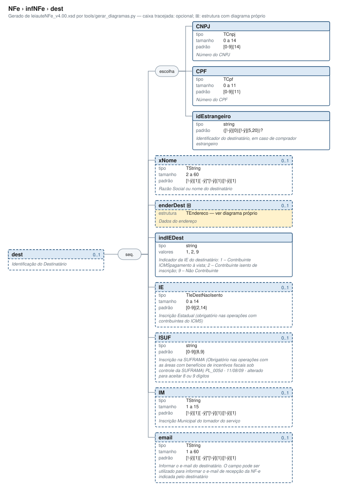

# dest — Identificação do Destinatário

[Manual](../../README.md) › [NFe](../../NFe.md) › [infNFe](../infNFe.md) › dest

<!-- estado-xsd:inicio -->
> **Estado: documentado.** Estrutura conferida contra a base XSD registrada.
>
> `Base atual e revisada: c537394250f913b591f3984f1de2e9d1a1ec94d334a0086e7a41f9850f5f7917`
<!-- estado-xsd:fim -->

| Informação | Base conferida |
|---|---|
| Caminho XML | `NFe/infNFe/dest` |
| Leiaute / pacote XSD | NF-e/NFC-e 4.00 / PL010f v1.04, 31/08/2026 |
| Biblioteca conferida | libnfe 1.0.0-rc4, commit `1dd412eebca80dd80d884b3f03a1a31cfaf42279` |
| Revisão | 2026-10-05 |
| Contexto no leiaute | `0..1` no pai, sujeito às sequências e escolhas abaixo |

## Finalidade e quando preencher

Os dados pertencem ao destinatário da operação. Escolha CNPJ, CPF ou identificação estrangeira conforme a pessoa e o leiaute, preservando o contexto da operação. As exigências de destinatário e endereço dependem do modelo e das regras fiscais; a API pode exigir preenchimento adicional ao mínimo estrutural.

A NT 2026.007 v1.10 distingue o contribuinte exclusivo do IBS/CBS, incluindo ausência de IE do emitente e direcionamento à SVRS em condições específicas. O XSD permite IE opcional; esse fato, isoladamente, não seleciona o autorizador nem dispensa as verificações cadastrais. A produção está prevista para 03/11/2026.

Descrição e observações do XSD adotado: Identificação do Destinatário. A estrutura e as restrições são as do pacote indicado; notas históricas de uso devem ser lidas junto às atualizações listadas nas referências.

## Estrutura, ordem e escolhas



[Abrir o diagrama](../../../diagramas/NFe/infNFe/dest.svg).

Uma ocorrência `1..1` dentro de uma alternativa exige o campo quando essa alternativa é selecionada; não obriga selecionar esse ramo em toda nota. Grupos opcionais podem conter filhos obrigatórios. Os elementos de sequência seguem a ordem indicada.

- **Sequência** `1..1`
  - **Escolha exclusiva** `1..1`
    - `CNPJ` `1..1`
    - `CPF` `1..1`
    - `idEstrangeiro` `1..1`
  - `xNome` `0..1`
  - `enderDest` `0..1`
  - `indIEDest` `1..1`
  - `IE` `0..1`
  - `ISUF` `0..1`
  - `IM` `0..1`
  - `email` `0..1`

## Campos e atributos

| Tag / atributo | Significado e observações | Tipo XML | Ocorrência | Formato / limites | Condição no contexto |
|---|---|---|---|---|---|
| `CNPJ` | Número do CNPJ | `TCnpj` | `1..1` | Máximo: 14<br>Padrão: `[0-9A-Z]{12}[0-9]{2}`<br>Tratamento de espaços: preserve | Obrigatório no contexto; apenas na alternativa selecionada |
| `CPF` | Número do CPF | `TCpf` | `1..1` | Máximo: 11<br>Padrão: `[0-9]{11}`<br>Tratamento de espaços: preserve | Obrigatório no contexto; apenas na alternativa selecionada |
| `idEstrangeiro` | Identificador do destinatário, em caso de comprador estrangeiro | `string` | `1..1` | Padrão: `([!-ÿ]{0}\|[!-ÿ]{5,20})?`<br>Tratamento de espaços: preserve | Obrigatório no contexto; apenas na alternativa selecionada |
| `xNome` | Razão Social ou nome do destinatário | `TString` | `0..1` | Mínimo: 2<br>Máximo: 60<br>Padrão: `[!-ÿ]{1}[ -ÿ]{0,}[!-ÿ]{1}\|[!-ÿ]{1}`<br>Tratamento de espaços: preserve | Opcional no contexto |
| [`enderDest`](dest/enderDest.md) | Dados do endereço | `TEndereco` | `0..1` | Grupo estruturado | Opcional no contexto |
| `indIEDest` | Indicador da IE do destinatário: 1 – Contribuinte ICMSpagamento à vista; 2 – Contribuinte isento de inscrição; 9 – Não Contribuinte | `string` | `1..1` | Domínio: `1`, `2`, `9`<br>Tratamento de espaços: preserve | Obrigatório no contexto |
| `IE` | Inscrição Estadual (obrigatório nas operações com contribuintes do ICMS) | `TIeDestNaoIsento` | `0..1` | Máximo: 14<br>Padrão: `[0-9]{2,14}`<br>Tratamento de espaços: preserve | Opcional no contexto |
| `ISUF` | Inscrição na SUFRAMA (Obrigatório nas operações com as áreas com benefícios de incentivos fiscais sob controle da SUFRAMA) PL_005d - 11/08/09 - alterado para aceitar 8 ou 9 dígitos | `string` | `0..1` | Padrão: `[0-9]{8,9}`<br>Tratamento de espaços: preserve | Opcional no contexto |
| `IM` | Inscrição Municipal do tomador do serviço | `TString` | `0..1` | Mínimo: 1<br>Máximo: 15<br>Padrão: `[!-ÿ]{1}[ -ÿ]{0,}[!-ÿ]{1}\|[!-ÿ]{1}`<br>Tratamento de espaços: preserve | Opcional no contexto |
| `email` | Informar o e-mail do destinatário. O campo pode ser utilizado para informar o e-mail de recepção da NF-e indicada pelo destinatário | `TString` | `0..1` | Mínimo: 1<br>Máximo: 60<br>Padrão: `[!-ÿ]{1}[ -ÿ]{0,}[!-ÿ]{1}\|[!-ÿ]{1}`<br>Tratamento de espaços: preserve | Opcional no contexto |

Campos decimais usam o separador `.` e a precisão indicada pelo tipo; preservar a representação textual evita perda por ponto flutuante. Ausência, texto vazio e zero são valores distintos. Padrões, comprimentos e enumerações precisam ser atendidos em conjunto; valores de códigos com zeros significativos devem conservar esses zeros. Campos de mesmo nome em outros pais têm contexto próprio.

## API C, integração e memória

Este grupo usa os objetos e funções específicos do módulo `dest.h`. O contrato completo abaixo identifica os argumentos, a ligação ao pai, a serialização e a liberação. O exemplo indicado usa essas funções; o motor genérico não é um substituto automático para esse objeto.

[Contrato público de dest.h](../../api/dest.md) apresenta assinaturas, argumentos, retornos e limitações. [Convenções de memória e erros](../../API.md) explica cópia, empréstimo e transferência de posse.

Ao usar um grupo emprestado, libere o objeto proprietário, nunca o grupo separadamente. Os setters de texto copiam seus valores; getters retornam texto interno emprestado. A escolha de outro ramo válido pode apagar o anterior. Os campos obrigatórios do motor são conferidos na escrita; validar um valor isolado não prova completude do grupo. Os contratos específicos prevalecem quando a função indicada não usa o motor.

## Exemplo C conferido

[Fonte completo do cenário teste_consumidor](../../../../tests/test_dest.c) contém o preenchimento, a conferência dos retornos e a liberação dos recursos. O cenário integra o programa de testes indicado, com os headers e apoios do repositório. O XML foi observado na serialização desse cenário e validado, não deduzido de um desenho.

```sh
make obj/test_dest
./obj/test_dest tests
```

A função abaixo é o cenário completo do teste, incluindo tratamento dos retornos e eventuais verificações de erros. O XML publicado foi observado na validação da linha **74** do fonte indicado; a função pode exercitar outras alterações antes/depois desse ponto.

<details>
<summary>Função C completa do cenário teste_consumidor</summary>

```c
static void teste_consumidor(void)
{
	nfe_dest *dest = nfe_dest_new();
	char *xml;
	int rc;

	VERIFICA(dest != NULL);
	if (!dest)
		return;

	/* Mínimo: só a identificação e o indIEDest */
	VERIFICA_INT(nfe_dest_set_cpf(dest, "12345678909"), 0);
	VERIFICA_INT(nfe_dest_set_indiedest(dest, NFE_IE_DEST_NAO_CONTRIBUINTE),
	             0);
	xml = teste_gera(escreve, dest, &rc);
	VERIFICA_INT(rc, 0);
	VERIFICA(xml != NULL);
	if (xml) {
		VERIFICA(strstr(xml,
		                "<dest xmlns=\"" TESTE_NS "\">"
		                "<CPF>12345678909</CPF>"
		                "<indIEDest>9</indIEDest></dest>") != NULL);
		VERIFICA_INT(teste_valida(xml), 0);
	}
	free(xml);

	/* Com nome, endereço e e-mail */
	VERIFICA_INT(nfe_dest_set_xnome(dest, "FULANO DE TAL"), 0);
	VERIFICA_INT(nfe_dest_set_endereco(dest, endereco()), 0);
	VERIFICA_INT(nfe_dest_set_email(dest, "fulano@exemplo.com.br"), 0);
	xml = teste_gera(escreve, dest, &rc);
	VERIFICA_INT(rc, 0);
	VERIFICA(xml != NULL);
	if (xml) {
		VERIFICA(strstr(xml,
		                "<CPF>12345678909</CPF>"
		                "<xNome>FULANO DE TAL</xNome>"
		                "<enderDest><xLgr>AV. BRASIL</xLgr>") != NULL);
		VERIFICA(strstr(xml, "</enderDest><indIEDest>9</indIEDest>"
		                     "<email>fulano@exemplo.com.br</email>"
		                     "</dest>") != NULL);
		VERIFICA_INT(teste_valida(xml), 0);
	}
	free(xml);

	/* NULL remove o endereço e os opcionais */
	VERIFICA_INT(nfe_dest_set_endereco(dest, NULL), 0);
	VERIFICA_INT(nfe_dest_set_xnome(dest, NULL), 0);
	VERIFICA_INT(nfe_dest_set_email(dest, NULL), 0);
	xml = teste_gera(escreve, dest, &rc);
	VERIFICA(xml != NULL);
	if (xml) {
		VERIFICA(strstr(xml, "enderDest") == NULL);
		VERIFICA(strstr(xml, "xNome") == NULL);
		VERIFICA(strstr(xml, "email") == NULL);
	}
	free(xml);
	nfe_dest_free(dest);
}
```

</details>

## XML correspondente

Trecho do cenário acima, com namespace preservado. [XML completo do cenário](../../exemplos/grupos/test_dest-0001.xml) permite conferir valores e ancestrais. Dados sintéticos; este exemplo comprova estrutura e uso da API, sem transmissão, autorização ou validação de enquadramento fiscal.

```xml
<dest xmlns="http://www.portalfiscal.inf.br/nfe">
  <CPF>12345678909</CPF>
  <indIEDest>9</indIEDest>
</dest>
```

O fragmento é validado no contexto que o declara no leiaute, com namespace e ancestrais. O wrapper tipos_v4.00.xsd, quando usado nos testes, extrai essas declarações do schema oficial e é identificado como apoio de testes, sem substituir o pacote oficial.

## Validação, erros e limites

| Situação | Etapa / resultado | Tratamento |
|---|---|---|
| Ponteiro obrigatório nulo | API: `E_ISNULL` (-1), conforme contrato da função | Conferir criação e argumentos |
| Texto fora do comprimento | Setter/motor: `E_TAMANHO` (-2) | Usar os limites do tipo e do argumento C |
| Domínio, padrão ou caminho inválido/ambíguo | Setter/motor: `E_VALOR` (-3) | Corrigir o valor e usar caminho completo |
| Campo obrigatório ou escolha incompleta | Escrita do motor: `E_VALOR`; XSD rejeita | Completar o ramo selecionado |
| Falha de escrita XML | Writer: `E_XML` (-4) | Descartar saída parcial e tratar a falha |
| Falta de memória | Criação: NULL; operações que alocam podem retornar `E_MALLOC` (-101) | Encerrar com limpeza dos recursos ainda próprios |
| Regra fiscal, cadastro, cálculo ou vigência | Pode ser aceito lexicalmente; depende da regra e do autorizador | Conferir fontes e contratos; não confundir 0 com autorização |

Os códigos negativos são da biblioteca, não códigos cStat. [Validação e regras implementadas](../../VALIDACAO.md) distingue XSD, verificações locais e retorno da SEFAZ. A referência da API identifica exceções aos comportamentos gerais desta tabela.

## Referências e grupos relacionados

- XSD atual: [leiaute](../../../../tests/schemas/nfe/leiauteNFe_v4.00.xsd), [tipos básicos](../../../../tests/schemas/nfe/tiposBasico_v4.00.xsd) e [tipos DFe/RTC](../../../../tests/schemas/nfe/DFeTiposBasicos_v1.00.xsd).
- MOC 7.0, Anexo I: E, pp. 14–15. [Fontes oficiais, versões e transições](../../BASES.md) relaciona atualizações posteriores, com vigência separada da publicação.
- API: [dest.h](../../../../include/libnfe/dest.h) e [referência das funções](../../api/dest.md).
- Grupo pai: [infNFe](../infNFe.md).
- Filhos: [enderDest](dest/enderDest.md).

Anterior: [avulsa](avulsa.md) | Próximo: [enderDest](dest/enderDest.md)
