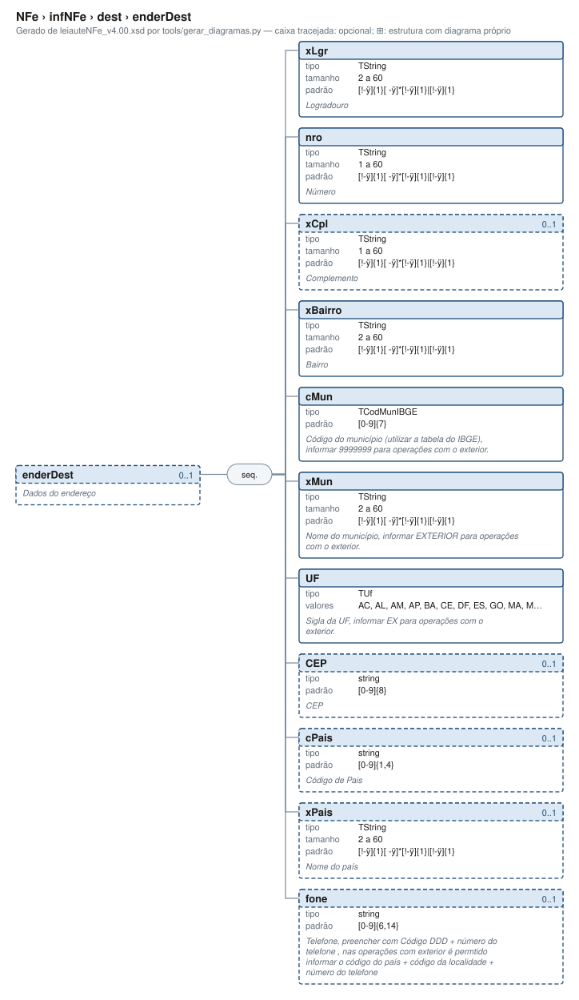

# enderDest — Dados do endereço

[Manual](../../../README.md) › [NFe](../../../NFe.md) › [infNFe](../../infNFe.md) › [dest](../dest.md) › enderDest

<!-- estado-xsd:inicio -->
> **Estado: documentado.** Estrutura conferida contra a base XSD registrada.
>
> `Base atual e revisada: c537394250f913b591f3984f1de2e9d1a1ec94d334a0086e7a41f9850f5f7917`
<!-- estado-xsd:fim -->

| Informação | Base conferida |
|---|---|
| Caminho XML | `NFe/infNFe/dest/enderDest` |
| Leiaute / pacote XSD | NF-e/NFC-e 4.00 / PL010f v1.04, 31/08/2026 |
| Biblioteca conferida | libnfe 1.0.0-rc4, commit `1dd412eebca80dd80d884b3f03a1a31cfaf42279` |
| Revisão | 2026-10-05 |
| Contexto no leiaute | `0..1` no pai, sujeito às sequências e escolhas abaixo |

## Finalidade e quando preencher

Os dados pertencem ao destinatário da operação. Escolha CNPJ, CPF ou identificação estrangeira conforme a pessoa e o leiaute, preservando o contexto da operação. As exigências de destinatário e endereço dependem do modelo e das regras fiscais; a API pode exigir preenchimento adicional ao mínimo estrutural.

A NT 2026.007 v1.10 distingue o contribuinte exclusivo do IBS/CBS, incluindo ausência de IE do emitente e direcionamento à SVRS em condições específicas. O XSD permite IE opcional; esse fato, isoladamente, não seleciona o autorizador nem dispensa as verificações cadastrais. A produção está prevista para 03/11/2026.

Descrição e observações do XSD adotado: Dados do endereço. A estrutura e as restrições são as do pacote indicado; notas históricas de uso devem ser lidas junto às atualizações listadas nas referências.

## Estrutura, ordem e escolhas



[Abrir o diagrama](../../../../diagramas/NFe/infNFe/dest/enderDest.svg).

Uma ocorrência `1..1` dentro de uma alternativa exige o campo quando essa alternativa é selecionada; não obriga selecionar esse ramo em toda nota. Grupos opcionais podem conter filhos obrigatórios. Os elementos de sequência seguem a ordem indicada.

- **Sequência** `1..1`
  - `xLgr` `1..1`
  - `nro` `1..1`
  - `xCpl` `0..1`
  - `xBairro` `1..1`
  - `cMun` `1..1`
  - `xMun` `1..1`
  - `UF` `1..1`
  - `CEP` `0..1`
  - `cPais` `0..1`
  - `xPais` `0..1`
  - `fone` `0..1`

## Campos e atributos

| Tag / atributo | Significado e observações | Tipo XML | Ocorrência | Formato / limites | Condição no contexto |
|---|---|---|---|---|---|
| `xLgr` | Logradouro | `TString` | `1..1` | Mínimo: 2<br>Máximo: 60<br>Padrão: `[!-ÿ]{1}[ -ÿ]{0,}[!-ÿ]{1}\|[!-ÿ]{1}`<br>Tratamento de espaços: preserve | Obrigatório no contexto |
| `nro` | Número | `TString` | `1..1` | Mínimo: 1<br>Máximo: 60<br>Padrão: `[!-ÿ]{1}[ -ÿ]{0,}[!-ÿ]{1}\|[!-ÿ]{1}`<br>Tratamento de espaços: preserve | Obrigatório no contexto |
| `xCpl` | Complemento | `TString` | `0..1` | Mínimo: 1<br>Máximo: 60<br>Padrão: `[!-ÿ]{1}[ -ÿ]{0,}[!-ÿ]{1}\|[!-ÿ]{1}`<br>Tratamento de espaços: preserve | Opcional no contexto |
| `xBairro` | Bairro | `TString` | `1..1` | Mínimo: 2<br>Máximo: 60<br>Padrão: `[!-ÿ]{1}[ -ÿ]{0,}[!-ÿ]{1}\|[!-ÿ]{1}`<br>Tratamento de espaços: preserve | Obrigatório no contexto |
| `cMun` | Código do município (utilizar a tabela do IBGE), informar 9999999 para operações com o exterior. | `TCodMunIBGE` | `1..1` | Padrão: `[0-9]{7}`<br>Tratamento de espaços: preserve | Obrigatório no contexto |
| `xMun` | Nome do município, informar EXTERIOR para operações com o exterior. | `TString` | `1..1` | Mínimo: 2<br>Máximo: 60<br>Padrão: `[!-ÿ]{1}[ -ÿ]{0,}[!-ÿ]{1}\|[!-ÿ]{1}`<br>Tratamento de espaços: preserve | Obrigatório no contexto |
| `UF` | Sigla da UF, informar EX para operações com o exterior. | `TUf` | `1..1` | Domínio: `AC`, `AL`, `AM`, `AP`, `BA`, `CE`, `DF`, `ES`, `GO`, `MA`, `MG`, `MS`, `MT`, `PA`, `PB`, `PE`, `PI`, `PR`, `RJ`, `RN`, `RO`, `RR`, `RS`, `SC`, `SE`, `SP`, `TO`, `EX`<br>Tratamento de espaços: preserve | Obrigatório no contexto |
| `CEP` | CEP | `string` | `0..1` | Padrão: `[0-9]{8}`<br>Tratamento de espaços: preserve | Opcional no contexto |
| `cPais` | Código de Pais | `string` | `0..1` | Padrão: `[0-9]{1,4}`<br>Tratamento de espaços: preserve | Opcional no contexto |
| `xPais` | Nome do país | `TString` | `0..1` | Mínimo: 2<br>Máximo: 60<br>Padrão: `[!-ÿ]{1}[ -ÿ]{0,}[!-ÿ]{1}\|[!-ÿ]{1}`<br>Tratamento de espaços: preserve | Opcional no contexto |
| `fone` | Telefone, preencher com Código DDD + número do telefone , nas operações com exterior é permtido informar o código do país + código da localidade + número do telefone | `string` | `0..1` | Padrão: `[0-9]{6,14}`<br>Tratamento de espaços: preserve | Opcional no contexto |

Campos decimais usam o separador `.` e a precisão indicada pelo tipo; preservar a representação textual evita perda por ponto flutuante. Ausência, texto vazio e zero são valores distintos. Padrões, comprimentos e enumerações precisam ser atendidos em conjunto; valores de códigos com zeros significativos devem conservar esses zeros. Campos de mesmo nome em outros pais têm contexto próprio.

## API C, integração e memória

Este grupo usa os objetos e funções específicos do módulo `dest.h`. O contrato completo abaixo identifica os argumentos, a ligação ao pai, a serialização e a liberação. O exemplo indicado usa essas funções; o motor genérico não é um substituto automático para esse objeto.

[Contrato público de dest.h](../../../api/dest.md) apresenta assinaturas, argumentos, retornos e limitações. [Convenções de memória e erros](../../../API.md) explica cópia, empréstimo e transferência de posse.

Ao usar um grupo emprestado, libere o objeto proprietário, nunca o grupo separadamente. Os setters de texto copiam seus valores; getters retornam texto interno emprestado. A escolha de outro ramo válido pode apagar o anterior. Os campos obrigatórios do motor são conferidos na escrita; validar um valor isolado não prova completude do grupo. Os contratos específicos prevalecem quando a função indicada não usa o motor.

## Exemplo C conferido

[Fonte completo do cenário teste_emitente](../../../../../tests/test_endereco.c) contém o preenchimento, a conferência dos retornos e a liberação dos recursos. O cenário integra o programa de testes indicado, com os headers e apoios do repositório. O XML foi observado na serialização desse cenário e validado, não deduzido de um desenho.

```sh
make obj/test_endereco
./obj/test_endereco tests
```

A função abaixo é o cenário completo do teste, incluindo tratamento dos retornos e eventuais verificações de erros. O XML publicado foi observado na validação da linha **179** do fonte indicado; a função pode exercitar outras alterações antes/depois desse ponto.

<details>
<summary>Função C completa do cenário teste_emitente</summary>

```c
static void teste_emitente(void)
{
	nfe_endereco *end = novo();
	char *xml;
	int rc;

	VERIFICA(end != NULL);
	if (!end)
		return;

	/* Só os obrigatórios */
	xml = gera(NFE_ENDERECO_EMITENTE, end, &rc);
	VERIFICA_INT(rc, 0);
	VERIFICA(xml != NULL);
	if (xml) {
		VERIFICA(strstr(xml,
		                "<enderEmit xmlns=\"" NS "\">"
		                "<xLgr>RUA DAS FLORES</xLgr><nro>123</nro>"
		                "<xBairro>CENTRO</xBairro>"
		                "<cMun>3550308</cMun>"
		                "<xMun>SÃO PAULO</xMun><UF>SP</UF>"
		                "<CEP>01001000</CEP></enderEmit>") != NULL);
		VERIFICA_INT(valida(xml), 0);
	}
	free(xml);

	/* Com os opcionais */
	VERIFICA_INT(nfe_endereco_set_xcpl(end, "SALA 4"), 0);
	VERIFICA_INT(nfe_endereco_set_cpais(end, NFE_CPAIS_BRASIL), 0);
	VERIFICA_INT(nfe_endereco_set_xpais(end, "BRASIL"), 0);
	VERIFICA_INT(nfe_endereco_set_fone(end, "1133334444"), 0);
	xml = gera(NFE_ENDERECO_EMITENTE, end, &rc);
	VERIFICA_INT(rc, 0);
	VERIFICA(xml != NULL);
	if (xml) {
		VERIFICA(strstr(xml, "<nro>123</nro><xCpl>SALA 4</xCpl>"
		                     "<xBairro>") != NULL);
		VERIFICA(strstr(xml, "<CEP>01001000</CEP><cPais>1058</cPais>"
		                     "<xPais>BRASIL</xPais>"
		                     "<fone>1133334444</fone>") != NULL);
		VERIFICA_INT(valida(xml), 0);
	}
	free(xml);

	/* Regras próprias do emitente */
	VERIFICA_INT(nfe_endereco_set_xpais(end, "Brazil"), 0);
	xml = gera(NFE_ENDERECO_EMITENTE, end, &rc);
	VERIFICA_INT(rc, E_VALOR);
	VERIFICA(xml == NULL);
	free(xml);
	VERIFICA_INT(nfe_endereco_set_xpais(end, NULL), 0);
	VERIFICA_INT(nfe_endereco_set_cpais(end, 249), 0);
	xml = gera(NFE_ENDERECO_EMITENTE, end, &rc);
	VERIFICA_INT(rc, E_VALOR);
	free(xml);
	VERIFICA_INT(nfe_endereco_set_cpais(end, 0), 0);
	VERIFICA_INT(nfe_endereco_set_uf(end, NFE_UF_EXTERIOR), 0);
	xml = gera(NFE_ENDERECO_EMITENTE, end, &rc);
	VERIFICA_INT(rc, E_VALOR);
	free(xml);
	VERIFICA_INT(nfe_endereco_set_uf(end, "SP"), 0);
	VERIFICA_INT(nfe_endereco_set_cep(end, NULL), 0);
	xml = gera(NFE_ENDERECO_EMITENTE, end, &rc);
	VERIFICA_INT(rc, E_VALOR);
	free(xml);

	/* O destinatário aceita o mesmo endereço sem CEP */
	xml = gera(NFE_ENDERECO_DESTINATARIO, end, &rc);
	VERIFICA_INT(rc, 0);
	VERIFICA(xml != NULL);
	if (xml) {
		VERIFICA(strstr(xml, "<enderDest") != NULL);
		VERIFICA(strstr(xml, "CEP") == NULL);
		VERIFICA_INT(valida(xml), 0);
	}
	free(xml);
	nfe_endereco_free(end);
}
```

</details>

## XML correspondente

Trecho do cenário acima, com namespace preservado. [XML completo do cenário](../../../exemplos/grupos/test_endereco-0003.xml) permite conferir valores e ancestrais. Dados sintéticos; este exemplo comprova estrutura e uso da API, sem transmissão, autorização ou validação de enquadramento fiscal.

```xml
<enderDest xmlns="http://www.portalfiscal.inf.br/nfe">
  <xLgr>RUA DAS FLORES</xLgr>
  <nro>123</nro>
  <xCpl>SALA 4</xCpl>
  <xBairro>CENTRO</xBairro>
  <cMun>3550308</cMun>
  <xMun>SÃO PAULO</xMun>
  <UF>SP</UF>
  <fone>1133334444</fone>
</enderDest>
```

O fragmento é validado no contexto que o declara no leiaute, com namespace e ancestrais. O wrapper tipos_v4.00.xsd, quando usado nos testes, extrai essas declarações do schema oficial e é identificado como apoio de testes, sem substituir o pacote oficial.

## Validação, erros e limites

| Situação | Etapa / resultado | Tratamento |
|---|---|---|
| Ponteiro obrigatório nulo | API: `E_ISNULL` (-1), conforme contrato da função | Conferir criação e argumentos |
| Texto fora do comprimento | Setter/motor: `E_TAMANHO` (-2) | Usar os limites do tipo e do argumento C |
| Domínio, padrão ou caminho inválido/ambíguo | Setter/motor: `E_VALOR` (-3) | Corrigir o valor e usar caminho completo |
| Campo obrigatório ou escolha incompleta | Escrita do motor: `E_VALOR`; XSD rejeita | Completar o ramo selecionado |
| Falha de escrita XML | Writer: `E_XML` (-4) | Descartar saída parcial e tratar a falha |
| Falta de memória | Criação: NULL; operações que alocam podem retornar `E_MALLOC` (-101) | Encerrar com limpeza dos recursos ainda próprios |
| Regra fiscal, cadastro, cálculo ou vigência | Pode ser aceito lexicalmente; depende da regra e do autorizador | Conferir fontes e contratos; não confundir 0 com autorização |

Os códigos negativos são da biblioteca, não códigos cStat. [Validação e regras implementadas](../../../VALIDACAO.md) distingue XSD, verificações locais e retorno da SEFAZ. A referência da API identifica exceções aos comportamentos gerais desta tabela.

## Referências e grupos relacionados

- XSD atual: [leiaute](../../../../../tests/schemas/nfe/leiauteNFe_v4.00.xsd), [tipos básicos](../../../../../tests/schemas/nfe/tiposBasico_v4.00.xsd) e [tipos DFe/RTC](../../../../../tests/schemas/nfe/DFeTiposBasicos_v1.00.xsd).
- MOC 7.0, Anexo I: E, pp. 14–15. [Fontes oficiais, versões e transições](../../../BASES.md) relaciona atualizações posteriores, com vigência separada da publicação.
- API: [dest.h](../../../../../include/libnfe/dest.h) e [referência das funções](../../../api/dest.md).
- Grupo pai: [dest](../dest.md).

Anterior: [dest](../dest.md) | Próximo: [retirada](../retirada.md)
