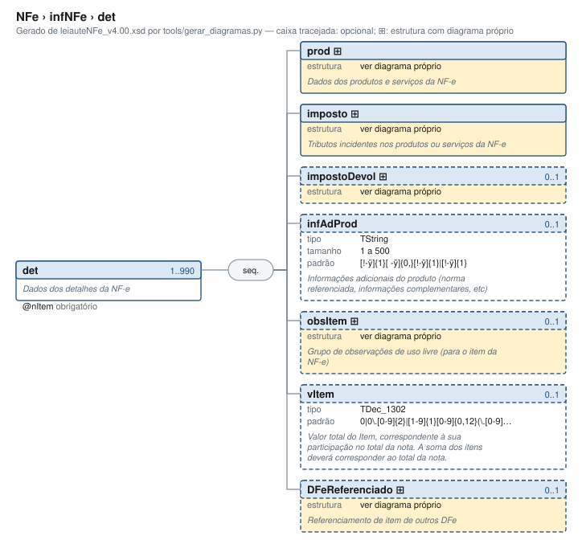

# det — Dados dos detalhes da NF-e

[Manual](../../README.md) › [NFe](../../NFe.md) › [infNFe](../infNFe.md) › det

<!-- estado-xsd:inicio -->
> **Estado: documentado.** Estrutura conferida contra a base XSD registrada.
>
> `Base atual e revisada: c537394250f913b591f3984f1de2e9d1a1ec94d334a0086e7a41f9850f5f7917`
<!-- estado-xsd:fim -->

| Informação | Base conferida |
|---|---|
| Caminho XML | `NFe/infNFe/det` |
| Leiaute / pacote XSD | NF-e/NFC-e 4.00 / PL010f v1.04, 31/08/2026 |
| Biblioteca conferida | libnfe 1.0.0-rc4, commit `1dd412eebca80dd80d884b3f03a1a31cfaf42279` |
| Revisão | 2026-10-05 |
| Contexto no leiaute | `1..990` no pai, sujeito às sequências e escolhas abaixo |

## Finalidade e quando preencher

Um det representa um item, com produto/serviço e seus tributos. O atributo nItem identifica sua posição; ao anexar o item à nota, nfe_nfe_add_det atribui a numeração a partir de 1. Não use a mesma instância de item em duas notas.

Descrição e observações do XSD adotado: Dados dos detalhes da NF-e. A estrutura e as restrições são as do pacote indicado; notas históricas de uso devem ser lidas junto às atualizações listadas nas referências.

## Estrutura, ordem e escolhas



[Abrir o diagrama](../../../diagramas/NFe/infNFe/det.svg).

Uma ocorrência `1..1` dentro de uma alternativa exige o campo quando essa alternativa é selecionada; não obriga selecionar esse ramo em toda nota. Grupos opcionais podem conter filhos obrigatórios. Os elementos de sequência seguem a ordem indicada.

- **Sequência** `1..1`
  - `prod` `1..1`
  - `imposto` `1..1`
  - `impostoDevol` `0..1`
  - `infAdProd` `0..1`
  - `obsItem` `0..1`
  - `vItem` `0..1`
  - `DFeReferenciado` `0..1`

## Campos e atributos

| Tag / atributo | Significado e observações | Tipo XML | Ocorrência | Formato / limites | Condição no contexto |
|---|---|---|---|---|---|
| `@nItem` | Número do item do NF | `string` | `1..1` | Padrão: `[1-9]{1}[0-9]{0,1}\|[1-8]{1}[0-9]{2}\|[9]{1}[0-8]{1}[0-9]{1}\|[9]{1}[9]{1}[0]{1}`<br>Tratamento de espaços: preserve | Obrigatório |
| [`prod`](det/prod.md) | Dados dos produtos e serviços da NF-e | `complexType anônimo` | `1..1` | Grupo estruturado | Obrigatório no contexto |
| [`imposto`](det/imposto.md) | Tributos incidentes nos produtos ou serviços da NF-e | `complexType anônimo` | `1..1` | Grupo estruturado | Obrigatório no contexto |
| [`impostoDevol`](det/impostoDevol.md) |  | `complexType anônimo` | `0..1` | Grupo estruturado | Opcional no contexto |
| `infAdProd` | Informações adicionais do produto (norma referenciada, informações complementares, etc) | `TString` | `0..1` | Mínimo: 1<br>Máximo: 500<br>Padrão: `[!-ÿ]{1}[ -ÿ]{0,}[!-ÿ]{1}\|[!-ÿ]{1}`<br>Tratamento de espaços: preserve | Opcional no contexto |
| [`obsItem`](det/obsItem.md) | Grupo de observações de uso livre (para o item da NF-e) | `complexType anônimo` | `0..1` | Grupo estruturado | Opcional no contexto |
| `vItem` | Valor total do Item, correspondente à sua participação no total da nota. A soma dos itens deverá corresponder ao total da nota. | `TDec_1302` | `0..1` | Padrão: `0\|0\.[0-9]{2}\|[1-9]{1}[0-9]{0,12}(\.[0-9]{2})?`<br>Tratamento de espaços: preserve | Opcional no contexto |
| [`DFeReferenciado`](det/DFeReferenciado.md) | Referenciamento de item de outros DFe | `complexType anônimo` | `0..1` | Grupo estruturado | Opcional no contexto |

Campos decimais usam o separador `.` e a precisão indicada pelo tipo; preservar a representação textual evita perda por ponto flutuante. Ausência, texto vazio e zero são valores distintos. Padrões, comprimentos e enumerações precisam ser atendidos em conjunto; valores de códigos com zeros significativos devem conservar esses zeros. Campos de mesmo nome em outros pais têm contexto próprio.

## API C, integração e memória

Este grupo usa os objetos e funções específicos do módulo `det.h`. O contrato completo abaixo identifica os argumentos, a ligação ao pai, a serialização e a liberação. O exemplo indicado usa essas funções; o motor genérico não é um substituto automático para esse objeto.

[Contrato público de det.h](../../api/det.md) apresenta assinaturas, argumentos, retornos e limitações. [Convenções de memória e erros](../../API.md) explica cópia, empréstimo e transferência de posse.

Ao usar um grupo emprestado, libere o objeto proprietário, nunca o grupo separadamente. Os setters de texto copiam seus valores; getters retornam texto interno emprestado. A escolha de outro ramo válido pode apagar o anterior. Os campos obrigatórios do motor são conferidos na escrita; validar um valor isolado não prova completude do grupo. Os contratos específicos prevalecem quando a função indicada não usa o motor.

## Exemplo C conferido

[Fonte completo do cenário teste_item](../../../../tests/test_det.c) contém o preenchimento, a conferência dos retornos e a liberação dos recursos. O cenário integra o programa de testes indicado, com os headers e apoios do repositório. O XML foi observado na serialização desse cenário e validado, não deduzido de um desenho.

```sh
make obj/test_det
./obj/test_det tests
```

A função abaixo é o cenário completo do teste, incluindo tratamento dos retornos e eventuais verificações de erros. O XML publicado foi observado na validação da linha **86** do fonte indicado; a função pode exercitar outras alterações antes/depois desse ponto.

<details>
<summary>Função C completa do cenário teste_item</summary>

```c
static void teste_item(void)
{
	nfe_det *det = nfe_det_new();
	char *xml;
	int rc;

	VERIFICA(det != NULL);
	if (!det)
		return;
	VERIFICA_INT(nfe_det_set_nitem(det, 1), 0);
	VERIFICA_INT(nfe_det_set_prod(det, produto()), 0);
	VERIFICA_INT(nfe_det_set_imposto(det, imposto()), 0);
	xml = teste_gera(escreve, det, &rc);
	VERIFICA_INT(rc, 0);
	VERIFICA(xml != NULL);
	if (xml) {
		VERIFICA(strstr(xml, "<det xmlns=\"" TESTE_NS "\" nItem=\"1\">"
		                     "<prod><cProd>001</cProd>") != NULL);
		VERIFICA(strstr(xml, "</prod><imposto><ICMS>") != NULL);
		VERIFICA(strstr(xml, "</COFINS></imposto></det>") != NULL);
		VERIFICA_INT(teste_valida(xml), 0);
	}
	free(xml);

	/* Opcionais e o último número de item */
	VERIFICA_INT(nfe_det_set_nitem(det, NFE_MAX_ITENS), 0);
	VERIFICA_INT(nfe_det_set_infadprod(det, "Cor: azul; ponta fina"), 0);
	VERIFICA_INT(nfe_det_set_vitem(det, "15.00"), 0);
	xml = teste_gera(escreve, det, &rc);
	VERIFICA_INT(rc, 0);
	VERIFICA(xml != NULL);
	if (xml) {
		VERIFICA(strstr(xml, "nItem=\"990\"") != NULL);
		VERIFICA(strstr(xml,
		                "</imposto>"
		                "<infAdProd>Cor: azul; ponta fina</infAdProd>"
		                "<vItem>15.00</vItem></det>") != NULL);
		VERIFICA_INT(teste_valida(xml), 0);
	}
	free(xml);

	/* Removendo os opcionais */
	VERIFICA_INT(nfe_det_set_infadprod(det, NULL), 0);
	VERIFICA_INT(nfe_det_set_vitem(det, NULL), 0);
	xml = teste_gera(escreve, det, &rc);
	VERIFICA(xml != NULL);
	if (xml) {
		VERIFICA(strstr(xml, "infAdProd") == NULL);
		VERIFICA(strstr(xml, "vItem") == NULL);
	}
	free(xml);
	nfe_det_free(det);
}
```

</details>

## XML correspondente

Trecho do cenário acima, com namespace preservado. [XML completo do cenário](../../exemplos/grupos/test_det-0001.xml) permite conferir valores e ancestrais. Dados sintéticos; este exemplo comprova estrutura e uso da API, sem transmissão, autorização ou validação de enquadramento fiscal.

```xml
<det xmlns="http://www.portalfiscal.inf.br/nfe" nItem="1">
  <prod>
    <cProd>001</cProd>
    <cEAN>SEM GTIN</cEAN>
    <xProd>CANETA AZUL</xProd>
    <NCM>96081000</NCM>
    <CFOP>5102</CFOP>
    <uCom>UN</uCom>
    <qCom>10</qCom>
    <vUnCom>1.50</vUnCom>
    <vProd>15.00</vProd>
    <cEANTrib>SEM GTIN</cEANTrib>
    <uTrib>UN</uTrib>
    <qTrib>10</qTrib>
    <vUnTrib>1.50</vUnTrib>
    <indTot>1</indTot>
  </prod>
  <imposto>
    <ICMS>
      <ICMSSN102>
        <orig>0</orig>
        <CSOSN>102</CSOSN>
      </ICMSSN102>
    </ICMS>
    <PIS>
      <PISNT>
        <CST>08</CST>
      </PISNT>
    </PIS>
    <COFINS>
      <COFINSNT>
        <CST>08</CST>
      </COFINSNT>
    </COFINS>
  </imposto>
</det>
```

O fragmento é validado no contexto que o declara no leiaute, com namespace e ancestrais. O wrapper tipos_v4.00.xsd, quando usado nos testes, extrai essas declarações do schema oficial e é identificado como apoio de testes, sem substituir o pacote oficial.

## Validação, erros e limites

| Situação | Etapa / resultado | Tratamento |
|---|---|---|
| Ponteiro obrigatório nulo | API: `E_ISNULL` (-1), conforme contrato da função | Conferir criação e argumentos |
| Texto fora do comprimento | Setter/motor: `E_TAMANHO` (-2) | Usar os limites do tipo e do argumento C |
| Domínio, padrão ou caminho inválido/ambíguo | Setter/motor: `E_VALOR` (-3) | Corrigir o valor e usar caminho completo |
| Campo obrigatório ou escolha incompleta | Escrita do motor: `E_VALOR`; XSD rejeita | Completar o ramo selecionado |
| Falha de escrita XML | Writer: `E_XML` (-4) | Descartar saída parcial e tratar a falha |
| Falta de memória | Criação: NULL; operações que alocam podem retornar `E_MALLOC` (-101) | Encerrar com limpeza dos recursos ainda próprios |
| Regra fiscal, cadastro, cálculo ou vigência | Pode ser aceito lexicalmente; depende da regra e do autorizador | Conferir fontes e contratos; não confundir 0 com autorização |

Os códigos negativos são da biblioteca, não códigos cStat. [Validação e regras implementadas](../../VALIDACAO.md) distingue XSD, verificações locais e retorno da SEFAZ. A referência da API identifica exceções aos comportamentos gerais desta tabela.

## Referências e grupos relacionados

- XSD atual: [leiaute](../../../../tests/schemas/nfe/leiauteNFe_v4.00.xsd), [tipos básicos](../../../../tests/schemas/nfe/tiposBasico_v4.00.xsd) e [tipos DFe/RTC](../../../../tests/schemas/nfe/DFeTiposBasicos_v1.00.xsd).
- MOC 7.0, Anexo I: H, p. 17. [Fontes oficiais, versões e transições](../../BASES.md) relaciona atualizações posteriores, com vigência separada da publicação.
- API: [det.h](../../../../include/libnfe/det.h) e [referência das funções](../../api/det.md).
- Grupo pai: [infNFe](../infNFe.md).
- Filhos: [prod](det/prod.md), [imposto](det/imposto.md), [impostoDevol](det/impostoDevol.md), [obsItem](det/obsItem.md), [DFeReferenciado](det/DFeReferenciado.md).

Anterior: [autXML](autXML.md) | Próximo: [prod](det/prod.md)
