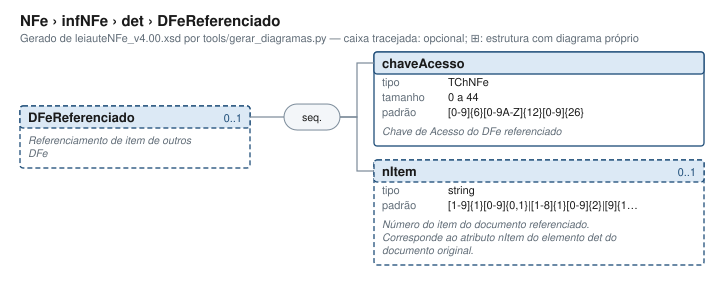

# DFeReferenciado — Referenciamento de item de outros DFe

[Manual](../../../README.md) › [NFe](../../../NFe.md) › [infNFe](../../infNFe.md) › [det](../det.md) › DFeReferenciado

<!-- estado-xsd:inicio -->
> **Estado: documentado.** Estrutura conferida contra a base XSD registrada.
>
> `Base atual e revisada: c537394250f913b591f3984f1de2e9d1a1ec94d334a0086e7a41f9850f5f7917`
<!-- estado-xsd:fim -->

| Informação | Base conferida |
|---|---|
| Caminho XML | `NFe/infNFe/det/DFeReferenciado` |
| Leiaute / pacote XSD | NF-e/NFC-e 4.00 / PL010f v1.04, 31/08/2026 |
| Biblioteca conferida | libnfe 1.0.0-rc4, commit `1dd412eebca80dd80d884b3f03a1a31cfaf42279` |
| Revisão | 2026-10-05 |
| Contexto no leiaute | `0..1` no pai, sujeito às sequências e escolhas abaixo |

## Finalidade e quando preencher

Relaciona este item a um documento fiscal eletrônico anterior, com chave e número de item. O número referenciado é o nItem da nota original, não o item da nova nota. A aplicação depende da finalidade e das condições da NT 2025.002 v1.52.

Na devolução, VC02-14 passa a exigir referência por item em produção em **03/11/2026**. VC02-05 proíbe combinar DFeReferenciado com NFref no nível da nota. A dispensa de nItem é específica da nota de débito tipo 03; não omita esse campo generalizando a cardinalidade opcional do XSD.

Descrição e observações do XSD adotado: Referenciamento de item de outros DFe. A estrutura e as restrições são as do pacote indicado; notas históricas de uso devem ser lidas junto às atualizações listadas nas referências.

## Estrutura, ordem e escolhas



[Abrir o diagrama](../../../../diagramas/NFe/infNFe/det/DFeReferenciado.svg).

Uma ocorrência `1..1` dentro de uma alternativa exige o campo quando essa alternativa é selecionada; não obriga selecionar esse ramo em toda nota. Grupos opcionais podem conter filhos obrigatórios. Os elementos de sequência seguem a ordem indicada.

- **Sequência** `1..1`
  - `chaveAcesso` `1..1`
  - `nItem` `0..1`

## Campos e atributos

| Tag / atributo | Significado e observações | Tipo XML | Ocorrência | Formato / limites | Condição no contexto |
|---|---|---|---|---|---|
| `chaveAcesso` | Chave de Acesso do DFe referenciado | `TChNFe` | `1..1` | Máximo: 44<br>Padrão: `[0-9]{6}[0-9A-Z]{12}[0-9]{26}`<br>Tratamento de espaços: preserve | Obrigatório no contexto |
| `nItem` | Número do item do documento referenciado. Corresponde ao atributo nItem do elemento det do documento original. | `string` | `0..1` | Padrão: `[1-9]{1}[0-9]{0,1}\|[1-8]{1}[0-9]{2}\|[9]{1}[0-8]{1}[0-9]{1}\|[9]{1}[9]{1}[0]{1}`<br>Tratamento de espaços: preserve | Opcional no contexto |

Campos decimais usam o separador `.` e a precisão indicada pelo tipo; preservar a representação textual evita perda por ponto flutuante. Ausência, texto vazio e zero são valores distintos. Padrões, comprimentos e enumerações precisam ser atendidos em conjunto; valores de códigos com zeros significativos devem conservar esses zeros. Campos de mesmo nome em outros pais têm contexto próprio.

## API C, integração e memória

Acesso pela API pública: `nfe_det_grupo(det, "DFeReferenciado")`. O grupo pertence ao objeto que o fornece. Use os caminhos completos a partir desse grupo; se um ancestral for uma lista, obtenha uma ocorrência com `nfe_grupo_add` antes de preencher seus filhos.

[Contrato público de det.h](../../../api/det.md) apresenta assinaturas, argumentos, retornos e limitações. [Convenções de memória e erros](../../../API.md) explica cópia, empréstimo e transferência de posse.

Ao usar um grupo emprestado, libere o objeto proprietário, nunca o grupo separadamente. Os setters de texto copiam seus valores; getters retornam texto interno emprestado. A escolha de outro ramo válido pode apagar o anterior. Os campos obrigatórios do motor são conferidos na escrita; validar um valor isolado não prova completude do grupo. Os contratos específicos prevalecem quando a função indicada não usa o motor.

## Exemplo C conferido

[Fonte completo do cenário teste_grupos](../../../../../tests/test_det.c) contém o preenchimento, a conferência dos retornos e a liberação dos recursos. O cenário integra o programa de testes indicado, com os headers e apoios do repositório. O XML foi observado na serialização desse cenário e validado, não deduzido de um desenho.

```sh
make obj/test_det
./obj/test_det tests
```

A função abaixo é o cenário completo do teste, incluindo tratamento dos retornos e eventuais verificações de erros. O XML publicado foi observado na validação da linha **167** do fonte indicado; a função pode exercitar outras alterações antes/depois desse ponto.

<details>
<summary>Função C completa do cenário teste_grupos</summary>

```c
static void teste_grupos(void)
{
	nfe_det *det = nfe_det_new();
	nfe_grupo *dev, *obs, *ref;
	char *xml;
	int rc = 0;

	rc |= nfe_det_set_nitem(det, 1);
	rc |= nfe_det_set_prod(det, produto());
	rc |= nfe_det_set_imposto(det, imposto());
	rc |= nfe_det_set_infadprod(det, "TEXTO");
	rc |= nfe_det_set_vitem(det, "15.00");
	VERIFICA_INT(rc, 0);
	/* Grupos criados vazios não aparecem */
	VERIFICA(nfe_det_grupo(det, "obsItem") != NULL);
	VERIFICA(nfe_det_grupo(det, "naoexiste") == NULL);
	VERIFICA(nfe_det_grupo(NULL, "obsItem") == NULL);
	xml = teste_gera(escreve, det, &rc);
	VERIFICA_INT(rc, 0);
	if (xml)
		VERIFICA(strstr(xml, "obsItem") == NULL);
	free(xml);

	dev = nfe_det_grupo(det, "impostoDevol");
	obs = nfe_det_grupo(det, "obsItem");
	ref = nfe_det_grupo(det, "DFeReferenciado");
	rc |= nfe_grupo_set(dev, "pDevol", "100.00");
	rc |= nfe_grupo_set(dev, "IPI/vIPIDevol", "0.00");
	rc |= nfe_grupo_set(obs, "obsCont/xCampo", "lote");
	rc |= nfe_grupo_set(obs, "obsCont/xTexto", "L-123");
	rc |= nfe_grupo_set(ref, "chaveAcesso",
	                    "35100812345678000195550010000000421123456781");
	rc |= nfe_grupo_set(ref, "nItem", "3");
	VERIFICA_INT(rc, 0);
	xml = teste_gera(escreve, det, &rc);
	VERIFICA_INT(rc, 0);
	VERIFICA(xml != NULL);
	if (xml) {
		VERIFICA(strstr(xml,
		                "</imposto><impostoDevol><pDevol>100.00"
		                "</pDevol><IPI><vIPIDevol>0.00</vIPIDevol>"
		                "</IPI></impostoDevol><infAdProd>TEXTO"
		                "</infAdProd><obsItem><obsCont xCampo=\"lote"
		                "\"><xTexto>L-123</xTexto></obsCont></obsItem>"
		                "<vItem>15.00</vItem><DFeReferenciado>") !=
		         NULL);
		VERIFICA_INT(teste_valida(xml), 0);
	}
	free(xml);

	/* Atributo obrigatório faltando */
	VERIFICA_INT(nfe_grupo_set(obs, "obsCont/xCampo", NULL), 0);
	xml = teste_gera(escreve, det, &rc);
	VERIFICA_INT(rc, E_VALOR);
	free(xml);
	nfe_det_free(det);
}
```

</details>

## XML correspondente

Trecho do cenário acima, com namespace preservado. [XML completo do cenário](../../../exemplos/grupos/test_det-0003.xml) permite conferir valores e ancestrais. Dados sintéticos; este exemplo comprova estrutura e uso da API, sem transmissão, autorização ou validação de enquadramento fiscal.

```xml
<DFeReferenciado xmlns="http://www.portalfiscal.inf.br/nfe">
  <chaveAcesso>35100812345678000195550010000000421123456781</chaveAcesso>
  <nItem>3</nItem>
</DFeReferenciado>

```

O fragmento é validado no contexto que o declara no leiaute, com namespace e ancestrais. O wrapper tipos_v4.00.xsd, quando usado nos testes, extrai essas declarações do schema oficial e é identificado como apoio de testes, sem substituir o pacote oficial.

## Validação, erros e limites

| Situação | Etapa / resultado | Tratamento |
|---|---|---|
| Ponteiro obrigatório nulo | API: `E_ISNULL` (-1), conforme contrato da função | Conferir criação e argumentos |
| Texto fora do comprimento | Setter/motor: `E_TAMANHO` (-2) | Usar os limites do tipo e do argumento C |
| Domínio, padrão ou caminho inválido/ambíguo | Setter/motor: `E_VALOR` (-3) | Corrigir o valor e usar caminho completo |
| Campo obrigatório ou escolha incompleta | Escrita do motor: `E_VALOR`; XSD rejeita | Completar o ramo selecionado |
| Falha de escrita XML | Writer: `E_XML` (-4) | Descartar saída parcial e tratar a falha |
| Falta de memória | Criação: NULL; operações que alocam podem retornar `E_MALLOC` (-101) | Encerrar com limpeza dos recursos ainda próprios |
| Regra fiscal, cadastro, cálculo ou vigência | Pode ser aceito lexicalmente; depende da regra e do autorizador | Conferir fontes e contratos; não confundir 0 com autorização |

Os códigos negativos são da biblioteca, não códigos cStat. [Validação e regras implementadas](../../../VALIDACAO.md) distingue XSD, verificações locais e retorno da SEFAZ. A referência da API identifica exceções aos comportamentos gerais desta tabela.

## Referências e grupos relacionados

- XSD atual: [leiaute](../../../../../tests/schemas/nfe/leiauteNFe_v4.00.xsd), [tipos básicos](../../../../../tests/schemas/nfe/tiposBasico_v4.00.xsd) e [tipos DFe/RTC](../../../../../tests/schemas/nfe/DFeTiposBasicos_v1.00.xsd).
- MOC 7.0, Anexo I: grupo VC da NT 2025.002 v1.52, pp. 29 e 69–70. [Fontes oficiais, versões e transições](../../../BASES.md) relaciona atualizações posteriores, com vigência separada da publicação.
- API: [det.h](../../../../../include/libnfe/det.h) e [referência das funções](../../../api/det.md).
- Grupo pai: [det](../det.md).

Anterior: [obsFisco](obsItem/obsFisco.md) | Próximo: [total](../total.md)
