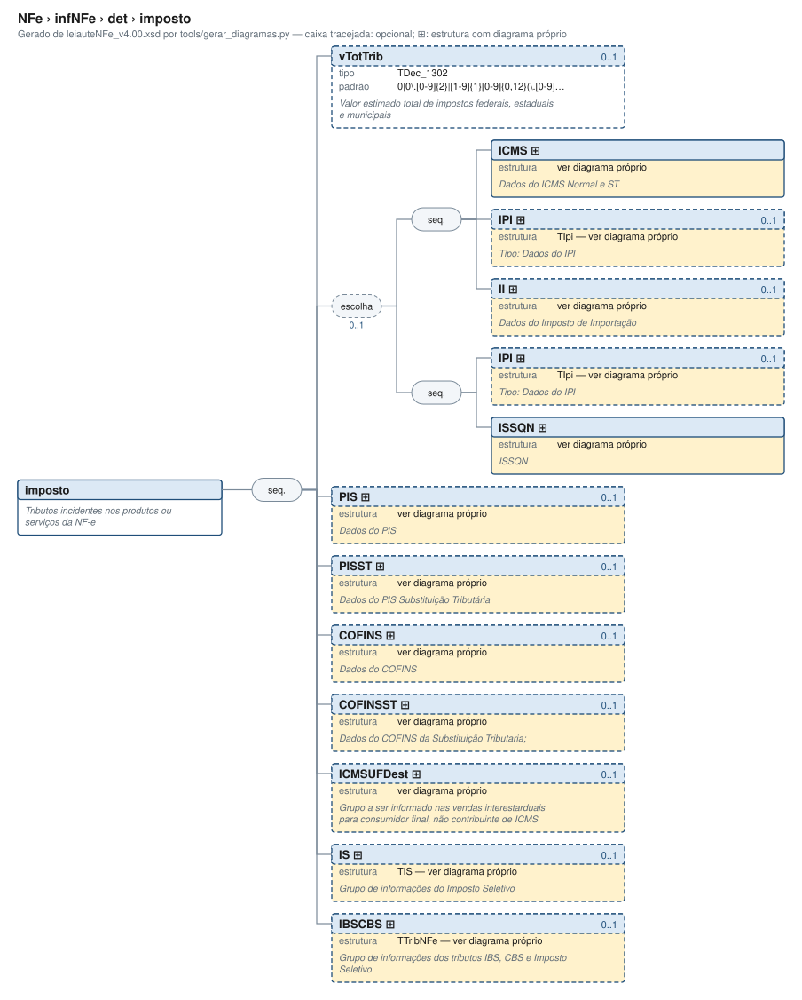

# imposto — Tributos incidentes nos produtos ou serviços da NF-e

[Manual](../../../README.md) › [NFe](../../../NFe.md) › [infNFe](../../infNFe.md) › [det](../det.md) › imposto

<!-- estado-xsd:inicio -->
> **Estado: documentado.** Estrutura conferida contra a base XSD registrada.
>
> `Base atual e revisada: c537394250f913b591f3984f1de2e9d1a1ec94d334a0086e7a41f9850f5f7917`
<!-- estado-xsd:fim -->

| Informação | Base conferida |
|---|---|
| Caminho XML | `NFe/infNFe/det/imposto` |
| Leiaute / pacote XSD | NF-e/NFC-e 4.00 / PL010f v1.04, 31/08/2026 |
| Biblioteca conferida | libnfe 1.0.0-rc4, commit `1dd412eebca80dd80d884b3f03a1a31cfaf42279` |
| Revisão | 2026-10-05 |
| Contexto no leiaute | `1..1` no pai, sujeito às sequências e escolhas abaixo |

## Finalidade e quando preencher

Os tributos são informados por item. Escolha os ramos de acordo com o regime do emitente e a operação; códigos CST/CSOSN e classificações fiscais não são decisões tomadas pelo motor de grupos. Bases, alíquotas e valores são textos decimais, e o preenchimento não recalcula os tributos.

**Atualização publicada:** a NT 2026.008 v1.00 prevê vUnComLiq, vProdLiq, vProdLiqTot e ICMSPrevistoPagtoAntecip/vICMSPrevisto. Esses campos/grupo **não constam no PL010f atualmente disponível no Portal e adotado pelo projeto**, e não são apresentados aqui como API existente. A NT registra homologação em 05/10/2026 e produção em 03/11/2026 para a primeira etapa; sua regra NB01-30 tem cronograma próprio em 2027. Confira [bases e transições](../../../BASES.md).

Descrição e observações do XSD adotado: Tributos incidentes nos produtos ou serviços da NF-e. A estrutura e as restrições são as do pacote indicado; notas históricas de uso devem ser lidas junto às atualizações listadas nas referências.

## Estrutura, ordem e escolhas



[Abrir o diagrama](../../../../diagramas/NFe/infNFe/det/imposto.svg).

Uma ocorrência `1..1` dentro de uma alternativa exige o campo quando essa alternativa é selecionada; não obriga selecionar esse ramo em toda nota. Grupos opcionais podem conter filhos obrigatórios. Os elementos de sequência seguem a ordem indicada.

- **Sequência** `1..1`
  - `vTotTrib` `0..1`
  - **Escolha exclusiva** `0..1`
    - **Sequência** `1..1`
      - `ICMS` `1..1`
      - `IPI` `0..1`
      - `II` `0..1`
    - **Sequência** `1..1`
      - `IPI` `0..1`
      - `ISSQN` `1..1`
  - `PIS` `0..1`
  - `PISST` `0..1`
  - `COFINS` `0..1`
  - `COFINSST` `0..1`
  - `ICMSUFDest` `0..1`
  - `IS` `0..1`
  - `IBSCBS` `0..1`

## Campos e atributos

| Tag / atributo | Significado e observações | Tipo XML | Ocorrência | Formato / limites | Condição no contexto |
|---|---|---|---|---|---|
| `vTotTrib` | Valor estimado total de impostos federais, estaduais e municipais | `TDec_1302` | `0..1` | Padrão: `0\|0\.[0-9]{2}\|[1-9]{1}[0-9]{0,12}(\.[0-9]{2})?`<br>Tratamento de espaços: preserve | Opcional no contexto |
| [`ICMS`](imposto/ICMS.md) | Dados do ICMS Normal e ST | `complexType anônimo` | `1..1` | Grupo estruturado | Obrigatório no contexto; apenas na alternativa selecionada; sequência/escolha opcional |
| [`IPI`](imposto/IPI.md) | Tipo: Dados do IPI | `TIpi` | `0..1` | Grupo estruturado | Opcional no contexto; apenas na alternativa selecionada; sequência/escolha opcional |
| [`II`](imposto/II.md) | Dados do Imposto de Importação | `complexType anônimo` | `0..1` | Grupo estruturado | Opcional no contexto; apenas na alternativa selecionada; sequência/escolha opcional |
| [`IPI`](imposto/IPI.md) | Tipo: Dados do IPI | `TIpi` | `0..1` | Grupo estruturado | Opcional no contexto; apenas na alternativa selecionada; sequência/escolha opcional |
| [`ISSQN`](imposto/ISSQN.md) | ISSQN | `complexType anônimo` | `1..1` | Grupo estruturado | Obrigatório no contexto; apenas na alternativa selecionada; sequência/escolha opcional |
| [`PIS`](imposto/PIS.md) | Dados do PIS | `complexType anônimo` | `0..1` | Grupo estruturado | Opcional no contexto |
| [`PISST`](imposto/PISST.md) | Dados do PIS Substituição Tributária | `complexType anônimo` | `0..1` | Grupo estruturado | Opcional no contexto |
| [`COFINS`](imposto/COFINS.md) | Dados do COFINS | `complexType anônimo` | `0..1` | Grupo estruturado | Opcional no contexto |
| [`COFINSST`](imposto/COFINSST.md) | Dados do COFINS da Substituição Tributaria; | `complexType anônimo` | `0..1` | Grupo estruturado | Opcional no contexto |
| [`ICMSUFDest`](imposto/ICMSUFDest.md) | Grupo a ser informado nas vendas interestarduais para consumidor final, não contribuinte de ICMS | `complexType anônimo` | `0..1` | Grupo estruturado | Opcional no contexto |
| [`IS`](imposto/IS.md) | Grupo de informações do Imposto Seletivo | `TIS` | `0..1` | Grupo estruturado | Opcional no contexto |
| [`IBSCBS`](imposto/IBSCBS.md) | Grupo de informações dos tributos IBS, CBS e Imposto Seletivo | `TTribNFe` | `0..1` | Grupo estruturado | Opcional no contexto |

Campos decimais usam o separador `.` e a precisão indicada pelo tipo; preservar a representação textual evita perda por ponto flutuante. Ausência, texto vazio e zero são valores distintos. Padrões, comprimentos e enumerações precisam ser atendidos em conjunto; valores de códigos com zeros significativos devem conservar esses zeros. Campos de mesmo nome em outros pais têm contexto próprio.

## API C, integração e memória

Acesso pela API pública: `nfe_imposto_grupo(imp)`. O grupo pertence ao objeto que o fornece. Use os caminhos completos a partir desse grupo; se um ancestral for uma lista, obtenha uma ocorrência com `nfe_grupo_add` antes de preencher seus filhos.

[Contrato público de imposto.h](../../../api/imposto.md) apresenta assinaturas, argumentos, retornos e limitações. [Convenções de memória e erros](../../../API.md) explica cópia, empréstimo e transferência de posse.

Ao usar um grupo emprestado, libere o objeto proprietário, nunca o grupo separadamente. Os setters de texto copiam seus valores; getters retornam texto interno emprestado. A escolha de outro ramo válido pode apagar o anterior. Os campos obrigatórios do motor são conferidos na escrita; validar um valor isolado não prova completude do grupo. Os contratos específicos prevalecem quando a função indicada não usa o motor.

## Exemplo C conferido

[Fonte completo do cenário teste_simples_nacional](../../../../../tests/test_imposto.c) contém o preenchimento, a conferência dos retornos e a liberação dos recursos. O cenário integra o programa de testes indicado, com os headers e apoios do repositório. O XML foi observado na serialização desse cenário e validado, não deduzido de um desenho.

```sh
make obj/test_imposto
./obj/test_imposto tests
```

A função abaixo é o cenário completo do teste, incluindo tratamento dos retornos e eventuais verificações de erros. O XML publicado foi observado na validação da linha **153** do fonte indicado; a função pode exercitar outras alterações antes/depois desse ponto.

<details>
<summary>Função C completa do cenário teste_simples_nacional</summary>

```c
static void teste_simples_nacional(void)
{
	nfe_imposto *imp = nfe_imposto_new();
	char *xml;
	int rc;

	VERIFICA(imp != NULL);
	if (!imp)
		return;
	VERIFICA_INT(nfe_imposto_set_icmssn102(imp, NFE_ORIGEM_NACIONAL,
	                                       NFE_CSOSN_102),
	             0);
	VERIFICA_INT(nfe_imposto_set_pisnt(imp, NFE_CST_PC_SEM_INCIDENCIA), 0);
	VERIFICA_INT(nfe_imposto_set_cofinsnt(imp, NFE_CST_PC_ISENTA), 0);
	xml = teste_gera(escreve, imp, &rc);
	VERIFICA_INT(rc, 0);
	VERIFICA(xml != NULL);
	if (xml) {
		VERIFICA(strstr(xml,
		                "<ICMS><ICMSSN102><orig>0</orig>"
		                "<CSOSN>102</CSOSN></ICMSSN102></ICMS>"
		                "<PIS><PISNT><CST>08</CST></PISNT></PIS>"
		                "<COFINS><COFINSNT><CST>07</CST></COFINSNT>"
		                "</COFINS></imposto>") != NULL);
		VERIFICA_INT(teste_valida(xml), 0);
	}
	free(xml);

	/* orig é opcional no ICMSSN102 */
	VERIFICA_INT(nfe_imposto_set_icmssn102(imp, NFE_ORIGEM_NAO_INFORMADA,
	                                       NFE_CSOSN_400),
	             0);
	xml = teste_gera(escreve, imp, &rc);
	VERIFICA(xml != NULL);
	if (xml) {
		VERIFICA(strstr(xml, "<ICMSSN102><CSOSN>400</CSOSN>") != NULL);
		VERIFICA_INT(teste_valida(xml), 0);
	}
	free(xml);

	/* Removendo os grupos */
	VERIFICA_INT(nfe_imposto_remove_icms(imp), 0);
	VERIFICA_INT(nfe_imposto_remove_pis(imp), 0);
	VERIFICA_INT(nfe_imposto_remove_cofins(imp), 0);
	xml = teste_gera(escreve, imp, &rc);
	VERIFICA(xml != NULL);
	if (xml) {
		VERIFICA(strstr(xml, "ICMS") == NULL);
		VERIFICA(strstr(xml, "PIS") == NULL);
		VERIFICA(strstr(xml, "COFINS") == NULL);
		VERIFICA_INT(teste_valida(xml), 0);
	}
	free(xml);
	nfe_imposto_free(imp);
}
```

</details>

## XML correspondente

Trecho do cenário acima, com namespace preservado. [XML completo do cenário](../../../exemplos/grupos/test_imposto-0005.xml) permite conferir valores e ancestrais. Dados sintéticos; este exemplo comprova estrutura e uso da API, sem transmissão, autorização ou validação de enquadramento fiscal.

```xml
<imposto xmlns="http://www.portalfiscal.inf.br/nfe" />
```

O fragmento é validado no contexto que o declara no leiaute, com namespace e ancestrais. O wrapper tipos_v4.00.xsd, quando usado nos testes, extrai essas declarações do schema oficial e é identificado como apoio de testes, sem substituir o pacote oficial.

## Validação, erros e limites

| Situação | Etapa / resultado | Tratamento |
|---|---|---|
| Ponteiro obrigatório nulo | API: `E_ISNULL` (-1), conforme contrato da função | Conferir criação e argumentos |
| Texto fora do comprimento | Setter/motor: `E_TAMANHO` (-2) | Usar os limites do tipo e do argumento C |
| Domínio, padrão ou caminho inválido/ambíguo | Setter/motor: `E_VALOR` (-3) | Corrigir o valor e usar caminho completo |
| Campo obrigatório ou escolha incompleta | Escrita do motor: `E_VALOR`; XSD rejeita | Completar o ramo selecionado |
| Falha de escrita XML | Writer: `E_XML` (-4) | Descartar saída parcial e tratar a falha |
| Falta de memória | Criação: NULL; operações que alocam podem retornar `E_MALLOC` (-101) | Encerrar com limpeza dos recursos ainda próprios |
| Regra fiscal, cadastro, cálculo ou vigência | Pode ser aceito lexicalmente; depende da regra e do autorizador | Conferir fontes e contratos; não confundir 0 com autorização |

Os códigos negativos são da biblioteca, não códigos cStat. [Validação e regras implementadas](../../../VALIDACAO.md) distingue XSD, verificações locais e retorno da SEFAZ. A referência da API identifica exceções aos comportamentos gerais desta tabela.

## Referências e grupos relacionados

- XSD atual: [leiaute](../../../../../tests/schemas/nfe/leiauteNFe_v4.00.xsd), [tipos básicos](../../../../../tests/schemas/nfe/tiposBasico_v4.00.xsd) e [tipos DFe/RTC](../../../../../tests/schemas/nfe/DFeTiposBasicos_v1.00.xsd).
- MOC 7.0, Anexo I: M–U, pp. 25–57. [Fontes oficiais, versões e transições](../../../BASES.md) relaciona atualizações posteriores, com vigência separada da publicação.
- API: [imposto.h](../../../../../include/libnfe/imposto.h) e [referência das funções](../../../api/imposto.md).
- Grupo pai: [det](../det.md).
- Filhos: [ICMS](imposto/ICMS.md), [IPI](imposto/IPI.md), [II](imposto/II.md), [IPI](imposto/IPI.md), [ISSQN](imposto/ISSQN.md), [PIS](imposto/PIS.md), [PISST](imposto/PISST.md), [COFINS](imposto/COFINS.md), [COFINSST](imposto/COFINSST.md), [ICMSUFDest](imposto/ICMSUFDest.md), [IS](imposto/IS.md), [IBSCBS](imposto/IBSCBS.md).

Anterior: [origComb](prod/comb/origComb.md) | Próximo: [ICMS](imposto/ICMS.md)
