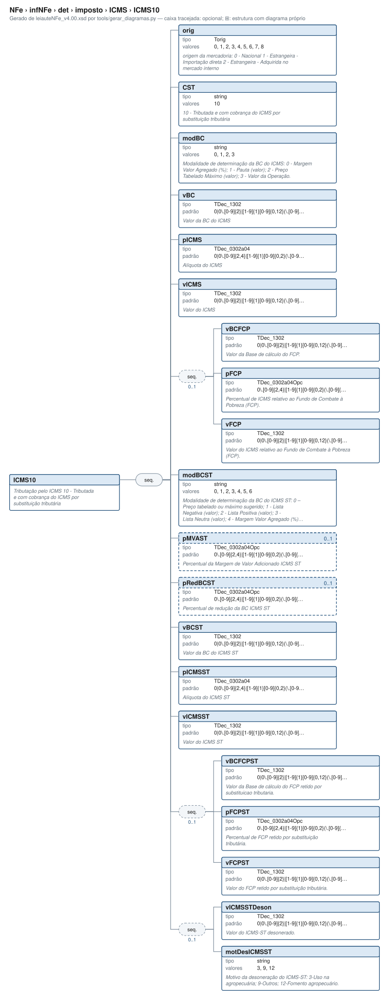

# ICMS10 — Tributação pelo ICMS 10 - Tributada e com cobrança do ICMS por substituição tributária

[Manual](../../../../../README.md) › [NFe](../../../../../NFe.md) › [infNFe](../../../../infNFe.md) › [det](../../../det.md) › [imposto](../../imposto.md) › [ICMS](../ICMS.md) › ICMS10

<!-- estado-xsd:inicio -->
> **Estado: documentado.** Estrutura conferida contra a base XSD registrada.
>
> `Base atual e revisada: c537394250f913b591f3984f1de2e9d1a1ec94d334a0086e7a41f9850f5f7917`
<!-- estado-xsd:fim -->

| Informação | Base conferida |
|---|---|
| Caminho XML | `NFe/infNFe/det/imposto/ICMS/ICMS10` |
| Leiaute / pacote XSD | NF-e/NFC-e 4.00 / PL010f v1.04, 31/08/2026 |
| Biblioteca conferida | libnfe 1.0.0-rc4, commit `1dd412eebca80dd80d884b3f03a1a31cfaf42279` |
| Revisão | 2026-10-05 |
| Contexto no leiaute | `1..1` no pai, sujeito às sequências e escolhas abaixo |

## Finalidade e quando preencher

Os tributos são informados por item. Escolha os ramos de acordo com o regime do emitente e a operação; códigos CST/CSOSN e classificações fiscais não são decisões tomadas pelo motor de grupos. Bases, alíquotas e valores são textos decimais, e o preenchimento não recalcula os tributos.

Este ramo participa da escolha do ICMS. Use o domínio de CST/CSOSN indicado na tabela e o regime da operação. Preencher um ramo válido no motor apaga os campos do ramo anterior; isso não determina que o novo tratamento seja fiscalmente apropriado.

**Atualização publicada:** a NT 2026.008 v1.00 prevê vUnComLiq, vProdLiq, vProdLiqTot e ICMSPrevistoPagtoAntecip/vICMSPrevisto. Esses campos/grupo **não constam no PL010f atualmente disponível no Portal e adotado pelo projeto**, e não são apresentados aqui como API existente. A NT registra homologação em 05/10/2026 e produção em 03/11/2026 para a primeira etapa; sua regra NB01-30 tem cronograma próprio em 2027. Confira [bases e transições](../../../../../BASES.md).

Descrição e observações do XSD adotado: Tributação pelo ICMS 10 - Tributada e com cobrança do ICMS por substituição tributária. A estrutura e as restrições são as do pacote indicado; notas históricas de uso devem ser lidas junto às atualizações listadas nas referências.

## Estrutura, ordem e escolhas



[Abrir o diagrama](../../../../../../diagramas/NFe/infNFe/det/imposto/ICMS/ICMS10.svg).

Uma ocorrência `1..1` dentro de uma alternativa exige o campo quando essa alternativa é selecionada; não obriga selecionar esse ramo em toda nota. Grupos opcionais podem conter filhos obrigatórios. Os elementos de sequência seguem a ordem indicada.

- **Sequência** `1..1`
  - `orig` `1..1`
  - `CST` `1..1`
  - `modBC` `1..1`
  - `vBC` `1..1`
  - `pICMS` `1..1`
  - `vICMS` `1..1`
  - **Sequência** `0..1`
    - `vBCFCP` `1..1`
    - `pFCP` `1..1`
    - `vFCP` `1..1`
  - `modBCST` `1..1`
  - `pMVAST` `0..1`
  - `pRedBCST` `0..1`
  - `vBCST` `1..1`
  - `pICMSST` `1..1`
  - `vICMSST` `1..1`
  - **Sequência** `0..1`
    - `vBCFCPST` `1..1`
    - `pFCPST` `1..1`
    - `vFCPST` `1..1`
  - **Sequência** `0..1`
    - `vICMSSTDeson` `1..1`
    - `motDesICMSST` `1..1`

## Campos e atributos

| Tag / atributo | Significado e observações | Tipo XML | Ocorrência | Formato / limites | Condição no contexto |
|---|---|---|---|---|---|
| `orig` | origem da mercadoria: 0 - Nacional 1 - Estrangeira - Importação direta 2 - Estrangeira - Adquirida no mercado interno | `Torig` | `1..1` | Domínio: `0`, `1`, `2`, `3`, `4`, `5`, `6`, `7`, `8`<br>Tratamento de espaços: preserve | Obrigatório no contexto |
| `CST` | 10 - Tributada e com cobrança do ICMS por substituição tributária | `string` | `1..1` | Domínio: `10`<br>Tratamento de espaços: preserve | Obrigatório no contexto |
| `modBC` | Modalidade de determinação da BC do ICMS: 0 - Margem Valor Agregado (%); 1 - Pauta (valor); 2 - Preço Tabelado Máximo (valor); 3 - Valor da Operação. | `string` | `1..1` | Domínio: `0`, `1`, `2`, `3`<br>Tratamento de espaços: preserve | Obrigatório no contexto |
| `vBC` | Valor da BC do ICMS | `TDec_1302` | `1..1` | Padrão: `0\|0\.[0-9]{2}\|[1-9]{1}[0-9]{0,12}(\.[0-9]{2})?`<br>Tratamento de espaços: preserve | Obrigatório no contexto |
| `pICMS` | Alíquota do ICMS | `TDec_0302a04` | `1..1` | Padrão: `0\|0\.[0-9]{2,4}\|[1-9]{1}[0-9]{0,2}(\.[0-9]{2,4})?`<br>Tratamento de espaços: preserve | Obrigatório no contexto |
| `vICMS` | Valor do ICMS | `TDec_1302` | `1..1` | Padrão: `0\|0\.[0-9]{2}\|[1-9]{1}[0-9]{0,12}(\.[0-9]{2})?`<br>Tratamento de espaços: preserve | Obrigatório no contexto |
| `vBCFCP` | Valor da Base de cálculo do FCP. | `TDec_1302` | `1..1` | Padrão: `0\|0\.[0-9]{2}\|[1-9]{1}[0-9]{0,12}(\.[0-9]{2})?`<br>Tratamento de espaços: preserve | Obrigatório no contexto; sequência/escolha opcional |
| `pFCP` | Percentual de ICMS relativo ao Fundo de Combate à Pobreza (FCP). | `TDec_0302a04Opc` | `1..1` | Padrão: `0\.[0-9]{2,4}\|[1-9]{1}[0-9]{0,2}(\.[0-9]{2,4})?`<br>Tratamento de espaços: preserve | Obrigatório no contexto; sequência/escolha opcional |
| `vFCP` | Valor do ICMS relativo ao Fundo de Combate à Pobreza (FCP). | `TDec_1302` | `1..1` | Padrão: `0\|0\.[0-9]{2}\|[1-9]{1}[0-9]{0,12}(\.[0-9]{2})?`<br>Tratamento de espaços: preserve | Obrigatório no contexto; sequência/escolha opcional |
| `modBCST` | Modalidade de determinação da BC do ICMS ST: 0 – Preço tabelado ou máximo sugerido; 1 - Lista Negativa (valor); 2 - Lista Positiva (valor); 3 - Lista Neutra (valor); 4 - Margem Valor Agregado (%); 5 - Pauta (valor) 6-Valor da Operação; | `string` | `1..1` | Domínio: `0`, `1`, `2`, `3`, `4`, `5`, `6`<br>Tratamento de espaços: preserve | Obrigatório no contexto |
| `pMVAST` | Percentual da Margem de Valor Adicionado ICMS ST | `TDec_0302a04Opc` | `0..1` | Padrão: `0\.[0-9]{2,4}\|[1-9]{1}[0-9]{0,2}(\.[0-9]{2,4})?`<br>Tratamento de espaços: preserve | Opcional no contexto |
| `pRedBCST` | Percentual de redução da BC ICMS ST | `TDec_0302a04Opc` | `0..1` | Padrão: `0\.[0-9]{2,4}\|[1-9]{1}[0-9]{0,2}(\.[0-9]{2,4})?`<br>Tratamento de espaços: preserve | Opcional no contexto |
| `vBCST` | Valor da BC do ICMS ST | `TDec_1302` | `1..1` | Padrão: `0\|0\.[0-9]{2}\|[1-9]{1}[0-9]{0,12}(\.[0-9]{2})?`<br>Tratamento de espaços: preserve | Obrigatório no contexto |
| `pICMSST` | Alíquota do ICMS ST | `TDec_0302a04` | `1..1` | Padrão: `0\|0\.[0-9]{2,4}\|[1-9]{1}[0-9]{0,2}(\.[0-9]{2,4})?`<br>Tratamento de espaços: preserve | Obrigatório no contexto |
| `vICMSST` | Valor do ICMS ST | `TDec_1302` | `1..1` | Padrão: `0\|0\.[0-9]{2}\|[1-9]{1}[0-9]{0,12}(\.[0-9]{2})?`<br>Tratamento de espaços: preserve | Obrigatório no contexto |
| `vBCFCPST` | Valor da Base de cálculo do FCP retido por substituicao tributaria. | `TDec_1302` | `1..1` | Padrão: `0\|0\.[0-9]{2}\|[1-9]{1}[0-9]{0,12}(\.[0-9]{2})?`<br>Tratamento de espaços: preserve | Obrigatório no contexto; sequência/escolha opcional |
| `pFCPST` | Percentual de FCP retido por substituição tributária. | `TDec_0302a04Opc` | `1..1` | Padrão: `0\.[0-9]{2,4}\|[1-9]{1}[0-9]{0,2}(\.[0-9]{2,4})?`<br>Tratamento de espaços: preserve | Obrigatório no contexto; sequência/escolha opcional |
| `vFCPST` | Valor do FCP retido por substituição tributária. | `TDec_1302` | `1..1` | Padrão: `0\|0\.[0-9]{2}\|[1-9]{1}[0-9]{0,12}(\.[0-9]{2})?`<br>Tratamento de espaços: preserve | Obrigatório no contexto; sequência/escolha opcional |
| `vICMSSTDeson` | Valor do ICMS-ST desonerado. | `TDec_1302` | `1..1` | Padrão: `0\|0\.[0-9]{2}\|[1-9]{1}[0-9]{0,12}(\.[0-9]{2})?`<br>Tratamento de espaços: preserve | Obrigatório no contexto; sequência/escolha opcional |
| `motDesICMSST` | Motivo da desoneração do ICMS-ST: 3-Uso na agropecuária; 9-Outros; 12-Fomento agropecuário. | `string` | `1..1` | Domínio: `3`, `9`, `12`<br>Tratamento de espaços: preserve | Obrigatório no contexto; sequência/escolha opcional |

Campos decimais usam o separador `.` e a precisão indicada pelo tipo; preservar a representação textual evita perda por ponto flutuante. Ausência, texto vazio e zero são valores distintos. Padrões, comprimentos e enumerações precisam ser atendidos em conjunto; valores de códigos com zeros significativos devem conservar esses zeros. Campos de mesmo nome em outros pais têm contexto próprio.

## API C, integração e memória

Acesso pela API pública: `nfe_imposto_grupo(imp)`. O grupo pertence ao objeto que o fornece. Use os caminhos completos a partir desse grupo; se um ancestral for uma lista, obtenha uma ocorrência com `nfe_grupo_add` antes de preencher seus filhos.

[Contrato público de imposto.h](../../../../../api/imposto.md) apresenta assinaturas, argumentos, retornos e limitações. [Convenções de memória e erros](../../../../../API.md) explica cópia, empréstimo e transferência de posse.

Ao usar um grupo emprestado, libere o objeto proprietário, nunca o grupo separadamente. Os setters de texto copiam seus valores; getters retornam texto interno emprestado. A escolha de outro ramo válido pode apagar o anterior. Os campos obrigatórios do motor são conferidos na escrita; validar um valor isolado não prova completude do grupo. Os contratos específicos prevalecem quando a função indicada não usa o motor.

## Exemplo C conferido

[Fonte completo do cenário teste_caminhos](../../../../../../../tests/test_imposto.c) contém o preenchimento, a conferência dos retornos e a liberação dos recursos. O cenário integra o programa de testes indicado, com os headers e apoios do repositório. O XML foi observado na serialização desse cenário e validado, não deduzido de um desenho.

```sh
make obj/test_imposto
./obj/test_imposto tests
```

A função abaixo é o cenário completo do teste, incluindo tratamento dos retornos e eventuais verificações de erros. O XML publicado foi observado na validação da linha **405** do fonte indicado; a função pode exercitar outras alterações antes/depois desse ponto.

<details>
<summary>Função C completa do cenário teste_caminhos</summary>

```c
static void teste_caminhos(void)
{
	static const char *const icms10[] = {
		"ICMS10/orig",
		"0",
		"ICMS10/modBC",
		"3",
		"ICMS10/vBC",
		"100.00",
		"ICMS10/pICMS",
		"18.00",
		"ICMS10/vICMS",
		"18.00",
		"ICMS10/modBCST",
		"4",
		"ICMS10/pMVAST",
		"40.00",
		"ICMS10/vBCST",
		"140.00",
		"ICMS10/pICMSST",
		"18.00",
		"ICMS10/vICMSST",
		"7.20",
		NULL,
	};
	static const char *const outros[] = {
		"IPI/cEnq",
		"999",
		"IPITrib/CST",
		"50",
		"IPITrib/vBC",
		"100.00",
		"IPITrib/pIPI",
		"10.00",
		"IPITrib/vIPI",
		"10.00",
		"II/vBC",
		"100.00",
		"II/vDespAdu",
		"5.00",
		"II/vII",
		"12.00",
		"II/vIOF",
		"0.38",
		"PISAliq/CST",
		"01",
		"PISAliq/vBC",
		"100.00",
		"PISAliq/pPIS",
		"1.65",
		"PISAliq/vPIS",
		"1.65",
		"PISST/vBC",
		"100.00",
		"PISST/pPIS",
		"1.65",
		"PISST/vPIS",
		"1.65",
		"COFINSNT/CST",
		"09",
		"ICMSUFDest/vBCUFDest",
		"100.00",
		"ICMSUFDest/pICMSUFDest",
		"18.00",
		"ICMSUFDest/pICMSInter",
		"12.00",
		"ICMSUFDest/pICMSInterPart",
		"100.00",
		"ICMSUFDest/vICMSUFDest",
		"6.00",
		"ICMSUFDest/vICMSUFRemet",
		"0.00",
		"IS/CSTIS",
		"000",
		"IS/cClassTribIS",
		"000001",
		"IS/vBCIS",
		"100.00",
		"IS/pIS",
		"1.00",
		"IS/vIS",
		"1.00",
		"IBSCBS/CST",
		"000",
		"IBSCBS/cClassTrib",
		"000001",
		"gIBSCBS/vBC",
		"100.00",
		"gIBSUF/pIBSUF",
		"0.10",
		"gIBSUF/vIBSUF",
		"0.10",
		"gIBSMun/pIBSMun",
		"0",
		"gIBSMun/vIBSMun",
		"0",
		"gIBSCBS/vIBS",
		"0.10",
		"gCBS/pCBS",
		"0.90",
		"gCBS/vCBS",
		"0.90",
		NULL,
	};
	nfe_imposto *imp = nfe_imposto_new();
	char *xml;
	int rc;

	VERIFICA(imp != NULL);
	if (!imp)
		return;
	VERIFICA_INT(grava(imp, icms10), 0);
	VERIFICA_INT(grava(imp, outros), 0);
	VERIFICA_STR(nfe_imposto_get(imp, "ICMS10/vICMSST"), "7.20");
	VERIFICA(nfe_imposto_get(imp, "ICMS10/vFCP") == NULL);
	xml = teste_gera(escreve, imp, &rc);
	VERIFICA_INT(rc, 0);
	VERIFICA(xml != NULL);
	if (xml) {
		/* CST de valor único preenchido sozinho, ordem do leiaute */
		VERIFICA(strstr(xml,
		                "<ICMS><ICMS10><orig>0</orig><CST>10</CST>"
		                "<modBC>3</modBC><vBC>100.00</vBC>") != NULL);
		VERIFICA(strstr(xml,
		                "<modBCST>4</modBCST><pMVAST>40.00</pMVAST>"
		                "<vBCST>140.00</vBCST>") != NULL);
		VERIFICA(strstr(xml, "</ICMS><IPI><cEnq>999</cEnq><IPITrib>"
		                     "<CST>50</CST><vBC>100.00</vBC>") != NULL);
		VERIFICA(strstr(xml, "</IPI><II><vBC>100.00</vBC>") != NULL);
		VERIFICA(strstr(xml, "</II><PIS><PISAliq>") != NULL);
		VERIFICA(strstr(xml, "</PIS><PISST><vBC>100.00</vBC>") != NULL);
		VERIFICA(strstr(xml,
		                "</PISST><COFINS><COFINSNT><CST>09</CST>") !=
		         NULL);
		VERIFICA(strstr(xml, "</COFINS><ICMSUFDest>") != NULL);
		VERIFICA(strstr(xml, "</ICMSUFDest><IS><CSTIS>000</CSTIS>") !=
		         NULL);
		VERIFICA(strstr(xml, "</IS><IBSCBS><CST>000</CST>") != NULL);
		VERIFICA(strstr(xml, "<gCBS><pCBS>0.90</pCBS><vCBS>0.90</vCBS>"
		                     "</gCBS></gIBSCBS></IBSCBS></imposto>") !=
		         NULL);
		VERIFICA_INT(teste_valida(xml), 0);
	}
	free(xml);

	/* Trocar de grupo na escolha apaga o anterior */
	VERIFICA_INT(nfe_imposto_set(imp, "ICMS40/CST", "41"), 0);
	VERIFICA(nfe_imposto_get(imp, "ICMS10/vBC") == NULL);
	VERIFICA_INT(nfe_imposto_set(imp, "ICMS40/orig", "2"), 0);
	xml = teste_gera(escreve, imp, &rc);
	VERIFICA_INT(rc, 0);
	if (xml) {
		VERIFICA(strstr(xml, "<ICMS><ICMS40><orig>2</orig><CST>41</CST>"
		                     "</ICMS40></ICMS>") != NULL);
		VERIFICA_INT(teste_valida(xml), 0);
	}
	free(xml);

	/* Grupo incompleto: recusado ao gerar */
	VERIFICA_INT(nfe_imposto_set(imp, "ICMSSN201/orig", "0"), 0);
	xml = teste_gera(escreve, imp, &rc);
	VERIFICA_INT(rc, E_VALOR);
	free(xml);
	VERIFICA_INT(nfe_imposto_remove(imp, "ICMS"), 0);

	/* Campos e valores recusados */
	VERIFICA_INT(nfe_imposto_set(imp, "ICMS10/naoexiste", "1"), E_VALOR);
	VERIFICA_INT(nfe_imposto_set(imp, "", "1"), E_VALOR);
	VERIFICA_INT(nfe_imposto_set(imp, "ICMS10/CST", "20"), E_VALOR);
	VERIFICA_INT(nfe_imposto_set(imp, "ICMS10/vBC", "1,00"), E_VALOR);
	VERIFICA_INT(nfe_imposto_set(imp, "IPI/cEnq", "1234"), E_TAMANHO);
	VERIFICA_INT(nfe_imposto_set(imp, "IBSCBS/CST", "00"), E_VALOR);
	VERIFICA_INT(nfe_imposto_set(imp, NULL, "1"), E_ISNULL);
	VERIFICA_INT(nfe_imposto_set(NULL, "vTotTrib", "1"), E_ISNULL);
	VERIFICA_INT(nfe_imposto_remove(imp, "naoexiste"), E_VALOR);

	/* NULL apaga o campo */
	VERIFICA_INT(nfe_imposto_set(imp, "IS/vIS", NULL), 0);
	VERIFICA(nfe_imposto_get(imp, "IS/vIS") == NULL);
	xml = teste_gera(escreve, imp, &rc); /* IS sem vIS */
	VERIFICA_INT(rc, E_VALOR);
	free(xml);
	nfe_imposto_free(imp);
}
```

</details>

## XML correspondente

Trecho do cenário acima, com namespace preservado. [XML completo do cenário](../../../../../exemplos/grupos/test_imposto-0007.xml) permite conferir valores e ancestrais. Dados sintéticos; este exemplo comprova estrutura e uso da API, sem transmissão, autorização ou validação de enquadramento fiscal.

```xml
<ICMS10 xmlns="http://www.portalfiscal.inf.br/nfe">
  <orig>0</orig>
  <CST>10</CST>
  <modBC>3</modBC>
  <vBC>100.00</vBC>
  <pICMS>18.00</pICMS>
  <vICMS>18.00</vICMS>
  <modBCST>4</modBCST>
  <pMVAST>40.00</pMVAST>
  <vBCST>140.00</vBCST>
  <pICMSST>18.00</pICMSST>
  <vICMSST>7.20</vICMSST>
</ICMS10>

```

O fragmento é validado no contexto que o declara no leiaute, com namespace e ancestrais. O wrapper tipos_v4.00.xsd, quando usado nos testes, extrai essas declarações do schema oficial e é identificado como apoio de testes, sem substituir o pacote oficial.

## Validação, erros e limites

| Situação | Etapa / resultado | Tratamento |
|---|---|---|
| Ponteiro obrigatório nulo | API: `E_ISNULL` (-1), conforme contrato da função | Conferir criação e argumentos |
| Texto fora do comprimento | Setter/motor: `E_TAMANHO` (-2) | Usar os limites do tipo e do argumento C |
| Domínio, padrão ou caminho inválido/ambíguo | Setter/motor: `E_VALOR` (-3) | Corrigir o valor e usar caminho completo |
| Campo obrigatório ou escolha incompleta | Escrita do motor: `E_VALOR`; XSD rejeita | Completar o ramo selecionado |
| Falha de escrita XML | Writer: `E_XML` (-4) | Descartar saída parcial e tratar a falha |
| Falta de memória | Criação: NULL; operações que alocam podem retornar `E_MALLOC` (-101) | Encerrar com limpeza dos recursos ainda próprios |
| Regra fiscal, cadastro, cálculo ou vigência | Pode ser aceito lexicalmente; depende da regra e do autorizador | Conferir fontes e contratos; não confundir 0 com autorização |

Os códigos negativos são da biblioteca, não códigos cStat. [Validação e regras implementadas](../../../../../VALIDACAO.md) distingue XSD, verificações locais e retorno da SEFAZ. A referência da API identifica exceções aos comportamentos gerais desta tabela.

## Referências e grupos relacionados

- XSD atual: [leiaute](../../../../../../../tests/schemas/nfe/leiauteNFe_v4.00.xsd), [tipos básicos](../../../../../../../tests/schemas/nfe/tiposBasico_v4.00.xsd) e [tipos DFe/RTC](../../../../../../../tests/schemas/nfe/DFeTiposBasicos_v1.00.xsd).
- MOC 7.0, Anexo I: M–U, pp. 25–57. [Fontes oficiais, versões e transições](../../../../../BASES.md) relaciona atualizações posteriores, com vigência separada da publicação.
- API: [imposto.h](../../../../../../../include/libnfe/imposto.h) e [referência das funções](../../../../../api/imposto.md).
- Grupo pai: [ICMS](../ICMS.md).

Anterior: [ICMS02](ICMS02.md) | Próximo: [ICMS15](ICMS15.md)
