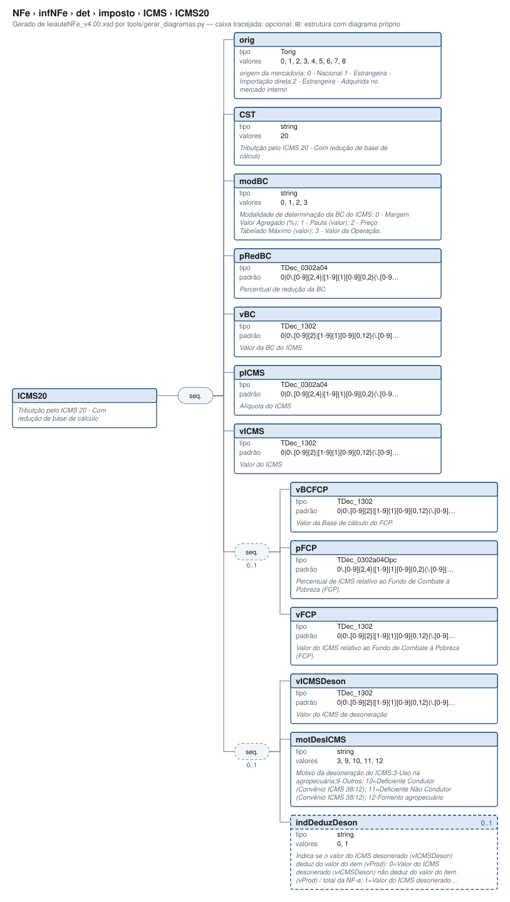

# ICMS20 — Tributção pelo ICMS 20 - Com redução de base de cálculo

[Manual](../../../../../README.md) › [NFe](../../../../../NFe.md) › [infNFe](../../../../infNFe.md) › [det](../../../det.md) › [imposto](../../imposto.md) › [ICMS](../ICMS.md) › ICMS20

<!-- estado-xsd:inicio -->
> **Estado: documentado.** Estrutura conferida contra a base XSD registrada.
>
> `Base atual e revisada: c537394250f913b591f3984f1de2e9d1a1ec94d334a0086e7a41f9850f5f7917`
<!-- estado-xsd:fim -->

| Informação | Base conferida |
|---|---|
| Caminho XML | `NFe/infNFe/det/imposto/ICMS/ICMS20` |
| Leiaute / pacote XSD | NF-e/NFC-e 4.00 / PL010f v1.04, 31/08/2026 |
| Biblioteca conferida | libnfe 1.0.0-rc4, commit `1dd412eebca80dd80d884b3f03a1a31cfaf42279` |
| Revisão | 2026-10-05 |
| Contexto no leiaute | `1..1` no pai, sujeito às sequências e escolhas abaixo |

## Finalidade e quando preencher

Os tributos são informados por item. Escolha os ramos de acordo com o regime do emitente e a operação; códigos CST/CSOSN e classificações fiscais não são decisões tomadas pelo motor de grupos. Bases, alíquotas e valores são textos decimais, e o preenchimento não recalcula os tributos.

Este ramo participa da escolha do ICMS. Use o domínio de CST/CSOSN indicado na tabela e o regime da operação. Preencher um ramo válido no motor apaga os campos do ramo anterior; isso não determina que o novo tratamento seja fiscalmente apropriado.

**Atualização publicada:** a NT 2026.008 v1.00 prevê vUnComLiq, vProdLiq, vProdLiqTot e ICMSPrevistoPagtoAntecip/vICMSPrevisto. Esses campos/grupo **não constam no PL010f atualmente disponível no Portal e adotado pelo projeto**, e não são apresentados aqui como API existente. A NT registra homologação em 05/10/2026 e produção em 03/11/2026 para a primeira etapa; sua regra NB01-30 tem cronograma próprio em 2027. Confira [bases e transições](../../../../../BASES.md).

Descrição e observações do XSD adotado: Tributção pelo ICMS 20 - Com redução de base de cálculo. A estrutura e as restrições são as do pacote indicado; notas históricas de uso devem ser lidas junto às atualizações listadas nas referências.

## Estrutura, ordem e escolhas



[Abrir o diagrama](../../../../../../diagramas/NFe/infNFe/det/imposto/ICMS/ICMS20.svg).

Uma ocorrência `1..1` dentro de uma alternativa exige o campo quando essa alternativa é selecionada; não obriga selecionar esse ramo em toda nota. Grupos opcionais podem conter filhos obrigatórios. Os elementos de sequência seguem a ordem indicada.

- **Sequência** `1..1`
  - `orig` `1..1`
  - `CST` `1..1`
  - `modBC` `1..1`
  - `pRedBC` `1..1`
  - `vBC` `1..1`
  - `pICMS` `1..1`
  - `vICMS` `1..1`
  - **Sequência** `0..1`
    - `vBCFCP` `1..1`
    - `pFCP` `1..1`
    - `vFCP` `1..1`
  - **Sequência** `0..1`
    - `vICMSDeson` `1..1`
    - `motDesICMS` `1..1`
    - `indDeduzDeson` `0..1`

## Campos e atributos

| Tag / atributo | Significado e observações | Tipo XML | Ocorrência | Formato / limites | Condição no contexto |
|---|---|---|---|---|---|
| `orig` | origem da mercadoria: 0 - Nacional 1 - Estrangeira - Importação direta 2 - Estrangeira - Adquirida no mercado interno | `Torig` | `1..1` | Domínio: `0`, `1`, `2`, `3`, `4`, `5`, `6`, `7`, `8`<br>Tratamento de espaços: preserve | Obrigatório no contexto |
| `CST` | Tributção pelo ICMS 20 - Com redução de base de cálculo | `string` | `1..1` | Domínio: `20`<br>Tratamento de espaços: preserve | Obrigatório no contexto |
| `modBC` | Modalidade de determinação da BC do ICMS: 0 - Margem Valor Agregado (%); 1 - Pauta (valor); 2 - Preço Tabelado Máximo (valor); 3 - Valor da Operação. | `string` | `1..1` | Domínio: `0`, `1`, `2`, `3`<br>Tratamento de espaços: preserve | Obrigatório no contexto |
| `pRedBC` | Percentual de redução da BC | `TDec_0302a04` | `1..1` | Padrão: `0\|0\.[0-9]{2,4}\|[1-9]{1}[0-9]{0,2}(\.[0-9]{2,4})?`<br>Tratamento de espaços: preserve | Obrigatório no contexto |
| `vBC` | Valor da BC do ICMS | `TDec_1302` | `1..1` | Padrão: `0\|0\.[0-9]{2}\|[1-9]{1}[0-9]{0,12}(\.[0-9]{2})?`<br>Tratamento de espaços: preserve | Obrigatório no contexto |
| `pICMS` | Alíquota do ICMS | `TDec_0302a04` | `1..1` | Padrão: `0\|0\.[0-9]{2,4}\|[1-9]{1}[0-9]{0,2}(\.[0-9]{2,4})?`<br>Tratamento de espaços: preserve | Obrigatório no contexto |
| `vICMS` | Valor do ICMS | `TDec_1302` | `1..1` | Padrão: `0\|0\.[0-9]{2}\|[1-9]{1}[0-9]{0,12}(\.[0-9]{2})?`<br>Tratamento de espaços: preserve | Obrigatório no contexto |
| `vBCFCP` | Valor da Base de cálculo do FCP. | `TDec_1302` | `1..1` | Padrão: `0\|0\.[0-9]{2}\|[1-9]{1}[0-9]{0,12}(\.[0-9]{2})?`<br>Tratamento de espaços: preserve | Obrigatório no contexto; sequência/escolha opcional |
| `pFCP` | Percentual de ICMS relativo ao Fundo de Combate à Pobreza (FCP). | `TDec_0302a04Opc` | `1..1` | Padrão: `0\.[0-9]{2,4}\|[1-9]{1}[0-9]{0,2}(\.[0-9]{2,4})?`<br>Tratamento de espaços: preserve | Obrigatório no contexto; sequência/escolha opcional |
| `vFCP` | Valor do ICMS relativo ao Fundo de Combate à Pobreza (FCP). | `TDec_1302` | `1..1` | Padrão: `0\|0\.[0-9]{2}\|[1-9]{1}[0-9]{0,12}(\.[0-9]{2})?`<br>Tratamento de espaços: preserve | Obrigatório no contexto; sequência/escolha opcional |
| `vICMSDeson` | Valor do ICMS de desoneração | `TDec_1302` | `1..1` | Padrão: `0\|0\.[0-9]{2}\|[1-9]{1}[0-9]{0,12}(\.[0-9]{2})?`<br>Tratamento de espaços: preserve | Obrigatório no contexto; sequência/escolha opcional |
| `motDesICMS` | Motivo da desoneração do ICMS:3-Uso na agropecuária;9-Outros; 10=Deficiente Condutor (Convênio ICMS 38/12); 11=Deficiente Não Condutor (Convênio ICMS 38/12); 12-Fomento agropecuário | `string` | `1..1` | Domínio: `3`, `9`, `10`, `11`, `12`<br>Tratamento de espaços: preserve | Obrigatório no contexto; sequência/escolha opcional |
| `indDeduzDeson` | Indica se o valor do ICMS desonerado (vICMSDeson) deduz do valor do item (vProd): 0=Valor do ICMS desonerado (vICMSDeson) não deduz do valor do item (vProd) / total da NF-e; 1=Valor do ICMS desonerado (vICMSDeson) deduz do valor do item (vProd) / total da NF-e. | `string` | `0..1` | Domínio: `0`, `1`<br>Tratamento de espaços: preserve | Opcional no contexto; sequência/escolha opcional |

Campos decimais usam o separador `.` e a precisão indicada pelo tipo; preservar a representação textual evita perda por ponto flutuante. Ausência, texto vazio e zero são valores distintos. Padrões, comprimentos e enumerações precisam ser atendidos em conjunto; valores de códigos com zeros significativos devem conservar esses zeros. Campos de mesmo nome em outros pais têm contexto próprio.

## API C, integração e memória

Acesso pela API pública: `nfe_imposto_grupo(imp)`. O grupo pertence ao objeto que o fornece. Use os caminhos completos a partir desse grupo; se um ancestral for uma lista, obtenha uma ocorrência com `nfe_grupo_add` antes de preencher seus filhos.

[Contrato público de imposto.h](../../../../../api/imposto.md) apresenta assinaturas, argumentos, retornos e limitações. [Convenções de memória e erros](../../../../../API.md) explica cópia, empréstimo e transferência de posse.

Ao usar um grupo emprestado, libere o objeto proprietário, nunca o grupo separadamente. Os setters de texto copiam seus valores; getters retornam texto interno emprestado. A escolha de outro ramo válido pode apagar o anterior. Os campos obrigatórios do motor são conferidos na escrita; validar um valor isolado não prova completude do grupo. Os contratos específicos prevalecem quando a função indicada não usa o motor.

## Exemplo C conferido

[Fonte completo do cenário main](../../../../../../../tests/test_exemplo_ibscbs.c) contém o preenchimento, a conferência dos retornos e a liberação dos recursos. O cenário integra o programa de testes indicado, com os headers e apoios do repositório. O XML foi observado na serialização desse cenário e validado, não deduzido de um desenho.

```sh
make obj/test_exemplo_ibscbs
./obj/test_exemplo_ibscbs tests
```

A função abaixo é o cenário completo do teste, incluindo tratamento dos retornos e eventuais verificações de erros. O XML publicado foi observado na validação da linha **70** do fonte indicado; a função pode exercitar outras alterações antes/depois desse ponto.

<details>
<summary>Função C completa do cenário main</summary>

```c
int main(int argc, char **argv)
{
	char dir[1024], pfx[1024], *xml = NULL, *assinado = NULL;
	size_t tam = 0, tam_assinado = 0;
	nfe_validador *v;
	nfe_erros *erros = nfe_erros_new();
	nfe_certificado *cert;
	nfe_nfe *nota;
	int i, rc;

	if (argc < 2) {
		fprintf(stderr, "uso: %s <diretório tests>\n", argv[0]);
		return 2;
	}
	nota = monta_nota(T0);
	VERIFICA(nota != NULL);
	if (!nota)
		TESTE_FIM();
	VERIFICA_INT(nfe_nfe_xml(nota, &xml, &tam), 0);

	/* Schema e regras da SEFAZ (chave, totais, UF) */
	snprintf(dir, sizeof dir, "%s/schemas/nfe", argv[1]);
	v = nfe_validador_new(dir);
	VERIFICA(v != NULL);
	rc = nfe_validar_xml(v, xml, tam, erros);
	VERIFICA_INT(rc, 0);
	for (i = 0; i < nfe_erros_qtd(erros); i++)
		fprintf(stderr, "%s: %s\n", nfe_erros_campo(erros, i),
		        nfe_erros_msg(erros, i));

	/* Item: ICMS20, PIS/COFINS alíquota zero e IBS/CBS */
	VERIFICA(contem(xml,
	                "<ICMS20><orig>0</orig><CST>20</CST><modBC>3"
	                "</modBC><pRedBC>60.00</pRedBC><vBC>15.20</vBC>"
	                "<pICMS>12.00</pICMS><vICMS>1.82</vICMS></ICMS20>"));
	VERIFICA(contem(xml, "<IBSCBS><CST>200</CST><cClassTrib>200038"
	                     "</cClassTrib><gIBSCBS><vBC>36.18</vBC><gIBSUF>"
	                     "<pIBSUF>0.10</pIBSUF><gRed><pRedAliq>60.00"
	                     "</pRedAliq><pAliqEfet>0.04</pAliqEfet></gRed>"
	                     "<vIBSUF>0.01</vIBSUF></gIBSUF>"));
	VERIFICA(contem(xml, "<vIBS>0.01</vIBS><gCBS><pCBS>0.90</pCBS><gRed>"
	                     "<pRedAliq>60.00</pRedAliq><pAliqEfet>0.36"
	                     "</pAliqEfet></gRed><vCBS>0.13</vCBS></gCBS>"));
	/* Totais: ICMSTot calculado e IBSCBSTot informado */
	VERIFICA(contem(xml, "<ICMSTot><vBC>15.20</vBC><vICMS>1.82</vICMS>"));
	VERIFICA(contem(xml, "<vProd>38.00</vProd>"));
	VERIFICA(contem(xml, "<vNF>38.00</vNF></ICMSTot><IBSCBSTot><vBCIBSCBS>"
	                     "36.18</vBCIBSCBS>"));
	VERIFICA(contem(xml, "<vNFTot>38.00</vNFTot></total>"));

	/* Assinada com o certificado de teste */
	snprintf(pfx, sizeof pfx, "%s/certificados/teste.pfx", argv[1]);
	cert = nfe_certificado_pfx(pfx, "teste", &rc);
	VERIFICA(cert != NULL);
	if (cert) {
		VERIFICA_INT(
		        nfe_nfe_assinar(nota, cert, &assinado, &tam_assinado),
		        0);
		VERIFICA_INT(nfe_verificar_assinatura(assinado, tam_assinado),
		             0);
		if (v && assinado)
			VERIFICA_INT(nfe_validar_xml(v, assinado, tam_assinado,
			                             erros),
			             0);
	}

	free(assinado);
	free(xml);
	nfe_certificado_free(cert);
	nfe_nfe_free(nota);
	nfe_validador_free(v);
	nfe_erros_free(erros);
	xmlCleanupParser();
	TESTE_FIM();
}
```

</details>

## XML correspondente

Trecho do cenário acima, com namespace preservado. [XML completo do cenário](../../../../../exemplos/grupos/test_exemplo_ibscbs-0001.xml) permite conferir valores e ancestrais. Dados sintéticos; este exemplo comprova estrutura e uso da API, sem transmissão, autorização ou validação de enquadramento fiscal.

```xml
<ICMS20 xmlns="http://www.portalfiscal.inf.br/nfe">
  <orig>0</orig>
  <CST>20</CST>
  <modBC>3</modBC>
  <pRedBC>60.00</pRedBC>
  <vBC>15.20</vBC>
  <pICMS>12.00</pICMS>
  <vICMS>1.82</vICMS>
</ICMS20>

```

O fragmento é validado no contexto que o declara no leiaute, com namespace e ancestrais. O wrapper tipos_v4.00.xsd, quando usado nos testes, extrai essas declarações do schema oficial e é identificado como apoio de testes, sem substituir o pacote oficial.

## Validação, erros e limites

| Situação | Etapa / resultado | Tratamento |
|---|---|---|
| Ponteiro obrigatório nulo | API: `E_ISNULL` (-1), conforme contrato da função | Conferir criação e argumentos |
| Texto fora do comprimento | Setter/motor: `E_TAMANHO` (-2) | Usar os limites do tipo e do argumento C |
| Domínio, padrão ou caminho inválido/ambíguo | Setter/motor: `E_VALOR` (-3) | Corrigir o valor e usar caminho completo |
| Campo obrigatório ou escolha incompleta | Escrita do motor: `E_VALOR`; XSD rejeita | Completar o ramo selecionado |
| Falha de escrita XML | Writer: `E_XML` (-4) | Descartar saída parcial e tratar a falha |
| Falta de memória | Criação: NULL; operações que alocam podem retornar `E_MALLOC` (-101) | Encerrar com limpeza dos recursos ainda próprios |
| Regra fiscal, cadastro, cálculo ou vigência | Pode ser aceito lexicalmente; depende da regra e do autorizador | Conferir fontes e contratos; não confundir 0 com autorização |

Os códigos negativos são da biblioteca, não códigos cStat. [Validação e regras implementadas](../../../../../VALIDACAO.md) distingue XSD, verificações locais e retorno da SEFAZ. A referência da API identifica exceções aos comportamentos gerais desta tabela.

## Referências e grupos relacionados

- XSD atual: [leiaute](../../../../../../../tests/schemas/nfe/leiauteNFe_v4.00.xsd), [tipos básicos](../../../../../../../tests/schemas/nfe/tiposBasico_v4.00.xsd) e [tipos DFe/RTC](../../../../../../../tests/schemas/nfe/DFeTiposBasicos_v1.00.xsd).
- MOC 7.0, Anexo I: M–U, pp. 25–57. [Fontes oficiais, versões e transições](../../../../../BASES.md) relaciona atualizações posteriores, com vigência separada da publicação.
- API: [imposto.h](../../../../../../../include/libnfe/imposto.h) e [referência das funções](../../../../../api/imposto.md).
- Grupo pai: [ICMS](../ICMS.md).

Anterior: [ICMS15](ICMS15.md) | Próximo: [ICMS30](ICMS30.md)
