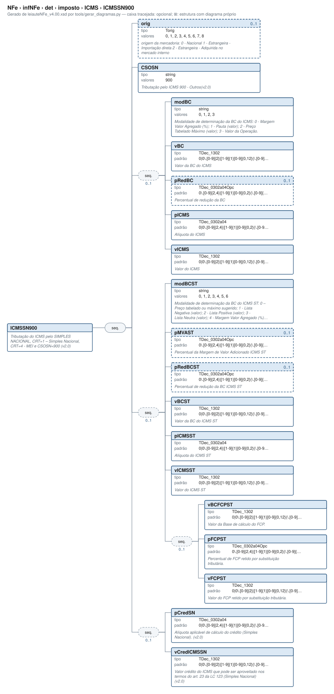

# ICMSSN900 — Tributação do ICMS pelo SIMPLES NACIONAL, CRT=1 – Simples Nacional, CRT=4 - MEI e CSOSN=900 (v2

[Manual](../../../../../README.md) › [NFe](../../../../../NFe.md) › [infNFe](../../../../infNFe.md) › [det](../../../det.md) › [imposto](../../imposto.md) › [ICMS](../ICMS.md) › ICMSSN900

<!-- estado-xsd:inicio -->
> **Estado: documentado.** Estrutura conferida contra a base XSD registrada.
>
> `Base atual e revisada: c537394250f913b591f3984f1de2e9d1a1ec94d334a0086e7a41f9850f5f7917`
<!-- estado-xsd:fim -->

| Informação | Base conferida |
|---|---|
| Caminho XML | `NFe/infNFe/det/imposto/ICMS/ICMSSN900` |
| Leiaute / pacote XSD | NF-e/NFC-e 4.00 / PL010f v1.04, 31/08/2026 |
| Biblioteca conferida | libnfe 1.0.0-rc4, commit `1dd412eebca80dd80d884b3f03a1a31cfaf42279` |
| Revisão | 2026-10-05 |
| Contexto no leiaute | `1..1` no pai, sujeito às sequências e escolhas abaixo |

## Finalidade e quando preencher

Os tributos são informados por item. Escolha os ramos de acordo com o regime do emitente e a operação; códigos CST/CSOSN e classificações fiscais não são decisões tomadas pelo motor de grupos. Bases, alíquotas e valores são textos decimais, e o preenchimento não recalcula os tributos.

Este ramo participa da escolha do ICMS. Use o domínio de CST/CSOSN indicado na tabela e o regime da operação. Preencher um ramo válido no motor apaga os campos do ramo anterior; isso não determina que o novo tratamento seja fiscalmente apropriado.

**Atualização publicada:** a NT 2026.008 v1.00 prevê vUnComLiq, vProdLiq, vProdLiqTot e ICMSPrevistoPagtoAntecip/vICMSPrevisto. Esses campos/grupo **não constam no PL010f atualmente disponível no Portal e adotado pelo projeto**, e não são apresentados aqui como API existente. A NT registra homologação em 05/10/2026 e produção em 03/11/2026 para a primeira etapa; sua regra NB01-30 tem cronograma próprio em 2027. Confira [bases e transições](../../../../../BASES.md).

Descrição e observações do XSD adotado: Tributação do ICMS pelo SIMPLES NACIONAL, CRT=1 – Simples Nacional, CRT=4 - MEI e CSOSN=900 (v2.0). A estrutura e as restrições são as do pacote indicado; notas históricas de uso devem ser lidas junto às atualizações listadas nas referências.

## Estrutura, ordem e escolhas



[Abrir o diagrama](../../../../../../diagramas/NFe/infNFe/det/imposto/ICMS/ICMSSN900.svg).

Uma ocorrência `1..1` dentro de uma alternativa exige o campo quando essa alternativa é selecionada; não obriga selecionar esse ramo em toda nota. Grupos opcionais podem conter filhos obrigatórios. Os elementos de sequência seguem a ordem indicada.

- **Sequência** `1..1`
  - `orig` `0..1`
  - `CSOSN` `1..1`
  - **Sequência** `0..1`
    - `modBC` `1..1`
    - `vBC` `1..1`
    - `pRedBC` `0..1`
    - `pICMS` `1..1`
    - `vICMS` `1..1`
  - **Sequência** `0..1`
    - `modBCST` `1..1`
    - `pMVAST` `0..1`
    - `pRedBCST` `0..1`
    - `vBCST` `1..1`
    - `pICMSST` `1..1`
    - `vICMSST` `1..1`
    - **Sequência** `0..1`
      - `vBCFCPST` `1..1`
      - `pFCPST` `1..1`
      - `vFCPST` `1..1`
  - **Sequência** `0..1`
    - `pCredSN` `1..1`
    - `vCredICMSSN` `1..1`

## Campos e atributos

| Tag / atributo | Significado e observações | Tipo XML | Ocorrência | Formato / limites | Condição no contexto |
|---|---|---|---|---|---|
| `orig` | origem da mercadoria: 0 - Nacional 1 - Estrangeira - Importação direta 2 - Estrangeira - Adquirida no mercado interno | `Torig` | `0..1` | Domínio: `0`, `1`, `2`, `3`, `4`, `5`, `6`, `7`, `8`<br>Tratamento de espaços: preserve | Opcional no contexto |
| `CSOSN` | Tributação pelo ICMS 900 - Outros(v2.0) | `string` | `1..1` | Domínio: `900`<br>Tratamento de espaços: preserve | Obrigatório no contexto |
| `modBC` | Modalidade de determinação da BC do ICMS: 0 - Margem Valor Agregado (%); 1 - Pauta (valor); 2 - Preço Tabelado Máximo (valor); 3 - Valor da Operação. | `string` | `1..1` | Domínio: `0`, `1`, `2`, `3`<br>Tratamento de espaços: preserve | Obrigatório no contexto; sequência/escolha opcional |
| `vBC` | Valor da BC do ICMS | `TDec_1302` | `1..1` | Padrão: `0\|0\.[0-9]{2}\|[1-9]{1}[0-9]{0,12}(\.[0-9]{2})?`<br>Tratamento de espaços: preserve | Obrigatório no contexto; sequência/escolha opcional |
| `pRedBC` | Percentual de redução da BC | `TDec_0302a04Opc` | `0..1` | Padrão: `0\.[0-9]{2,4}\|[1-9]{1}[0-9]{0,2}(\.[0-9]{2,4})?`<br>Tratamento de espaços: preserve | Opcional no contexto; sequência/escolha opcional |
| `pICMS` | Alíquota do ICMS | `TDec_0302a04` | `1..1` | Padrão: `0\|0\.[0-9]{2,4}\|[1-9]{1}[0-9]{0,2}(\.[0-9]{2,4})?`<br>Tratamento de espaços: preserve | Obrigatório no contexto; sequência/escolha opcional |
| `vICMS` | Valor do ICMS | `TDec_1302` | `1..1` | Padrão: `0\|0\.[0-9]{2}\|[1-9]{1}[0-9]{0,12}(\.[0-9]{2})?`<br>Tratamento de espaços: preserve | Obrigatório no contexto; sequência/escolha opcional |
| `modBCST` | Modalidade de determinação da BC do ICMS ST: 0 – Preço tabelado ou máximo sugerido; 1 - Lista Negativa (valor); 2 - Lista Positiva (valor); 3 - Lista Neutra (valor); 4 - Margem Valor Agregado (%); 5 - Pauta (valor). 6 - Valor da Operação | `string` | `1..1` | Domínio: `0`, `1`, `2`, `3`, `4`, `5`, `6`<br>Tratamento de espaços: preserve | Obrigatório no contexto; sequência/escolha opcional |
| `pMVAST` | Percentual da Margem de Valor Adicionado ICMS ST | `TDec_0302a04Opc` | `0..1` | Padrão: `0\.[0-9]{2,4}\|[1-9]{1}[0-9]{0,2}(\.[0-9]{2,4})?`<br>Tratamento de espaços: preserve | Opcional no contexto; sequência/escolha opcional |
| `pRedBCST` | Percentual de redução da BC ICMS ST | `TDec_0302a04Opc` | `0..1` | Padrão: `0\.[0-9]{2,4}\|[1-9]{1}[0-9]{0,2}(\.[0-9]{2,4})?`<br>Tratamento de espaços: preserve | Opcional no contexto; sequência/escolha opcional |
| `vBCST` | Valor da BC do ICMS ST | `TDec_1302` | `1..1` | Padrão: `0\|0\.[0-9]{2}\|[1-9]{1}[0-9]{0,12}(\.[0-9]{2})?`<br>Tratamento de espaços: preserve | Obrigatório no contexto; sequência/escolha opcional |
| `pICMSST` | Alíquota do ICMS ST | `TDec_0302a04` | `1..1` | Padrão: `0\|0\.[0-9]{2,4}\|[1-9]{1}[0-9]{0,2}(\.[0-9]{2,4})?`<br>Tratamento de espaços: preserve | Obrigatório no contexto; sequência/escolha opcional |
| `vICMSST` | Valor do ICMS ST | `TDec_1302` | `1..1` | Padrão: `0\|0\.[0-9]{2}\|[1-9]{1}[0-9]{0,12}(\.[0-9]{2})?`<br>Tratamento de espaços: preserve | Obrigatório no contexto; sequência/escolha opcional |
| `vBCFCPST` | Valor da Base de cálculo do FCP. | `TDec_1302` | `1..1` | Padrão: `0\|0\.[0-9]{2}\|[1-9]{1}[0-9]{0,12}(\.[0-9]{2})?`<br>Tratamento de espaços: preserve | Obrigatório no contexto; sequência/escolha opcional; sequência/escolha opcional |
| `pFCPST` | Percentual de FCP retido por substituição tributária. | `TDec_0302a04Opc` | `1..1` | Padrão: `0\.[0-9]{2,4}\|[1-9]{1}[0-9]{0,2}(\.[0-9]{2,4})?`<br>Tratamento de espaços: preserve | Obrigatório no contexto; sequência/escolha opcional; sequência/escolha opcional |
| `vFCPST` | Valor do FCP retido por substituição tributária. | `TDec_1302` | `1..1` | Padrão: `0\|0\.[0-9]{2}\|[1-9]{1}[0-9]{0,12}(\.[0-9]{2})?`<br>Tratamento de espaços: preserve | Obrigatório no contexto; sequência/escolha opcional; sequência/escolha opcional |
| `pCredSN` | Alíquota aplicável de cálculo do crédito (Simples Nacional). (v2.0) | `TDec_0302a04` | `1..1` | Padrão: `0\|0\.[0-9]{2,4}\|[1-9]{1}[0-9]{0,2}(\.[0-9]{2,4})?`<br>Tratamento de espaços: preserve | Obrigatório no contexto; sequência/escolha opcional |
| `vCredICMSSN` | Valor crédito do ICMS que pode ser aproveitado nos termos do art. 23 da LC 123 (Simples Nacional) (v2.0) | `TDec_1302` | `1..1` | Padrão: `0\|0\.[0-9]{2}\|[1-9]{1}[0-9]{0,12}(\.[0-9]{2})?`<br>Tratamento de espaços: preserve | Obrigatório no contexto; sequência/escolha opcional |

Campos decimais usam o separador `.` e a precisão indicada pelo tipo; preservar a representação textual evita perda por ponto flutuante. Ausência, texto vazio e zero são valores distintos. Padrões, comprimentos e enumerações precisam ser atendidos em conjunto; valores de códigos com zeros significativos devem conservar esses zeros. Campos de mesmo nome em outros pais têm contexto próprio.

## API C, integração e memória

Acesso pela API pública: `nfe_imposto_grupo(imp)`. O grupo pertence ao objeto que o fornece. Use os caminhos completos a partir desse grupo; se um ancestral for uma lista, obtenha uma ocorrência com `nfe_grupo_add` antes de preencher seus filhos.

[Contrato público de imposto.h](../../../../../api/imposto.md) apresenta assinaturas, argumentos, retornos e limitações. [Convenções de memória e erros](../../../../../API.md) explica cópia, empréstimo e transferência de posse.

Ao usar um grupo emprestado, libere o objeto proprietário, nunca o grupo separadamente. Os setters de texto copiam seus valores; getters retornam texto interno emprestado. A escolha de outro ramo válido pode apagar o anterior. Os campos obrigatórios do motor são conferidos na escrita; validar um valor isolado não prova completude do grupo. Os contratos específicos prevalecem quando a função indicada não usa o motor.

## Exemplo C conferido

[Fonte completo do cenário caso_057](../../../../../../../examples/manual/casos.inc) contém o preenchimento, a conferência dos retornos e a liberação dos recursos. [Programa que cria o objeto e obtém o grupo](../../../../../../../examples/manual_grupos.c) fornece os headers e a execução desse cenário.

```sh
make exemplos
./obj/manual_grupos NFe/infNFe/det/imposto/ICMS/ICMSSN900
```

Recorte do cenário executado (o programa completo define CONFERE e fornece o grupo do objeto proprietário):

```c
static int caso_057(nfe_grupo *g)
{
	int rc = 0;
	CONFERE(nfe_grupo_set(g, "ICMS/ICMSSN900/CSOSN", "900"));
fim:
	return rc;
}
```

## XML correspondente

Trecho do cenário acima, com namespace preservado. [XML completo do cenário](../../../../../exemplos/grupos/caso_057.xml) e [nota de contexto validada](../../../../../exemplos/contextos/caso_057.xml) permitem conferir valores e ancestrais. Dados sintéticos; este exemplo comprova estrutura e uso da API, sem transmissão, autorização ou validação de enquadramento fiscal.

```xml
<ICMSSN900 xmlns="http://www.portalfiscal.inf.br/nfe">
  <CSOSN>900</CSOSN>
</ICMSSN900>

```

O fragmento é validado no contexto que o declara no leiaute, com namespace e ancestrais. O wrapper tipos_v4.00.xsd, quando usado nos testes, extrai essas declarações do schema oficial e é identificado como apoio de testes, sem substituir o pacote oficial.

## Validação, erros e limites

| Situação | Etapa / resultado | Tratamento |
|---|---|---|
| Ponteiro obrigatório nulo | API: `E_ISNULL` (-1), conforme contrato da função | Conferir criação e argumentos |
| Texto fora do comprimento | Setter/motor: `E_TAMANHO` (-2) | Usar os limites do tipo e do argumento C |
| Domínio, padrão ou caminho inválido/ambíguo | Setter/motor: `E_VALOR` (-3) | Corrigir o valor e usar caminho completo |
| Campo obrigatório ou escolha incompleta | Escrita do motor: `E_VALOR`; XSD rejeita | Completar o ramo selecionado |
| Falha de escrita XML | Writer: `E_XML` (-4) | Descartar saída parcial e tratar a falha |
| Falta de memória | Criação: NULL; operações que alocam podem retornar `E_MALLOC` (-101) | Encerrar com limpeza dos recursos ainda próprios |
| Regra fiscal, cadastro, cálculo ou vigência | Pode ser aceito lexicalmente; depende da regra e do autorizador | Conferir fontes e contratos; não confundir 0 com autorização |

Os códigos negativos são da biblioteca, não códigos cStat. [Validação e regras implementadas](../../../../../VALIDACAO.md) distingue XSD, verificações locais e retorno da SEFAZ. A referência da API identifica exceções aos comportamentos gerais desta tabela.

## Referências e grupos relacionados

- XSD atual: [leiaute](../../../../../../../tests/schemas/nfe/leiauteNFe_v4.00.xsd), [tipos básicos](../../../../../../../tests/schemas/nfe/tiposBasico_v4.00.xsd) e [tipos DFe/RTC](../../../../../../../tests/schemas/nfe/DFeTiposBasicos_v1.00.xsd).
- MOC 7.0, Anexo I: M–U, pp. 25–57. [Fontes oficiais, versões e transições](../../../../../BASES.md) relaciona atualizações posteriores, com vigência separada da publicação.
- API: [imposto.h](../../../../../../../include/libnfe/imposto.h) e [referência das funções](../../../../../api/imposto.md).
- Grupo pai: [ICMS](../ICMS.md).

Anterior: [ICMSSN500](ICMSSN500.md) | Próximo: [IPI](../IPI.md)
