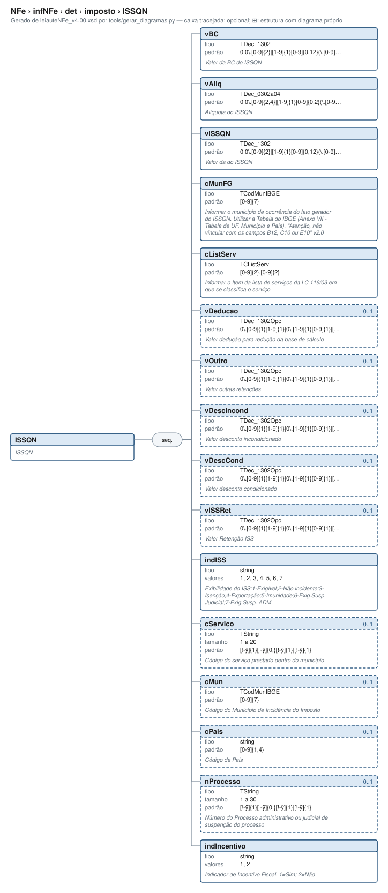

# ISSQN — ISSQN

[Manual](../../../../README.md) › [NFe](../../../../NFe.md) › [infNFe](../../../infNFe.md) › [det](../../det.md) › [imposto](../imposto.md) › ISSQN

<!-- estado-xsd:inicio -->
> **Estado: documentado.** Estrutura conferida contra a base XSD registrada.
>
> `Base atual e revisada: c537394250f913b591f3984f1de2e9d1a1ec94d334a0086e7a41f9850f5f7917`
<!-- estado-xsd:fim -->

| Informação | Base conferida |
|---|---|
| Caminho XML | `NFe/infNFe/det/imposto/ISSQN` |
| Leiaute / pacote XSD | NF-e/NFC-e 4.00 / PL010f v1.04, 31/08/2026 |
| Biblioteca conferida | libnfe 1.0.0-rc4, commit `1dd412eebca80dd80d884b3f03a1a31cfaf42279` |
| Revisão | 2026-10-05 |
| Contexto no leiaute | `1..1` no pai, sujeito às sequências e escolhas abaixo |

## Finalidade e quando preencher

Os tributos são informados por item. Escolha os ramos de acordo com o regime do emitente e a operação; códigos CST/CSOSN e classificações fiscais não são decisões tomadas pelo motor de grupos. Bases, alíquotas e valores são textos decimais, e o preenchimento não recalcula os tributos.

**Atualização publicada:** a NT 2026.008 v1.00 prevê vUnComLiq, vProdLiq, vProdLiqTot e ICMSPrevistoPagtoAntecip/vICMSPrevisto. Esses campos/grupo **não constam no PL010f atualmente disponível no Portal e adotado pelo projeto**, e não são apresentados aqui como API existente. A NT registra homologação em 05/10/2026 e produção em 03/11/2026 para a primeira etapa; sua regra NB01-30 tem cronograma próprio em 2027. Confira [bases e transições](../../../../BASES.md).

Descrição e observações do XSD adotado: ISSQN. A estrutura e as restrições são as do pacote indicado; notas históricas de uso devem ser lidas junto às atualizações listadas nas referências.

## Estrutura, ordem e escolhas



[Abrir o diagrama](../../../../../diagramas/NFe/infNFe/det/imposto/ISSQN.svg).

Uma ocorrência `1..1` dentro de uma alternativa exige o campo quando essa alternativa é selecionada; não obriga selecionar esse ramo em toda nota. Grupos opcionais podem conter filhos obrigatórios. Os elementos de sequência seguem a ordem indicada.

- **Sequência** `1..1`
  - `vBC` `1..1`
  - `vAliq` `1..1`
  - `vISSQN` `1..1`
  - `cMunFG` `1..1`
  - `cListServ` `1..1`
  - `vDeducao` `0..1`
  - `vOutro` `0..1`
  - `vDescIncond` `0..1`
  - `vDescCond` `0..1`
  - `vISSRet` `0..1`
  - `indISS` `1..1`
  - `cServico` `0..1`
  - `cMun` `0..1`
  - `cPais` `0..1`
  - `nProcesso` `0..1`
  - `indIncentivo` `1..1`

## Campos e atributos

| Tag / atributo | Significado e observações | Tipo XML | Ocorrência | Formato / limites | Condição no contexto |
|---|---|---|---|---|---|
| `vBC` | Valor da BC do ISSQN | `TDec_1302` | `1..1` | Padrão: `0\|0\.[0-9]{2}\|[1-9]{1}[0-9]{0,12}(\.[0-9]{2})?`<br>Tratamento de espaços: preserve | Obrigatório no contexto |
| `vAliq` | Alíquota do ISSQN | `TDec_0302a04` | `1..1` | Padrão: `0\|0\.[0-9]{2,4}\|[1-9]{1}[0-9]{0,2}(\.[0-9]{2,4})?`<br>Tratamento de espaços: preserve | Obrigatório no contexto |
| `vISSQN` | Valor da do ISSQN | `TDec_1302` | `1..1` | Padrão: `0\|0\.[0-9]{2}\|[1-9]{1}[0-9]{0,12}(\.[0-9]{2})?`<br>Tratamento de espaços: preserve | Obrigatório no contexto |
| `cMunFG` | Informar o município de ocorrência do fato gerador do ISSQN. Utilizar a Tabela do IBGE (Anexo VII - Tabela de UF, Município e País). “Atenção, não vincular com os campos B12, C10 ou E10” v2.0 | `TCodMunIBGE` | `1..1` | Padrão: `[0-9]{7}`<br>Tratamento de espaços: preserve | Obrigatório no contexto |
| `cListServ` | Informar o Item da lista de serviços da LC 116/03 em que se classifica o serviço. | `TCListServ` | `1..1` | Padrão: `[0-9]{2}.[0-9]{2}`<br>Tratamento de espaços: preserve | Obrigatório no contexto |
| `vDeducao` | Valor dedução para redução da base de cálculo | `TDec_1302Opc` | `0..1` | Padrão: `0\.[0-9]{1}[1-9]{1}\|0\.[1-9]{1}[0-9]{1}\|[1-9]{1}[0-9]{0,12}(\.[0-9]{2})?`<br>Tratamento de espaços: preserve | Opcional no contexto |
| `vOutro` | Valor outras retenções | `TDec_1302Opc` | `0..1` | Padrão: `0\.[0-9]{1}[1-9]{1}\|0\.[1-9]{1}[0-9]{1}\|[1-9]{1}[0-9]{0,12}(\.[0-9]{2})?`<br>Tratamento de espaços: preserve | Opcional no contexto |
| `vDescIncond` | Valor desconto incondicionado | `TDec_1302Opc` | `0..1` | Padrão: `0\.[0-9]{1}[1-9]{1}\|0\.[1-9]{1}[0-9]{1}\|[1-9]{1}[0-9]{0,12}(\.[0-9]{2})?`<br>Tratamento de espaços: preserve | Opcional no contexto |
| `vDescCond` | Valor desconto condicionado | `TDec_1302Opc` | `0..1` | Padrão: `0\.[0-9]{1}[1-9]{1}\|0\.[1-9]{1}[0-9]{1}\|[1-9]{1}[0-9]{0,12}(\.[0-9]{2})?`<br>Tratamento de espaços: preserve | Opcional no contexto |
| `vISSRet` | Valor Retenção ISS | `TDec_1302Opc` | `0..1` | Padrão: `0\.[0-9]{1}[1-9]{1}\|0\.[1-9]{1}[0-9]{1}\|[1-9]{1}[0-9]{0,12}(\.[0-9]{2})?`<br>Tratamento de espaços: preserve | Opcional no contexto |
| `indISS` | Exibilidade do ISS:1-Exigível;2-Não incidente;3-Isenção;4-Exportação;5-Imunidade;6-Exig.Susp. Judicial;7-Exig.Susp. ADM | `string` | `1..1` | Domínio: `1`, `2`, `3`, `4`, `5`, `6`, `7`<br>Tratamento de espaços: preserve | Obrigatório no contexto |
| `cServico` | Código do serviço prestado dentro do município | `TString` | `0..1` | Mínimo: 1<br>Máximo: 20<br>Padrão: `[!-ÿ]{1}[ -ÿ]{0,}[!-ÿ]{1}\|[!-ÿ]{1}`<br>Tratamento de espaços: preserve | Opcional no contexto |
| `cMun` | Código do Município de Incidência do Imposto | `TCodMunIBGE` | `0..1` | Padrão: `[0-9]{7}`<br>Tratamento de espaços: preserve | Opcional no contexto |
| `cPais` | Código de Pais | `string` | `0..1` | Padrão: `[0-9]{1,4}`<br>Tratamento de espaços: preserve | Opcional no contexto |
| `nProcesso` | Número do Processo administrativo ou judicial de suspenção do processo | `TString` | `0..1` | Mínimo: 1<br>Máximo: 30<br>Padrão: `[!-ÿ]{1}[ -ÿ]{0,}[!-ÿ]{1}\|[!-ÿ]{1}`<br>Tratamento de espaços: preserve | Opcional no contexto |
| `indIncentivo` | Indicador de Incentivo Fiscal. 1=Sim; 2=Não | `string` | `1..1` | Domínio: `1`, `2`<br>Tratamento de espaços: preserve | Obrigatório no contexto |

Campos decimais usam o separador `.` e a precisão indicada pelo tipo; preservar a representação textual evita perda por ponto flutuante. Ausência, texto vazio e zero são valores distintos. Padrões, comprimentos e enumerações precisam ser atendidos em conjunto; valores de códigos com zeros significativos devem conservar esses zeros. Campos de mesmo nome em outros pais têm contexto próprio.

## API C, integração e memória

Acesso pela API pública: `nfe_imposto_grupo(imp)`. O grupo pertence ao objeto que o fornece. Use os caminhos completos a partir desse grupo; se um ancestral for uma lista, obtenha uma ocorrência com `nfe_grupo_add` antes de preencher seus filhos.

[Contrato público de imposto.h](../../../../api/imposto.md) apresenta assinaturas, argumentos, retornos e limitações. [Convenções de memória e erros](../../../../API.md) explica cópia, empréstimo e transferência de posse.

Ao usar um grupo emprestado, libere o objeto proprietário, nunca o grupo separadamente. Os setters de texto copiam seus valores; getters retornam texto interno emprestado. A escolha de outro ramo válido pode apagar o anterior. Os campos obrigatórios do motor são conferidos na escrita; validar um valor isolado não prova completude do grupo. Os contratos específicos prevalecem quando a função indicada não usa o motor.

## Exemplo C conferido

[Fonte completo do cenário caso_060](../../../../../../examples/manual/casos.inc) contém o preenchimento, a conferência dos retornos e a liberação dos recursos. [Programa que cria o objeto e obtém o grupo](../../../../../../examples/manual_grupos.c) fornece os headers e a execução desse cenário.

```sh
make exemplos
./obj/manual_grupos NFe/infNFe/det/imposto/ISSQN
```

Recorte do cenário executado (o programa completo define CONFERE e fornece o grupo do objeto proprietário):

```c
static int caso_060(nfe_grupo *g)
{
	int rc = 0;
	CONFERE(nfe_grupo_set(g, "ISSQN/vBC", "1.00"));
	CONFERE(nfe_grupo_set(g, "ISSQN/vAliq", "1.00"));
	CONFERE(nfe_grupo_set(g, "ISSQN/vISSQN", "1.00"));
	CONFERE(nfe_grupo_set(g, "ISSQN/cMunFG", "3550308"));
	CONFERE(nfe_grupo_set(g, "ISSQN/cListServ", "00A00"));
	CONFERE(nfe_grupo_set(g, "ISSQN/indISS", "1"));
	CONFERE(nfe_grupo_set(g, "ISSQN/indIncentivo", "1"));
fim:
	return rc;
}
```

## XML correspondente

Trecho do cenário acima, com namespace preservado. [XML completo do cenário](../../../../exemplos/grupos/caso_060.xml) e [nota de contexto validada](../../../../exemplos/contextos/caso_060.xml) permitem conferir valores e ancestrais. Dados sintéticos; este exemplo comprova estrutura e uso da API, sem transmissão, autorização ou validação de enquadramento fiscal.

```xml
<ISSQN xmlns="http://www.portalfiscal.inf.br/nfe">
  <vBC>1.00</vBC>
  <vAliq>1.00</vAliq>
  <vISSQN>1.00</vISSQN>
  <cMunFG>3550308</cMunFG>
  <cListServ>00A00</cListServ>
  <indISS>1</indISS>
  <indIncentivo>1</indIncentivo>
</ISSQN>

```

O fragmento é validado no contexto que o declara no leiaute, com namespace e ancestrais. O wrapper tipos_v4.00.xsd, quando usado nos testes, extrai essas declarações do schema oficial e é identificado como apoio de testes, sem substituir o pacote oficial.

## Validação, erros e limites

| Situação | Etapa / resultado | Tratamento |
|---|---|---|
| Ponteiro obrigatório nulo | API: `E_ISNULL` (-1), conforme contrato da função | Conferir criação e argumentos |
| Texto fora do comprimento | Setter/motor: `E_TAMANHO` (-2) | Usar os limites do tipo e do argumento C |
| Domínio, padrão ou caminho inválido/ambíguo | Setter/motor: `E_VALOR` (-3) | Corrigir o valor e usar caminho completo |
| Campo obrigatório ou escolha incompleta | Escrita do motor: `E_VALOR`; XSD rejeita | Completar o ramo selecionado |
| Falha de escrita XML | Writer: `E_XML` (-4) | Descartar saída parcial e tratar a falha |
| Falta de memória | Criação: NULL; operações que alocam podem retornar `E_MALLOC` (-101) | Encerrar com limpeza dos recursos ainda próprios |
| Regra fiscal, cadastro, cálculo ou vigência | Pode ser aceito lexicalmente; depende da regra e do autorizador | Conferir fontes e contratos; não confundir 0 com autorização |

Os códigos negativos são da biblioteca, não códigos cStat. [Validação e regras implementadas](../../../../VALIDACAO.md) distingue XSD, verificações locais e retorno da SEFAZ. A referência da API identifica exceções aos comportamentos gerais desta tabela.

## Referências e grupos relacionados

- XSD atual: [leiaute](../../../../../../tests/schemas/nfe/leiauteNFe_v4.00.xsd), [tipos básicos](../../../../../../tests/schemas/nfe/tiposBasico_v4.00.xsd) e [tipos DFe/RTC](../../../../../../tests/schemas/nfe/DFeTiposBasicos_v1.00.xsd).
- MOC 7.0, Anexo I: M–U, pp. 25–57. [Fontes oficiais, versões e transições](../../../../BASES.md) relaciona atualizações posteriores, com vigência separada da publicação.
- API: [imposto.h](../../../../../../include/libnfe/imposto.h) e [referência das funções](../../../../api/imposto.md).
- Grupo pai: [imposto](../imposto.md).

Anterior: [II](II.md) | Próximo: [PIS](PIS.md)
