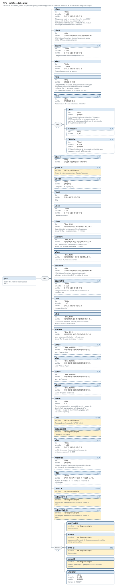

# prod — Dados dos produtos e serviços da NF-e

[Manual](../../../README.md) › [NFe](../../../NFe.md) › [infNFe](../../infNFe.md) › [det](../det.md) › prod

<!-- estado-xsd:inicio -->
> **Estado: documentado.** Estrutura conferida contra a base XSD registrada.
>
> `Base atual e revisada: c537394250f913b591f3984f1de2e9d1a1ec94d334a0086e7a41f9850f5f7917`
<!-- estado-xsd:fim -->

| Informação | Base conferida |
|---|---|
| Caminho XML | `NFe/infNFe/det/prod` |
| Leiaute / pacote XSD | NF-e/NFC-e 4.00 / PL010f v1.04, 31/08/2026 |
| Biblioteca conferida | libnfe 1.0.0-rc4, commit `1dd412eebca80dd80d884b3f03a1a31cfaf42279` |
| Revisão | 2026-10-05 |
| Contexto no leiaute | `1..1` no pai, sujeito às sequências e escolhas abaixo |

## Finalidade e quando preencher

Os campos identificam e quantificam o produto ou serviço deste item. Dados comerciais e tributáveis podem usar unidades diferentes; quantidades, valores unitários e totais precisam ser coerentes. A API confere formatos, mas não transforma automaticamente unidades nem escolhe CFOP, NCM ou tratamento tributário.

**Atualização publicada:** a NT 2026.008 v1.00 prevê vUnComLiq, vProdLiq, vProdLiqTot e ICMSPrevistoPagtoAntecip/vICMSPrevisto. Esses campos/grupo **não constam no PL010f atualmente disponível no Portal e adotado pelo projeto**, e não são apresentados aqui como API existente. A NT registra homologação em 05/10/2026 e produção em 03/11/2026 para a primeira etapa; sua regra NB01-30 tem cronograma próprio em 2027. Confira [bases e transições](../../../BASES.md).

GTIN, NCM e CFOP dependem também de cadastros e tabelas fiscais. A NT 2021.003 v1.50 trata da validação de GTIN; a NT 2026.009 v1.00 altera I08-140; a NT 2023.003 v1.40 contém exceções de NFC-e por UF. A aceitação lexical de um código não consulta esses cadastros.

Descrição e observações do XSD adotado: Dados dos produtos e serviços da NF-e. A estrutura e as restrições são as do pacote indicado; notas históricas de uso devem ser lidas junto às atualizações listadas nas referências.

## Estrutura, ordem e escolhas



[Abrir o diagrama](../../../../diagramas/NFe/infNFe/det/prod.svg).

Uma ocorrência `1..1` dentro de uma alternativa exige o campo quando essa alternativa é selecionada; não obriga selecionar esse ramo em toda nota. Grupos opcionais podem conter filhos obrigatórios. Os elementos de sequência seguem a ordem indicada.

- **Sequência** `1..1`
  - `cProd` `1..1`
  - `cEAN` `1..1`
  - `cBarra` `0..1`
  - `xProd` `1..1`
  - `NCM` `1..1`
  - `NVE` `0..8`
  - **Sequência** `0..1`
    - `CEST` `1..1`
    - `indEscala` `0..1`
    - `CNPJFab` `0..1`
  - `cBenef` `0..1`
  - `gCred` `0..4`
  - `tpCredPresIBSZFM` `0..1`
  - `EXTIPI` `0..1`
  - `CFOP` `1..1`
  - `uCom` `1..1`
  - `qCom` `1..1`
  - `vUnCom` `1..1`
  - `vProd` `1..1`
  - `cEANTrib` `1..1`
  - `cBarraTrib` `0..1`
  - `uTrib` `1..1`
  - `qTrib` `1..1`
  - `vUnTrib` `1..1`
  - `vFrete` `0..1`
  - `vSeg` `0..1`
  - `vDesc` `0..1`
  - `vOutro` `0..1`
  - `indTot` `1..1`
  - `indBemMovelUsado` `0..1`
  - `DI` `0..100`
  - `detExport` `0..500`
  - `xPed` `0..1`
  - `nItemPed` `0..1`
  - `nFCI` `0..1`
  - `rastro` `0..500`
  - `infProdNFF` `0..1`
  - `infProdEmb` `0..1`
  - **Escolha exclusiva** `0..1`
    - `veicProd` `1..1`
    - `med` `1..1`
    - `arma` `1..500`
    - `comb` `1..1`
    - `nRECOPI` `1..1`

## Campos e atributos

| Tag / atributo | Significado e observações | Tipo XML | Ocorrência | Formato / limites | Condição no contexto |
|---|---|---|---|---|---|
| `cProd` | Código do produto ou serviço. Preencher com CFOP caso se trate de itens não relacionados com mercadorias/produto e que o contribuinte não possua codificação própria Formato ”CFOP9999”. | `TString` | `1..1` | Mínimo: 1<br>Máximo: 60<br>Padrão: `[!-ÿ]{1}[ -ÿ]{0,}[!-ÿ]{1}\|[!-ÿ]{1}`<br>Tratamento de espaços: preserve | Obrigatório no contexto |
| `cEAN` | GTIN (Global Trade Item Number) do produto, antigo código EAN ou código de barras | `string` | `1..1` | Padrão: `SEM GTIN\|[0-9]{0}\|[0-9]{8}\|[0-9]{12,14}`<br>Tratamento de espaços: preserve | Obrigatório no contexto |
| `cBarra` | Codigo de barras diferente do padrão GTIN | `TString` | `0..1` | Mínimo: 3<br>Máximo: 30<br>Padrão: `[!-ÿ]{1}[ -ÿ]{0,}[!-ÿ]{1}\|[!-ÿ]{1}`<br>Tratamento de espaços: preserve | Opcional no contexto |
| `xProd` | Descrição do produto ou serviço | `TString` | `1..1` | Mínimo: 1<br>Máximo: 120<br>Padrão: `[!-ÿ]{1}[ -ÿ]{0,}[!-ÿ]{1}\|[!-ÿ]{1}`<br>Tratamento de espaços: preserve | Obrigatório no contexto |
| `NCM` | Código NCM (8 posições), será permitida a informação do gênero (posição do capítulo do NCM) quando a operação não for de comércio exterior (importação/exportação) ou o produto não seja tributado pelo IPI. Em caso de item de serviço ou item que não tenham produto (Ex. transferência de crédito, crédito do ativo imobilizado, etc.), informar o código 00 (zeros) (v2.0) | `string` | `1..1` | Padrão: `[0-9]{2}\|[0-9]{8}`<br>Tratamento de espaços: preserve | Obrigatório no contexto |
| `NVE` | Nomenclatura de Valor aduaneio e Estatístico | `string` | `0..8` | Padrão: `[A-Z]{2}[0-9]{4}`<br>Tratamento de espaços: preserve | Opcional no contexto |
| `CEST` | Codigo especificador da Substuicao Tributaria - CEST, que identifica a mercadoria sujeita aos regimes de substituicao tributária e de antecipação do recolhimento do imposto | `string` | `1..1` | Padrão: `[0-9]{7}`<br>Tratamento de espaços: preserve | Obrigatório no contexto; sequência/escolha opcional |
| `indEscala` | Campo indEscala do grupo prod | `string` | `0..1` | Domínio: `S`, `N` | Opcional no contexto; sequência/escolha opcional |
| `CNPJFab` | CNPJ do Fabricante da Mercadoria, obrigatório para produto em escala NÃO relevante. | `TCnpj` | `0..1` | Máximo: 14<br>Padrão: `[0-9A-Z]{12}[0-9]{2}`<br>Tratamento de espaços: preserve | Opcional no contexto; sequência/escolha opcional |
| `cBenef` | Campo cBenef do grupo prod | `string` | `0..1` | Padrão: `([!-ÿ]{8}\|[!-ÿ]{10}\|SEM CBENEF)?`<br>Tratamento de espaços: preserve | Opcional no contexto |
| [`gCred`](prod/gCred.md) | Grupo de informações sobre o CréditoPresumido | `complexType anônimo` | `0..4` | Grupo estruturado | Opcional no contexto |
| `tpCredPresIBSZFM` | Classificação para subapuração do IBS na ZFM | `TTpCredPresIBSZFM` | `0..1` | Domínio: `0`, `1`, `2`, `3`, `4` | Opcional no contexto |
| `EXTIPI` | Código EX TIPI (3 posições) | `string` | `0..1` | Padrão: `[0-9]{2,3}`<br>Tratamento de espaços: preserve | Opcional no contexto |
| `CFOP` | Cfop | `string` | `1..1` | Padrão: `[1,2,3,5,6,7]{1}[0-9]{3}`<br>Tratamento de espaços: preserve | Obrigatório no contexto |
| `uCom` | Unidade comercial | `TString` | `1..1` | Mínimo: 1<br>Máximo: 6<br>Padrão: `[!-ÿ]{1}[ -ÿ]{0,}[!-ÿ]{1}\|[!-ÿ]{1}`<br>Tratamento de espaços: preserve | Obrigatório no contexto |
| `qCom` | Quantidade Comercial do produto, alterado para aceitar de 0 a 4 casas decimais e 11 inteiros. | `TDec_1104v` | `1..1` | Padrão: `0\|0\.[0-9]{1,4}\|[1-9]{1}[0-9]{0,10}\|[1-9]{1}[0-9]{0,10}(\.[0-9]{1,4})?`<br>Tratamento de espaços: preserve | Obrigatório no contexto |
| `vUnCom` | Valor unitário de comercialização - alterado para aceitar 0 a 10 casas decimais e 11 inteiros | `TDec_1110v` | `1..1` | Padrão: `0\|0\.[0-9]{1,10}\|[1-9]{1}[0-9]{0,10}\|[1-9]{1}[0-9]{0,10}(\.[0-9]{1,10})?`<br>Tratamento de espaços: preserve | Obrigatório no contexto |
| `vProd` | Valor bruto do produto ou serviço. | `TDec_1302` | `1..1` | Padrão: `0\|0\.[0-9]{2}\|[1-9]{1}[0-9]{0,12}(\.[0-9]{2})?`<br>Tratamento de espaços: preserve | Obrigatório no contexto |
| `cEANTrib` | GTIN (Global Trade Item Number) da unidade tributável, antigo código EAN ou código de barras | `string` | `1..1` | Padrão: `SEM GTIN\|[0-9]{0}\|[0-9]{8}\|[0-9]{12,14}`<br>Tratamento de espaços: preserve | Obrigatório no contexto |
| `cBarraTrib` | Código de barras da unidade tributável diferente do padrão GTIN | `TString` | `0..1` | Mínimo: 3<br>Máximo: 30<br>Padrão: `[!-ÿ]{1}[ -ÿ]{0,}[!-ÿ]{1}\|[!-ÿ]{1}`<br>Tratamento de espaços: preserve | Opcional no contexto |
| `uTrib` | Unidade Tributável | `TString` | `1..1` | Mínimo: 1<br>Máximo: 6<br>Padrão: `[!-ÿ]{1}[ -ÿ]{0,}[!-ÿ]{1}\|[!-ÿ]{1}`<br>Tratamento de espaços: preserve | Obrigatório no contexto |
| `qTrib` | Quantidade Tributável - alterado para aceitar de 0 a 4 casas decimais e 11 inteiros | `TDec_1104v` | `1..1` | Padrão: `0\|0\.[0-9]{1,4}\|[1-9]{1}[0-9]{0,10}\|[1-9]{1}[0-9]{0,10}(\.[0-9]{1,4})?`<br>Tratamento de espaços: preserve | Obrigatório no contexto |
| `vUnTrib` | Valor unitário de tributação - alterado para aceitar 0 a 10 casas decimais e 11 inteiros | `TDec_1110v` | `1..1` | Padrão: `0\|0\.[0-9]{1,10}\|[1-9]{1}[0-9]{0,10}\|[1-9]{1}[0-9]{0,10}(\.[0-9]{1,10})?`<br>Tratamento de espaços: preserve | Obrigatório no contexto |
| `vFrete` | Valor Total do Frete | `TDec_1302Opc` | `0..1` | Padrão: `0\.[0-9]{1}[1-9]{1}\|0\.[1-9]{1}[0-9]{1}\|[1-9]{1}[0-9]{0,12}(\.[0-9]{2})?`<br>Tratamento de espaços: preserve | Opcional no contexto |
| `vSeg` | Valor Total do Seguro | `TDec_1302Opc` | `0..1` | Padrão: `0\.[0-9]{1}[1-9]{1}\|0\.[1-9]{1}[0-9]{1}\|[1-9]{1}[0-9]{0,12}(\.[0-9]{2})?`<br>Tratamento de espaços: preserve | Opcional no contexto |
| `vDesc` | Valor do Desconto | `TDec_1302Opc` | `0..1` | Padrão: `0\.[0-9]{1}[1-9]{1}\|0\.[1-9]{1}[0-9]{1}\|[1-9]{1}[0-9]{0,12}(\.[0-9]{2})?`<br>Tratamento de espaços: preserve | Opcional no contexto |
| `vOutro` | Outras despesas acessórias | `TDec_1302Opc` | `0..1` | Padrão: `0\.[0-9]{1}[1-9]{1}\|0\.[1-9]{1}[0-9]{1}\|[1-9]{1}[0-9]{0,12}(\.[0-9]{2})?`<br>Tratamento de espaços: preserve | Opcional no contexto |
| `indTot` | Este campo deverá ser preenchido com: 0 – o valor do item (vProd) não compõe o valor total da NF-e (vProd) 1 – o valor do item (vProd) compõe o valor total da NF-e (vProd) | `string` | `1..1` | Domínio: `0`, `1`<br>Tratamento de espaços: preserve | Obrigatório no contexto |
| `indBemMovelUsado` | Indicador de fornecimento de bem móvel usado: 1-Bem Móvel Usado | `string` | `0..1` | Domínio: `1`<br>Tratamento de espaços: preserve | Opcional no contexto |
| [`DI`](prod/DI.md) | Declaração de Importação (NT 2011/004) | `complexType anônimo` | `0..100` | Grupo estruturado | Opcional no contexto |
| [`detExport`](prod/detExport.md) | Detalhe da exportação | `complexType anônimo` | `0..500` | Grupo estruturado | Opcional no contexto |
| `xPed` | pedido de compra - Informação de interesse do emissor para controle do B2B. | `TString` | `0..1` | Mínimo: 1<br>Máximo: 15<br>Padrão: `[!-ÿ]{1}[ -ÿ]{0,}[!-ÿ]{1}\|[!-ÿ]{1}`<br>Tratamento de espaços: preserve | Opcional no contexto |
| `nItemPed` | Número do Item do Pedido de Compra - Identificação do número do item do pedido de Compra | `string` | `0..1` | Padrão: `[0-9]{1,6}`<br>Tratamento de espaços: preserve | Opcional no contexto |
| `nFCI` | Número de controle da FCI - Ficha de Conteúdo de Importação. | `TGuid` | `0..1` | Padrão: `[A-F0-9]{8}-[A-F0-9]{4}-[A-F0-9]{4}-[A-F0-9]{4}-[A-F0-9]{12}`<br>Tratamento de espaços: preserve | Opcional no contexto |
| [`rastro`](prod/rastro.md) | O rastreamento identifica lote, quantidade, fabricação e validade do produto deste item. Uma nova ocorrência representa outro lote; datas e quantidades precisam corresponder ao rastreamento real. | `complexType anônimo` | `0..500` | Grupo estruturado | Opcional no contexto |
| [`infProdNFF`](prod/infProdNFF.md) | Informações mais detalhadas do produto (usada na NFF) | `complexType anônimo` | `0..1` | Grupo estruturado | Opcional no contexto |
| [`infProdEmb`](prod/infProdEmb.md) | Informações mais detalhadas do produto (usada na NFF) | `complexType anônimo` | `0..1` | Grupo estruturado | Opcional no contexto |
| [`veicProd`](prod/veicProd.md) | Veículos novos | `complexType anônimo` | `1..1` | Grupo estruturado | Obrigatório no contexto; apenas na alternativa selecionada; sequência/escolha opcional |
| [`med`](prod/med.md) | grupo do detalhamento de Medicamentos e de matérias-primas farmacêuticas | `complexType anônimo` | `1..1` | Grupo estruturado | Obrigatório no contexto; apenas na alternativa selecionada; sequência/escolha opcional |
| [`arma`](prod/arma.md) | Armamentos | `complexType anônimo` | `1..500` | Grupo estruturado | Obrigatório no contexto; apenas na alternativa selecionada; sequência/escolha opcional |
| [`comb`](prod/comb.md) | Informar apenas para operações com combustíveis líquidos | `complexType anônimo` | `1..1` | Grupo estruturado | Obrigatório no contexto; apenas na alternativa selecionada; sequência/escolha opcional |
| `nRECOPI` | Número do RECOPI | `string` | `1..1` | Máximo: 20<br>Padrão: `[0-9]{20}`<br>Tratamento de espaços: preserve | Obrigatório no contexto; apenas na alternativa selecionada; sequência/escolha opcional |

Campos decimais usam o separador `.` e a precisão indicada pelo tipo; preservar a representação textual evita perda por ponto flutuante. Ausência, texto vazio e zero são valores distintos. Padrões, comprimentos e enumerações precisam ser atendidos em conjunto; valores de códigos com zeros significativos devem conservar esses zeros. Campos de mesmo nome em outros pais têm contexto próprio.

## API C, integração e memória

Acesso pela API pública: `nfe_prod_grupo(prod)`. O grupo pertence ao objeto que o fornece. Use os caminhos completos a partir desse grupo; se um ancestral for uma lista, obtenha uma ocorrência com `nfe_grupo_add` antes de preencher seus filhos.

[Contrato público de prod.h](../../../api/prod.md) apresenta assinaturas, argumentos, retornos e limitações. [Convenções de memória e erros](../../../API.md) explica cópia, empréstimo e transferência de posse.

Ao usar um grupo emprestado, libere o objeto proprietário, nunca o grupo separadamente. Os setters de texto copiam seus valores; getters retornam texto interno emprestado. A escolha de outro ramo válido pode apagar o anterior. Os campos obrigatórios do motor são conferidos na escrita; validar um valor isolado não prova completude do grupo. Os contratos específicos prevalecem quando a função indicada não usa o motor.

## Exemplo C conferido

[Fonte completo do cenário teste_minimo](../../../../../tests/test_prod.c) contém o preenchimento, a conferência dos retornos e a liberação dos recursos. O cenário integra o programa de testes indicado, com os headers e apoios do repositório. O XML foi observado na serialização desse cenário e validado, não deduzido de um desenho.

```sh
make obj/test_prod
./obj/test_prod tests
```

A função abaixo é o cenário completo do teste, incluindo tratamento dos retornos e eventuais verificações de erros. O XML publicado foi observado na validação da linha **76** do fonte indicado; a função pode exercitar outras alterações antes/depois desse ponto.

<details>
<summary>Função C completa do cenário teste_minimo</summary>

```c
static void teste_minimo(void)
{
	nfe_prod *prod = novo();
	char *xml;
	int rc;

	VERIFICA(prod != NULL);
	if (!prod)
		return;
	xml = teste_gera(escreve, prod, &rc);
	VERIFICA_INT(rc, 0);
	VERIFICA(xml != NULL);
	if (xml) {
		VERIFICA(strstr(xml,
		                "<prod xmlns=\"" TESTE_NS
		                "\"><cProd>001</cProd>"
		                "<cEAN>SEM GTIN</cEAN>"
		                "<xProd>CANETA ESFEROGRÁFICA AZUL</xProd>"
		                "<NCM>96081000</NCM><CFOP>5102</CFOP>"
		                "<uCom>UN</uCom><qCom>10</qCom>"
		                "<vUnCom>1.50</vUnCom><vProd>15.00</vProd>"
		                "<cEANTrib>SEM GTIN</cEANTrib><uTrib>UN</uTrib>"
		                "<qTrib>10</qTrib><vUnTrib>1.50</vUnTrib>"
		                "<indTot>1</indTot></prod>") != NULL);
		VERIFICA_INT(teste_valida(xml), 0);
	}
	free(xml);
	nfe_prod_free(prod);
}
```

</details>

## XML correspondente

Trecho do cenário acima, com namespace preservado. [XML completo do cenário](../../../exemplos/grupos/test_prod-0001.xml) permite conferir valores e ancestrais. Dados sintéticos; este exemplo comprova estrutura e uso da API, sem transmissão, autorização ou validação de enquadramento fiscal.

```xml
<prod xmlns="http://www.portalfiscal.inf.br/nfe">
  <cProd>001</cProd>
  <cEAN>SEM GTIN</cEAN>
  <xProd>CANETA ESFEROGRÁFICA AZUL</xProd>
  <NCM>96081000</NCM>
  <CFOP>5102</CFOP>
  <uCom>UN</uCom>
  <qCom>10</qCom>
  <vUnCom>1.50</vUnCom>
  <vProd>15.00</vProd>
  <cEANTrib>SEM GTIN</cEANTrib>
  <uTrib>UN</uTrib>
  <qTrib>10</qTrib>
  <vUnTrib>1.50</vUnTrib>
  <indTot>1</indTot>
</prod>
```

O fragmento é validado no contexto que o declara no leiaute, com namespace e ancestrais. O wrapper tipos_v4.00.xsd, quando usado nos testes, extrai essas declarações do schema oficial e é identificado como apoio de testes, sem substituir o pacote oficial.

## Validação, erros e limites

| Situação | Etapa / resultado | Tratamento |
|---|---|---|
| Ponteiro obrigatório nulo | API: `E_ISNULL` (-1), conforme contrato da função | Conferir criação e argumentos |
| Texto fora do comprimento | Setter/motor: `E_TAMANHO` (-2) | Usar os limites do tipo e do argumento C |
| Domínio, padrão ou caminho inválido/ambíguo | Setter/motor: `E_VALOR` (-3) | Corrigir o valor e usar caminho completo |
| Campo obrigatório ou escolha incompleta | Escrita do motor: `E_VALOR`; XSD rejeita | Completar o ramo selecionado |
| Falha de escrita XML | Writer: `E_XML` (-4) | Descartar saída parcial e tratar a falha |
| Falta de memória | Criação: NULL; operações que alocam podem retornar `E_MALLOC` (-101) | Encerrar com limpeza dos recursos ainda próprios |
| Regra fiscal, cadastro, cálculo ou vigência | Pode ser aceito lexicalmente; depende da regra e do autorizador | Conferir fontes e contratos; não confundir 0 com autorização |

Os códigos negativos são da biblioteca, não códigos cStat. [Validação e regras implementadas](../../../VALIDACAO.md) distingue XSD, verificações locais e retorno da SEFAZ. A referência da API identifica exceções aos comportamentos gerais desta tabela.

## Referências e grupos relacionados

- XSD atual: [leiaute](../../../../../tests/schemas/nfe/leiauteNFe_v4.00.xsd), [tipos básicos](../../../../../tests/schemas/nfe/tiposBasico_v4.00.xsd) e [tipos DFe/RTC](../../../../../tests/schemas/nfe/DFeTiposBasicos_v1.00.xsd).
- MOC 7.0, Anexo I: I, pp. 17–25. [Fontes oficiais, versões e transições](../../../BASES.md) relaciona atualizações posteriores, com vigência separada da publicação.
- API: [prod.h](../../../../../include/libnfe/prod.h) e [referência das funções](../../../api/prod.md).
- Grupo pai: [det](../det.md).
- Filhos: [gCred](prod/gCred.md), [DI](prod/DI.md), [detExport](prod/detExport.md), [rastro](prod/rastro.md), [infProdNFF](prod/infProdNFF.md), [infProdEmb](prod/infProdEmb.md), [veicProd](prod/veicProd.md), [med](prod/med.md), [arma](prod/arma.md), [comb](prod/comb.md).

Anterior: [det](../det.md) | Próximo: [gCred](prod/gCred.md)
