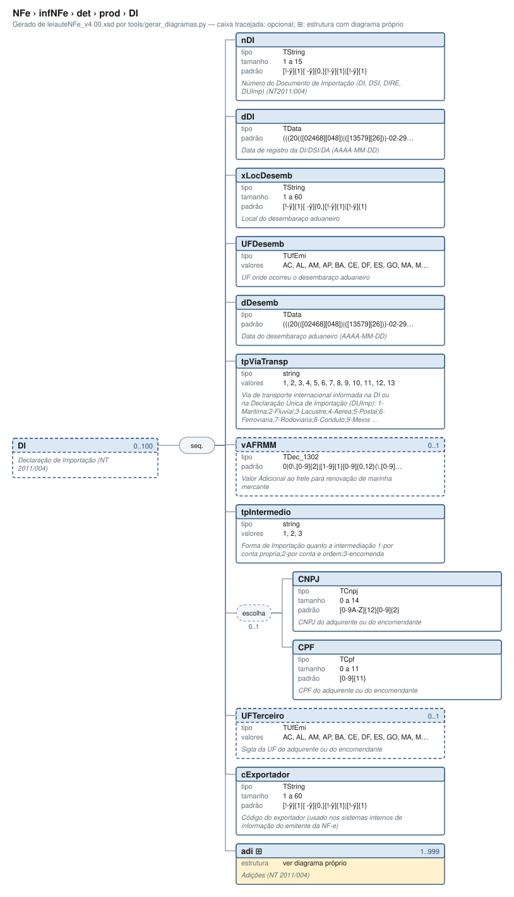

# DI — Declaração de Importação (NT 2011/004)

[Manual](../../../../README.md) › [NFe](../../../../NFe.md) › [infNFe](../../../infNFe.md) › [det](../../det.md) › [prod](../prod.md) › DI

<!-- estado-xsd:inicio -->
> **Estado: documentado.** Estrutura conferida contra a base XSD registrada.
>
> `Base atual e revisada: c537394250f913b591f3984f1de2e9d1a1ec94d334a0086e7a41f9850f5f7917`
<!-- estado-xsd:fim -->

| Informação | Base conferida |
|---|---|
| Caminho XML | `NFe/infNFe/det/prod/DI` |
| Leiaute / pacote XSD | NF-e/NFC-e 4.00 / PL010f v1.04, 31/08/2026 |
| Biblioteca conferida | libnfe 1.0.0-rc4, commit `1dd412eebca80dd80d884b3f03a1a31cfaf42279` |
| Revisão | 2026-10-05 |
| Contexto no leiaute | `0..100` no pai, sujeito às sequências e escolhas abaixo |

## Finalidade e quando preencher

Os campos identificam e quantificam o produto ou serviço deste item. Dados comerciais e tributáveis podem usar unidades diferentes; quantidades, valores unitários e totais precisam ser coerentes. A API confere formatos, mas não transforma automaticamente unidades nem escolhe CFOP, NCM ou tratamento tributário.

A declaração de importação é do produto/importação referenciado. Para uma nova declaração, acrescente outro DI; adi pertence à declaração específica e identifica sua adição.

**Atualização publicada:** a NT 2026.008 v1.00 prevê vUnComLiq, vProdLiq, vProdLiqTot e ICMSPrevistoPagtoAntecip/vICMSPrevisto. Esses campos/grupo **não constam no PL010f atualmente disponível no Portal e adotado pelo projeto**, e não são apresentados aqui como API existente. A NT registra homologação em 05/10/2026 e produção em 03/11/2026 para a primeira etapa; sua regra NB01-30 tem cronograma próprio em 2027. Confira [bases e transições](../../../../BASES.md).

GTIN, NCM e CFOP dependem também de cadastros e tabelas fiscais. A NT 2021.003 v1.50 trata da validação de GTIN; a NT 2026.009 v1.00 altera I08-140; a NT 2023.003 v1.40 contém exceções de NFC-e por UF. A aceitação lexical de um código não consulta esses cadastros.

Descrição e observações do XSD adotado: Declaração de Importação (NT 2011/004). A estrutura e as restrições são as do pacote indicado; notas históricas de uso devem ser lidas junto às atualizações listadas nas referências.

## Estrutura, ordem e escolhas



[Abrir o diagrama](../../../../../diagramas/NFe/infNFe/det/prod/DI.svg).

Uma ocorrência `1..1` dentro de uma alternativa exige o campo quando essa alternativa é selecionada; não obriga selecionar esse ramo em toda nota. Grupos opcionais podem conter filhos obrigatórios. Os elementos de sequência seguem a ordem indicada.

- **Sequência** `1..1`
  - `nDI` `1..1`
  - `dDI` `1..1`
  - `xLocDesemb` `1..1`
  - `UFDesemb` `1..1`
  - `dDesemb` `1..1`
  - `tpViaTransp` `1..1`
  - `vAFRMM` `0..1`
  - `tpIntermedio` `1..1`
  - **Escolha exclusiva** `0..1`
    - `CNPJ` `1..1`
    - `CPF` `1..1`
  - `UFTerceiro` `0..1`
  - `cExportador` `1..1`
  - `adi` `1..999`

## Campos e atributos

| Tag / atributo | Significado e observações | Tipo XML | Ocorrência | Formato / limites | Condição no contexto |
|---|---|---|---|---|---|
| `nDI` | Número do Documento de Importação (DI, DSI, DIRE, DUImp) (NT2011/004) | `TString` | `1..1` | Mínimo: 1<br>Máximo: 15<br>Padrão: `[!-ÿ]{1}[ -ÿ]{0,}[!-ÿ]{1}\|[!-ÿ]{1}`<br>Tratamento de espaços: preserve | Obrigatório no contexto |
| `dDI` | Data de registro da DI/DSI/DA (AAAA-MM-DD) | `TData` | `1..1` | Padrão: `(((20(([02468][048])\|([13579][26]))-02-29))\|(20[0-9][0-9])-((((0[1-9])\|(1[0-2]))-((0[1-9])\|(1\d)\|(2[0-8])))\|((((0[13578])\|(1[02]))-31)\|(((0[1,3-9])\|(1[0-2]))-(29\|30)))))`<br>Tratamento de espaços: preserve<br>Data: `AAAA-MM-DD` | Obrigatório no contexto |
| `xLocDesemb` | Local do desembaraço aduaneiro | `TString` | `1..1` | Mínimo: 1<br>Máximo: 60<br>Padrão: `[!-ÿ]{1}[ -ÿ]{0,}[!-ÿ]{1}\|[!-ÿ]{1}`<br>Tratamento de espaços: preserve | Obrigatório no contexto |
| `UFDesemb` | UF onde ocorreu o desembaraço aduaneiro | `TUfEmi` | `1..1` | Domínio: `AC`, `AL`, `AM`, `AP`, `BA`, `CE`, `DF`, `ES`, `GO`, `MA`, `MG`, `MS`, `MT`, `PA`, `PB`, `PE`, `PI`, `PR`, `RJ`, `RN`, `RO`, `RR`, `RS`, `SC`, `SE`, `SP`, `TO`<br>Tratamento de espaços: preserve | Obrigatório no contexto |
| `dDesemb` | Data do desembaraço aduaneiro (AAAA-MM-DD) | `TData` | `1..1` | Padrão: `(((20(([02468][048])\|([13579][26]))-02-29))\|(20[0-9][0-9])-((((0[1-9])\|(1[0-2]))-((0[1-9])\|(1\d)\|(2[0-8])))\|((((0[13578])\|(1[02]))-31)\|(((0[1,3-9])\|(1[0-2]))-(29\|30)))))`<br>Tratamento de espaços: preserve<br>Data: `AAAA-MM-DD` | Obrigatório no contexto |
| `tpViaTransp` | Via de transporte internacional informada na DI ou na Declaração Única de Importação (DUImp): 1-Maritima;2-Fluvial;3-Lacustre;4-Aerea;5-Postal;6-Ferroviaria;7-Rodoviaria;8-Conduto;9-Meios Proprios;10-Entrada/Saida Ficta; 11-Courier;12-Em maos;13-Por reboque. | `string` | `1..1` | Domínio: `1`, `2`, `3`, `4`, `5`, `6`, `7`, `8`, `9`, `10`, `11`, `12`, `13`<br>Tratamento de espaços: preserve | Obrigatório no contexto |
| `vAFRMM` | Valor Adicional ao frete para renovação de marinha mercante | `TDec_1302` | `0..1` | Padrão: `0\|0\.[0-9]{2}\|[1-9]{1}[0-9]{0,12}(\.[0-9]{2})?`<br>Tratamento de espaços: preserve | Opcional no contexto |
| `tpIntermedio` | Forma de Importação quanto a intermediação 1-por conta propria;2-por conta e ordem;3-encomenda | `string` | `1..1` | Domínio: `1`, `2`, `3`<br>Tratamento de espaços: preserve | Obrigatório no contexto |
| `CNPJ` | CNPJ do adquirente ou do encomendante | `TCnpj` | `1..1` | Máximo: 14<br>Padrão: `[0-9A-Z]{12}[0-9]{2}`<br>Tratamento de espaços: preserve | Obrigatório no contexto; apenas na alternativa selecionada; sequência/escolha opcional |
| `CPF` | CPF do adquirente ou do encomendante | `TCpf` | `1..1` | Máximo: 11<br>Padrão: `[0-9]{11}`<br>Tratamento de espaços: preserve | Obrigatório no contexto; apenas na alternativa selecionada; sequência/escolha opcional |
| `UFTerceiro` | Sigla da UF do adquirente ou do encomendante | `TUfEmi` | `0..1` | Domínio: `AC`, `AL`, `AM`, `AP`, `BA`, `CE`, `DF`, `ES`, `GO`, `MA`, `MG`, `MS`, `MT`, `PA`, `PB`, `PE`, `PI`, `PR`, `RJ`, `RN`, `RO`, `RR`, `RS`, `SC`, `SE`, `SP`, `TO`<br>Tratamento de espaços: preserve | Opcional no contexto |
| `cExportador` | Código do exportador (usado nos sistemas internos de informação do emitente da NF-e) | `TString` | `1..1` | Mínimo: 1<br>Máximo: 60<br>Padrão: `[!-ÿ]{1}[ -ÿ]{0,}[!-ÿ]{1}\|[!-ÿ]{1}`<br>Tratamento de espaços: preserve | Obrigatório no contexto |
| [`adi`](DI/adi.md) | Adições (NT 2011/004) | `complexType anônimo` | `1..999` | Grupo estruturado | Obrigatório no contexto |

Campos decimais usam o separador `.` e a precisão indicada pelo tipo; preservar a representação textual evita perda por ponto flutuante. Ausência, texto vazio e zero são valores distintos. Padrões, comprimentos e enumerações precisam ser atendidos em conjunto; valores de códigos com zeros significativos devem conservar esses zeros. Campos de mesmo nome em outros pais têm contexto próprio.

## API C, integração e memória

Acesso pela API pública: `nfe_prod_grupo(prod)`. O grupo pertence ao objeto que o fornece. Use os caminhos completos a partir desse grupo; se um ancestral for uma lista, obtenha uma ocorrência com `nfe_grupo_add` antes de preencher seus filhos.

[Contrato público de prod.h](../../../../api/prod.md) apresenta assinaturas, argumentos, retornos e limitações. [Convenções de memória e erros](../../../../API.md) explica cópia, empréstimo e transferência de posse.

Ao usar um grupo emprestado, libere o objeto proprietário, nunca o grupo separadamente. Os setters de texto copiam seus valores; getters retornam texto interno emprestado. A escolha de outro ramo válido pode apagar o anterior. Os campos obrigatórios do motor são conferidos na escrita; validar um valor isolado não prova completude do grupo. Os contratos específicos prevalecem quando a função indicada não usa o motor.

## Exemplo C conferido

[Fonte completo do cenário teste_subgrupos](../../../../../../tests/test_prod.c) contém o preenchimento, a conferência dos retornos e a liberação dos recursos. O cenário integra o programa de testes indicado, com os headers e apoios do repositório. O XML foi observado na serialização desse cenário e validado, não deduzido de um desenho.

```sh
make obj/test_prod
./obj/test_prod tests
```

A função abaixo é o cenário completo do teste, incluindo tratamento dos retornos e eventuais verificações de erros. O XML publicado foi observado na validação da linha **318** do fonte indicado; a função pode exercitar outras alterações antes/depois desse ponto.

<details>
<summary>Função C completa do cenário teste_subgrupos</summary>

```c
static void teste_subgrupos(void)
{
	nfe_prod *prod = novo();
	nfe_grupo *g = nfe_prod_grupo(prod), *di, *adi, *ras, *cred;
	char *xml;
	int rc = 0;

	VERIFICA(g != NULL);
	if (!g) {
		nfe_prod_free(prod);
		return;
	}
	rc |= nfe_grupo_add(g, "gCred", &cred);
	rc |= nfe_grupo_set(cred, "cCredPresumido", "SP000001");
	rc |= nfe_grupo_set(cred, "pCredPresumido", "1.00");
	rc |= nfe_grupo_set(cred, "vCredPresumido", "0.15");
	rc |= nfe_grupo_add(g, "DI", &di);
	rc |= nfe_grupo_set(di, "nDI", "2612345678");
	rc |= nfe_grupo_set(di, "dDI", "2026-09-30");
	rc |= nfe_grupo_set(di, "xLocDesemb", "SANTOS");
	rc |= nfe_grupo_set(di, "UFDesemb", "SP");
	rc |= nfe_grupo_set(di, "dDesemb", "2026-10-01");
	rc |= nfe_grupo_set(di, "tpViaTransp", "1");
	rc |= nfe_grupo_set(di, "vAFRMM", "10.00");
	rc |= nfe_grupo_set(di, "tpIntermedio", "1");
	rc |= nfe_grupo_set(di, "cExportador", "EXP001");
	rc |= nfe_grupo_add(di, "adi", &adi);
	rc |= nfe_grupo_set(adi, "nAdicao", "1");
	rc |= nfe_grupo_set(adi, "nSeqAdic", "1");
	rc |= nfe_grupo_set(adi, "cFabricante", "FAB01");
	rc |= nfe_grupo_add(g, "rastro", &ras);
	rc |= nfe_grupo_set(ras, "nLote", "L123");
	rc |= nfe_grupo_set(ras, "qLote", "10.000");
	rc |= nfe_grupo_set(ras, "dFab", "2026-01-01");
	rc |= nfe_grupo_set(ras, "dVal", "2027-01-01");
	rc |= nfe_grupo_set(g, "med/cProdANVISA", "1234567890123");
	rc |= nfe_grupo_set(g, "med/vPMC", "20.00");
	VERIFICA_INT(rc, 0);
	VERIFICA_INT(nfe_grupo_quantidade(g, "DI"), 1);
	VERIFICA(nfe_grupo_item(g, "DI", 0) == di);
	VERIFICA(nfe_grupo_item(g, "DI", 1) == NULL);

	xml = teste_gera(escreve, prod, &rc);
	VERIFICA_INT(rc, 0);
	VERIFICA(xml != NULL);
	if (xml) {
		VERIFICA(strstr(xml,
		                "<NCM>96081000</NCM><gCred>"
		                "<cCredPresumido>SP000001</cCredPresumido>") !=
		         NULL);
		VERIFICA(
		        strstr(xml,
		               "<indTot>1</indTot><DI><nDI>2612345678</nDI>") !=
		        NULL);
		VERIFICA(strstr(xml,
		                "<adi><nAdicao>1</nAdicao><nSeqAdic>1"
		                "</nSeqAdic><cFabricante>FAB01</cFabricante>"
		                "</adi></DI><rastro><nLote>L123</nLote>") !=
		         NULL);
		VERIFICA(strstr(xml, "</rastro><med><cProdANVISA>1234567890123"
		                     "</cProdANVISA><vPMC>20.00</vPMC></med>"
		                     "</prod>") != NULL);
		VERIFICA_INT(teste_valida(xml), 0);
	}
	free(xml);

	/* DI sem adição: lista obrigatória vazia é recusada */
	VERIFICA_INT(nfe_grupo_remove(di, "adi"), 0);
	xml = teste_gera(escreve, prod, &rc);
	VERIFICA_INT(rc, E_VALOR);
	free(xml);

	/* Trocar med por comb apaga med (escolha) */
	VERIFICA_INT(nfe_grupo_remove(g, "DI"), 0);
	VERIFICA_INT(nfe_grupo_set(g, "nRECOPI", "12345678901234567890"), 0);
	VERIFICA(nfe_grupo_get(g, "med/vPMC") == NULL);
	xml = teste_gera(escreve, prod, &rc);
	VERIFICA_INT(rc, 0);
	if (xml) {
		VERIFICA(strstr(xml,
		                "<nRECOPI>12345678901234567890</nRECOPI>") !=
		         NULL);
		VERIFICA_INT(teste_valida(xml), 0);
	}
	free(xml);

	/* Listas: limite (gCred até 4), caminho inexistente e NULL */
	VERIFICA_INT(nfe_grupo_add(g, "gCred", &cred), 0);
	VERIFICA_INT(nfe_grupo_add(g, "gCred", &cred), 0);
	VERIFICA_INT(nfe_grupo_add(g, "gCred", &cred), 0);
	VERIFICA_INT(nfe_grupo_add(g, "gCred", &cred), E_VALOR);
	VERIFICA_INT(nfe_grupo_add(g, "cProd", &cred), E_VALOR);
	VERIFICA_INT(nfe_grupo_add(g, "gCred", NULL), E_ISNULL);
	VERIFICA_INT(nfe_grupo_quantidade(g, "naoexiste"), E_VALOR);
	VERIFICA(nfe_prod_grupo(NULL) == NULL);
	nfe_prod_free(prod);
}
```

</details>

## XML correspondente

Trecho do cenário acima, com namespace preservado. [XML completo do cenário](../../../../exemplos/grupos/test_prod-0005.xml) permite conferir valores e ancestrais. Dados sintéticos; este exemplo comprova estrutura e uso da API, sem transmissão, autorização ou validação de enquadramento fiscal.

```xml
<DI xmlns="http://www.portalfiscal.inf.br/nfe">
  <nDI>2612345678</nDI>
  <dDI>2026-09-30</dDI>
  <xLocDesemb>SANTOS</xLocDesemb>
  <UFDesemb>SP</UFDesemb>
  <dDesemb>2026-10-01</dDesemb>
  <tpViaTransp>1</tpViaTransp>
  <vAFRMM>10.00</vAFRMM>
  <tpIntermedio>1</tpIntermedio>
  <cExportador>EXP001</cExportador>
  <adi>
    <nAdicao>1</nAdicao>
    <nSeqAdic>1</nSeqAdic>
    <cFabricante>FAB01</cFabricante>
  </adi>
</DI>

```

O fragmento é validado no contexto que o declara no leiaute, com namespace e ancestrais. O wrapper tipos_v4.00.xsd, quando usado nos testes, extrai essas declarações do schema oficial e é identificado como apoio de testes, sem substituir o pacote oficial.

## Validação, erros e limites

| Situação | Etapa / resultado | Tratamento |
|---|---|---|
| Ponteiro obrigatório nulo | API: `E_ISNULL` (-1), conforme contrato da função | Conferir criação e argumentos |
| Texto fora do comprimento | Setter/motor: `E_TAMANHO` (-2) | Usar os limites do tipo e do argumento C |
| Domínio, padrão ou caminho inválido/ambíguo | Setter/motor: `E_VALOR` (-3) | Corrigir o valor e usar caminho completo |
| Campo obrigatório ou escolha incompleta | Escrita do motor: `E_VALOR`; XSD rejeita | Completar o ramo selecionado |
| Falha de escrita XML | Writer: `E_XML` (-4) | Descartar saída parcial e tratar a falha |
| Falta de memória | Criação: NULL; operações que alocam podem retornar `E_MALLOC` (-101) | Encerrar com limpeza dos recursos ainda próprios |
| Regra fiscal, cadastro, cálculo ou vigência | Pode ser aceito lexicalmente; depende da regra e do autorizador | Conferir fontes e contratos; não confundir 0 com autorização |

Os códigos negativos são da biblioteca, não códigos cStat. [Validação e regras implementadas](../../../../VALIDACAO.md) distingue XSD, verificações locais e retorno da SEFAZ. A referência da API identifica exceções aos comportamentos gerais desta tabela.

## Referências e grupos relacionados

- XSD atual: [leiaute](../../../../../../tests/schemas/nfe/leiauteNFe_v4.00.xsd), [tipos básicos](../../../../../../tests/schemas/nfe/tiposBasico_v4.00.xsd) e [tipos DFe/RTC](../../../../../../tests/schemas/nfe/DFeTiposBasicos_v1.00.xsd).
- MOC 7.0, Anexo I: I, pp. 17–25. [Fontes oficiais, versões e transições](../../../../BASES.md) relaciona atualizações posteriores, com vigência separada da publicação.
- API: [prod.h](../../../../../../include/libnfe/prod.h) e [referência das funções](../../../../api/prod.md).
- Grupo pai: [prod](../prod.md).
- Filhos: [adi](DI/adi.md).

Anterior: [gCred](gCred.md) | Próximo: [adi](DI/adi.md)
