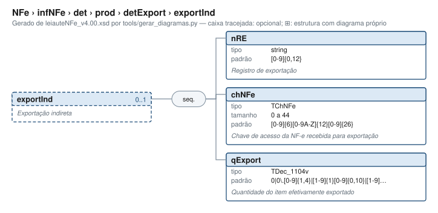

# exportInd — Exportação indireta

[Manual](../../../../../README.md) › [NFe](../../../../../NFe.md) › [infNFe](../../../../infNFe.md) › [det](../../../det.md) › [prod](../../prod.md) › [detExport](../detExport.md) › exportInd

<!-- estado-xsd:inicio -->
> **Estado: documentado.** Estrutura conferida contra a base XSD registrada.
>
> `Base atual e revisada: c537394250f913b591f3984f1de2e9d1a1ec94d334a0086e7a41f9850f5f7917`
<!-- estado-xsd:fim -->

| Informação | Base conferida |
|---|---|
| Caminho XML | `NFe/infNFe/det/prod/detExport/exportInd` |
| Leiaute / pacote XSD | NF-e/NFC-e 4.00 / PL010f v1.04, 31/08/2026 |
| Biblioteca conferida | libnfe 1.0.0-rc4, commit `1dd412eebca80dd80d884b3f03a1a31cfaf42279` |
| Revisão | 2026-10-05 |
| Contexto no leiaute | `0..1` no pai, sujeito às sequências e escolhas abaixo |

## Finalidade e quando preencher

Os campos identificam e quantificam o produto ou serviço deste item. Dados comerciais e tributáveis podem usar unidades diferentes; quantidades, valores unitários e totais precisam ser coerentes. A API confere formatos, mas não transforma automaticamente unidades nem escolhe CFOP, NCM ou tratamento tributário.

**Atualização publicada:** a NT 2026.008 v1.00 prevê vUnComLiq, vProdLiq, vProdLiqTot e ICMSPrevistoPagtoAntecip/vICMSPrevisto. Esses campos/grupo **não constam no PL010f atualmente disponível no Portal e adotado pelo projeto**, e não são apresentados aqui como API existente. A NT registra homologação em 05/10/2026 e produção em 03/11/2026 para a primeira etapa; sua regra NB01-30 tem cronograma próprio em 2027. Confira [bases e transições](../../../../../BASES.md).

GTIN, NCM e CFOP dependem também de cadastros e tabelas fiscais. A NT 2021.003 v1.50 trata da validação de GTIN; a NT 2026.009 v1.00 altera I08-140; a NT 2023.003 v1.40 contém exceções de NFC-e por UF. A aceitação lexical de um código não consulta esses cadastros.

Descrição e observações do XSD adotado: Exportação indireta. A estrutura e as restrições são as do pacote indicado; notas históricas de uso devem ser lidas junto às atualizações listadas nas referências.

## Estrutura, ordem e escolhas



[Abrir o diagrama](../../../../../../diagramas/NFe/infNFe/det/prod/detExport/exportInd.svg).

Uma ocorrência `1..1` dentro de uma alternativa exige o campo quando essa alternativa é selecionada; não obriga selecionar esse ramo em toda nota. Grupos opcionais podem conter filhos obrigatórios. Os elementos de sequência seguem a ordem indicada.

- **Sequência** `1..1`
  - `nRE` `1..1`
  - `chNFe` `1..1`
  - `qExport` `1..1`

## Campos e atributos

| Tag / atributo | Significado e observações | Tipo XML | Ocorrência | Formato / limites | Condição no contexto |
|---|---|---|---|---|---|
| `nRE` | Registro de exportação | `string` | `1..1` | Padrão: `[0-9]{0,12}`<br>Tratamento de espaços: preserve | Obrigatório no contexto |
| `chNFe` | Chave de acesso da NF-e recebida para exportação | `TChNFe` | `1..1` | Máximo: 44<br>Padrão: `[0-9]{6}[0-9A-Z]{12}[0-9]{26}`<br>Tratamento de espaços: preserve | Obrigatório no contexto |
| `qExport` | Quantidade do item efetivamente exportado | `TDec_1104v` | `1..1` | Padrão: `0\|0\.[0-9]{1,4}\|[1-9]{1}[0-9]{0,10}\|[1-9]{1}[0-9]{0,10}(\.[0-9]{1,4})?`<br>Tratamento de espaços: preserve | Obrigatório no contexto |

Campos decimais usam o separador `.` e a precisão indicada pelo tipo; preservar a representação textual evita perda por ponto flutuante. Ausência, texto vazio e zero são valores distintos. Padrões, comprimentos e enumerações precisam ser atendidos em conjunto; valores de códigos com zeros significativos devem conservar esses zeros. Campos de mesmo nome em outros pais têm contexto próprio.

## API C, integração e memória

Acesso pela API pública: `nfe_prod_grupo(prod)`. O grupo pertence ao objeto que o fornece. Use os caminhos completos a partir desse grupo; se um ancestral for uma lista, obtenha uma ocorrência com `nfe_grupo_add` antes de preencher seus filhos.

[Contrato público de prod.h](../../../../../api/prod.md) apresenta assinaturas, argumentos, retornos e limitações. [Convenções de memória e erros](../../../../../API.md) explica cópia, empréstimo e transferência de posse.

Ao usar um grupo emprestado, libere o objeto proprietário, nunca o grupo separadamente. Os setters de texto copiam seus valores; getters retornam texto interno emprestado. A escolha de outro ramo válido pode apagar o anterior. Os campos obrigatórios do motor são conferidos na escrita; validar um valor isolado não prova completude do grupo. Os contratos específicos prevalecem quando a função indicada não usa o motor.

## Exemplo C conferido

[Fonte completo do cenário caso_070](../../../../../../../examples/manual/casos.inc) contém o preenchimento, a conferência dos retornos e a liberação dos recursos. [Programa que cria o objeto e obtém o grupo](../../../../../../../examples/manual_grupos.c) fornece os headers e a execução desse cenário.

```sh
make exemplos
./obj/manual_grupos NFe/infNFe/det/prod/detExport/exportInd
```

Recorte do cenário executado (o programa completo define CONFERE e fornece o grupo do objeto proprietário):

```c
static int caso_070(nfe_grupo *g)
{
	int rc = 0;
	CONFERE(nfe_grupo_set(g, "cProd", "EXEMPLO"));
	CONFERE(nfe_grupo_set(g, "cEAN", "SEM GTIN"));
	CONFERE(nfe_grupo_set(g, "xProd", "EXEMPLO"));
	CONFERE(nfe_grupo_set(g, "NCM", "01"));
	CONFERE(nfe_grupo_set(g, "CFOP", "1000"));
	CONFERE(nfe_grupo_set(g, "uCom", "1.00"));
	CONFERE(nfe_grupo_set(g, "qCom", "1.00"));
	CONFERE(nfe_grupo_set(g, "vUnCom", "1.00"));
	CONFERE(nfe_grupo_set(g, "vProd", "1.00"));
	CONFERE(nfe_grupo_set(g, "cEANTrib", "SEM GTIN"));
	CONFERE(nfe_grupo_set(g, "uTrib", "1.00"));
	CONFERE(nfe_grupo_set(g, "qTrib", "1.00"));
	CONFERE(nfe_grupo_set(g, "vUnTrib", "1.00"));
	CONFERE(nfe_grupo_set(g, "indTot", "0"));
	nfe_grupo *item1 = NULL;
	CONFERE(nfe_grupo_add(g, "detExport", &item1));
	CONFERE(nfe_grupo_set(item1, "exportInd/nRE", "1"));
	CONFERE(nfe_grupo_set(item1, "exportInd/chNFe",
	                      "35261012345678000195550010000000011123456781"));
	CONFERE(nfe_grupo_set(item1, "exportInd/qExport", "1.00"));
fim:
	return rc;
}
```

## XML correspondente

Trecho do cenário acima, com namespace preservado. [XML completo do cenário](../../../../../exemplos/grupos/caso_070.xml) e [nota de contexto validada](../../../../../exemplos/contextos/caso_070.xml) permitem conferir valores e ancestrais. Dados sintéticos; este exemplo comprova estrutura e uso da API, sem transmissão, autorização ou validação de enquadramento fiscal.

```xml
<exportInd xmlns="http://www.portalfiscal.inf.br/nfe">
  <nRE>1</nRE>
  <chNFe>35261012345678000195550010000000011123456781</chNFe>
  <qExport>1.00</qExport>
</exportInd>

```

O fragmento é validado no contexto que o declara no leiaute, com namespace e ancestrais. O wrapper tipos_v4.00.xsd, quando usado nos testes, extrai essas declarações do schema oficial e é identificado como apoio de testes, sem substituir o pacote oficial.

## Validação, erros e limites

| Situação | Etapa / resultado | Tratamento |
|---|---|---|
| Ponteiro obrigatório nulo | API: `E_ISNULL` (-1), conforme contrato da função | Conferir criação e argumentos |
| Texto fora do comprimento | Setter/motor: `E_TAMANHO` (-2) | Usar os limites do tipo e do argumento C |
| Domínio, padrão ou caminho inválido/ambíguo | Setter/motor: `E_VALOR` (-3) | Corrigir o valor e usar caminho completo |
| Campo obrigatório ou escolha incompleta | Escrita do motor: `E_VALOR`; XSD rejeita | Completar o ramo selecionado |
| Falha de escrita XML | Writer: `E_XML` (-4) | Descartar saída parcial e tratar a falha |
| Falta de memória | Criação: NULL; operações que alocam podem retornar `E_MALLOC` (-101) | Encerrar com limpeza dos recursos ainda próprios |
| Regra fiscal, cadastro, cálculo ou vigência | Pode ser aceito lexicalmente; depende da regra e do autorizador | Conferir fontes e contratos; não confundir 0 com autorização |

Os códigos negativos são da biblioteca, não códigos cStat. [Validação e regras implementadas](../../../../../VALIDACAO.md) distingue XSD, verificações locais e retorno da SEFAZ. A referência da API identifica exceções aos comportamentos gerais desta tabela.

## Referências e grupos relacionados

- XSD atual: [leiaute](../../../../../../../tests/schemas/nfe/leiauteNFe_v4.00.xsd), [tipos básicos](../../../../../../../tests/schemas/nfe/tiposBasico_v4.00.xsd) e [tipos DFe/RTC](../../../../../../../tests/schemas/nfe/DFeTiposBasicos_v1.00.xsd).
- MOC 7.0, Anexo I: I, pp. 17–25. [Fontes oficiais, versões e transições](../../../../../BASES.md) relaciona atualizações posteriores, com vigência separada da publicação.
- API: [prod.h](../../../../../../../include/libnfe/prod.h) e [referência das funções](../../../../../api/prod.md).
- Grupo pai: [detExport](../detExport.md).

Anterior: [detExport](../detExport.md) | Próximo: [rastro](../rastro.md)
