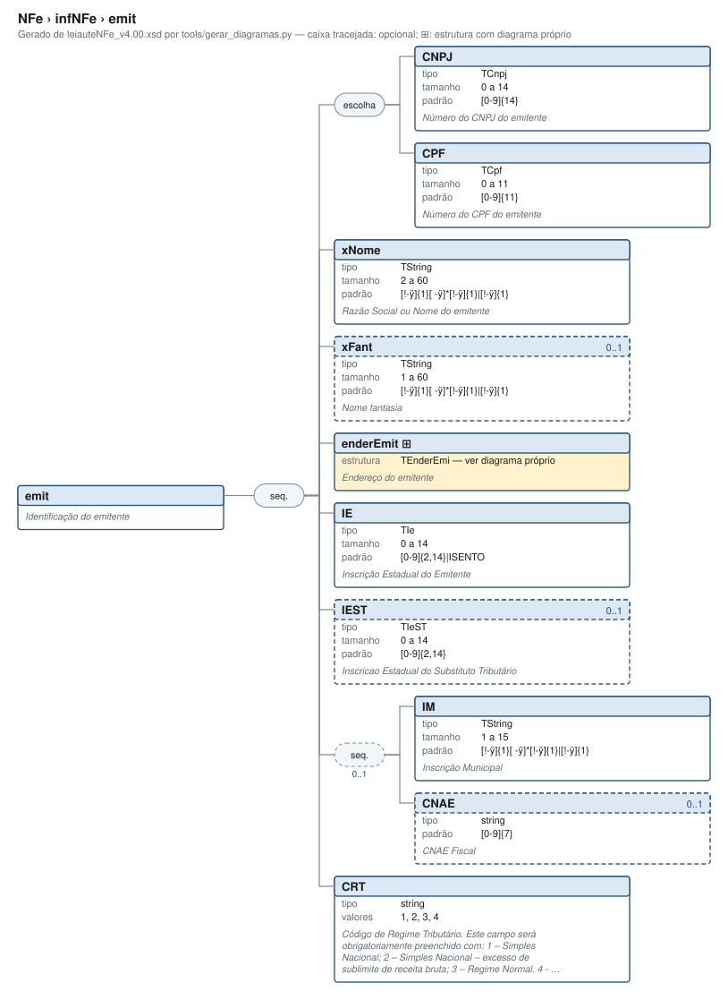

# emit — Identificação do emitente

[Manual](../../README.md) › [NFe](../../NFe.md) › [infNFe](../infNFe.md) › emit

<!-- estado-xsd:inicio -->
> **Estado: documentado.** Estrutura conferida contra a base XSD registrada.
>
> `Base atual e revisada: c537394250f913b591f3984f1de2e9d1a1ec94d334a0086e7a41f9850f5f7917`
<!-- estado-xsd:fim -->

| Informação | Base conferida |
|---|---|
| Caminho XML | `NFe/infNFe/emit` |
| Leiaute / pacote XSD | NF-e/NFC-e 4.00 / PL010f v1.04, 31/08/2026 |
| Biblioteca conferida | libnfe 1.0.0-rc4, commit `1dd412eebca80dd80d884b3f03a1a31cfaf42279` |
| Revisão | 2026-10-05 |
| Contexto no leiaute | `1..1` no pai, sujeito às sequências e escolhas abaixo |

## Finalidade e quando preencher

Os dados pertencem ao estabelecimento que emite a nota. CNPJ/CPF, endereço, regime tributário e inscrições devem representar esse emitente. O CRT orienta a tributação dos itens, mas a biblioteca não escolhe automaticamente um enquadramento fiscal.

A NT 2026.007 v1.10 distingue o contribuinte exclusivo do IBS/CBS, incluindo ausência de IE do emitente e direcionamento à SVRS em condições específicas. O XSD permite IE opcional; esse fato, isoladamente, não seleciona o autorizador nem dispensa as verificações cadastrais. A produção está prevista para 03/11/2026.

Descrição e observações do XSD adotado: Identificação do emitente. A estrutura e as restrições são as do pacote indicado; notas históricas de uso devem ser lidas junto às atualizações listadas nas referências.

## Estrutura, ordem e escolhas



[Abrir o diagrama](../../../diagramas/NFe/infNFe/emit.svg).

Uma ocorrência `1..1` dentro de uma alternativa exige o campo quando essa alternativa é selecionada; não obriga selecionar esse ramo em toda nota. Grupos opcionais podem conter filhos obrigatórios. Os elementos de sequência seguem a ordem indicada.

- **Sequência** `1..1`
  - **Escolha exclusiva** `1..1`
    - `CNPJ` `1..1`
    - `CPF` `1..1`
  - `xNome` `1..1`
  - `xFant` `0..1`
  - `enderEmit` `1..1`
  - `IE` `0..1`
  - `IEST` `0..1`
  - **Sequência** `0..1`
    - `IM` `1..1`
    - `CNAE` `0..1`
  - `CRT` `1..1`
  - `ISUFEmit` `0..1`

## Campos e atributos

| Tag / atributo | Significado e observações | Tipo XML | Ocorrência | Formato / limites | Condição no contexto |
|---|---|---|---|---|---|
| `CNPJ` | Número do CNPJ do emitente | `TCnpj` | `1..1` | Máximo: 14<br>Padrão: `[0-9A-Z]{12}[0-9]{2}`<br>Tratamento de espaços: preserve | Obrigatório no contexto; apenas na alternativa selecionada |
| `CPF` | Número do CPF do emitente | `TCpf` | `1..1` | Máximo: 11<br>Padrão: `[0-9]{11}`<br>Tratamento de espaços: preserve | Obrigatório no contexto; apenas na alternativa selecionada |
| `xNome` | Razão Social ou Nome do emitente | `TString` | `1..1` | Mínimo: 2<br>Máximo: 60<br>Padrão: `[!-ÿ]{1}[ -ÿ]{0,}[!-ÿ]{1}\|[!-ÿ]{1}`<br>Tratamento de espaços: preserve | Obrigatório no contexto |
| `xFant` | Nome fantasia | `TString` | `0..1` | Mínimo: 1<br>Máximo: 60<br>Padrão: `[!-ÿ]{1}[ -ÿ]{0,}[!-ÿ]{1}\|[!-ÿ]{1}`<br>Tratamento de espaços: preserve | Opcional no contexto |
| [`enderEmit`](emit/enderEmit.md) | Endereço do emitente | `TEnderEmi` | `1..1` | Grupo estruturado | Obrigatório no contexto |
| `IE` | Inscrição Estadual do Emitente | `TIe` | `0..1` | Máximo: 14<br>Padrão: `[0-9]{2,14}\|ISENTO`<br>Tratamento de espaços: preserve | Opcional no contexto |
| `IEST` | Inscricao Estadual do Substituto Tributário | `TIeST` | `0..1` | Máximo: 14<br>Padrão: `[0-9]{2,14}`<br>Tratamento de espaços: preserve | Opcional no contexto |
| `IM` | Inscrição Municipal | `TString` | `1..1` | Mínimo: 1<br>Máximo: 15<br>Padrão: `[!-ÿ]{1}[ -ÿ]{0,}[!-ÿ]{1}\|[!-ÿ]{1}`<br>Tratamento de espaços: preserve | Obrigatório no contexto; sequência/escolha opcional |
| `CNAE` | CNAE Fiscal | `string` | `0..1` | Padrão: `[0-9]{7}`<br>Tratamento de espaços: preserve | Opcional no contexto; sequência/escolha opcional |
| `CRT` | Código de Regime Tributário. Este campo será obrigatoriamente preenchido com: 1 – Simples Nacional; 2 – Simples Nacional – excesso de sublimite de receita bruta; 3 – Regime Normal. 4 - Simples Nacional - Microempreendedor individual - MEI | `string` | `1..1` | Domínio: `1`, `2`, `3`, `4`<br>Tratamento de espaços: preserve | Obrigatório no contexto |
| `ISUFEmit` | Inscrição do emitente na Suframa | `string` | `0..1` | Padrão: `[0-9]{8,9}`<br>Tratamento de espaços: preserve | Opcional no contexto |

Campos decimais usam o separador `.` e a precisão indicada pelo tipo; preservar a representação textual evita perda por ponto flutuante. Ausência, texto vazio e zero são valores distintos. Padrões, comprimentos e enumerações precisam ser atendidos em conjunto; valores de códigos com zeros significativos devem conservar esses zeros. Campos de mesmo nome em outros pais têm contexto próprio.

## API C, integração e memória

Este grupo usa os objetos e funções específicos do módulo `emit.h`. O contrato completo abaixo identifica os argumentos, a ligação ao pai, a serialização e a liberação. O exemplo indicado usa essas funções; o motor genérico não é um substituto automático para esse objeto.

[Contrato público de emit.h](../../api/emit.md) apresenta assinaturas, argumentos, retornos e limitações. [Convenções de memória e erros](../../API.md) explica cópia, empréstimo e transferência de posse.

Ao usar um grupo emprestado, libere o objeto proprietário, nunca o grupo separadamente. Os setters de texto copiam seus valores; getters retornam texto interno emprestado. A escolha de outro ramo válido pode apagar o anterior. Os campos obrigatórios do motor são conferidos na escrita; validar um valor isolado não prova completude do grupo. Os contratos específicos prevalecem quando a função indicada não usa o motor.

## Exemplo C conferido

[Fonte completo do cenário teste_completo](../../../../tests/test_emit.c) contém o preenchimento, a conferência dos retornos e a liberação dos recursos. O cenário integra o programa de testes indicado, com os headers e apoios do repositório. O XML foi observado na serialização desse cenário e validado, não deduzido de um desenho.

```sh
make obj/test_emit
./obj/test_emit tests
```

A função abaixo é o cenário completo do teste, incluindo tratamento dos retornos e eventuais verificações de erros. O XML publicado foi observado na validação da linha **88** do fonte indicado; a função pode exercitar outras alterações antes/depois desse ponto.

<details>
<summary>Função C completa do cenário teste_completo</summary>

```c
static void teste_completo(void)
{
	nfe_emit *emit = novo();
	char *xml;
	int rc;

	VERIFICA(emit != NULL);
	if (!emit)
		return;

	xml = teste_gera(escreve, emit, &rc);
	VERIFICA_INT(rc, 0);
	VERIFICA(xml != NULL);
	if (xml) {
		VERIFICA(strstr(xml, "<emit xmlns=\"" TESTE_NS "\">"
		                     "<CNPJ>12345678000195</CNPJ>"
		                     "<xNome>EMPRESA EXEMPLO LTDA</xNome>"
		                     "<enderEmit>") != NULL);
		VERIFICA(strstr(xml, "</enderEmit><CRT>3</CRT></emit>") !=
		         NULL);
		VERIFICA_INT(teste_valida(xml), 0);
	}
	free(xml);

	/* Todos os opcionais, na ordem do leiaute */
	VERIFICA_INT(nfe_emit_set_xfant(emit, "EXEMPLO"), 0);
	VERIFICA_INT(nfe_emit_set_ie(emit, "123456789012"), 0);
	VERIFICA_INT(nfe_emit_set_iest(emit, "98765432"), 0);
	VERIFICA_INT(nfe_emit_set_im(emit, "IM-12345"), 0);
	VERIFICA_INT(nfe_emit_set_cnae(emit, "4751201"), 0);
	VERIFICA_INT(nfe_emit_set_isufemit(emit, "123456789"), 0);
	VERIFICA_INT(nfe_emit_set_crt(emit, NFE_CRT_MEI), 0);
	xml = teste_gera(escreve, emit, &rc);
	VERIFICA_INT(rc, 0);
	VERIFICA(xml != NULL);
	if (xml) {
		VERIFICA(strstr(xml, "</xNome><xFant>EXEMPLO</xFant>"
		                     "<enderEmit>") != NULL);
		VERIFICA(strstr(xml, "</enderEmit><IE>123456789012</IE>"
		                     "<IEST>98765432</IEST><IM>IM-12345</IM>"
		                     "<CNAE>4751201</CNAE><CRT>4</CRT>"
		                     "<ISUFEmit>123456789</ISUFEmit></emit>") !=
		         NULL);
		VERIFICA_INT(teste_valida(xml), 0);
	}
	free(xml);

	/* CPF e CNPJ alfanumérico; IE ISENTO */
	VERIFICA_INT(nfe_emit_set_cpf(emit, "12345678909"), 0);
	VERIFICA_INT(nfe_emit_set_ie(emit, "ISENTO"), 0);
	xml = teste_gera(escreve, emit, &rc);
	VERIFICA(xml != NULL);
	if (xml) {
		VERIFICA(strstr(xml, "<CPF>12345678909</CPF>") != NULL);
		VERIFICA(strstr(xml, "CNPJ") == NULL);
		VERIFICA(strstr(xml, "<IE>ISENTO</IE>") != NULL);
		VERIFICA_INT(teste_valida(xml), 0);
	}
	free(xml);
	VERIFICA_INT(nfe_emit_set_cnpj(emit, "12ABC34501DE35"), 0);
	xml = teste_gera(escreve, emit, &rc);
	VERIFICA(xml != NULL);
	if (xml) {
		VERIFICA(strstr(xml, "<CNPJ>12ABC34501DE35</CNPJ>") != NULL);
		VERIFICA(strstr(xml, "CPF") == NULL);
		VERIFICA_INT(teste_valida(xml), 0);
	}
	free(xml);

	/* CNAE só com IM */
	VERIFICA_INT(nfe_emit_set_im(emit, NULL), 0);
	xml = teste_gera(escreve, emit, &rc);
	VERIFICA_INT(rc, E_VALOR);
	free(xml);
	VERIFICA_INT(nfe_emit_set_cnae(emit, NULL), 0);
	xml = teste_gera(escreve, emit, &rc);
	VERIFICA_INT(rc, 0);
	if (xml)
		VERIFICA_INT(teste_valida(xml), 0);
	free(xml);
	nfe_emit_free(emit);
}
```

</details>

## XML correspondente

Trecho do cenário acima, com namespace preservado. [XML completo do cenário](../../exemplos/grupos/test_emit-0001.xml) permite conferir valores e ancestrais. Dados sintéticos; este exemplo comprova estrutura e uso da API, sem transmissão, autorização ou validação de enquadramento fiscal.

```xml
<emit xmlns="http://www.portalfiscal.inf.br/nfe">
  <CNPJ>12345678000195</CNPJ>
  <xNome>EMPRESA EXEMPLO LTDA</xNome>
  <enderEmit>
    <xLgr>RUA DAS FLORES</xLgr>
    <nro>123</nro>
    <xBairro>CENTRO</xBairro>
    <cMun>3550308</cMun>
    <xMun>SAO PAULO</xMun>
    <UF>SP</UF>
    <CEP>01001000</CEP>
  </enderEmit>
  <CRT>3</CRT>
</emit>
```

O fragmento é validado no contexto que o declara no leiaute, com namespace e ancestrais. O wrapper tipos_v4.00.xsd, quando usado nos testes, extrai essas declarações do schema oficial e é identificado como apoio de testes, sem substituir o pacote oficial.

## Validação, erros e limites

| Situação | Etapa / resultado | Tratamento |
|---|---|---|
| Ponteiro obrigatório nulo | API: `E_ISNULL` (-1), conforme contrato da função | Conferir criação e argumentos |
| Texto fora do comprimento | Setter/motor: `E_TAMANHO` (-2) | Usar os limites do tipo e do argumento C |
| Domínio, padrão ou caminho inválido/ambíguo | Setter/motor: `E_VALOR` (-3) | Corrigir o valor e usar caminho completo |
| Campo obrigatório ou escolha incompleta | Escrita do motor: `E_VALOR`; XSD rejeita | Completar o ramo selecionado |
| Falha de escrita XML | Writer: `E_XML` (-4) | Descartar saída parcial e tratar a falha |
| Falta de memória | Criação: NULL; operações que alocam podem retornar `E_MALLOC` (-101) | Encerrar com limpeza dos recursos ainda próprios |
| Regra fiscal, cadastro, cálculo ou vigência | Pode ser aceito lexicalmente; depende da regra e do autorizador | Conferir fontes e contratos; não confundir 0 com autorização |

Os códigos negativos são da biblioteca, não códigos cStat. [Validação e regras implementadas](../../VALIDACAO.md) distingue XSD, verificações locais e retorno da SEFAZ. A referência da API identifica exceções aos comportamentos gerais desta tabela.

## Referências e grupos relacionados

- XSD atual: [leiaute](../../../../tests/schemas/nfe/leiauteNFe_v4.00.xsd), [tipos básicos](../../../../tests/schemas/nfe/tiposBasico_v4.00.xsd) e [tipos DFe/RTC](../../../../tests/schemas/nfe/DFeTiposBasicos_v1.00.xsd).
- MOC 7.0, Anexo I: C, pp. 12–13. [Fontes oficiais, versões e transições](../../BASES.md) relaciona atualizações posteriores, com vigência separada da publicação.
- API: [emit.h](../../../../include/libnfe/emit.h) e [referência das funções](../../api/emit.md).
- Grupo pai: [infNFe](../infNFe.md).
- Filhos: [enderEmit](emit/enderEmit.md).

Anterior: [gPagAntecipado](ide/gPagAntecipado.md) | Próximo: [enderEmit](emit/enderEmit.md)
