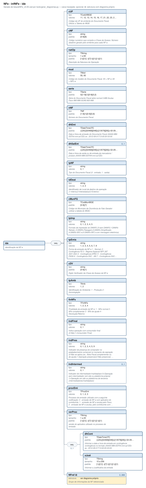

# ide — identificação da NF-e

[Manual](../../README.md) › [NFe](../../NFe.md) › [infNFe](../infNFe.md) › ide

<!-- estado-xsd:inicio -->
> **Estado: documentado.** Estrutura conferida contra a base XSD registrada.
>
> `Base atual e revisada: c537394250f913b591f3984f1de2e9d1a1ec94d334a0086e7a41f9850f5f7917`
<!-- estado-xsd:fim -->

| Informação | Base conferida |
|---|---|
| Caminho XML | `NFe/infNFe/ide` |
| Leiaute / pacote XSD | NF-e/NFC-e 4.00 / PL010f v1.04, 31/08/2026 |
| Biblioteca conferida | libnfe 1.0.0-rc4, commit `1dd412eebca80dd80d884b3f03a1a31cfaf42279` |
| Revisão | 2026-10-05 |
| Contexto no leiaute | `1..1` no pai, sujeito às sequências e escolhas abaixo |

## Finalidade e quando preencher

A identificação descreve a operação atual: modelo, finalidade, ambiente, local, datas e numeração. Esses dados participam da chave de acesso. Defina-os antes de gerar a chave e assinar; alterações posteriores exigem nova geração e assinatura.

A NT 2026.007 v1.10 distingue o contribuinte exclusivo do IBS/CBS, incluindo ausência de IE do emitente e direcionamento à SVRS em condições específicas. O XSD permite IE opcional; esse fato, isoladamente, não seleciona o autorizador nem dispensa as verificações cadastrais. A produção está prevista para 03/11/2026.

Descrição e observações do XSD adotado: identificação da NF-e. A estrutura e as restrições são as do pacote indicado; notas históricas de uso devem ser lidas junto às atualizações listadas nas referências.

## Estrutura, ordem e escolhas



[Abrir o diagrama](../../../diagramas/NFe/infNFe/ide.svg).

Uma ocorrência `1..1` dentro de uma alternativa exige o campo quando essa alternativa é selecionada; não obriga selecionar esse ramo em toda nota. Grupos opcionais podem conter filhos obrigatórios. Os elementos de sequência seguem a ordem indicada.

- **Sequência** `1..1`
  - `cUF` `1..1`
  - `cNF` `1..1`
  - `natOp` `1..1`
  - `mod` `1..1`
  - `serie` `1..1`
  - `nNF` `1..1`
  - `dhEmi` `1..1`
  - `dhSaiEnt` `0..1`
  - `dPrevEntrega` `0..1`
  - `tpNF` `1..1`
  - `idDest` `1..1`
  - `cMunFG` `1..1`
  - `cMunFGIBS` `0..1`
  - `tpImp` `1..1`
  - `tpEmis` `1..1`
  - `cDV` `1..1`
  - `tpAmb` `1..1`
  - `finNFe` `1..1`
  - `tpNFDebito` `0..1`
  - `tpNFCredito` `0..1`
  - `indFinal` `1..1`
  - `indPres` `1..1`
  - `indIntermed` `0..1`
  - `cIndOp` `0..1`
  - `procEmi` `1..1`
  - `verProc` `1..1`
  - **Sequência** `0..1`
    - `dhCont` `1..1`
    - `xJust` `1..1`
  - `NFref` `0..999`
  - `gCompraGov` `0..1`
  - `gPagAntecipado` `0..1`

## Campos e atributos

| Tag / atributo | Significado e observações | Tipo XML | Ocorrência | Formato / limites | Condição no contexto |
|---|---|---|---|---|---|
| `cUF` | Código da UF do emitente do Documento Fiscal. Utilizar a Tabela do IBGE. | `TCodUfIBGE` | `1..1` | Domínio: `11`, `12`, `13`, `14`, `15`, `16`, `17`, `21`, `22`, `23`, `24`, `25`, `26`, `27`, `28`, `29`, `31`, `32`, `33`, `35`, `41`, `42`, `43`, `50`, `51`, `52`, `53`<br>Tratamento de espaços: preserve | Obrigatório no contexto |
| `cNF` | Código numérico que compõe a Chave de Acesso. Número aleatório gerado pelo emitente para cada NF-e. | `string` | `1..1` | Padrão: `[0-9]{8}`<br>Tratamento de espaços: preserve | Obrigatório no contexto |
| `natOp` | Descrição da Natureza da Operação | `TString` | `1..1` | Mínimo: 1<br>Máximo: 60<br>Padrão: `[!-ÿ]{1}[ -ÿ]{0,}[!-ÿ]{1}\|[!-ÿ]{1}`<br>Tratamento de espaços: preserve | Obrigatório no contexto |
| `mod` | Código do modelo do Documento Fiscal. 55 = NF-e; 65 = NFC-e. | `TMod` | `1..1` | Domínio: `55`, `65`<br>Tratamento de espaços: preserve | Obrigatório no contexto |
| `serie` | Série do Documento Fiscal | `TSerie` | `1..1` | Padrão: `0\|[1-9]{1}[0-9]{0,2}`<br>Tratamento de espaços: preserve | Obrigatório no contexto |
| `nNF` | Número do Documento Fiscal | `TNF` | `1..1` | Padrão: `[1-9]{1}[0-9]{0,8}`<br>Tratamento de espaços: preserve | Obrigatório no contexto |
| `dhEmi` | Data e Hora de emissão do Documento Fiscal (AAAA-MM-DDThh:mm:ssTZD) ex.: 2012-09-01T13:00:00-03:00 | `TDateTimeUTC` | `1..1` | Padrão: `(((20(([02468][048])\|([13579][26]))-02-29))\|(20[0-9][0-9])-((((0[1-9])\|(1[0-2]))-((0[1-9])\|(1\d)\|(2[0-8])))\|((((0[13578])\|(1[02]))-31)\|(((0[1,3-9])\|(1[0-2]))-(29\|30)))))T(20\|21\|22\|23\|[0-1]\d):[0-5]\d:[0-5]\d([\-,\+](0[0-9]\|10\|11):00\|([\+](12):00))`<br>Tratamento de espaços: preserve<br>Data/hora XML; preservar o fuso exigido pelo tipo | Obrigatório no contexto |
| `dhSaiEnt` | Data e Hora da saída ou de entrada da mercadoria / produto (AAAA-MM-DDTHH:mm:ssTZD) | `TDateTimeUTC` | `0..1` | Padrão: `(((20(([02468][048])\|([13579][26]))-02-29))\|(20[0-9][0-9])-((((0[1-9])\|(1[0-2]))-((0[1-9])\|(1\d)\|(2[0-8])))\|((((0[13578])\|(1[02]))-31)\|(((0[1,3-9])\|(1[0-2]))-(29\|30)))))T(20\|21\|22\|23\|[0-1]\d):[0-5]\d:[0-5]\d([\-,\+](0[0-9]\|10\|11):00\|([\+](12):00))`<br>Tratamento de espaços: preserve<br>Data/hora XML; preservar o fuso exigido pelo tipo | Opcional no contexto |
| `dPrevEntrega` | Data da previsão de entrega ou disponibilização do bem (AAAA-MM-DD) | `TData` | `0..1` | Padrão: `(((20(([02468][048])\|([13579][26]))-02-29))\|(20[0-9][0-9])-((((0[1-9])\|(1[0-2]))-((0[1-9])\|(1\d)\|(2[0-8])))\|((((0[13578])\|(1[02]))-31)\|(((0[1,3-9])\|(1[0-2]))-(29\|30)))))`<br>Tratamento de espaços: preserve<br>Data: `AAAA-MM-DD` | Opcional no contexto |
| `tpNF` | Tipo do Documento Fiscal (0 - entrada; 1 - saída) | `string` | `1..1` | Domínio: `0`, `1`<br>Tratamento de espaços: preserve | Obrigatório no contexto |
| `idDest` | Identificador de Local de destino da operação (1-Interna;2-Interestadual;3-Exterior) | `string` | `1..1` | Domínio: `1`, `2`, `3`<br>Tratamento de espaços: preserve | Obrigatório no contexto |
| `cMunFG` | Código do Município de Ocorrência do Fato Gerador (utilizar a tabela do IBGE) | `TCodMunIBGE` | `1..1` | Padrão: `[0-9]{7}`<br>Tratamento de espaços: preserve | Obrigatório no contexto |
| `cMunFGIBS` | Informar o município de ocorrência do fato gerador do fato gerador do IBS / CBS. Campo preenchido somente quando "indPres = 5 (Operação presencial, fora do estabelecimento)", e não estiver preenchido o endereço do destinatário (grupo: E05) nem o local de entrega (grupo: G01). | `TCodMunIBGE` | `0..1` | Padrão: `[0-9]{7}`<br>Tratamento de espaços: preserve | Opcional no contexto |
| `tpImp` | Formato de impressão do DANFE: 0 - Sem DANFE; 1 - DANFE Retrato; 2 - DANFE Paisagem; 3 - DANFE Simplificado; 4 - DANFE NFC-e; 5 - DANFE NFC-e em mensagem eletrônica; 6 - DANFE Simplificado Tipo 2 (nas condições do Ajuste SINIEF 13/26). | `string` | `1..1` | Domínio: `0`, `1`, `2`, `3`, `4`, `5`, `6`<br>Tratamento de espaços: preserve | Obrigatório no contexto |
| `tpEmis` | Forma de emissão da NF-e: 1 - Normal; 2 - Contingência FS; 3 - Regime Especial NFF (NT 2021.002); 4 - Contingência DPEC; 5 - Contingência FSDA; 6 - Contingência SVC - AN; 7 - Contingência SVC - RS; 9 - Contingência off-line da NFC-e e da NF-e com DANFE Simplificado Tipo 2. | `string` | `1..1` | Domínio: `1`, `2`, `3`, `4`, `5`, `6`, `7`, `9`<br>Tratamento de espaços: preserve | Obrigatório no contexto |
| `cDV` | Digito Verificador da Chave de Acesso da NF-e | `string` | `1..1` | Padrão: `[0-9]{1}`<br>Tratamento de espaços: preserve | Obrigatório no contexto |
| `tpAmb` | Identificação do Ambiente: 1 - Produção 2 - Homologação | `TAmb` | `1..1` | Domínio: `1`, `2`<br>Tratamento de espaços: preserve | Obrigatório no contexto |
| `finNFe` | Finalidade da emissão da NF-e: 1 - NFe normal 2 - NFe complementar 3 - NFe de ajuste 4 - Devolução/Retorno 5 - Nota de crédito 6 - Nota de débito | `TFinNFe` | `1..1` | Domínio: `1`, `2`, `3`, `4`, `5`, `6`<br>Tratamento de espaços: preserve | Obrigatório no contexto |
| `tpNFDebito` | Tipo de Nota de Débito | `TTpNFDebito` | `0..1` | Domínio: `01`, `02`, `03`, `04`, `05`, `06`, `07`, `08`<br>Tratamento de espaços: preserve | Opcional no contexto |
| `tpNFCredito` | Tipo de Nota de Crédito | `TTpNFCredito` | `0..1` | Domínio: `01`, `02`, `03`, `04`, `05`, `06`<br>Tratamento de espaços: preserve | Opcional no contexto |
| `indFinal` | Indica operação com consumidor final (0-Não;1-Consumidor Final) | `string` | `1..1` | Domínio: `0`, `1`<br>Tratamento de espaços: preserve | Obrigatório no contexto |
| `indPres` | Indicador de presença do comprador no estabelecimento comercial no momento da oepração: 0 - Não se aplica (ex.: Nota Fiscal complementar ou de ajuste); 1 - Operação presencial; 2 - Operação não presencial, internet; 3 - Operação não presencial, teleatendimento; 4 - Operação não presencial com NFC-e e NFe com DANFE Simplificado Tipo 2 (com entrega); 5 - Operação presencial, fora do estabelecimento; 9 - Operação não presencial, outros. | `string` | `1..1` | Domínio: `0`, `1`, `2`, `3`, `4`, `5`, `9`<br>Tratamento de espaços: preserve | Obrigatório no contexto |
| `indIntermed` | Indicador de intermediador/marketplace 0=Operação sem intermediador (em site ou plataforma própria) 1=Operação em site ou plataforma de terceiros (intermediadores/marketplace) | `string` | `0..1` | Domínio: `0`, `1`<br>Tratamento de espaços: preserve | Opcional no contexto |
| `cIndOp` | Código indicador do local da operação de fornecimento | `string` | `0..1` | Padrão: `[0-9]{6}`<br>Tratamento de espaços: preserve | Opcional no contexto |
| `procEmi` | Processo de emissão utilizado com a seguinte codificação: 0 - emissão de NF-e com aplicativo do contribuinte; 1 - emissão de NF-e avulsa pelo Fisco; 2 - emissão de NF-e avulsa, pelo contribuinte com seu certificado digital, através do site do Fisco; 3 - emissão de NF-e pelo contribuinte com aplicativo fornecido pelo Fisco; 4 - emissão de NF-e por Provedor de Assinatura e Autorização - PAA. | `TProcEmi` | `1..1` | Domínio: `0`, `1`, `2`, `3`, `4`<br>Tratamento de espaços: preserve | Obrigatório no contexto |
| `verProc` | versão do aplicativo utilizado no processo de emissão | `TString` | `1..1` | Mínimo: 1<br>Máximo: 20<br>Padrão: `[!-ÿ]{1}[ -ÿ]{0,}[!-ÿ]{1}\|[!-ÿ]{1}`<br>Tratamento de espaços: preserve | Obrigatório no contexto |
| `dhCont` | Informar a data e hora de entrada em contingência contingência no formato (AAAA-MM-DDThh:mm:ssTZD) ex.: 2012-09-01T13:00:00-03:00. | `TDateTimeUTC` | `1..1` | Padrão: `(((20(([02468][048])\|([13579][26]))-02-29))\|(20[0-9][0-9])-((((0[1-9])\|(1[0-2]))-((0[1-9])\|(1\d)\|(2[0-8])))\|((((0[13578])\|(1[02]))-31)\|(((0[1,3-9])\|(1[0-2]))-(29\|30)))))T(20\|21\|22\|23\|[0-1]\d):[0-5]\d:[0-5]\d([\-,\+](0[0-9]\|10\|11):00\|([\+](12):00))`<br>Tratamento de espaços: preserve<br>Data/hora XML; preservar o fuso exigido pelo tipo | Obrigatório no contexto; sequência/escolha opcional |
| `xJust` | Informar a Justificativa da entrada | `TString` | `1..1` | Mínimo: 15<br>Máximo: 256<br>Padrão: `[!-ÿ]{1}[ -ÿ]{0,}[!-ÿ]{1}\|[!-ÿ]{1}`<br>Tratamento de espaços: preserve | Obrigatório no contexto; sequência/escolha opcional |
| [`NFref`](ide/NFref.md) | Grupo de infromações da NF referenciada | `complexType anônimo` | `0..999` | Grupo estruturado | Opcional no contexto |
| [`gCompraGov`](ide/gCompraGov.md) | Grupo de Compras Governamentais | `TCompraGov` | `0..1` | Grupo estruturado | Opcional no contexto |
| [`gPagAntecipado`](ide/gPagAntecipado.md) | Informado para abater as parcelas de antecipação de pagamento, conforme Art. 10. § 4º | `complexType anônimo` | `0..1` | Grupo estruturado | Opcional no contexto |

Campos decimais usam o separador `.` e a precisão indicada pelo tipo; preservar a representação textual evita perda por ponto flutuante. Ausência, texto vazio e zero são valores distintos. Padrões, comprimentos e enumerações precisam ser atendidos em conjunto; valores de códigos com zeros significativos devem conservar esses zeros. Campos de mesmo nome em outros pais têm contexto próprio.

## API C, integração e memória

Este grupo usa os objetos e funções específicos do módulo `ide.h`. O contrato completo abaixo identifica os argumentos, a ligação ao pai, a serialização e a liberação. O exemplo indicado usa essas funções; o motor genérico não é um substituto automático para esse objeto.

[Contrato público de ide.h](../../api/ide.md) apresenta assinaturas, argumentos, retornos e limitações. [Convenções de memória e erros](../../API.md) explica cópia, empréstimo e transferência de posse.

Ao usar um grupo emprestado, libere o objeto proprietário, nunca o grupo separadamente. Os setters de texto copiam seus valores; getters retornam texto interno emprestado. A escolha de outro ramo válido pode apagar o anterior. Os campos obrigatórios do motor são conferidos na escrita; validar um valor isolado não prova completude do grupo. Os contratos específicos prevalecem quando a função indicada não usa o motor.

## Exemplo C conferido

[Fonte completo do cenário teste_fusos](../../../../tests/test_ide.c) contém o preenchimento, a conferência dos retornos e a liberação dos recursos. O cenário integra o programa de testes indicado, com os headers e apoios do repositório. O XML foi observado na serialização desse cenário e validado, não deduzido de um desenho.

```sh
make obj/test_ide
./obj/test_ide tests
```

A função abaixo é o cenário completo do teste, incluindo tratamento dos retornos e eventuais verificações de erros. O XML publicado foi observado na validação da linha **181** do fonte indicado; a função pode exercitar outras alterações antes/depois desse ponto.

<details>
<summary>Função C completa do cenário teste_fusos</summary>

```c
static void teste_fusos(void)
{
	const nfe_tzd fusos[] = { NFE_TZD_FERNANDO_NORONHA, NFE_TZD_BRASILIA,
		                  NFE_TZD_MANAUS, NFE_TZD_ACRE };
	const char *esperado[] = {
		"<dhEmi>2010-08-19T15:00:15-02:00</dhEmi>",
		"<dhEmi>2010-08-19T14:00:15-03:00</dhEmi>",
		"<dhEmi>2010-08-19T13:00:15-04:00</dhEmi>",
		"<dhEmi>2010-08-19T12:00:15-05:00</dhEmi>",
	};
	size_t i;

	for (i = 0; i < sizeof fusos / sizeof fusos[0]; i++) {
		nfe_ide *ide = novo(NFE_SEM_DATA, NFE_EMISSAO_NORMAL, fusos[i]);
		char *xml = gera(ide);
		VERIFICA(xml != NULL);
		if (xml) {
			VERIFICA(strstr(xml, esperado[i]) != NULL);
			/* dhSaiEnt é opcional e não é gerado sem data */
			VERIFICA(strstr(xml, "dhSaiEnt") == NULL);
			VERIFICA_INT(valida(xml, 1), 0);
		}
		free(xml);
		nfe_ide_free(ide);
	}
}
```

</details>

## XML correspondente

Trecho do cenário acima, com namespace preservado. [XML completo do cenário](../../exemplos/grupos/test_ide-0002.xml) permite conferir valores e ancestrais. Dados sintéticos; este exemplo comprova estrutura e uso da API, sem transmissão, autorização ou validação de enquadramento fiscal.

```xml
<ide xmlns="http://www.portalfiscal.inf.br/nfe">
  <cUF>35</cUF>
  <cNF>12345678</cNF>
  <natOp>VENDA DE MERCADORIA</natOp>
  <mod>55</mod>
  <serie>1</serie>
  <nNF>42</nNF>
  <dhEmi>2010-08-19T15:00:15-02:00</dhEmi>
  <tpNF>1</tpNF>
  <idDest>1</idDest>
  <cMunFG>3550308</cMunFG>
  <tpImp>1</tpImp>
  <tpEmis>1</tpEmis>
  <cDV>7</cDV>
  <tpAmb>2</tpAmb>
  <finNFe>1</finNFe>
  <indFinal>1</indFinal>
  <indPres>1</indPres>
  <procEmi>0</procEmi>
  <verProc>tooldoce 0.1</verProc>
</ide>
```

O fragmento é validado no contexto que o declara no leiaute, com namespace e ancestrais. O wrapper tipos_v4.00.xsd, quando usado nos testes, extrai essas declarações do schema oficial e é identificado como apoio de testes, sem substituir o pacote oficial.

## Validação, erros e limites

| Situação | Etapa / resultado | Tratamento |
|---|---|---|
| Ponteiro obrigatório nulo | API: `E_ISNULL` (-1), conforme contrato da função | Conferir criação e argumentos |
| Texto fora do comprimento | Setter/motor: `E_TAMANHO` (-2) | Usar os limites do tipo e do argumento C |
| Domínio, padrão ou caminho inválido/ambíguo | Setter/motor: `E_VALOR` (-3) | Corrigir o valor e usar caminho completo |
| Campo obrigatório ou escolha incompleta | Escrita do motor: `E_VALOR`; XSD rejeita | Completar o ramo selecionado |
| Falha de escrita XML | Writer: `E_XML` (-4) | Descartar saída parcial e tratar a falha |
| Falta de memória | Criação: NULL; operações que alocam podem retornar `E_MALLOC` (-101) | Encerrar com limpeza dos recursos ainda próprios |
| Regra fiscal, cadastro, cálculo ou vigência | Pode ser aceito lexicalmente; depende da regra e do autorizador | Conferir fontes e contratos; não confundir 0 com autorização |

Os códigos negativos são da biblioteca, não códigos cStat. [Validação e regras implementadas](../../VALIDACAO.md) distingue XSD, verificações locais e retorno da SEFAZ. A referência da API identifica exceções aos comportamentos gerais desta tabela.

## Referências e grupos relacionados

- XSD atual: [leiaute](../../../../tests/schemas/nfe/leiauteNFe_v4.00.xsd), [tipos básicos](../../../../tests/schemas/nfe/tiposBasico_v4.00.xsd) e [tipos DFe/RTC](../../../../tests/schemas/nfe/DFeTiposBasicos_v1.00.xsd).
- MOC 7.0, Anexo I: B, pp. 8–11. [Fontes oficiais, versões e transições](../../BASES.md) relaciona atualizações posteriores, com vigência separada da publicação.
- API: [ide.h](../../../../include/libnfe/ide.h) e [referência das funções](../../api/ide.md).
- Grupo pai: [infNFe](../infNFe.md).
- Filhos: [NFref](ide/NFref.md), [gCompraGov](ide/gCompraGov.md), [gPagAntecipado](ide/gPagAntecipado.md).

Anterior: [infNFe](../infNFe.md) | Próximo: [NFref](ide/NFref.md)
