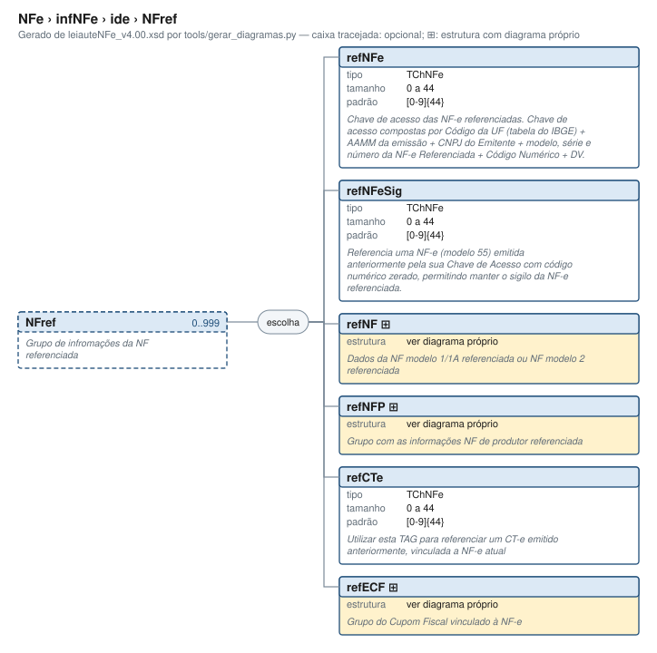

# NFref — documentos fiscais referenciados

[Manual](../../../README.md) › [NFe (diagrama)](../../../../diagramas/NFe.svg) › [infNFe (diagrama)](../../../../diagramas/NFe/infNFe.svg) › [ide, grupo pai (diagrama)](../../../../diagramas/NFe/infNFe/ide.svg) › NFref

<!-- estado-xsd:inicio -->
> **Estado: documentado.** Estrutura conferida contra a base XSD registrada. Base revisada: `c537394250f913b591f3984f1de2e9d1a1ec94d334a0086e7a41f9850f5f7917`. Base atual: `c537394250f913b591f3984f1de2e9d1a1ec94d334a0086e7a41f9850f5f7917`.
<!-- estado-xsd:fim -->

| Informação | Base conferida |
|---|---|
| Documento/modelo | NF-e modelo 55; NFC-e modelo 65 não admite NFref (BA01-10, rejeição 708) |
| Leiaute / XSD revisado e atual | NF-e 4.00 / PL010f v1.04, publicado em 31/08/2026 |
| Biblioteca | libnfe 1.0.0-rc4, commit `94aca18ee130df3070f8fe421c88d7f30b632a2d` |
| Última revisão | 2026-10-05 |
| Normas consultadas | MOC 7.0, Anexo I; NT 2022.003 v1.11; NT 2026.004 v1.01; NT 2025.002 v1.52 |

Caminho XML: `NFe/infNFe/ide/NFref`. Os ancestrais ainda não possuem página editorial; a navegação acima abre seus diagramas.

## Finalidade e quando preencher

Relaciona documentos fiscais à NF-e atual. Os dados de cada referência identificam o **documento anterior**, não a nova nota. Omita o grupo quando a operação não exigir referenciamento. A possibilidade de omissão no XSD não dispensa regras fiscais.

Na NT 2025.002 v1.52, B25-30 e B25-40 exigem exatamente uma referência para NF-e complementar (`finNFe=2`) e notas de crédito dos tipos 1, 3 e 4. B25-65 proíbe NFref para crédito do tipo 2. A escolha do documento e a aplicação das demais condições dependem da operação e das regras oficiais; não use uma referência fictícia para atender à cardinalidade.

**Devoluções:** o MOC 7.0 descreve referenciamento no nível da nota, mas a NT 2025.002 v1.52 altera esse fluxo. VC02-14 exige `det/DFeReferenciado/chaveAcesso` na devolução (`finNFe=4`), com implantação em produção adiada para **03/11/2026**. A observação da regra proíbe `refNFe` nesse fluxo; VC02-05 rejeita combinar referenciamento por item com NFref (1010). Não generalize o exemplo desta página para devoluções nem substitua automaticamente documentos antigos por uma chave eletrônica. Confira cronograma, condições e abrangência tributária na NT, especialmente suas páginas 6 e 69.

## Estrutura e escolha



[Abrir o diagrama](../../../../diagramas/NFe/infNFe/ide/NFref.svg).

O pai `ide` permite **0..999 ocorrências de NFref**. Cada ocorrência contém **exatamente uma** das seis alternativas abaixo; não há atributos. Os filhos de uma alternativa estruturada seguem a ordem do seu próprio XSD. Repetir o documento significa adicionar outro NFref, não dois ramos dentro do mesmo grupo. O limite 999 é estrutural; operações específicas podem admitir apenas uma referência.

| Alternativa | Documento / finalidade | Tipo XML e ocorrência no contexto | Acesso |
|---|---|---|---|
| `refNFe` | NF-e pela chave completa | `TChNFe`; 1..1 somente se selecionada | [Diagrama](../../../../diagramas/NFe/infNFe/ide/NFref.svg) |
| `refNFeSig` | Chave de NF-e com sigilo, conforme NT 2022.003 | `TChNFe`; 1..1 somente se selecionada | [Regra de sigilo](#validação-e-erros) |
| `refNF` | Nota modelo 1/1A (`01`) ou modelo 2 (`02`) | Grupo; 1..1 somente se selecionado | [Página dos seis campos](NFref/refNF.md) |
| `refNFP` | Nota fiscal de produtor | Grupo; 1..1 somente se selecionado | [Diagrama](../../../../diagramas/NFe/infNFe/ide/NFref/refNFP.svg) |
| `refCTe` | CT-e pela chave | `TChNFe`; 1..1 somente se selecionada | [Diagrama do pai](../../../../diagramas/NFe/infNFe/ide/NFref.svg) |
| `refECF` | Cupom fiscal de ECF | Grupo; 1..1 somente se selecionado | [Diagrama](../../../../diagramas/NFe/infNFe/ide/NFref/refECF.svg) |

`TChNFe` tem 44 caracteres: seis dígitos, doze caracteres `[0-9A-Z]`, vinte e seis dígitos. Os comprimentos e o padrão combinados impõem 44 posições; o XSD não calcula dígito verificador. Não remova zeros nem pontue a chave. Para `refNFeSig`, a NT 2022.003 determina zerar o código numérico da chave (`cNF`), condiciona o uso às regras de sigilo e não dispensa chave completa quando ela for exigida. O setter genérico não realiza essa transformação.

No exemplo adicional `refECF`, os filhos são `mod` (`2B`, `2C` ou `2D`), `nECF` (1 a 3 dígitos) e `nCOO` (1 a 6 dígitos), todos 1..1, nessa ordem. O exemplo demonstra escolha e repetição; não afirma que o uso de ECF é permitido em toda operação ou UF.

## API da libnfe

Headers: `<libnfe/ide.h>`, `<libnfe/grupo.h>`, `<libnfe/esquema.h>`, `<libnfe/refNF.h>` e, para chave eletrônica específica, `<libnfe/refNFe.h>`.

```c
nfe_ide *nfe_ide_new(void);
void nfe_ide_free(nfe_ide *ide);
int nfe_ide_add_refnf(nfe_ide *ide, struct refNF_s *nf);
int nfe_ide_add_refnfe(nfe_ide *ide, struct refNFe_s *nf);
int nfe_ide_add_nfref(nfe_ide *ide, nfe_grupo **nfref);
int nfe_ide_write_xml(xmlTextWriterPtr writer, const nfe_ide *ide);
int nfe_grupo_set(nfe_grupo *g, const char *caminho, const char *valor);
const char *nfe_grupo_get(const nfe_grupo *g, const char *caminho);
int nfe_grupo_valida(const nfe_grupo *g, const char *caminho,
                     const char *valor);
```

| Operação / argumentos C | Resultado e propriedade |
|---|---|
| `nfe_ide_new()` | Cria ide com valores padrão; NULL se faltar memória. Ainda requer os dados obrigatórios da identificação. |
| `nfe_ide_add_refnf(ide, nf)` / `add_refnfe` | Adiciona uma ocorrência no fim da lista. Sucesso 0 transfere a posse do objeto, sem cópia. Em falha, o chamador continua responsável por ele. Não anexar o mesmo ponteiro duas vezes. |
| `nfe_ide_add_nfref(ide, &grupo)` | Cria e anexa uma ocorrência vazia. Sucesso 0 devolve ponteiro emprestado, pertencente a ide; não liberar `grupo`. Em falha, o argumento de saída permanece inalterado. |
| `nfe_grupo_set(grupo, caminho, valor)` | Caminho relativo, por exemplo `refNF/mod`; copia o texto e verifica restrições lexicais. Selecionar outro ramo válido apaga o ramo anterior da mesma ocorrência. Valor inválido não altera o estado; NULL remove o campo. |
| `nfe_grupo_get(grupo, caminho)` | Texto interno emprestado ou NULL se não houver valor/caminho; não liberar. Reconsultar após mutações. |
| `nfe_grupo_valida(grupo, caminho, valor)` | Confere o valor sem preencher o grupo; não confirma que todos os obrigatórios foram informados. |
| `nfe_ide_write_xml(writer, ide)` | Escreve ide e suas referências na ordem de inclusão; 0 ou erro. No ramo genérico verifica escolha e campos obrigatórios; a API específica refNF tem as limitações descritas no filho. |
| `nfe_ide_free(ide)` | Aceita NULL e libera as referências anexadas, específicas e genéricas. |

As três funções de adição compartilham o limite `NFE_MAX_NFREF=999`. Retornam `E_ISNULL` com argumento obrigatório nulo, `E_VALOR` ao exceder o limite, `E_MALLOC` em falha de alocação. Não verificam duplicidade, completude ou regras fiscais ao anexar. Não há operação pública para retirar uma ocorrência de NFref da lista: se o preenchimento genérico falhar, corrija esse grupo ou descarte ide; não prossiga com ocorrência vazia.

Para uma nota completa, `nfe_nfe_set_ide` transfere ide à NF-e após sucesso; veja [gerar_nfe.c](../../../../../examples/gerar_nfe.c). Não libere novamente um ide cuja posse já foi transferida.

## Exemplo em C

O programa completo [referenciar_nf.c](../../../../../examples/referenciar_nf.c) verifica cada retorno, libera recursos em todos os caminhos e interrompe na primeira falha. Ele cria uma ocorrência refNF pela API específica e uma segunda ocorrência refECF pelo motor genérico. Execute na raiz do projeto:

```sh
make exemplos
./obj/referenciar_nf
./obj/referenciar_nf --generico
./obj/referenciar_nf --isolado
```

O modo `--generico` preenche os mesmos seis campos por caminhos `refNF/...` e produz exatamente o mesmo ide. O modo `--isolado` mostra quem abre e fecha NFref; é explicado na [página do filho](NFref/refNF.md). Com a libnfe instalada, compile o programa externo assim:

```sh
cc -std=c99 -Wall -Wextra examples/referenciar_nf.c $(pkg-config --cflags --libs libnfe) -o referenciar_nf
```

O carregador precisa localizar a biblioteca compartilhada instalada. O exemplo usa dados sintéticos e uma data fixa; não transmite documentos. O namespace atribuído ao fragmento não deve ser aplicado posteriormente a um documento já assinado.

## XML produzido

A saída integral está em [ide-referencias.xml](../../../exemplos/ide-referencias.xml). Este recorte contém as duas ocorrências efetivamente produzidas, na ordem de inclusão, e herda o namespace de ide:

```xml
<NFref xmlns="http://www.portalfiscal.inf.br/nfe">
  <refNF>
    <cUF>35</cUF>
    <AAMM>2609</AAMM>
    <CNPJ>12345678000195</CNPJ>
    <mod>01</mod>
    <serie>0</serie>
    <nNF>123</nNF>
  </refNF>
</NFref>
<NFref xmlns="http://www.portalfiscal.inf.br/nfe">
  <refECF>
    <mod>2D</mod>
    <nECF>1</nECF>
    <nCOO>456</nCOO>
  </refECF>
</NFref>
```

São fragmentos, não uma NF-e completa. A verificação dos exemplos valida o ide dentro do wrapper de testes que extrai sua definição do XSD oficial. Assinatura, autorização, existência dos documentos e regras fiscais não foram exercitadas.

## Validação e erros

| Situação | Camada / retorno confirmado | Correção |
|---|---|---|
| Duas alternativas no mesmo NFref | XSD rejeita `choice`; motor genérico troca o ramo anterior | Criar duas ocorrências quando a operação permitir |
| NFref vazio ou filho genérico incompleto | Escrita genérica: `E_VALOR`; XSD rejeita | Preencher uma alternativa completa |
| 1000 referências | Adição: `E_VALOR`; XSD rejeita | Respeitar o limite e a regra da operação |
| NFref em modelo 65 | Regra BA01-10: 708; implementada em `nfe_validar_xml` | Omitir NFref em NFC-e |
| Complementar/crédito especificado sem referência, ou com mais de uma | B25-30/40: 254/255; não implementadas pelo validador local | Conferir finalidade, tipo e exatamente uma referência |
| Crédito tipo 2 com NFref | B25-65: 1027; não implementada localmente | Omitir o referenciamento indevido |
| Referência por item junto com NFref | VC02-05: 1010; não implementada localmente | Usar o nível exigido para a operação |
| Sigilo inadequado ou chave inválida fiscalmente | Regras da NT 2022.003 / SEFAZ; formato XSD não basta | Conferir chave, condição de uso e regras da UF |

Os retornos negativos da API não são códigos `cStat` da SEFAZ. A validação XSD não determina se a referência é fiscalmente aceitável.

## Alterações e referências

| Assunto | Fonte / localização | Situação nesta base |
|---|---|---|
| Campos e escolha | [Leiaute XSD](../../../../../tests/schemas/nfe/leiauteNFe_v4.00.xsd), declaração NFref em ide; [tipos](../../../../../tests/schemas/nfe/tiposBasico_v4.00.xsd) | Autoridade estrutural atual |
| Significado dos documentos | MOC 7.0, Anexo I, grupo BA, pp. 11–12; BA01-10 | Complementado pelas NT posteriores |
| 500 → 999 e refNFeSig | NT 2022.003 v1.11, seções 2.1.1–2.1.2 | Incorporado ao XSD e limite da API |
| Chave/CNPJ alfanuméricos | NT 2026.004 v1.01, grupo BA | XSD permite letras maiúsculas nas posições especificadas |
| Complemento/crédito/devolução | NT 2025.002 v1.52, pp. 6, 31 e 69 | Conferir condições e cronograma; validador local parcial |

Fontes oficiais: [MOC 7.0 e anexos](https://www.nfe.fazenda.gov.br/portal/listaConteudo.aspx?tipoConteudo=33ol5hhSYZk=), [NT 2022.003 v1.11](https://www.nfe.fazenda.gov.br/portal/exibirArquivo.aspx?conteudo=%2FC5jc3RZhNQ%3D), [NT 2026.004 v1.01](https://www.nfe.fazenda.gov.br/portal/exibirArquivo.aspx?conteudo=BTZQzgsO9Ws%3D), [NT 2025.002 v1.52](https://www.nfe.fazenda.gov.br/portal/exibirArquivo.aspx?conteudo=HXPO8VLbh4o=), [pacote PL010f](https://www.nfe.fazenda.gov.br/portal/exibirArquivo.aspx?conteudo=8ITFuBLltXs=).

Código conferido: [ide.h](../../../../../include/libnfe/ide.h), [ide.c](../../../../../src/libnfe/ide.c), [grupo.h](../../../../../include/libnfe/grupo.h), [grupo.c](../../../../../src/libnfe/grupo.c), [test_ide.c](../../../../../tests/test_ide.c), [validar.c](../../../../../src/libnfe/validar.c) e [verificação do manual](../../../../../tests/verificar_manual.py).

Anterior: [índice](../../../README.md) | Pai: [ide (diagrama)](../../../../diagramas/NFe/infNFe/ide.svg) | Próximo: [refNF](NFref/refNF.md)
