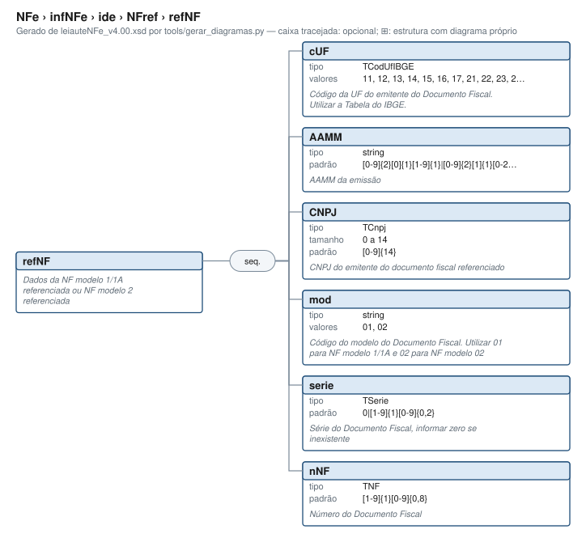

# refNF — nota fiscal não eletrônica referenciada

[Manual](../../../../README.md) › [NFref, grupo pai](../NFref.md) › refNF

<!-- estado-xsd:inicio -->
> **Estado: documentado.** Estrutura conferida contra a base XSD registrada. Base revisada: `c537394250f913b591f3984f1de2e9d1a1ec94d334a0086e7a41f9850f5f7917`. Base atual: `c537394250f913b591f3984f1de2e9d1a1ec94d334a0086e7a41f9850f5f7917`.
<!-- estado-xsd:fim -->

| Informação | Base conferida |
|---|---|
| Documento/modelo | NF-e modelo 55; NFC-e modelo 65 não admite NFref (BA01-10, rejeição 708) |
| Leiaute / XSD revisado e atual | NF-e 4.00 / PL010f v1.04, publicado em 31/08/2026 |
| Biblioteca | libnfe 1.0.0-rc4, commit `94aca18ee130df3070f8fe421c88d7f30b632a2d` |
| Última revisão | 2026-10-05 |
| Normas consultadas | MOC 7.0, Anexo I; NT 2022.003 v1.11; NT 2026.004 v1.01; NT 2025.002 v1.52 |

Caminho XML: `NFe/infNFe/ide/NFref/refNF`.

## Finalidade e quando preencher

Identifica uma nota fiscal anterior sem chave eletrônica, pelos dados de seu emitente e documento. Use `mod=01` para nota modelo 1/1A e `mod=02` para nota modelo 2, conforme o domínio do XSD. Para NF-e com chave, use a alternativa refNFe; para nota de produtor, confira refNFP. A inclusão de refNF depende da operação e da legislação aplicável; esta página não autoriza referenciar qualquer documento em qualquer finalidade.

Todos os campos pertencem à **nota referenciada**. O CNPJ não é automaticamente o emitente da nova NF-e. A opção refNF ocupa uma das escolhas de NFref; consulte as [restrições fiscais e a transição das devoluções](../NFref.md#finalidade-e-quando-preencher) antes de escolher o nível de referência.

## Estrutura e campos



[Abrir o diagrama](../../../../../diagramas/NFe/infNFe/ide/NFref/refNF.svg).

Uma ocorrência de refNF contém os seis campos abaixo, **nessa ordem**, sem atributos. Cada campo ocorre 1..1 quando a alternativa refNF é selecionada. Isso não torna refNF obrigatório em toda NF-e; quem repete é NFref (0..999 no pai).

| Tag / ID | Significado | Tipo XML | Ocorrência | Formato e limites | Condição |
|---|---|---|---|---|---|
| `cUF` / BA04 | UF do emitente da nota anterior | `TCodUfIBGE` | 1..1 | Dois dígitos, enumeração IBGE abaixo | Sempre na alternativa refNF |
| `AAMM` / BA05 | Ano e mês de emissão anterior | `xs:string` restrito | 1..1 | Quatro dígitos: ano 00..99, mês 01..12 | Sempre; não contém dia |
| `CNPJ` / BA06 | CNPJ do emitente anterior | `TCnpj` | 1..1 | 14 caracteres; `[0-9A-Z]{12}[0-9]{2}` | Sempre; sem pontuação ou minúsculas |
| `mod` / BA07 | Modelo da nota anterior | `xs:string` restrito | 1..1 | `01` = modelo 1/1A; `02` = modelo 2 | Sempre; não usar `55` |
| `serie` / BA08 | Série da nota anterior | `TSerie` | 1..1 | `0` ou 1..999, sem zeros iniciais | `0` quando não houver série |
| `nNF` / BA09 | Número da nota anterior | `TNF` | 1..1 | 1..999999999, sem zeros iniciais | Sempre; zero não é número válido |

Domínio de cUF: 11 RO, 12 AC, 13 AM, 14 RR, 15 PA, 16 AP, 17 TO, 21 MA, 22 PI, 23 CE, 24 RN, 25 PB, 26 PE, 27 AL, 28 SE, 29 BA, 31 MG, 32 ES, 33 RJ, 35 SP, 41 PR, 42 SC, 43 RS, 50 MS, 51 MT, 52 GO e 53 DF.

Restrições efetivas: AAMM usa `[0-9]{2}[0]{1}[1-9]{1}|[0-9]{2}[1]{1}[0-2]{1}`; serie usa `0|[1-9]{1}[0-9]{0,2}`; nNF usa `[1-9]{1}[0-9]{0,8}`. O padrão e `maxLength=14` de TCnpj impõem 14 posições. Os tipos preservam espaços: não há limpeza automática. Campo ausente, campo vazio e o valor `0` são situações distintas; série `0` é válida, nNF `0` não é.

`AAMM=2609` significa setembro de um ano terminado em 26; o campo não transporta o século. O XSD confere formato, mas não verifica data futura, existência da nota nem dígitos verificadores do CNPJ.

## API C e contratos

Header: `<libnfe/refNF.h>`. As assinaturas abaixo conservam os nomes e tipos públicos:

```c
struct refNF_s *RefNFNew();
void RefNFDel(struct refNF_s *nf);
int RefNFSetcUF(struct refNF_s *nf, nfe_uf uf);
const char *RefNFGetcUF(const struct refNF_s *nf);
int RefNFSetAAMM(struct refNF_s *nf, const int ano, nfe_mes mes);
const char *RefNFGetAAMM(const struct refNF_s *nf);
int RefNFSetCNPJ(struct refNF_s *nf, const char *cnpj);
const char *RefNFGetCNPJ(const struct refNF_s *nf);
int RefNFSetmod(struct refNF_s *nf, const char *mod);
const char *RefNFGetmod(const struct refNF_s *nf);
int RefNFSetSerie(struct refNF_s *nf, const char *serie);
const char *RefNFGetSerie(const struct refNF_s *nf);
int RefNFSetnNF(struct refNF_s *nf, const char *nnf);
const char *RefNFGetnNF(const struct refNF_s *nf);
int xmlGenRefNFNode(xmlTextWriterPtr writer, const struct refNF_s *nf);
```

| Função / argumentos C | Conversão e validação efetiva |
|---|---|
| `RefNFNew()` | Aloca objeto vazio; NULL em falta de memória. Todos os getters começam em `""`. |
| `SetcUF(nf, uf)` | Recebe enum nfe_uf e escreve dois dígitos. Confere somente a faixa 11..53; um cast para 18 passa na API, mas é rejeitado pelo XSD. Use as constantes de UF. |
| `SetAAMM(nf, ano, mes)` | ano 0..99 e enum de mês 1..12; formata ambos com dois dígitos. `(26, NFE_MES_SETEMBRO)` → `2609`; ano 2026 retorna E_VALOR. Não compara com a data atual. |
| `SetCNPJ(nf, cnpj)` | Texto de 14 caracteres; valida posições alfanuméricas maiúsculas, dígitos finais e cálculo do DV; rejeita sequências repetidas. Copia o texto, sem pontuar ou normalizar. |
| `Setmod(nf, mod)` | Confere apenas comprimento de dois caracteres. Pode aceitar `55`, que o XSD rejeita nesta alternativa. |
| `SetSerie(nf, serie)` | Confere comprimento 1..3, não o padrão numérico. Pode aceitar `01` ou `abc`, ambos inválidos no XSD. |
| `SetnNF(nf, nnf)` | Confere comprimento 1..9, não o padrão numérico. Pode aceitar `0` ou `0123`, inválidos no XSD. |
| Getters | Ponteiro emprestado ao texto interno; `""` se campo não preenchido, NULL se nf for NULL. Não liberar; o conteúdo muda com setter e deixa de existir após liberação. |
| `xmlGenRefNFNode(writer, nf)` | Escreve `<refNF>` e os seis filhos, escapando texto XML. Não escreve NFref, não atribui namespace e não verifica completude nem regras fiscais. |
| `RefNFDel(nf)` | Libera o objeto; aceita NULL. Não chamar depois de transferir a posse ao ide. |

Setters retornam 0 no sucesso, `E_ISNULL` (-1) para ponteiro obrigatório nulo, `E_TAMANHO` (-2) para comprimento inválido e `E_VALOR` (-3) para valor recusado pelas verificações descritas. Falhas preservam o campo anterior. Os setters de texto copiam os dados; o chamador pode reutilizar seu buffer depois do sucesso. Não removem espaços ou zeros. A serialização retorna 0, `E_ISNULL` ou `E_XML` (-4); uma falha de escrita pode deixar saída parcial, que deve ser descartada.

### Integração e propriedade

Preencha os seis campos antes de `nfe_ide_add_refnf(ide, ref)`. Sucesso transfere a posse ao ide; então atribua NULL à variável local usada na limpeza. Em falha de adição, libere ref por RefNFDel. `nfe_ide_free` libera os filhos anexados. O [exemplo completo](../../../../../../examples/referenciar_nf.c) aplica esse contrato em todos os caminhos.

A alternativa genérica usa `nfe_ide_add_nfref(ide, &grupo)` e `nfe_grupo_set(grupo, "refNF/cUF", "35")`, seguido de AAMM, CNPJ, mod, serie e nNF. O grupo já pertence ao ide. Essa API verifica domínio e padrões XSD, mas **não calcula o DV de CNPJ**. Não confunda sua validação lexical com a validação mais forte de RefNFSetCNPJ. Ao selecionar outro ramo válido no mesmo grupo, refNF e seus campos são apagados; para outra referência, crie outro NFref.

## Exemplo C compilável e XML

Use [referenciar_nf.c](../../../../../../examples/referenciar_nf.c), que inclui headers, tratamento de cada erro e limpeza comum. [Compilação e modos de execução](../NFref.md#exemplo-em-c). Os valores preenchidos são:

```c
/* Recorte do programa completo; CONFERE interrompe na primeira falha. */
CONFERE(RefNFSetcUF(ref, NFE_UF_SP));
CONFERE(RefNFSetAAMM(ref, 26, NFE_MES_SETEMBRO));
CONFERE(RefNFSetCNPJ(ref, "12345678000195"));
CONFERE(RefNFSetmod(ref, "01"));
CONFERE(RefNFSetSerie(ref, "0"));
CONFERE(RefNFSetnNF(ref, "123"));
```

O modo `--isolado` abre `<NFref>`, chama `xmlGenRefNFNode` e fecha o pai. Atribui depois o namespace ao fragmento não assinado para permitir sua leitura e validação no contexto de testes. A saída é [nfref-isolado.xml](../../../../exemplos/nfref-isolado.xml):

```xml
<NFref xmlns="http://www.portalfiscal.inf.br/nfe">
  <refNF>
    <cUF>35</cUF>
    <AAMM>2609</AAMM>
    <CNPJ>12345678000195</CNPJ>
    <mod>01</mod>
    <serie>0</serie>
    <nNF>123</nNF>
  </refNF>
</NFref>
```

Este fragmento não tem declaração global no schema oficial: a checagem o insere no ide de teste e valida esse contexto. O modo padrão demonstra a integração real ao pai ide; o modo `--generico` produz os mesmos valores e ordem. Os dados são sintéticos; não representam documento emitido, assinado ou autorizado.

## Validação e regras de negócio

| Situação | Onde é detectada / retorno | Correção |
|---|---|---|
| Ano 2026 em SetAAMM | Setter: E_VALOR | Passar 26 e mês válido |
| CNPJ com DV incorreto | SetCNPJ: E_VALOR; XSD e setter genérico não calculam DV | Conferir a identificação real e validar DV |
| mod 55, UF 18, série 01 ou nNF 0 | API específica pode aceitar; XSD rejeita | Usar domínio e representação canônica da tabela |
| Um dos seis campos omitido | Writer específico pode emitir campo vazio; XSD rejeita; writer genérico retorna E_VALOR | Preencher todos antes de anexar/serializar |
| Data futura ou mais de 20 anos para modelo 1 | BA05-10, rejeição 317, facultativa por autorizador; não implementada localmente | Conferir emissão original e regra aplicável |
| CNPJ inválido da nota anterior | BA06-10, rejeição 548, facultativa; SetCNPJ cobre seu DV | Não tratar êxito do XSD como CNPJ válido |
| Duplicidade de CNPJ/modelo/série/número | BA03-10, rejeição 681, facultativa; não implementada localmente | Eliminar duplicidade de referências |

As três últimas condições vêm do MOC 7.0, Anexo I, p. 79; a aplicabilidade facultativa não significa validação pelo setter. Consulte também as alterações de finalidade/referenciamento da NT 2025.002 v1.52 na página do pai. Regras fiscais e seus prazos não são deduzidos do XSD.

## Alterações e referências

- **Base histórica:** MOC 7.0, Anexo I, grupo BA, pp. 11–12 (BA03–BA09), p. 79 (BA03-10, BA05-10 e BA06-10). [Documentação oficial MOC e anexos](https://www.nfe.fazenda.gov.br/portal/listaConteudo.aspx?tipoConteudo=33ol5hhSYZk=).
- **Estrutura atual:** [leiauteNFe_v4.00.xsd](../../../../../../tests/schemas/nfe/leiauteNFe_v4.00.xsd), [tiposBasico_v4.00.xsd](../../../../../../tests/schemas/nfe/tiposBasico_v4.00.xsd), [origem e versão dos schemas](../../../../../../tests/schemas/README.md), pacote [PL010f](https://www.nfe.fazenda.gov.br/portal/exibirArquivo.aspx?conteudo=8ITFuBLltXs=).
- **CNPJ:** [NT 2026.004 v1.01](https://www.nfe.fazenda.gov.br/portal/exibirArquivo.aspx?conteudo=BTZQzgsO9Ws%3D), grupo BA; padrão alfanumérico incorporado no XSD atual. A forma lexical aceita no schema não determina disponibilidade cadastral de cada CNPJ.
- **Limite/escolha:** [NT 2022.003 v1.11](https://www.nfe.fazenda.gov.br/portal/exibirArquivo.aspx?conteudo=%2FC5jc3RZhNQ%3D), seções 2.1.1–2.1.2; [NT 2025.002 v1.52](https://www.nfe.fazenda.gov.br/portal/exibirArquivo.aspx?conteudo=HXPO8VLbh4o=), condições e vigência de referenciamento.
- **API efetiva:** [refNF.h](../../../../../../include/libnfe/refNF.h), [refNF.c](../../../../../../src/libnfe/refNF.c), [cnpj.c](../../../../../../src/libnfe/cnpjcpf.c), [ide.c](../../../../../../src/libnfe/ide.c), [grupo.c](../../../../../../src/libnfe/grupo.c), [test_ide.c](../../../../../../tests/test_ide.c), [checagem dos exemplos](../../../../../../tests/verificar_manual.py).

Anterior / pai: [NFref](../NFref.md) | Próximo: [índice para outras estruturas](../../../../README.md)
