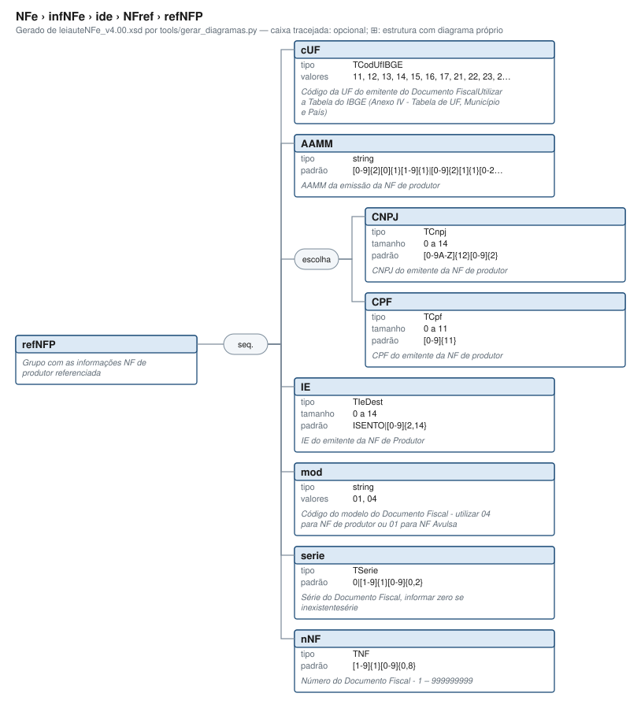

# refNFP — Grupo com as informações NF de produtor referenciada

[Manual](../../../../README.md) › [NFe](../../../../NFe.md) › [infNFe](../../../infNFe.md) › [ide](../../ide.md) › [NFref](../NFref.md) › refNFP

<!-- estado-xsd:inicio -->
> **Estado: documentado.** Estrutura conferida contra a base XSD registrada.
>
> `Base atual e revisada: c537394250f913b591f3984f1de2e9d1a1ec94d334a0086e7a41f9850f5f7917`
<!-- estado-xsd:fim -->

| Informação | Base conferida |
|---|---|
| Caminho XML | `NFe/infNFe/ide/NFref/refNFP` |
| Leiaute / pacote XSD | NF-e/NFC-e 4.00 / PL010f v1.04, 31/08/2026 |
| Biblioteca conferida | libnfe 1.0.0-rc4, commit `1dd412eebca80dd80d884b3f03a1a31cfaf42279` |
| Revisão | 2026-10-05 |
| Contexto no leiaute | `1..1` no pai, sujeito às sequências e escolhas abaixo |

## Finalidade e quando preencher

A identificação descreve a operação atual: modelo, finalidade, ambiente, local, datas e numeração. Esses dados participam da chave de acesso. Defina-os antes de gerar a chave e assinar; alterações posteriores exigem nova geração e assinatura.

A NT 2026.007 v1.10 distingue o contribuinte exclusivo do IBS/CBS, incluindo ausência de IE do emitente e direcionamento à SVRS em condições específicas. O XSD permite IE opcional; esse fato, isoladamente, não seleciona o autorizador nem dispensa as verificações cadastrais. A produção está prevista para 03/11/2026.

Descrição e observações do XSD adotado: Grupo com as informações NF de produtor referenciada. A estrutura e as restrições são as do pacote indicado; notas históricas de uso devem ser lidas junto às atualizações listadas nas referências.

## Estrutura, ordem e escolhas



[Abrir o diagrama](../../../../../diagramas/NFe/infNFe/ide/NFref/refNFP.svg).

Uma ocorrência `1..1` dentro de uma alternativa exige o campo quando essa alternativa é selecionada; não obriga selecionar esse ramo em toda nota. Grupos opcionais podem conter filhos obrigatórios. Os elementos de sequência seguem a ordem indicada.

- **Sequência** `1..1`
  - `cUF` `1..1`
  - `AAMM` `1..1`
  - **Escolha exclusiva** `1..1`
    - `CNPJ` `1..1`
    - `CPF` `1..1`
  - `IE` `1..1`
  - `mod` `1..1`
  - `serie` `1..1`
  - `nNF` `1..1`

## Campos e atributos

| Tag / atributo | Significado e observações | Tipo XML | Ocorrência | Formato / limites | Condição no contexto |
|---|---|---|---|---|---|
| `cUF` | Código da UF do emitente do Documento FiscalUtilizar a Tabela do IBGE (Anexo IV - Tabela de UF, Município e País) | `TCodUfIBGE` | `1..1` | Domínio: `11`, `12`, `13`, `14`, `15`, `16`, `17`, `21`, `22`, `23`, `24`, `25`, `26`, `27`, `28`, `29`, `31`, `32`, `33`, `35`, `41`, `42`, `43`, `50`, `51`, `52`, `53`<br>Tratamento de espaços: preserve | Obrigatório no contexto |
| `AAMM` | AAMM da emissão da NF de produtor | `string` | `1..1` | Padrão: `[0-9]{2}[0]{1}[1-9]{1}\|[0-9]{2}[1]{1}[0-2]{1}`<br>Tratamento de espaços: preserve | Obrigatório no contexto |
| `CNPJ` | CNPJ do emitente da NF de produtor | `TCnpj` | `1..1` | Máximo: 14<br>Padrão: `[0-9A-Z]{12}[0-9]{2}`<br>Tratamento de espaços: preserve | Obrigatório no contexto; apenas na alternativa selecionada |
| `CPF` | CPF do emitente da NF de produtor | `TCpf` | `1..1` | Máximo: 11<br>Padrão: `[0-9]{11}`<br>Tratamento de espaços: preserve | Obrigatório no contexto; apenas na alternativa selecionada |
| `IE` | IE do emitente da NF de Produtor | `TIeDest` | `1..1` | Máximo: 14<br>Padrão: `ISENTO\|[0-9]{2,14}`<br>Tratamento de espaços: preserve | Obrigatório no contexto |
| `mod` | Código do modelo do Documento Fiscal - utilizar 04 para NF de produtor ou 01 para NF Avulsa | `string` | `1..1` | Domínio: `01`, `04`<br>Tratamento de espaços: preserve | Obrigatório no contexto |
| `serie` | Série do Documento Fiscal, informar zero se inexistentesérie | `TSerie` | `1..1` | Padrão: `0\|[1-9]{1}[0-9]{0,2}`<br>Tratamento de espaços: preserve | Obrigatório no contexto |
| `nNF` | Número do Documento Fiscal - 1 – 999999999 | `TNF` | `1..1` | Padrão: `[1-9]{1}[0-9]{0,8}`<br>Tratamento de espaços: preserve | Obrigatório no contexto |

Campos decimais usam o separador `.` e a precisão indicada pelo tipo; preservar a representação textual evita perda por ponto flutuante. Ausência, texto vazio e zero são valores distintos. Padrões, comprimentos e enumerações precisam ser atendidos em conjunto; valores de códigos com zeros significativos devem conservar esses zeros. Campos de mesmo nome em outros pais têm contexto próprio.

## API C, integração e memória

Obtenha uma ocorrência por `nfe_ide_add_nfref(ide, &grupo)`; o ponteiro pertence ao ide. Um novo documento exige outra ocorrência, conforme a página de NFref.

[Contrato público de ide.h](../../../../api/ide.md) apresenta assinaturas, argumentos, retornos e limitações. [Convenções de memória e erros](../../../../API.md) explica cópia, empréstimo e transferência de posse.

Ao usar um grupo emprestado, libere o objeto proprietário, nunca o grupo separadamente. Os setters de texto copiam seus valores; getters retornam texto interno emprestado. A escolha de outro ramo válido pode apagar o anterior. Os campos obrigatórios do motor são conferidos na escrita; validar um valor isolado não prova completude do grupo. Os contratos específicos prevalecem quando a função indicada não usa o motor.

## Exemplo C conferido

[Fonte completo do cenário teste_nfref_generico](../../../../../../tests/test_ide.c) contém o preenchimento, a conferência dos retornos e a liberação dos recursos. O cenário integra o programa de testes indicado, com os headers e apoios do repositório. O XML foi observado na serialização desse cenário e validado, não deduzido de um desenho.

```sh
make obj/test_ide
./obj/test_ide tests
```

A função abaixo é o cenário completo do teste, incluindo tratamento dos retornos e eventuais verificações de erros. O XML publicado foi observado na validação da linha **599** do fonte indicado; a função pode exercitar outras alterações antes/depois desse ponto.

<details>
<summary>Função C completa do cenário teste_nfref_generico</summary>

```c
static void teste_nfref_generico(void)
{
	nfe_ide *ide = novo(NFE_SEM_DATA, NFE_EMISSAO_NORMAL, NFE_TZD_BRASILIA);
	struct refNFe_s *r = RefNFeNew();
	nfe_grupo *nfp, *ecf, *cte, *vazio;
	char *xml;
	int rc = 0;

	rc |= RefNFeSetrefNFe(r, CHAVE);
	rc |= nfe_ide_add_refnfe(ide, r);
	rc |= nfe_ide_add_nfref(ide, &nfp);
	rc |= nfe_grupo_set(nfp, "refNFP/cUF", "35");
	rc |= nfe_grupo_set(nfp, "refNFP/AAMM", "2609");
	rc |= nfe_grupo_set(nfp, "refNFP/CPF", "12345678909");
	rc |= nfe_grupo_set(nfp, "refNFP/IE", "ISENTO");
	rc |= nfe_grupo_set(nfp, "refNFP/mod", "04");
	rc |= nfe_grupo_set(nfp, "refNFP/serie", "1");
	rc |= nfe_grupo_set(nfp, "refNFP/nNF", "123");
	rc |= nfe_ide_add_nfref(ide, &ecf);
	rc |= nfe_grupo_set(ecf, "refECF/mod", "2D");
	rc |= nfe_grupo_set(ecf, "refECF/nECF", "1");
	rc |= nfe_grupo_set(ecf, "refECF/nCOO", "456");
	rc |= nfe_ide_add_nfref(ide, &cte);
	rc |= nfe_grupo_set(cte, "refCTe", CHAVE);
	VERIFICA_INT(rc, 0);
	xml = gera(ide);
	VERIFICA(xml != NULL);
	if (xml) {
		VERIFICA(strstr(xml, "<NFref><refNFe>" CHAVE "</refNFe></NFref>"
		                     "<NFref><refNFP><cUF>35</cUF>") != NULL);
		VERIFICA(strstr(xml, "<CPF>12345678909</CPF><IE>ISENTO</IE>") !=
		         NULL);
		VERIFICA(strstr(xml,
		                "<NFref><refECF><mod>2D</mod><nECF>1</nECF>"
		                "<nCOO>456</nCOO></refECF></NFref><NFref>"
		                "<refCTe>") != NULL);
		VERIFICA_INT(valida(xml, 1), 0);
	}
	free(xml);

	/* NFref vazio não é aceito na geração */
	VERIFICA_INT(nfe_ide_add_nfref(ide, &vazio), 0);
	xml = gera(ide);
	VERIFICA(xml == NULL);
	free(xml);
	VERIFICA_INT(nfe_ide_add_nfref(NULL, &vazio), E_ISNULL);
	VERIFICA_INT(nfe_ide_add_nfref(ide, NULL), E_ISNULL);
	nfe_ide_free(ide);
}
```

</details>

## XML correspondente

Trecho do cenário acima, com namespace preservado. [XML completo do cenário](../../../../exemplos/grupos/test_ide-0015.xml) permite conferir valores e ancestrais. Dados sintéticos; este exemplo comprova estrutura e uso da API, sem transmissão, autorização ou validação de enquadramento fiscal.

```xml
<refNFP xmlns="http://www.portalfiscal.inf.br/nfe">
  <cUF>35</cUF>
  <AAMM>2609</AAMM>
  <CPF>12345678909</CPF>
  <IE>ISENTO</IE>
  <mod>04</mod>
  <serie>1</serie>
  <nNF>123</nNF>
</refNFP>

```

O fragmento é validado no contexto que o declara no leiaute, com namespace e ancestrais. O wrapper tipos_v4.00.xsd, quando usado nos testes, extrai essas declarações do schema oficial e é identificado como apoio de testes, sem substituir o pacote oficial.

## Validação, erros e limites

| Situação | Etapa / resultado | Tratamento |
|---|---|---|
| Ponteiro obrigatório nulo | API: `E_ISNULL` (-1), conforme contrato da função | Conferir criação e argumentos |
| Texto fora do comprimento | Setter/motor: `E_TAMANHO` (-2) | Usar os limites do tipo e do argumento C |
| Domínio, padrão ou caminho inválido/ambíguo | Setter/motor: `E_VALOR` (-3) | Corrigir o valor e usar caminho completo |
| Campo obrigatório ou escolha incompleta | Escrita do motor: `E_VALOR`; XSD rejeita | Completar o ramo selecionado |
| Falha de escrita XML | Writer: `E_XML` (-4) | Descartar saída parcial e tratar a falha |
| Falta de memória | Criação: NULL; operações que alocam podem retornar `E_MALLOC` (-101) | Encerrar com limpeza dos recursos ainda próprios |
| Regra fiscal, cadastro, cálculo ou vigência | Pode ser aceito lexicalmente; depende da regra e do autorizador | Conferir fontes e contratos; não confundir 0 com autorização |

Os códigos negativos são da biblioteca, não códigos cStat. [Validação e regras implementadas](../../../../VALIDACAO.md) distingue XSD, verificações locais e retorno da SEFAZ. A referência da API identifica exceções aos comportamentos gerais desta tabela.

## Referências e grupos relacionados

- XSD atual: [leiaute](../../../../../../tests/schemas/nfe/leiauteNFe_v4.00.xsd), [tipos básicos](../../../../../../tests/schemas/nfe/tiposBasico_v4.00.xsd) e [tipos DFe/RTC](../../../../../../tests/schemas/nfe/DFeTiposBasicos_v1.00.xsd).
- MOC 7.0, Anexo I: B, pp. 8–11. [Fontes oficiais, versões e transições](../../../../BASES.md) relaciona atualizações posteriores, com vigência separada da publicação.
- API: [ide.h](../../../../../../include/libnfe/ide.h) e [referência das funções](../../../../api/ide.md).
- Grupo pai: [NFref](../NFref.md).

Anterior: [refNF](refNF.md) | Próximo: [refECF](refECF.md)
