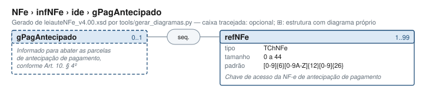

# gPagAntecipado — Informado para abater as parcelas de antecipação de pagamento, conforme Art

[Manual](../../../README.md) › [NFe](../../../NFe.md) › [infNFe](../../infNFe.md) › [ide](../ide.md) › gPagAntecipado

<!-- estado-xsd:inicio -->
> **Estado: documentado.** Estrutura conferida contra a base XSD registrada.
>
> `Base atual e revisada: c537394250f913b591f3984f1de2e9d1a1ec94d334a0086e7a41f9850f5f7917`
<!-- estado-xsd:fim -->

| Informação | Base conferida |
|---|---|
| Caminho XML | `NFe/infNFe/ide/gPagAntecipado` |
| Leiaute / pacote XSD | NF-e/NFC-e 4.00 / PL010f v1.04, 31/08/2026 |
| Biblioteca conferida | libnfe 1.0.0-rc4, commit `1dd412eebca80dd80d884b3f03a1a31cfaf42279` |
| Revisão | 2026-10-05 |
| Contexto no leiaute | `0..1` no pai, sujeito às sequências e escolhas abaixo |

## Finalidade e quando preencher

A identificação descreve a operação atual: modelo, finalidade, ambiente, local, datas e numeração. Esses dados participam da chave de acesso. Defina-os antes de gerar a chave e assinar; alterações posteriores exigem nova geração e assinatura.

A NT 2026.007 v1.10 distingue o contribuinte exclusivo do IBS/CBS, incluindo ausência de IE do emitente e direcionamento à SVRS em condições específicas. O XSD permite IE opcional; esse fato, isoladamente, não seleciona o autorizador nem dispensa as verificações cadastrais. A produção está prevista para 03/11/2026.

Descrição e observações do XSD adotado: Informado para abater as parcelas de antecipação de pagamento, conforme Art. 10. § 4º. A estrutura e as restrições são as do pacote indicado; notas históricas de uso devem ser lidas junto às atualizações listadas nas referências.

## Estrutura, ordem e escolhas



[Abrir o diagrama](../../../../diagramas/NFe/infNFe/ide/gPagAntecipado.svg).

Uma ocorrência `1..1` dentro de uma alternativa exige o campo quando essa alternativa é selecionada; não obriga selecionar esse ramo em toda nota. Grupos opcionais podem conter filhos obrigatórios. Os elementos de sequência seguem a ordem indicada.

- **Sequência** `1..1`
  - `refNFe` `1..99`

## Campos e atributos

| Tag / atributo | Significado e observações | Tipo XML | Ocorrência | Formato / limites | Condição no contexto |
|---|---|---|---|---|---|
| `refNFe` | Chave de acesso da NF-e de antecipação de pagamento | `TChNFe` | `1..99` | Máximo: 44<br>Padrão: `[0-9]{6}[0-9A-Z]{12}[0-9]{26}`<br>Tratamento de espaços: preserve | Obrigatório no contexto |

Campos decimais usam o separador `.` e a precisão indicada pelo tipo; preservar a representação textual evita perda por ponto flutuante. Ausência, texto vazio e zero são valores distintos. Padrões, comprimentos e enumerações precisam ser atendidos em conjunto; valores de códigos com zeros significativos devem conservar esses zeros. Campos de mesmo nome em outros pais têm contexto próprio.

## API C, integração e memória

Acrescente cada chave por `nfe_ide_add_pagantecipado`; a biblioteca copia o texto e confere DV, tamanho e limite 99. `nfe_ide_remove_pagantecipado` remove todas as referências. Não confundir o grupo da identificação com a informação de pagamento no grupo pag.

Este grupo usa os objetos e funções específicos do módulo `ide.h`. O contrato completo abaixo identifica os argumentos, a ligação ao pai, a serialização e a liberação. O exemplo indicado usa essas funções; o motor genérico não é um substituto automático para esse objeto.

[Contrato público de ide.h](../../../api/ide.md) apresenta assinaturas, argumentos, retornos e limitações. [Convenções de memória e erros](../../../API.md) explica cópia, empréstimo e transferência de posse.

Ao usar um grupo emprestado, libere o objeto proprietário, nunca o grupo separadamente. Os setters de texto copiam seus valores; getters retornam texto interno emprestado. A escolha de outro ramo válido pode apagar o anterior. Os campos obrigatórios do motor são conferidos na escrita; validar um valor isolado não prova completude do grupo. Os contratos específicos prevalecem quando a função indicada não usa o motor.

## Exemplo C conferido

[Fonte completo do cenário teste_compragov_pagantecipado](../../../../../tests/test_ide.c) contém o preenchimento, a conferência dos retornos e a liberação dos recursos. O cenário integra o programa de testes indicado, com os headers e apoios do repositório. O XML foi observado na serialização desse cenário e validado, não deduzido de um desenho.

```sh
make obj/test_ide
./obj/test_ide tests
```

A função abaixo é o cenário completo do teste, incluindo tratamento dos retornos e eventuais verificações de erros. O XML publicado foi observado na validação da linha **505** do fonte indicado; a função pode exercitar outras alterações antes/depois desse ponto.

<details>
<summary>Função C completa do cenário teste_compragov_pagantecipado</summary>

```c
static void teste_compragov_pagantecipado(void)
{
	nfe_ide *ide = novo(NFE_SEM_DATA, NFE_EMISSAO_NORMAL, NFE_TZD_BRASILIA);
	char *xml;
	int i, rc = 0;

	VERIFICA(ide != NULL);
	if (!ide)
		return;

	/* Valores recusados */
	VERIFICA_INT(nfe_ide_set_compragov(
	                     ide, (nfe_ente_gov)7, "10.00",
	                     NFE_OPER_GOV_PAGAMENTO_FORNECIMENTO_POSTERIOR),
	             E_VALOR);
	VERIFICA_INT(nfe_ide_set_compragov(ide, NFE_ENTE_GOV_UNIAO, "10.00",
	                                   (nfe_oper_gov)5),
	             E_VALOR);
	VERIFICA_INT(nfe_ide_set_compragov(
	                     ide, NFE_ENTE_GOV_UNIAO, "10,00",
	                     NFE_OPER_GOV_PAGAMENTO_FORNECIMENTO_POSTERIOR),
	             E_VALOR);
	VERIFICA_INT(nfe_ide_set_compragov(
	                     ide, NFE_ENTE_GOV_UNIAO, "10.5",
	                     NFE_OPER_GOV_PAGAMENTO_FORNECIMENTO_POSTERIOR),
	             E_VALOR);
	VERIFICA_INT(nfe_ide_set_compragov(
	                     ide, NFE_ENTE_GOV_UNIAO, "1000",
	                     NFE_OPER_GOV_PAGAMENTO_FORNECIMENTO_POSTERIOR),
	             E_VALOR);
	VERIFICA_INT(nfe_ide_set_compragov(
	                     ide, NFE_ENTE_GOV_UNIAO, NULL,
	                     NFE_OPER_GOV_PAGAMENTO_FORNECIMENTO_POSTERIOR),
	             E_ISNULL);
	/* refDFeAnt sem o grupo gCompraGov */
	VERIFICA_INT(nfe_ide_add_compragov_refdfeant(ide, CHAVE), E_VALOR);
	/* chave com dígito verificador errado ou curta */
	VERIFICA_INT(
	        nfe_ide_add_pagantecipado(
	                ide, "35100812345678000195550010000000421123456782"),
	        E_VALOR);
	VERIFICA_INT(nfe_ide_add_pagantecipado(ide, "3510081234"), E_TAMANHO);
	VERIFICA_INT(nfe_ide_add_pagantecipado(ide, NULL), E_ISNULL);

	/* Fornecimento com pagamento já realizado: uma ou mais chaves */
	VERIFICA_INT(nfe_ide_set_compragov(
	                     ide, NFE_ENTE_GOV_MUNICIPIO, "12.50",
	                     NFE_OPER_GOV_FORNECIMENTO_PAGAMENTO_REALIZADO),
	             0);
	xml = gera(ide); /* sem chave: recusado */
	VERIFICA(xml == NULL);
	free(xml);
	VERIFICA_INT(nfe_ide_add_compragov_refdfeant(ide, CHAVE), 0);
	VERIFICA_INT(nfe_ide_add_compragov_refdfeant(ide, CHAVE3), 0);
	VERIFICA_INT(nfe_ide_add_pagantecipado(ide, CHAVE2), 0);
	VERIFICA_INT(nfe_ide_add_pagantecipado(ide, CHAVE3), 0);
	xml = gera(ide);
	VERIFICA(xml != NULL);
	if (xml) {
		VERIFICA(strstr(xml,
		                "<gCompraGov><tpEnteGov>4</tpEnteGov>"
		                "<pRedutor>12.50</pRedutor>"
		                "<tpOperGov>3</tpOperGov>"
		                "<refDFeAnt>" CHAVE "</refDFeAnt>"
		                "<refDFeAnt>" CHAVE3 "</refDFeAnt>"
		                "</gCompraGov>"
		                "<gPagAntecipado><refNFe>" CHAVE2 "</refNFe>"
		                "<refNFe>" CHAVE3 "</refNFe>"
		                "</gPagAntecipado></ide>") != NULL);
		VERIFICA_INT(valida(xml, 1), 0);
	}
	free(xml);

	/* Pagamento com fornecimento já realizado: exatamente uma chave */
	VERIFICA_INT(nfe_ide_set_compragov(
	                     ide, NFE_ENTE_GOV_MUNICIPIO, "12.50",
	                     NFE_OPER_GOV_PAGAMENTO_FORNECIMENTO_REALIZADO),
	             0);
	xml = gera(ide);
	VERIFICA(xml == NULL);
	free(xml);

	/* Tipos 1 e 4: nenhuma chave. Remover o grupo apaga as chaves */
	VERIFICA_INT(nfe_ide_set_compragov(ide, NFE_ENTE_GOV_NAO_INFORMADO,
	                                   NULL, (nfe_oper_gov)0),
	             0);
	VERIFICA_INT(nfe_ide_set_compragov(
	                     ide, NFE_ENTE_GOV_COMITE_GESTOR_IBS, "100.0000",
	                     NFE_OPER_GOV_FORNECIMENTO_PAGAMENTO_POSTERIOR),
	             0);
	VERIFICA_INT(nfe_ide_remove_pagantecipado(ide), 0);
	xml = gera(ide);
	VERIFICA(xml != NULL);
	if (xml) {
		VERIFICA(strstr(xml, "<pRedutor>100.0000</pRedutor>"
		                     "<tpOperGov>1</tpOperGov></gCompraGov>") !=
		         NULL);
		VERIFICA(strstr(xml, "refDFeAnt") == NULL);
		VERIFICA(strstr(xml, "gPagAntecipado") == NULL);
		VERIFICA_INT(valida(xml, 1), 0);
	}
	free(xml);
	VERIFICA_INT(nfe_ide_add_compragov_refdfeant(ide, CHAVE), 0);
	xml = gera(ide);
	VERIFICA(xml == NULL);
	free(xml);

	/* Limite de 99 chaves */
	for (i = 0; i < NFE_MAX_REF_RTC; i++)
		rc |= nfe_ide_add_pagantecipado(ide, CHAVE2);
	VERIFICA_INT(rc, 0);
	VERIFICA_INT(nfe_ide_add_pagantecipado(ide, CHAVE2), E_VALOR);
	VERIFICA_INT(nfe_ide_set_compragov(ide, NFE_ENTE_GOV_NAO_INFORMADO,
	                                   NULL, (nfe_oper_gov)0),
	             0);
	xml = gera(ide);
	VERIFICA(xml != NULL);
	if (xml) {
		VERIFICA(strstr(xml, "gCompraGov") == NULL);
		VERIFICA_INT(valida(xml, 1), 0);
	}
	free(xml);
	nfe_ide_free(ide);
}
```

</details>

## XML correspondente

Trecho do cenário acima, com namespace preservado. [XML completo do cenário](../../../exemplos/grupos/test_ide-0012.xml) permite conferir valores e ancestrais. Dados sintéticos; este exemplo comprova estrutura e uso da API, sem transmissão, autorização ou validação de enquadramento fiscal.

```xml
<gPagAntecipado xmlns="http://www.portalfiscal.inf.br/nfe">
  <refNFe>35250912345678000195550010000001001123456788</refNFe>
  <refNFe>35250912ABC456780001550010000002001123456780</refNFe>
</gPagAntecipado>

```

O fragmento é validado no contexto que o declara no leiaute, com namespace e ancestrais. O wrapper tipos_v4.00.xsd, quando usado nos testes, extrai essas declarações do schema oficial e é identificado como apoio de testes, sem substituir o pacote oficial.

## Validação, erros e limites

| Situação | Etapa / resultado | Tratamento |
|---|---|---|
| Ponteiro obrigatório nulo | API: `E_ISNULL` (-1), conforme contrato da função | Conferir criação e argumentos |
| Texto fora do comprimento | Setter/motor: `E_TAMANHO` (-2) | Usar os limites do tipo e do argumento C |
| Domínio, padrão ou caminho inválido/ambíguo | Setter/motor: `E_VALOR` (-3) | Corrigir o valor e usar caminho completo |
| Campo obrigatório ou escolha incompleta | Escrita do motor: `E_VALOR`; XSD rejeita | Completar o ramo selecionado |
| Falha de escrita XML | Writer: `E_XML` (-4) | Descartar saída parcial e tratar a falha |
| Falta de memória | Criação: NULL; operações que alocam podem retornar `E_MALLOC` (-101) | Encerrar com limpeza dos recursos ainda próprios |
| Regra fiscal, cadastro, cálculo ou vigência | Pode ser aceito lexicalmente; depende da regra e do autorizador | Conferir fontes e contratos; não confundir 0 com autorização |

Os códigos negativos são da biblioteca, não códigos cStat. [Validação e regras implementadas](../../../VALIDACAO.md) distingue XSD, verificações locais e retorno da SEFAZ. A referência da API identifica exceções aos comportamentos gerais desta tabela.

## Referências e grupos relacionados

- XSD atual: [leiaute](../../../../../tests/schemas/nfe/leiauteNFe_v4.00.xsd), [tipos básicos](../../../../../tests/schemas/nfe/tiposBasico_v4.00.xsd) e [tipos DFe/RTC](../../../../../tests/schemas/nfe/DFeTiposBasicos_v1.00.xsd).
- MOC 7.0, Anexo I: B, pp. 8–11. [Fontes oficiais, versões e transições](../../../BASES.md) relaciona atualizações posteriores, com vigência separada da publicação.
- API: [ide.h](../../../../../include/libnfe/ide.h) e [referência das funções](../../../api/ide.md).
- Grupo pai: [ide](../ide.md).

Anterior: [gCompraGov](gCompraGov.md) | Próximo: [emit](../emit.md)
