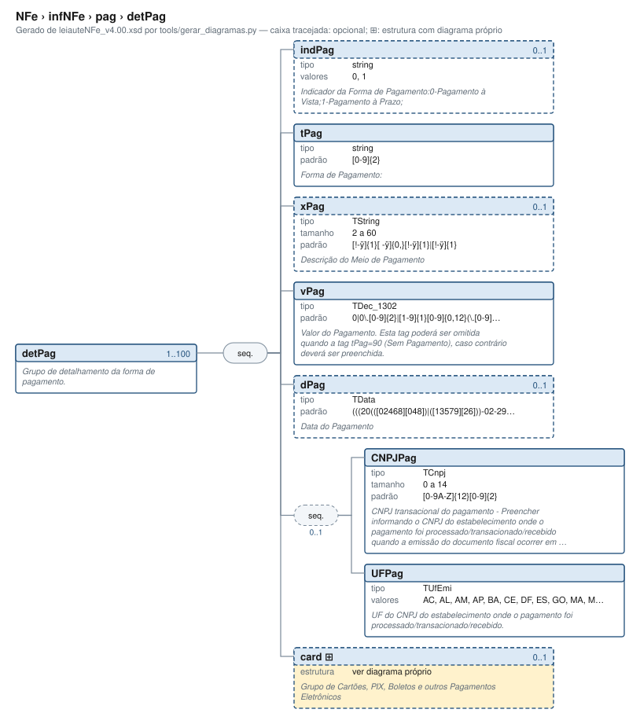

# detPag — Grupo de detalhamento da forma de pagamento

[Manual](../../../README.md) › [NFe](../../../NFe.md) › [infNFe](../../infNFe.md) › [pag](../pag.md) › detPag

<!-- estado-xsd:inicio -->
> **Estado: documentado.** Estrutura conferida contra a base XSD registrada.
>
> `Base atual e revisada: c537394250f913b591f3984f1de2e9d1a1ec94d334a0086e7a41f9850f5f7917`
<!-- estado-xsd:fim -->

| Informação | Base conferida |
|---|---|
| Caminho XML | `NFe/infNFe/pag/detPag` |
| Leiaute / pacote XSD | NF-e/NFC-e 4.00 / PL010f v1.04, 31/08/2026 |
| Biblioteca conferida | libnfe 1.0.0-rc4, commit `1dd412eebca80dd80d884b3f03a1a31cfaf42279` |
| Revisão | 2026-10-05 |
| Contexto no leiaute | `1..100` no pai, sujeito às sequências e escolhas abaixo |

## Finalidade e quando preencher

O pagamento contém formas de pagamento e, quando aplicável, troco. Cada detPag representa uma forma; identifique o meio e seu valor, com informações complementares quando exigidas. O schema atual exige o grupo na nota e a API exige ao menos uma forma; a anotação histórica de obrigatoriedade apenas para NFC-e não descreve todo o uso atual.

Descrição e observações do XSD adotado: Grupo de detalhamento da forma de pagamento.. A estrutura e as restrições são as do pacote indicado; notas históricas de uso devem ser lidas junto às atualizações listadas nas referências.

## Estrutura, ordem e escolhas



[Abrir o diagrama](../../../../diagramas/NFe/infNFe/pag/detPag.svg).

Uma ocorrência `1..1` dentro de uma alternativa exige o campo quando essa alternativa é selecionada; não obriga selecionar esse ramo em toda nota. Grupos opcionais podem conter filhos obrigatórios. Os elementos de sequência seguem a ordem indicada.

- **Sequência** `1..1`
  - `indPag` `0..1`
  - `tPag` `1..1`
  - `xPag` `0..1`
  - `vPag` `1..1`
  - `dPag` `0..1`
  - **Sequência** `0..1`
    - `CNPJPag` `1..1`
    - `UFPag` `1..1`
  - `card` `0..1`

## Campos e atributos

| Tag / atributo | Significado e observações | Tipo XML | Ocorrência | Formato / limites | Condição no contexto |
|---|---|---|---|---|---|
| `indPag` | Indicador da Forma de Pagamento:0-Pagamento à Vista;1-Pagamento à Prazo; | `string` | `0..1` | Domínio: `0`, `1`<br>Tratamento de espaços: preserve | Opcional no contexto |
| `tPag` | Forma de Pagamento: | `string` | `1..1` | Padrão: `[0-9]{2}`<br>Tratamento de espaços: preserve | Obrigatório no contexto |
| `xPag` | Descrição do Meio de Pagamento | `TString` | `0..1` | Mínimo: 2<br>Máximo: 60<br>Padrão: `[!-ÿ]{1}[ -ÿ]{0,}[!-ÿ]{1}\|[!-ÿ]{1}`<br>Tratamento de espaços: preserve | Opcional no contexto |
| `vPag` | Valor do Pagamento. Esta tag poderá ser omitida quando a tag tPag=90 (Sem Pagamento), caso contrário deverá ser preenchida. | `TDec_1302` | `1..1` | Padrão: `0\|0\.[0-9]{2}\|[1-9]{1}[0-9]{0,12}(\.[0-9]{2})?`<br>Tratamento de espaços: preserve | Obrigatório no contexto |
| `dPag` | Data do Pagamento | `TData` | `0..1` | Padrão: `(((20(([02468][048])\|([13579][26]))-02-29))\|(20[0-9][0-9])-((((0[1-9])\|(1[0-2]))-((0[1-9])\|(1\d)\|(2[0-8])))\|((((0[13578])\|(1[02]))-31)\|(((0[1,3-9])\|(1[0-2]))-(29\|30)))))`<br>Tratamento de espaços: preserve<br>Data: `AAAA-MM-DD` | Opcional no contexto |
| `CNPJPag` | CNPJ transacional do pagamento - Preencher informando o CNPJ do estabelecimento onde o pagamento foi processado/transacionado/recebido quando a emissão do documento fiscal ocorrer em estabelecimento distinto | `TCnpj` | `1..1` | Máximo: 14<br>Padrão: `[0-9A-Z]{12}[0-9]{2}`<br>Tratamento de espaços: preserve | Obrigatório no contexto; sequência/escolha opcional |
| `UFPag` | UF do CNPJ do estabelecimento onde o pagamento foi processado/transacionado/recebido. | `TUfEmi` | `1..1` | Domínio: `AC`, `AL`, `AM`, `AP`, `BA`, `CE`, `DF`, `ES`, `GO`, `MA`, `MG`, `MS`, `MT`, `PA`, `PB`, `PE`, `PI`, `PR`, `RJ`, `RN`, `RO`, `RR`, `RS`, `SC`, `SE`, `SP`, `TO`<br>Tratamento de espaços: preserve | Obrigatório no contexto; sequência/escolha opcional |
| [`card`](detPag/card.md) | Grupo de Cartões, PIX, Boletos e outros Pagamentos Eletrônicos | `complexType anônimo` | `0..1` | Grupo estruturado | Opcional no contexto |

Campos decimais usam o separador `.` e a precisão indicada pelo tipo; preservar a representação textual evita perda por ponto flutuante. Ausência, texto vazio e zero são valores distintos. Padrões, comprimentos e enumerações precisam ser atendidos em conjunto; valores de códigos com zeros significativos devem conservar esses zeros. Campos de mesmo nome em outros pais têm contexto próprio.

## API C, integração e memória

Este grupo usa os objetos e funções específicos do módulo `pag.h`. O contrato completo abaixo identifica os argumentos, a ligação ao pai, a serialização e a liberação. O exemplo indicado usa essas funções; o motor genérico não é um substituto automático para esse objeto.

[Contrato público de pag.h](../../../api/pag.md) apresenta assinaturas, argumentos, retornos e limitações. [Convenções de memória e erros](../../../API.md) explica cópia, empréstimo e transferência de posse.

Ao usar um grupo emprestado, libere o objeto proprietário, nunca o grupo separadamente. Os setters de texto copiam seus valores; getters retornam texto interno emprestado. A escolha de outro ramo válido pode apagar o anterior. Os campos obrigatórios do motor são conferidos na escrita; validar um valor isolado não prova completude do grupo. Os contratos específicos prevalecem quando a função indicada não usa o motor.

## Exemplo C conferido

[Fonte completo do cenário teste_valores_invalidos](../../../../../tests/test_pag.c) contém o preenchimento, a conferência dos retornos e a liberação dos recursos. O cenário integra o programa de testes indicado, com os headers e apoios do repositório. O XML foi observado na serialização desse cenário e validado, não deduzido de um desenho.

```sh
make obj/test_pag
./obj/test_pag tests
```

A função abaixo é o cenário completo do teste, incluindo tratamento dos retornos e eventuais verificações de erros. O XML publicado foi observado na validação da linha **216** do fonte indicado; a função pode exercitar outras alterações antes/depois desse ponto.

<details>
<summary>Função C completa do cenário teste_valores_invalidos</summary>

```c
static void teste_valores_invalidos(void)
{
	nfe_pag *pag = nfe_pag_new();
	nfe_detpag *dp = nfe_detpag_new();
	char *xml;
	int i, rc = 0;

	VERIFICA(pag && dp);
	if (!pag || !dp) {
		nfe_pag_free(pag);
		nfe_detpag_free(dp);
		return;
	}
	VERIFICA_INT(nfe_detpag_set_indpag(dp, (nfe_forma_pagamento)2),
	             E_VALOR);
	VERIFICA_INT(nfe_detpag_set_tpag(dp, (nfe_meio_pagamento)100), E_VALOR);
	VERIFICA_INT(nfe_detpag_set_tpag(dp, (nfe_meio_pagamento)-1), E_VALOR);
	VERIFICA_INT(nfe_detpag_set_xpag(dp, "V"), E_TAMANHO);
	VERIFICA_INT(nfe_detpag_set_vpag(dp, "20,00"), E_VALOR);
	VERIFICA_INT(nfe_detpag_set_vpag(dp, NULL), E_ISNULL);
	VERIFICA_INT(nfe_detpag_set_dpag(dp, "2026-02-30"), E_VALOR);
	VERIFICA_INT(nfe_detpag_set_dpag(dp, "03/10/2026"), E_VALOR);
	VERIFICA_INT(nfe_detpag_set_local(dp, "12345678000195", NULL), E_VALOR);
	VERIFICA_INT(nfe_detpag_set_local(dp, "12345678000195", "EX"), E_VALOR);
	VERIFICA_INT(nfe_detpag_set_local(dp, "12345678000196", "SP"), E_VALOR);
	VERIFICA_INT(nfe_detpag_set_card(dp, (nfe_integracao)3, NULL, 0, NULL,
	                                 NULL, NULL),
	             E_VALOR);
	VERIFICA_INT(nfe_detpag_set_card(dp, NFE_INTEGRACAO_TEF, NULL, 100,
	                                 NULL, NULL, NULL),
	             E_VALOR);
	VERIFICA_INT(nfe_detpag_set_card(dp, NFE_INTEGRACAO_TEF,
	                                 "12345678000196", 1, NULL, NULL, NULL),
	             E_VALOR);
	VERIFICA_INT(nfe_detpag_set_card(dp, NFE_INTEGRACAO_TEF, NULL, 1, "",
	                                 NULL, NULL),
	             E_TAMANHO);
	VERIFICA_INT(nfe_pag_set_vtroco(pag, "5.0"), E_VALOR);
	VERIFICA_INT(nfe_pag_add_detpag(pag, NULL), E_ISNULL);
	VERIFICA_INT(nfe_detpag_set_tpag(NULL, NFE_MEIO_DINHEIRO), E_ISNULL);

	/* Sem forma de pagamento, ou forma incompleta */
	xml = teste_gera(escreve, pag, &rc);
	VERIFICA_INT(rc, E_VALOR);
	free(xml);
	VERIFICA_INT(nfe_pag_add_detpag(pag, dp), 0);
	xml = teste_gera(escreve, pag, &rc); /* sem tPag e vPag */
	VERIFICA_INT(rc, E_VALOR);
	free(xml);
	VERIFICA_INT(nfe_detpag_set_tpag(dp, NFE_MEIO_SEM_PAGAMENTO), 0);
	xml = teste_gera(escreve, pag, &rc); /* sem vPag */
	VERIFICA_INT(rc, E_VALOR);
	free(xml);
	VERIFICA_INT(nfe_detpag_set_vpag(dp, "0.00"), 0);
	xml = teste_gera(escreve, pag, &rc);
	VERIFICA_INT(rc, 0);
	if (xml) {
		VERIFICA(strstr(xml, "<tPag>90</tPag><vPag>0.00</vPag>") !=
		         NULL);
		VERIFICA_INT(teste_valida(xml), 0);
	}
	free(xml);

	/* Limite de 100 formas */
	for (i = 1; i < NFE_MAX_DETPAG; i++)
		rc |= nfe_pag_add_detpag(pag, forma(NFE_MEIO_DINHEIRO, "1.00"));
	VERIFICA_INT(rc, 0);
	dp = forma(NFE_MEIO_DINHEIRO, "1.00");
	VERIFICA_INT(nfe_pag_add_detpag(pag, dp), E_VALOR);
	nfe_detpag_free(dp);
	xml = teste_gera(escreve, pag, &rc);
	VERIFICA_INT(rc, 0);
	if (xml)
		VERIFICA_INT(teste_valida(xml), 0);
	free(xml);
	VERIFICA_INT(nfe_pag_write_xml(NULL, pag), E_ISNULL);
	nfe_pag_free(pag);
	nfe_pag_free(NULL);
	nfe_detpag_free(NULL);
}
```

</details>

## XML correspondente

Trecho do cenário acima, com namespace preservado. [XML completo do cenário](../../../exemplos/grupos/test_pag-0004.xml) permite conferir valores e ancestrais. Dados sintéticos; este exemplo comprova estrutura e uso da API, sem transmissão, autorização ou validação de enquadramento fiscal.

```xml
<detPag xmlns="http://www.portalfiscal.inf.br/nfe">
  <tPag>90</tPag>
  <vPag>0.00</vPag>
</detPag>

```

O fragmento é validado no contexto que o declara no leiaute, com namespace e ancestrais. O wrapper tipos_v4.00.xsd, quando usado nos testes, extrai essas declarações do schema oficial e é identificado como apoio de testes, sem substituir o pacote oficial.

## Validação, erros e limites

| Situação | Etapa / resultado | Tratamento |
|---|---|---|
| Ponteiro obrigatório nulo | API: `E_ISNULL` (-1), conforme contrato da função | Conferir criação e argumentos |
| Texto fora do comprimento | Setter/motor: `E_TAMANHO` (-2) | Usar os limites do tipo e do argumento C |
| Domínio, padrão ou caminho inválido/ambíguo | Setter/motor: `E_VALOR` (-3) | Corrigir o valor e usar caminho completo |
| Campo obrigatório ou escolha incompleta | Escrita do motor: `E_VALOR`; XSD rejeita | Completar o ramo selecionado |
| Falha de escrita XML | Writer: `E_XML` (-4) | Descartar saída parcial e tratar a falha |
| Falta de memória | Criação: NULL; operações que alocam podem retornar `E_MALLOC` (-101) | Encerrar com limpeza dos recursos ainda próprios |
| Regra fiscal, cadastro, cálculo ou vigência | Pode ser aceito lexicalmente; depende da regra e do autorizador | Conferir fontes e contratos; não confundir 0 com autorização |

Os códigos negativos são da biblioteca, não códigos cStat. [Validação e regras implementadas](../../../VALIDACAO.md) distingue XSD, verificações locais e retorno da SEFAZ. A referência da API identifica exceções aos comportamentos gerais desta tabela.

## Referências e grupos relacionados

- XSD atual: [leiaute](../../../../../tests/schemas/nfe/leiauteNFe_v4.00.xsd), [tipos básicos](../../../../../tests/schemas/nfe/tiposBasico_v4.00.xsd) e [tipos DFe/RTC](../../../../../tests/schemas/nfe/DFeTiposBasicos_v1.00.xsd).
- MOC 7.0, Anexo I: YA, pp. 62–63; leiaute atual. [Fontes oficiais, versões e transições](../../../BASES.md) relaciona atualizações posteriores, com vigência separada da publicação.
- API: [pag.h](../../../../../include/libnfe/pag.h) e [referência das funções](../../../api/pag.md).
- Grupo pai: [pag](../pag.md).
- Filhos: [card](detPag/card.md).

Anterior: [pag](../pag.md) | Próximo: [card](detPag/card.md)
