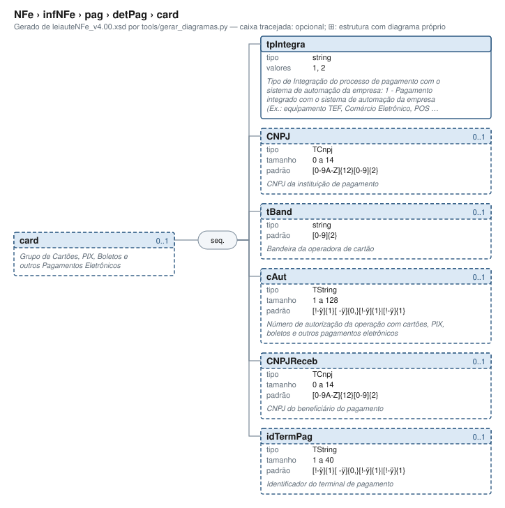

# card — Grupo de Cartões, PIX, Boletos e outros Pagamentos Eletrônicos

[Manual](../../../../README.md) › [NFe](../../../../NFe.md) › [infNFe](../../../infNFe.md) › [pag](../../pag.md) › [detPag](../detPag.md) › card

<!-- estado-xsd:inicio -->
> **Estado: documentado.** Estrutura conferida contra a base XSD registrada.
>
> `Base atual e revisada: c537394250f913b591f3984f1de2e9d1a1ec94d334a0086e7a41f9850f5f7917`
<!-- estado-xsd:fim -->

| Informação | Base conferida |
|---|---|
| Caminho XML | `NFe/infNFe/pag/detPag/card` |
| Leiaute / pacote XSD | NF-e/NFC-e 4.00 / PL010f v1.04, 31/08/2026 |
| Biblioteca conferida | libnfe 1.0.0-rc4, commit `1dd412eebca80dd80d884b3f03a1a31cfaf42279` |
| Revisão | 2026-10-05 |
| Contexto no leiaute | `0..1` no pai, sujeito às sequências e escolhas abaixo |

## Finalidade e quando preencher

O pagamento contém formas de pagamento e, quando aplicável, troco. Cada detPag representa uma forma; identifique o meio e seu valor, com informações complementares quando exigidas. O schema atual exige o grupo na nota e a API exige ao menos uma forma; a anotação histórica de obrigatoriedade apenas para NFC-e não descreve todo o uso atual.

Os dados podem representar cartão, PIX, boleto e outros pagamentos eletrônicos conforme o leiaute atual. CNPJ e CNPJReceb identificam participantes diferentes; a API não efetua uma cobrança nem consulta a credenciadora.

Descrição e observações do XSD adotado: Grupo de Cartões, PIX, Boletos e outros Pagamentos Eletrônicos. A estrutura e as restrições são as do pacote indicado; notas históricas de uso devem ser lidas junto às atualizações listadas nas referências.

## Estrutura, ordem e escolhas



[Abrir o diagrama](../../../../../diagramas/NFe/infNFe/pag/detPag/card.svg).

Uma ocorrência `1..1` dentro de uma alternativa exige o campo quando essa alternativa é selecionada; não obriga selecionar esse ramo em toda nota. Grupos opcionais podem conter filhos obrigatórios. Os elementos de sequência seguem a ordem indicada.

- **Sequência** `1..1`
  - `tpIntegra` `1..1`
  - `CNPJ` `0..1`
  - `tBand` `0..1`
  - `cAut` `0..1`
  - `CNPJReceb` `0..1`
  - `idTermPag` `0..1`

## Campos e atributos

| Tag / atributo | Significado e observações | Tipo XML | Ocorrência | Formato / limites | Condição no contexto |
|---|---|---|---|---|---|
| `tpIntegra` | Tipo de Integração do processo de pagamento com o sistema de automação da empresa: 1 - Pagamento integrado com o sistema de automação da empresa (Ex.: equipamento TEF, Comércio Eletrônico, POS Integrado); 2 - Pagamento não integrado com o sistema de automação da empresa (Ex.: equipamento POS Simples). | `string` | `1..1` | Domínio: `1`, `2`<br>Tratamento de espaços: preserve | Obrigatório no contexto |
| `CNPJ` | CNPJ da instituição de pagamento | `TCnpj` | `0..1` | Máximo: 14<br>Padrão: `[0-9A-Z]{12}[0-9]{2}`<br>Tratamento de espaços: preserve | Opcional no contexto |
| `tBand` | Bandeira da operadora de cartão | `string` | `0..1` | Padrão: `[0-9]{2}`<br>Tratamento de espaços: preserve | Opcional no contexto |
| `cAut` | Número de autorização da operação com cartões, PIX, boletos e outros pagamentos eletrônicos | `TString` | `0..1` | Mínimo: 1<br>Máximo: 128<br>Padrão: `[!-ÿ]{1}[ -ÿ]{0,}[!-ÿ]{1}\|[!-ÿ]{1}`<br>Tratamento de espaços: preserve | Opcional no contexto |
| `CNPJReceb` | CNPJ do beneficiário do pagamento | `TCnpj` | `0..1` | Máximo: 14<br>Padrão: `[0-9A-Z]{12}[0-9]{2}`<br>Tratamento de espaços: preserve | Opcional no contexto |
| `idTermPag` | Identificador do terminal de pagamento | `TString` | `0..1` | Mínimo: 1<br>Máximo: 40<br>Padrão: `[!-ÿ]{1}[ -ÿ]{0,}[!-ÿ]{1}\|[!-ÿ]{1}`<br>Tratamento de espaços: preserve | Opcional no contexto |

Campos decimais usam o separador `.` e a precisão indicada pelo tipo; preservar a representação textual evita perda por ponto flutuante. Ausência, texto vazio e zero são valores distintos. Padrões, comprimentos e enumerações precisam ser atendidos em conjunto; valores de códigos com zeros significativos devem conservar esses zeros. Campos de mesmo nome em outros pais têm contexto próprio.

## API C, integração e memória

Este grupo usa os objetos e funções específicos do módulo `pag.h`. O contrato completo abaixo identifica os argumentos, a ligação ao pai, a serialização e a liberação. O exemplo indicado usa essas funções; o motor genérico não é um substituto automático para esse objeto.

[Contrato público de pag.h](../../../../api/pag.md) apresenta assinaturas, argumentos, retornos e limitações. [Convenções de memória e erros](../../../../API.md) explica cópia, empréstimo e transferência de posse.

Ao usar um grupo emprestado, libere o objeto proprietário, nunca o grupo separadamente. Os setters de texto copiam seus valores; getters retornam texto interno emprestado. A escolha de outro ramo válido pode apagar o anterior. Os campos obrigatórios do motor são conferidos na escrita; validar um valor isolado não prova completude do grupo. Os contratos específicos prevalecem quando a função indicada não usa o motor.

## Exemplo C conferido

[Fonte completo do cenário teste_varias_formas](../../../../../../tests/test_pag.c) contém o preenchimento, a conferência dos retornos e a liberação dos recursos. O cenário integra o programa de testes indicado, com os headers e apoios do repositório. O XML foi observado na serialização desse cenário e validado, não deduzido de um desenho.

```sh
make obj/test_pag
./obj/test_pag tests
```

A função abaixo é o cenário completo do teste, incluindo tratamento dos retornos e eventuais verificações de erros. O XML publicado foi observado na validação da linha **151** do fonte indicado; a função pode exercitar outras alterações antes/depois desse ponto.

<details>
<summary>Função C completa do cenário teste_varias_formas</summary>

```c
static void teste_varias_formas(void)
{
	nfe_pag *pag = nfe_pag_new();
	nfe_detpag *cartao = forma(NFE_MEIO_CARTAO_CREDITO, "50.00");
	nfe_detpag *outros = forma(NFE_MEIO_OUTROS, "10.00");
	nfe_detpag *pix = forma(NFE_MEIO_PIX_DINAMICO, "40.00");
	char *xml;
	int rc;

	VERIFICA(pag && cartao && outros && pix);
	if (!pag || !cartao || !outros || !pix) {
		nfe_pag_free(pag);
		nfe_detpag_free(cartao);
		nfe_detpag_free(outros);
		nfe_detpag_free(pix);
		return;
	}
	VERIFICA_INT(nfe_detpag_set_indpag(cartao, NFE_PAGAMENTO_PRAZO), 0);
	VERIFICA_INT(nfe_detpag_set_card(cartao, NFE_INTEGRACAO_TEF,
	                                 "12345678000195", 2, "AUT123456",
	                                 "12ABC34501DE35", "TERM-01"),
	             0);
	VERIFICA_INT(nfe_detpag_set_xpag(outros, "VALE DA EMPRESA"), 0);
	VERIFICA_INT(nfe_detpag_set_dpag(outros, "2026-10-03"), 0);
	VERIFICA_INT(nfe_detpag_set_local(pix, "12345678000195", "SP"), 0);
	VERIFICA_INT(nfe_detpag_set_card(pix, NFE_INTEGRACAO_POS, NULL, 0, NULL,
	                                 NULL, NULL),
	             0);
	VERIFICA_INT(nfe_pag_add_detpag(pag, cartao), 0);
	VERIFICA_INT(nfe_pag_add_detpag(pag, outros), 0);
	VERIFICA_INT(nfe_pag_add_detpag(pag, pix), 0);
	xml = teste_gera(escreve, pag, &rc);
	VERIFICA_INT(rc, 0);
	VERIFICA(xml != NULL);
	if (xml) {
		VERIFICA(strstr(xml, "<detPag><indPag>1</indPag><tPag>03</tPag>"
		                     "<vPag>50.00</vPag><card>"
		                     "<tpIntegra>1</tpIntegra>"
		                     "<CNPJ>12345678000195</CNPJ>"
		                     "<tBand>02</tBand><cAut>AUT123456</cAut>"
		                     "<CNPJReceb>12ABC34501DE35</CNPJReceb>"
		                     "<idTermPag>TERM-01</idTermPag></card>"
		                     "</detPag>") != NULL);
		VERIFICA(strstr(xml, "<detPag><tPag>99</tPag>"
		                     "<xPag>VALE DA EMPRESA</xPag>"
		                     "<vPag>10.00</vPag><dPag>2026-10-03</dPag>"
		                     "</detPag>") != NULL);
		VERIFICA(strstr(xml, "<detPag><tPag>17</tPag><vPag>40.00</vPag>"
		                     "<CNPJPag>12345678000195</CNPJPag>"
		                     "<UFPag>SP</UFPag><card>"
		                     "<tpIntegra>2</tpIntegra></card></detPag>"
		                     "</pag>") != NULL);
		VERIFICA_INT(teste_valida(xml), 0);
	}
	free(xml);

	/* Removendo opcionais */
	VERIFICA_INT(nfe_detpag_remove_card(cartao), 0);
	VERIFICA_INT(nfe_detpag_set_indpag(cartao, NFE_PAGAMENTO_NAO_INFORMADO),
	             0);
	VERIFICA_INT(nfe_detpag_set_xpag(outros, NULL), 0);
	VERIFICA_INT(nfe_detpag_set_dpag(outros, NULL), 0);
	VERIFICA_INT(nfe_detpag_set_local(pix, NULL, NULL), 0);
	xml = teste_gera(escreve, pag, &rc);
	VERIFICA(xml != NULL);
	if (xml) {
		VERIFICA(strstr(xml, "indPag") == NULL);
		VERIFICA(strstr(xml, "<tpIntegra>1") == NULL);
		VERIFICA(strstr(xml, "xPag") == NULL);
		VERIFICA(strstr(xml, "dPag") == NULL);
		VERIFICA(strstr(xml, "CNPJPag") == NULL);
		VERIFICA_INT(teste_valida(xml), 0);
	}
	free(xml);
	nfe_pag_free(pag);
}
```

</details>

## XML correspondente

Trecho do cenário acima, com namespace preservado. [XML completo do cenário](../../../../exemplos/grupos/test_pag-0003.xml) permite conferir valores e ancestrais. Dados sintéticos; este exemplo comprova estrutura e uso da API, sem transmissão, autorização ou validação de enquadramento fiscal.

```xml
<card xmlns="http://www.portalfiscal.inf.br/nfe">
  <tpIntegra>2</tpIntegra>
</card>

```

O fragmento é validado no contexto que o declara no leiaute, com namespace e ancestrais. O wrapper tipos_v4.00.xsd, quando usado nos testes, extrai essas declarações do schema oficial e é identificado como apoio de testes, sem substituir o pacote oficial.

## Validação, erros e limites

| Situação | Etapa / resultado | Tratamento |
|---|---|---|
| Ponteiro obrigatório nulo | API: `E_ISNULL` (-1), conforme contrato da função | Conferir criação e argumentos |
| Texto fora do comprimento | Setter/motor: `E_TAMANHO` (-2) | Usar os limites do tipo e do argumento C |
| Domínio, padrão ou caminho inválido/ambíguo | Setter/motor: `E_VALOR` (-3) | Corrigir o valor e usar caminho completo |
| Campo obrigatório ou escolha incompleta | Escrita do motor: `E_VALOR`; XSD rejeita | Completar o ramo selecionado |
| Falha de escrita XML | Writer: `E_XML` (-4) | Descartar saída parcial e tratar a falha |
| Falta de memória | Criação: NULL; operações que alocam podem retornar `E_MALLOC` (-101) | Encerrar com limpeza dos recursos ainda próprios |
| Regra fiscal, cadastro, cálculo ou vigência | Pode ser aceito lexicalmente; depende da regra e do autorizador | Conferir fontes e contratos; não confundir 0 com autorização |

Os códigos negativos são da biblioteca, não códigos cStat. [Validação e regras implementadas](../../../../VALIDACAO.md) distingue XSD, verificações locais e retorno da SEFAZ. A referência da API identifica exceções aos comportamentos gerais desta tabela.

## Referências e grupos relacionados

- XSD atual: [leiaute](../../../../../../tests/schemas/nfe/leiauteNFe_v4.00.xsd), [tipos básicos](../../../../../../tests/schemas/nfe/tiposBasico_v4.00.xsd) e [tipos DFe/RTC](../../../../../../tests/schemas/nfe/DFeTiposBasicos_v1.00.xsd).
- MOC 7.0, Anexo I: YA, pp. 62–63; leiaute atual. [Fontes oficiais, versões e transições](../../../../BASES.md) relaciona atualizações posteriores, com vigência separada da publicação.
- API: [pag.h](../../../../../../include/libnfe/pag.h) e [referência das funções](../../../../api/pag.md).
- Grupo pai: [detPag](../detPag.md).

Anterior: [detPag](../detPag.md) | Próximo: [infIntermed](../../infIntermed.md)
