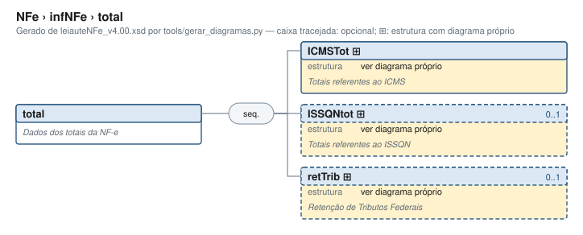

# total — Dados dos totais da NF-e

[Manual](../../README.md) › [NFe](../../NFe.md) › [infNFe](../infNFe.md) › total

<!-- estado-xsd:inicio -->
> **Estado: documentado.** Estrutura conferida contra a base XSD registrada.
>
> `Base atual e revisada: c537394250f913b591f3984f1de2e9d1a1ec94d334a0086e7a41f9850f5f7917`
<!-- estado-xsd:fim -->

| Informação | Base conferida |
|---|---|
| Caminho XML | `NFe/infNFe/total` |
| Leiaute / pacote XSD | NF-e/NFC-e 4.00 / PL010f v1.04, 31/08/2026 |
| Biblioteca conferida | libnfe 1.0.0-rc4, commit `1dd412eebca80dd80d884b3f03a1a31cfaf42279` |
| Revisão | 2026-10-05 |
| Contexto no leiaute | `1..1` no pai, sujeito às sequências e escolhas abaixo |

## Finalidade e quando preencher

Os totais consolidam os itens nos grupos correspondentes. nfe_nfe_calcular_totais preenche somente os campos documentados de ICMSTot; IBS/CBS/IS, ISSQN e retenções precisam de tratamento próprio. Não some novamente tributos já incluídos no valor do produto em um fluxo que determine essa composição.

**Atualização publicada:** a NT 2026.008 v1.00 prevê vUnComLiq, vProdLiq, vProdLiqTot e ICMSPrevistoPagtoAntecip/vICMSPrevisto. Esses campos/grupo **não constam no PL010f atualmente disponível no Portal e adotado pelo projeto**, e não são apresentados aqui como API existente. A NT registra homologação em 05/10/2026 e produção em 03/11/2026 para a primeira etapa; sua regra NB01-30 tem cronograma próprio em 2027. Confira [bases e transições](../../BASES.md).

Descrição e observações do XSD adotado: Dados dos totais da NF-e. A estrutura e as restrições são as do pacote indicado; notas históricas de uso devem ser lidas junto às atualizações listadas nas referências.

## Estrutura, ordem e escolhas



[Abrir o diagrama](../../../diagramas/NFe/infNFe/total.svg).

Uma ocorrência `1..1` dentro de uma alternativa exige o campo quando essa alternativa é selecionada; não obriga selecionar esse ramo em toda nota. Grupos opcionais podem conter filhos obrigatórios. Os elementos de sequência seguem a ordem indicada.

- **Sequência** `1..1`
  - `ICMSTot` `1..1`
  - `ISSQNtot` `0..1`
  - `retTrib` `0..1`
  - `ISTot` `0..1`
  - `IBSCBSTot` `0..1`
  - `vNFTot` `0..1`

## Campos e atributos

| Tag / atributo | Significado e observações | Tipo XML | Ocorrência | Formato / limites | Condição no contexto |
|---|---|---|---|---|---|
| [`ICMSTot`](total/ICMSTot.md) | Totais referentes ao ICMS | `complexType anônimo` | `1..1` | Grupo estruturado | Obrigatório no contexto |
| [`ISSQNtot`](total/ISSQNtot.md) | Totais referentes ao ISSQN | `complexType anônimo` | `0..1` | Grupo estruturado | Opcional no contexto |
| [`retTrib`](total/retTrib.md) | Retenção de Tributos Federais | `complexType anônimo` | `0..1` | Grupo estruturado | Opcional no contexto |
| [`ISTot`](total/ISTot.md) | Valores totais da NF com Imposto Seletivo | `TISTot` | `0..1` | Grupo estruturado | Opcional no contexto |
| [`IBSCBSTot`](total/IBSCBSTot.md) | Valores totais da NF com IBS / CBS | `TIBSCBSMonoTot` | `0..1` | Grupo estruturado | Opcional no contexto |
| `vNFTot` | Valor Total da NF considerando os impostos por fora IBS, CBS e IS | `TDec_1302` | `0..1` | Padrão: `0\|0\.[0-9]{2}\|[1-9]{1}[0-9]{0,12}(\.[0-9]{2})?`<br>Tratamento de espaços: preserve | Opcional no contexto |

Campos decimais usam o separador `.` e a precisão indicada pelo tipo; preservar a representação textual evita perda por ponto flutuante. Ausência, texto vazio e zero são valores distintos. Padrões, comprimentos e enumerações precisam ser atendidos em conjunto; valores de códigos com zeros significativos devem conservar esses zeros. Campos de mesmo nome em outros pais têm contexto próprio.

## API C, integração e memória

Acesso pela API pública: `nfe_total_grupo(total)`. O grupo pertence ao objeto que o fornece. Use os caminhos completos a partir desse grupo; se um ancestral for uma lista, obtenha uma ocorrência com `nfe_grupo_add` antes de preencher seus filhos.

[Contrato público de total.h](../../api/total.md) apresenta assinaturas, argumentos, retornos e limitações. [Convenções de memória e erros](../../API.md) explica cópia, empréstimo e transferência de posse.

Ao usar um grupo emprestado, libere o objeto proprietário, nunca o grupo separadamente. Os setters de texto copiam seus valores; getters retornam texto interno emprestado. A escolha de outro ramo válido pode apagar o anterior. Os campos obrigatórios do motor são conferidos na escrita; validar um valor isolado não prova completude do grupo. Os contratos específicos prevalecem quando a função indicada não usa o motor.

## Exemplo C conferido

[Fonte completo do cenário teste_padrao](../../../../tests/test_total.c) contém o preenchimento, a conferência dos retornos e a liberação dos recursos. O cenário integra o programa de testes indicado, com os headers e apoios do repositório. O XML foi observado na serialização desse cenário e validado, não deduzido de um desenho.

```sh
make obj/test_total
./obj/test_total tests
```

A função abaixo é o cenário completo do teste, incluindo tratamento dos retornos e eventuais verificações de erros. O XML publicado foi observado na validação da linha **63** do fonte indicado; a função pode exercitar outras alterações antes/depois desse ponto.

<details>
<summary>Função C completa do cenário teste_padrao</summary>

```c
static void teste_padrao(void)
{
	nfe_total *tot = nfe_total_new();
	char *xml;
	int rc;

	VERIFICA(tot != NULL);
	if (!tot)
		return;

	/* Recém-criado: todos os obrigatórios em 0.00, já válido */
	xml = teste_gera(escreve, tot, &rc);
	VERIFICA_INT(rc, 0);
	VERIFICA(xml != NULL);
	if (xml) {
		VERIFICA(strstr(xml,
		                "<total xmlns=\"" TESTE_NS "\"><ICMSTot>"
		                "<vBC>0.00</vBC><vICMS>0.00</vICMS>"
		                "<vICMSDeson>0.00</vICMSDeson><vFCP>0.00</vFCP>"
		                "<vBCST>0.00</vBCST><vST>0.00</vST>"
		                "<vFCPST>0.00</vFCPST>"
		                "<vFCPSTRet>0.00</vFCPSTRet>"
		                "<vProd>0.00</vProd><vFrete>0.00</vFrete>"
		                "<vSeg>0.00</vSeg><vDesc>0.00</vDesc>"
		                "<vII>0.00</vII><vIPI>0.00</vIPI>"
		                "<vIPIDevol>0.00</vIPIDevol><vPIS>0.00</vPIS>"
		                "<vCOFINS>0.00</vCOFINS><vOutro>0.00</vOutro>"
		                "<vNF>0.00</vNF></ICMSTot></total>") != NULL);
		VERIFICA_INT(teste_valida(xml), 0);
	}
	free(xml);
	nfe_total_free(tot);
}
```

</details>

## XML correspondente

Trecho do cenário acima, com namespace preservado. [XML completo do cenário](../../exemplos/grupos/test_total-0001.xml) permite conferir valores e ancestrais. Dados sintéticos; este exemplo comprova estrutura e uso da API, sem transmissão, autorização ou validação de enquadramento fiscal.

```xml
<total xmlns="http://www.portalfiscal.inf.br/nfe">
  <ICMSTot>
    <vBC>0.00</vBC>
    <vICMS>0.00</vICMS>
    <vICMSDeson>0.00</vICMSDeson>
    <vFCP>0.00</vFCP>
    <vBCST>0.00</vBCST>
    <vST>0.00</vST>
    <vFCPST>0.00</vFCPST>
    <vFCPSTRet>0.00</vFCPSTRet>
    <vProd>0.00</vProd>
    <vFrete>0.00</vFrete>
    <vSeg>0.00</vSeg>
    <vDesc>0.00</vDesc>
    <vII>0.00</vII>
    <vIPI>0.00</vIPI>
    <vIPIDevol>0.00</vIPIDevol>
    <vPIS>0.00</vPIS>
    <vCOFINS>0.00</vCOFINS>
    <vOutro>0.00</vOutro>
    <vNF>0.00</vNF>
  </ICMSTot>
</total>
```

O fragmento é validado no contexto que o declara no leiaute, com namespace e ancestrais. O wrapper tipos_v4.00.xsd, quando usado nos testes, extrai essas declarações do schema oficial e é identificado como apoio de testes, sem substituir o pacote oficial.

## Validação, erros e limites

| Situação | Etapa / resultado | Tratamento |
|---|---|---|
| Ponteiro obrigatório nulo | API: `E_ISNULL` (-1), conforme contrato da função | Conferir criação e argumentos |
| Texto fora do comprimento | Setter/motor: `E_TAMANHO` (-2) | Usar os limites do tipo e do argumento C |
| Domínio, padrão ou caminho inválido/ambíguo | Setter/motor: `E_VALOR` (-3) | Corrigir o valor e usar caminho completo |
| Campo obrigatório ou escolha incompleta | Escrita do motor: `E_VALOR`; XSD rejeita | Completar o ramo selecionado |
| Falha de escrita XML | Writer: `E_XML` (-4) | Descartar saída parcial e tratar a falha |
| Falta de memória | Criação: NULL; operações que alocam podem retornar `E_MALLOC` (-101) | Encerrar com limpeza dos recursos ainda próprios |
| Regra fiscal, cadastro, cálculo ou vigência | Pode ser aceito lexicalmente; depende da regra e do autorizador | Conferir fontes e contratos; não confundir 0 com autorização |

Os códigos negativos são da biblioteca, não códigos cStat. [Validação e regras implementadas](../../VALIDACAO.md) distingue XSD, verificações locais e retorno da SEFAZ. A referência da API identifica exceções aos comportamentos gerais desta tabela.

## Referências e grupos relacionados

- XSD atual: [leiaute](../../../../tests/schemas/nfe/leiauteNFe_v4.00.xsd), [tipos básicos](../../../../tests/schemas/nfe/tiposBasico_v4.00.xsd) e [tipos DFe/RTC](../../../../tests/schemas/nfe/DFeTiposBasicos_v1.00.xsd).
- MOC 7.0, Anexo I: W, pp. 58–59. [Fontes oficiais, versões e transições](../../BASES.md) relaciona atualizações posteriores, com vigência separada da publicação.
- API: [total.h](../../../../include/libnfe/total.h) e [referência das funções](../../api/total.md).
- Grupo pai: [infNFe](../infNFe.md).
- Filhos: [ICMSTot](total/ICMSTot.md), [ISSQNtot](total/ISSQNtot.md), [retTrib](total/retTrib.md), [ISTot](total/ISTot.md), [IBSCBSTot](total/IBSCBSTot.md).

Anterior: [DFeReferenciado](det/DFeReferenciado.md) | Próximo: [ICMSTot](total/ICMSTot.md)
