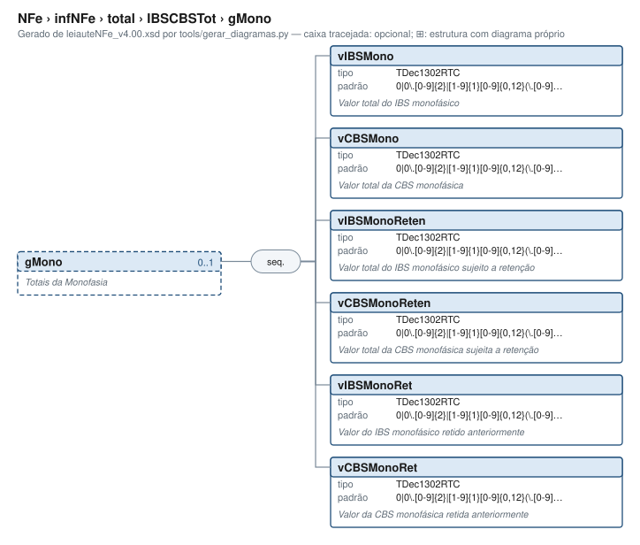

# gMono — Totais da Monofasia

[Manual](../../../../README.md) › [NFe](../../../../NFe.md) › [infNFe](../../../infNFe.md) › [total](../../total.md) › [IBSCBSTot](../IBSCBSTot.md) › gMono

<!-- estado-xsd:inicio -->
> **Estado: documentado.** Estrutura conferida contra a base XSD registrada.
>
> `Base atual e revisada: c537394250f913b591f3984f1de2e9d1a1ec94d334a0086e7a41f9850f5f7917`
<!-- estado-xsd:fim -->

| Informação | Base conferida |
|---|---|
| Caminho XML | `NFe/infNFe/total/IBSCBSTot/gMono` |
| Leiaute / pacote XSD | NF-e/NFC-e 4.00 / PL010f v1.04, 31/08/2026 |
| Biblioteca conferida | libnfe 1.0.0-rc4, commit `1dd412eebca80dd80d884b3f03a1a31cfaf42279` |
| Revisão | 2026-10-05 |
| Contexto no leiaute | `0..1` no pai, sujeito às sequências e escolhas abaixo |

## Finalidade e quando preencher

Os totais consolidam os itens nos grupos correspondentes. nfe_nfe_calcular_totais preenche somente os campos documentados de ICMSTot; IBS/CBS/IS, ISSQN e retenções precisam de tratamento próprio. Não some novamente tributos já incluídos no valor do produto em um fluxo que determine essa composição.

A NT 2025.002 v1.52 atualiza esses grupos e suas regras. Escolha CST e cClassTrib nas tabelas oficiais aplicáveis; valores sintéticos do exemplo não comprovam enquadramento. O formato aceito pelo XSD não verifica a vigência, o crédito permitido ou a correção das contas.

A monofasia distingue tributação ad rem (alíquota por unidade) e ad valorem (percentual), retenção, imposto retido anteriormente e efeitos da composição de biocombustíveis. Preserve o ramo e as unidades do pai; não converta esses campos para percentuais ou valores de outro grupo por semelhança de nome.

**Atualização publicada:** a NT 2026.008 v1.00 prevê vUnComLiq, vProdLiq, vProdLiqTot e ICMSPrevistoPagtoAntecip/vICMSPrevisto. Esses campos/grupo **não constam no PL010f atualmente disponível no Portal e adotado pelo projeto**, e não são apresentados aqui como API existente. A NT registra homologação em 05/10/2026 e produção em 03/11/2026 para a primeira etapa; sua regra NB01-30 tem cronograma próprio em 2027. Confira [bases e transições](../../../../BASES.md).

Descrição e observações do XSD adotado: Totais da Monofasia. A estrutura e as restrições são as do pacote indicado; notas históricas de uso devem ser lidas junto às atualizações listadas nas referências.

## Estrutura, ordem e escolhas



[Abrir o diagrama](../../../../../diagramas/NFe/infNFe/total/IBSCBSTot/gMono.svg).

Uma ocorrência `1..1` dentro de uma alternativa exige o campo quando essa alternativa é selecionada; não obriga selecionar esse ramo em toda nota. Grupos opcionais podem conter filhos obrigatórios. Os elementos de sequência seguem a ordem indicada.

- **Sequência** `1..1`
  - `vIBSMono` `1..1`
  - `vCBSMono` `1..1`
  - `vIBSMonoReten` `1..1`
  - `vCBSMonoReten` `1..1`
  - `vIBSMonoRet` `1..1`
  - `vCBSMonoRet` `1..1`

## Campos e atributos

| Tag / atributo | Significado e observações | Tipo XML | Ocorrência | Formato / limites | Condição no contexto |
|---|---|---|---|---|---|
| `vIBSMono` | Valor total do IBS monofásico | `TDec1302RTC` | `1..1` | Padrão: `0\|0\.[0-9]{2}\|[1-9]{1}[0-9]{0,12}(\.[0-9]{2})?`<br>Tratamento de espaços: preserve | Obrigatório no contexto |
| `vCBSMono` | Valor total da CBS monofásica | `TDec1302RTC` | `1..1` | Padrão: `0\|0\.[0-9]{2}\|[1-9]{1}[0-9]{0,12}(\.[0-9]{2})?`<br>Tratamento de espaços: preserve | Obrigatório no contexto |
| `vIBSMonoReten` | Valor total do IBS monofásico sujeito a retenção | `TDec1302RTC` | `1..1` | Padrão: `0\|0\.[0-9]{2}\|[1-9]{1}[0-9]{0,12}(\.[0-9]{2})?`<br>Tratamento de espaços: preserve | Obrigatório no contexto |
| `vCBSMonoReten` | Valor total da CBS monofásica sujeita a retenção | `TDec1302RTC` | `1..1` | Padrão: `0\|0\.[0-9]{2}\|[1-9]{1}[0-9]{0,12}(\.[0-9]{2})?`<br>Tratamento de espaços: preserve | Obrigatório no contexto |
| `vIBSMonoRet` | Valor do IBS monofásico retido anteriormente | `TDec1302RTC` | `1..1` | Padrão: `0\|0\.[0-9]{2}\|[1-9]{1}[0-9]{0,12}(\.[0-9]{2})?`<br>Tratamento de espaços: preserve | Obrigatório no contexto |
| `vCBSMonoRet` | Valor da CBS monofásica retida anteriormente | `TDec1302RTC` | `1..1` | Padrão: `0\|0\.[0-9]{2}\|[1-9]{1}[0-9]{0,12}(\.[0-9]{2})?`<br>Tratamento de espaços: preserve | Obrigatório no contexto |

Campos decimais usam o separador `.` e a precisão indicada pelo tipo; preservar a representação textual evita perda por ponto flutuante. Ausência, texto vazio e zero são valores distintos. Padrões, comprimentos e enumerações precisam ser atendidos em conjunto; valores de códigos com zeros significativos devem conservar esses zeros. Campos de mesmo nome em outros pais têm contexto próprio.

## API C, integração e memória

Acesso pela API pública: `nfe_total_grupo(total)`. O grupo pertence ao objeto que o fornece. Use os caminhos completos a partir desse grupo; se um ancestral for uma lista, obtenha uma ocorrência com `nfe_grupo_add` antes de preencher seus filhos.

[Contrato público de total.h](../../../../api/total.md) apresenta assinaturas, argumentos, retornos e limitações. [Convenções de memória e erros](../../../../API.md) explica cópia, empréstimo e transferência de posse.

Ao usar um grupo emprestado, libere o objeto proprietário, nunca o grupo separadamente. Os setters de texto copiam seus valores; getters retornam texto interno emprestado. A escolha de outro ramo válido pode apagar o anterior. Os campos obrigatórios do motor são conferidos na escrita; validar um valor isolado não prova completude do grupo. Os contratos específicos prevalecem quando a função indicada não usa o motor.

## Exemplo C conferido

[Fonte completo do cenário caso_079](../../../../../../examples/manual/casos.inc) contém o preenchimento, a conferência dos retornos e a liberação dos recursos. [Programa que cria o objeto e obtém o grupo](../../../../../../examples/manual_grupos.c) fornece os headers e a execução desse cenário.

```sh
make exemplos
./obj/manual_grupos NFe/infNFe/total/IBSCBSTot/gMono
```

Recorte do cenário executado (o programa completo define CONFERE e fornece o grupo do objeto proprietário):

```c
static int caso_079(nfe_grupo *g)
{
	int rc = 0;
	CONFERE(nfe_grupo_set(g, "ICMSTot/vBC", "1.00"));
	CONFERE(nfe_grupo_set(g, "ICMSTot/vICMS", "1.00"));
	CONFERE(nfe_grupo_set(g, "ICMSTot/vICMSDeson", "1.00"));
	CONFERE(nfe_grupo_set(g, "ICMSTot/vFCP", "1.00"));
	CONFERE(nfe_grupo_set(g, "ICMSTot/vBCST", "1.00"));
	CONFERE(nfe_grupo_set(g, "ICMSTot/vST", "1.00"));
	CONFERE(nfe_grupo_set(g, "ICMSTot/vFCPST", "1.00"));
	CONFERE(nfe_grupo_set(g, "ICMSTot/vFCPSTRet", "1.00"));
	CONFERE(nfe_grupo_set(g, "ICMSTot/vProd", "1.00"));
	CONFERE(nfe_grupo_set(g, "ICMSTot/vFrete", "1.00"));
	CONFERE(nfe_grupo_set(g, "ICMSTot/vSeg", "1.00"));
	CONFERE(nfe_grupo_set(g, "ICMSTot/vDesc", "1.00"));
	CONFERE(nfe_grupo_set(g, "ICMSTot/vII", "1.00"));
	CONFERE(nfe_grupo_set(g, "ICMSTot/vIPI", "1.00"));
	CONFERE(nfe_grupo_set(g, "ICMSTot/vIPIDevol", "1.00"));
	CONFERE(nfe_grupo_set(g, "ICMSTot/vPIS", "1.00"));
	CONFERE(nfe_grupo_set(g, "ICMSTot/vCOFINS", "1.00"));
	CONFERE(nfe_grupo_set(g, "ICMSTot/vOutro", "1.00"));
	CONFERE(nfe_grupo_set(g, "ICMSTot/vNF", "1.00"));
	CONFERE(nfe_grupo_set(g, "IBSCBSTot/vBCIBSCBS", "1.00"));
	CONFERE(nfe_grupo_set(g, "IBSCBSTot/gMono/vIBSMono", "1.00"));
	CONFERE(nfe_grupo_set(g, "IBSCBSTot/gMono/vCBSMono", "1.00"));
	CONFERE(nfe_grupo_set(g, "IBSCBSTot/gMono/vIBSMonoReten", "1.00"));
	CONFERE(nfe_grupo_set(g, "IBSCBSTot/gMono/vCBSMonoReten", "1.00"));
	CONFERE(nfe_grupo_set(g, "IBSCBSTot/gMono/vIBSMonoRet", "1.00"));
	CONFERE(nfe_grupo_set(g, "IBSCBSTot/gMono/vCBSMonoRet", "1.00"));
fim:
	return rc;
}
```

## XML correspondente

Trecho do cenário acima, com namespace preservado. [XML completo do cenário](../../../../exemplos/grupos/caso_079.xml) e [nota de contexto validada](../../../../exemplos/contextos/caso_079.xml) permitem conferir valores e ancestrais. Dados sintéticos; este exemplo comprova estrutura e uso da API, sem transmissão, autorização ou validação de enquadramento fiscal.

```xml
<gMono xmlns="http://www.portalfiscal.inf.br/nfe">
  <vIBSMono>1.00</vIBSMono>
  <vCBSMono>1.00</vCBSMono>
  <vIBSMonoReten>1.00</vIBSMonoReten>
  <vCBSMonoReten>1.00</vCBSMonoReten>
  <vIBSMonoRet>1.00</vIBSMonoRet>
  <vCBSMonoRet>1.00</vCBSMonoRet>
</gMono>

```

O fragmento é validado no contexto que o declara no leiaute, com namespace e ancestrais. O wrapper tipos_v4.00.xsd, quando usado nos testes, extrai essas declarações do schema oficial e é identificado como apoio de testes, sem substituir o pacote oficial.

## Validação, erros e limites

| Situação | Etapa / resultado | Tratamento |
|---|---|---|
| Ponteiro obrigatório nulo | API: `E_ISNULL` (-1), conforme contrato da função | Conferir criação e argumentos |
| Texto fora do comprimento | Setter/motor: `E_TAMANHO` (-2) | Usar os limites do tipo e do argumento C |
| Domínio, padrão ou caminho inválido/ambíguo | Setter/motor: `E_VALOR` (-3) | Corrigir o valor e usar caminho completo |
| Campo obrigatório ou escolha incompleta | Escrita do motor: `E_VALOR`; XSD rejeita | Completar o ramo selecionado |
| Falha de escrita XML | Writer: `E_XML` (-4) | Descartar saída parcial e tratar a falha |
| Falta de memória | Criação: NULL; operações que alocam podem retornar `E_MALLOC` (-101) | Encerrar com limpeza dos recursos ainda próprios |
| Regra fiscal, cadastro, cálculo ou vigência | Pode ser aceito lexicalmente; depende da regra e do autorizador | Conferir fontes e contratos; não confundir 0 com autorização |

Os códigos negativos são da biblioteca, não códigos cStat. [Validação e regras implementadas](../../../../VALIDACAO.md) distingue XSD, verificações locais e retorno da SEFAZ. A referência da API identifica exceções aos comportamentos gerais desta tabela.

## Referências e grupos relacionados

- XSD atual: [leiaute](../../../../../../tests/schemas/nfe/leiauteNFe_v4.00.xsd), [tipos básicos](../../../../../../tests/schemas/nfe/tiposBasico_v4.00.xsd) e [tipos DFe/RTC](../../../../../../tests/schemas/nfe/DFeTiposBasicos_v1.00.xsd).
- MOC 7.0, Anexo I: W, pp. 58–59. [Fontes oficiais, versões e transições](../../../../BASES.md) relaciona atualizações posteriores, com vigência separada da publicação.
- API: [total.h](../../../../../../include/libnfe/total.h) e [referência das funções](../../../../api/total.md).
- Grupo pai: [IBSCBSTot](../IBSCBSTot.md).

Anterior: [gCBS](gCBS.md) | Próximo: [gEstornoCred](gEstornoCred.md)
