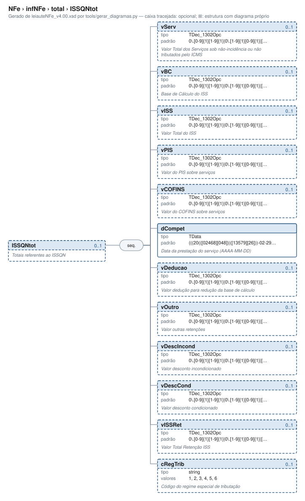

# ISSQNtot — Totais referentes ao ISSQN

[Manual](../../../README.md) › [NFe](../../../NFe.md) › [infNFe](../../infNFe.md) › [total](../total.md) › ISSQNtot

<!-- estado-xsd:inicio -->
> **Estado: documentado.** Estrutura conferida contra a base XSD registrada.
>
> `Base atual e revisada: c537394250f913b591f3984f1de2e9d1a1ec94d334a0086e7a41f9850f5f7917`
<!-- estado-xsd:fim -->

| Informação | Base conferida |
|---|---|
| Caminho XML | `NFe/infNFe/total/ISSQNtot` |
| Leiaute / pacote XSD | NF-e/NFC-e 4.00 / PL010f v1.04, 31/08/2026 |
| Biblioteca conferida | libnfe 1.0.0-rc4, commit `1dd412eebca80dd80d884b3f03a1a31cfaf42279` |
| Revisão | 2026-10-05 |
| Contexto no leiaute | `0..1` no pai, sujeito às sequências e escolhas abaixo |

## Finalidade e quando preencher

Os totais consolidam os itens nos grupos correspondentes. nfe_nfe_calcular_totais preenche somente os campos documentados de ICMSTot; IBS/CBS/IS, ISSQN e retenções precisam de tratamento próprio. Não some novamente tributos já incluídos no valor do produto em um fluxo que determine essa composição.

Consolide os itens sujeitos ao ISSQN neste grupo. Valores e competência são informados pelo chamador; nfe_nfe_calcular_totais não preenche os totais de ISSQN.

**Atualização publicada:** a NT 2026.008 v1.00 prevê vUnComLiq, vProdLiq, vProdLiqTot e ICMSPrevistoPagtoAntecip/vICMSPrevisto. Esses campos/grupo **não constam no PL010f atualmente disponível no Portal e adotado pelo projeto**, e não são apresentados aqui como API existente. A NT registra homologação em 05/10/2026 e produção em 03/11/2026 para a primeira etapa; sua regra NB01-30 tem cronograma próprio em 2027. Confira [bases e transições](../../../BASES.md).

Descrição e observações do XSD adotado: Totais referentes ao ISSQN. A estrutura e as restrições são as do pacote indicado; notas históricas de uso devem ser lidas junto às atualizações listadas nas referências.

## Estrutura, ordem e escolhas



[Abrir o diagrama](../../../../diagramas/NFe/infNFe/total/ISSQNtot.svg).

Uma ocorrência `1..1` dentro de uma alternativa exige o campo quando essa alternativa é selecionada; não obriga selecionar esse ramo em toda nota. Grupos opcionais podem conter filhos obrigatórios. Os elementos de sequência seguem a ordem indicada.

- **Sequência** `1..1`
  - `vServ` `0..1`
  - `vBC` `0..1`
  - `vISS` `0..1`
  - `vPIS` `0..1`
  - `vCOFINS` `0..1`
  - `dCompet` `1..1`
  - `vDeducao` `0..1`
  - `vOutro` `0..1`
  - `vDescIncond` `0..1`
  - `vDescCond` `0..1`
  - `vISSRet` `0..1`
  - `cRegTrib` `0..1`

## Campos e atributos

| Tag / atributo | Significado e observações | Tipo XML | Ocorrência | Formato / limites | Condição no contexto |
|---|---|---|---|---|---|
| `vServ` | Valor Total dos Serviços sob não-incidência ou não tributados pelo ICMS | `TDec_1302Opc` | `0..1` | Padrão: `0\.[0-9]{1}[1-9]{1}\|0\.[1-9]{1}[0-9]{1}\|[1-9]{1}[0-9]{0,12}(\.[0-9]{2})?`<br>Tratamento de espaços: preserve | Opcional no contexto |
| `vBC` | Base de Cálculo do ISS | `TDec_1302Opc` | `0..1` | Padrão: `0\.[0-9]{1}[1-9]{1}\|0\.[1-9]{1}[0-9]{1}\|[1-9]{1}[0-9]{0,12}(\.[0-9]{2})?`<br>Tratamento de espaços: preserve | Opcional no contexto |
| `vISS` | Valor Total do ISS | `TDec_1302Opc` | `0..1` | Padrão: `0\.[0-9]{1}[1-9]{1}\|0\.[1-9]{1}[0-9]{1}\|[1-9]{1}[0-9]{0,12}(\.[0-9]{2})?`<br>Tratamento de espaços: preserve | Opcional no contexto |
| `vPIS` | Valor do PIS sobre serviços | `TDec_1302Opc` | `0..1` | Padrão: `0\.[0-9]{1}[1-9]{1}\|0\.[1-9]{1}[0-9]{1}\|[1-9]{1}[0-9]{0,12}(\.[0-9]{2})?`<br>Tratamento de espaços: preserve | Opcional no contexto |
| `vCOFINS` | Valor do COFINS sobre serviços | `TDec_1302Opc` | `0..1` | Padrão: `0\.[0-9]{1}[1-9]{1}\|0\.[1-9]{1}[0-9]{1}\|[1-9]{1}[0-9]{0,12}(\.[0-9]{2})?`<br>Tratamento de espaços: preserve | Opcional no contexto |
| `dCompet` | Data da prestação do serviço (AAAA-MM-DD) | `TData` | `1..1` | Padrão: `(((20(([02468][048])\|([13579][26]))-02-29))\|(20[0-9][0-9])-((((0[1-9])\|(1[0-2]))-((0[1-9])\|(1\d)\|(2[0-8])))\|((((0[13578])\|(1[02]))-31)\|(((0[1,3-9])\|(1[0-2]))-(29\|30)))))`<br>Tratamento de espaços: preserve<br>Data: `AAAA-MM-DD` | Obrigatório no contexto |
| `vDeducao` | Valor dedução para redução da base de cálculo | `TDec_1302Opc` | `0..1` | Padrão: `0\.[0-9]{1}[1-9]{1}\|0\.[1-9]{1}[0-9]{1}\|[1-9]{1}[0-9]{0,12}(\.[0-9]{2})?`<br>Tratamento de espaços: preserve | Opcional no contexto |
| `vOutro` | Valor outras retenções | `TDec_1302Opc` | `0..1` | Padrão: `0\.[0-9]{1}[1-9]{1}\|0\.[1-9]{1}[0-9]{1}\|[1-9]{1}[0-9]{0,12}(\.[0-9]{2})?`<br>Tratamento de espaços: preserve | Opcional no contexto |
| `vDescIncond` | Valor desconto incondicionado | `TDec_1302Opc` | `0..1` | Padrão: `0\.[0-9]{1}[1-9]{1}\|0\.[1-9]{1}[0-9]{1}\|[1-9]{1}[0-9]{0,12}(\.[0-9]{2})?`<br>Tratamento de espaços: preserve | Opcional no contexto |
| `vDescCond` | Valor desconto condicionado | `TDec_1302Opc` | `0..1` | Padrão: `0\.[0-9]{1}[1-9]{1}\|0\.[1-9]{1}[0-9]{1}\|[1-9]{1}[0-9]{0,12}(\.[0-9]{2})?`<br>Tratamento de espaços: preserve | Opcional no contexto |
| `vISSRet` | Valor Total Retenção ISS | `TDec_1302Opc` | `0..1` | Padrão: `0\.[0-9]{1}[1-9]{1}\|0\.[1-9]{1}[0-9]{1}\|[1-9]{1}[0-9]{0,12}(\.[0-9]{2})?`<br>Tratamento de espaços: preserve | Opcional no contexto |
| `cRegTrib` | Código do regime especial de tributação | `string` | `0..1` | Domínio: `1`, `2`, `3`, `4`, `5`, `6`<br>Tratamento de espaços: preserve | Opcional no contexto |

Campos decimais usam o separador `.` e a precisão indicada pelo tipo; preservar a representação textual evita perda por ponto flutuante. Ausência, texto vazio e zero são valores distintos. Padrões, comprimentos e enumerações precisam ser atendidos em conjunto; valores de códigos com zeros significativos devem conservar esses zeros. Campos de mesmo nome em outros pais têm contexto próprio.

## API C, integração e memória

Acesso pela API pública: `nfe_total_grupo(total)`. O grupo pertence ao objeto que o fornece. Use os caminhos completos a partir desse grupo; se um ancestral for uma lista, obtenha uma ocorrência com `nfe_grupo_add` antes de preencher seus filhos.

[Contrato público de total.h](../../../api/total.md) apresenta assinaturas, argumentos, retornos e limitações. [Convenções de memória e erros](../../../API.md) explica cópia, empréstimo e transferência de posse.

Ao usar um grupo emprestado, libere o objeto proprietário, nunca o grupo separadamente. Os setters de texto copiam seus valores; getters retornam texto interno emprestado. A escolha de outro ramo válido pode apagar o anterior. Os campos obrigatórios do motor são conferidos na escrita; validar um valor isolado não prova completude do grupo. Os contratos específicos prevalecem quando a função indicada não usa o motor.

## Exemplo C conferido

[Fonte completo do cenário caso_080](../../../../../examples/manual/casos.inc) contém o preenchimento, a conferência dos retornos e a liberação dos recursos. [Programa que cria o objeto e obtém o grupo](../../../../../examples/manual_grupos.c) fornece os headers e a execução desse cenário.

```sh
make exemplos
./obj/manual_grupos NFe/infNFe/total/ISSQNtot
```

Recorte do cenário executado (o programa completo define CONFERE e fornece o grupo do objeto proprietário):

```c
static int caso_080(nfe_grupo *g)
{
	int rc = 0;
	CONFERE(nfe_grupo_set(g, "ICMSTot/vBC", "1.00"));
	CONFERE(nfe_grupo_set(g, "ICMSTot/vICMS", "1.00"));
	CONFERE(nfe_grupo_set(g, "ICMSTot/vICMSDeson", "1.00"));
	CONFERE(nfe_grupo_set(g, "ICMSTot/vFCP", "1.00"));
	CONFERE(nfe_grupo_set(g, "ICMSTot/vBCST", "1.00"));
	CONFERE(nfe_grupo_set(g, "ICMSTot/vST", "1.00"));
	CONFERE(nfe_grupo_set(g, "ICMSTot/vFCPST", "1.00"));
	CONFERE(nfe_grupo_set(g, "ICMSTot/vFCPSTRet", "1.00"));
	CONFERE(nfe_grupo_set(g, "ICMSTot/vProd", "1.00"));
	CONFERE(nfe_grupo_set(g, "ICMSTot/vFrete", "1.00"));
	CONFERE(nfe_grupo_set(g, "ICMSTot/vSeg", "1.00"));
	CONFERE(nfe_grupo_set(g, "ICMSTot/vDesc", "1.00"));
	CONFERE(nfe_grupo_set(g, "ICMSTot/vII", "1.00"));
	CONFERE(nfe_grupo_set(g, "ICMSTot/vIPI", "1.00"));
	CONFERE(nfe_grupo_set(g, "ICMSTot/vIPIDevol", "1.00"));
	CONFERE(nfe_grupo_set(g, "ICMSTot/vPIS", "1.00"));
	CONFERE(nfe_grupo_set(g, "ICMSTot/vCOFINS", "1.00"));
	CONFERE(nfe_grupo_set(g, "ICMSTot/vOutro", "1.00"));
	CONFERE(nfe_grupo_set(g, "ICMSTot/vNF", "1.00"));
	CONFERE(nfe_grupo_set(g, "ISSQNtot/dCompet", "2026-10-05"));
fim:
	return rc;
}
```

## XML correspondente

Trecho do cenário acima, com namespace preservado. [XML completo do cenário](../../../exemplos/grupos/caso_080.xml) e [nota de contexto validada](../../../exemplos/contextos/caso_080.xml) permitem conferir valores e ancestrais. Dados sintéticos; este exemplo comprova estrutura e uso da API, sem transmissão, autorização ou validação de enquadramento fiscal.

```xml
<ISSQNtot xmlns="http://www.portalfiscal.inf.br/nfe">
  <dCompet>2026-10-05</dCompet>
</ISSQNtot>

```

O fragmento é validado no contexto que o declara no leiaute, com namespace e ancestrais. O wrapper tipos_v4.00.xsd, quando usado nos testes, extrai essas declarações do schema oficial e é identificado como apoio de testes, sem substituir o pacote oficial.

## Validação, erros e limites

| Situação | Etapa / resultado | Tratamento |
|---|---|---|
| Ponteiro obrigatório nulo | API: `E_ISNULL` (-1), conforme contrato da função | Conferir criação e argumentos |
| Texto fora do comprimento | Setter/motor: `E_TAMANHO` (-2) | Usar os limites do tipo e do argumento C |
| Domínio, padrão ou caminho inválido/ambíguo | Setter/motor: `E_VALOR` (-3) | Corrigir o valor e usar caminho completo |
| Campo obrigatório ou escolha incompleta | Escrita do motor: `E_VALOR`; XSD rejeita | Completar o ramo selecionado |
| Falha de escrita XML | Writer: `E_XML` (-4) | Descartar saída parcial e tratar a falha |
| Falta de memória | Criação: NULL; operações que alocam podem retornar `E_MALLOC` (-101) | Encerrar com limpeza dos recursos ainda próprios |
| Regra fiscal, cadastro, cálculo ou vigência | Pode ser aceito lexicalmente; depende da regra e do autorizador | Conferir fontes e contratos; não confundir 0 com autorização |

Os códigos negativos são da biblioteca, não códigos cStat. [Validação e regras implementadas](../../../VALIDACAO.md) distingue XSD, verificações locais e retorno da SEFAZ. A referência da API identifica exceções aos comportamentos gerais desta tabela.

## Referências e grupos relacionados

- XSD atual: [leiaute](../../../../../tests/schemas/nfe/leiauteNFe_v4.00.xsd), [tipos básicos](../../../../../tests/schemas/nfe/tiposBasico_v4.00.xsd) e [tipos DFe/RTC](../../../../../tests/schemas/nfe/DFeTiposBasicos_v1.00.xsd).
- MOC 7.0, Anexo I: W, pp. 58–59. [Fontes oficiais, versões e transições](../../../BASES.md) relaciona atualizações posteriores, com vigência separada da publicação.
- API: [total.h](../../../../../include/libnfe/total.h) e [referência das funções](../../../api/total.md).
- Grupo pai: [total](../total.md).

Anterior: [ICMSTot](ICMSTot.md) | Próximo: [retTrib](retTrib.md)
