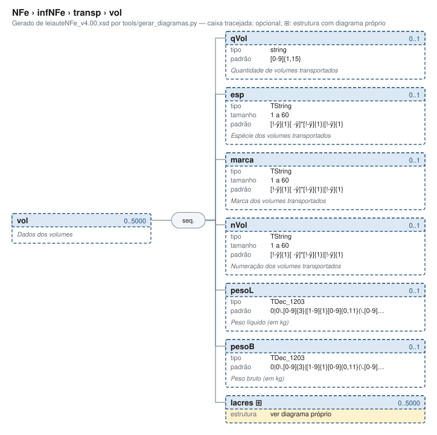

# vol — Dados dos volumes

[Manual](../../../README.md) › [NFe](../../../NFe.md) › [infNFe](../../infNFe.md) › [transp](../transp.md) › vol

<!-- estado-xsd:inicio -->
> **Estado: documentado.** Estrutura conferida contra a base XSD registrada.
>
> `Base atual e revisada: c537394250f913b591f3984f1de2e9d1a1ec94d334a0086e7a41f9850f5f7917`
<!-- estado-xsd:fim -->

| Informação | Base conferida |
|---|---|
| Caminho XML | `NFe/infNFe/transp/vol` |
| Leiaute / pacote XSD | NF-e/NFC-e 4.00 / PL010f v1.04, 31/08/2026 |
| Biblioteca conferida | libnfe 1.0.0-rc4, commit `1dd412eebca80dd80d884b3f03a1a31cfaf42279` |
| Revisão | 2026-10-05 |
| Contexto no leiaute | `0..5000` no pai, sujeito às sequências e escolhas abaixo |

## Finalidade e quando preencher

A modalidade do frete orienta a presença dos dados de transporte. Identifique o transportador, retenções, veículo, reboques e volumes quando a operação exigir. O construtor começa em modFrete=9; a biblioteca não conclui a modalidade a partir dos demais campos.

Descrição e observações do XSD adotado: Dados dos volumes. A estrutura e as restrições são as do pacote indicado; notas históricas de uso devem ser lidas junto às atualizações listadas nas referências.

## Estrutura, ordem e escolhas



[Abrir o diagrama](../../../../diagramas/NFe/infNFe/transp/vol.svg).

Uma ocorrência `1..1` dentro de uma alternativa exige o campo quando essa alternativa é selecionada; não obriga selecionar esse ramo em toda nota. Grupos opcionais podem conter filhos obrigatórios. Os elementos de sequência seguem a ordem indicada.

- **Sequência** `1..1`
  - `qVol` `0..1`
  - `esp` `0..1`
  - `marca` `0..1`
  - `nVol` `0..1`
  - `pesoL` `0..1`
  - `pesoB` `0..1`
  - `lacres` `0..5000`

## Campos e atributos

| Tag / atributo | Significado e observações | Tipo XML | Ocorrência | Formato / limites | Condição no contexto |
|---|---|---|---|---|---|
| `qVol` | Quantidade de volumes transportados | `string` | `0..1` | Padrão: `[0-9]{1,15}`<br>Tratamento de espaços: preserve | Opcional no contexto |
| `esp` | Espécie dos volumes transportados | `TString` | `0..1` | Mínimo: 1<br>Máximo: 60<br>Padrão: `[!-ÿ]{1}[ -ÿ]{0,}[!-ÿ]{1}\|[!-ÿ]{1}`<br>Tratamento de espaços: preserve | Opcional no contexto |
| `marca` | Marca dos volumes transportados | `TString` | `0..1` | Mínimo: 1<br>Máximo: 60<br>Padrão: `[!-ÿ]{1}[ -ÿ]{0,}[!-ÿ]{1}\|[!-ÿ]{1}`<br>Tratamento de espaços: preserve | Opcional no contexto |
| `nVol` | Numeração dos volumes transportados | `TString` | `0..1` | Mínimo: 1<br>Máximo: 60<br>Padrão: `[!-ÿ]{1}[ -ÿ]{0,}[!-ÿ]{1}\|[!-ÿ]{1}`<br>Tratamento de espaços: preserve | Opcional no contexto |
| `pesoL` | Peso líquido (em kg) | `TDec_1203` | `0..1` | Padrão: `0\|0\.[0-9]{3}\|[1-9]{1}[0-9]{0,11}(\.[0-9]{3})?`<br>Tratamento de espaços: preserve | Opcional no contexto |
| `pesoB` | Peso bruto (em kg) | `TDec_1203` | `0..1` | Padrão: `0\|0\.[0-9]{3}\|[1-9]{1}[0-9]{0,11}(\.[0-9]{3})?`<br>Tratamento de espaços: preserve | Opcional no contexto |
| [`lacres`](vol/lacres.md) | Uma ocorrência identifica um lacre do volume ao qual pertence. Adicione o lacre ao grupo de volume específico, e não à raiz de transp. | `complexType anônimo` | `0..5000` | Grupo estruturado | Opcional no contexto |

Campos decimais usam o separador `.` e a precisão indicada pelo tipo; preservar a representação textual evita perda por ponto flutuante. Ausência, texto vazio e zero são valores distintos. Padrões, comprimentos e enumerações precisam ser atendidos em conjunto; valores de códigos com zeros significativos devem conservar esses zeros. Campos de mesmo nome em outros pais têm contexto próprio.

## API C, integração e memória

Acesso pela API pública: `nfe_transp_grupo(transp)`. O grupo pertence ao objeto que o fornece. Use os caminhos completos a partir desse grupo; se um ancestral for uma lista, obtenha uma ocorrência com `nfe_grupo_add` antes de preencher seus filhos.

[Contrato público de transp.h](../../../api/transp.md) apresenta assinaturas, argumentos, retornos e limitações. [Convenções de memória e erros](../../../API.md) explica cópia, empréstimo e transferência de posse.

Ao usar um grupo emprestado, libere o objeto proprietário, nunca o grupo separadamente. Os setters de texto copiam seus valores; getters retornam texto interno emprestado. A escolha de outro ramo válido pode apagar o anterior. Os campos obrigatórios do motor são conferidos na escrita; validar um valor isolado não prova completude do grupo. Os contratos específicos prevalecem quando a função indicada não usa o motor.

## Exemplo C conferido

[Fonte completo do cenário teste_subgrupos](../../../../../tests/test_transp.c) contém o preenchimento, a conferência dos retornos e a liberação dos recursos. O cenário integra o programa de testes indicado, com os headers e apoios do repositório. O XML foi observado na serialização desse cenário e validado, não deduzido de um desenho.

```sh
make obj/test_transp
./obj/test_transp tests
```

A função abaixo é o cenário completo do teste, incluindo tratamento dos retornos e eventuais verificações de erros. O XML publicado foi observado na validação da linha **174** do fonte indicado; a função pode exercitar outras alterações antes/depois desse ponto.

<details>
<summary>Função C completa do cenário teste_subgrupos</summary>

```c
static void teste_subgrupos(void)
{
	nfe_transp *tr = nfe_transp_new();
	nfe_grupo *g = nfe_transp_grupo(tr), *reb, *vol, *lac;
	char *xml;
	int rc = 0;

	rc |= nfe_transp_set_modfrete(tr, NFE_FRETE_REMETENTE);
	rc |= nfe_grupo_set(g, "veicTransp/placa", "ABC1D23");
	rc |= nfe_grupo_set(g, "veicTransp/UF", "SP");
	rc |= nfe_grupo_add(g, "reboque", &reb);
	rc |= nfe_grupo_set(reb, "placa", "XYZ9A87");
	rc |= nfe_transp_add_vol(tr, "1", "CAIXA", NULL, NULL, NULL, NULL);
	vol = nfe_grupo_item(g, "vol", 0);
	VERIFICA(vol != NULL);
	rc |= nfe_grupo_add(vol, "lacres", &lac);
	rc |= nfe_grupo_set(lac, "nLacre", "LAC-1");
	VERIFICA_INT(rc, 0);
	xml = teste_gera(escreve, tr, &rc);
	VERIFICA_INT(rc, 0);
	VERIFICA(xml != NULL);
	if (xml) {
		VERIFICA(strstr(xml,
		                "<modFrete>0</modFrete><veicTransp><placa>"
		                "ABC1D23</placa><UF>SP</UF></veicTransp>"
		                "<reboque><placa>XYZ9A87</placa></reboque>"
		                "<vol><qVol>1</qVol><esp>CAIXA</esp><lacres>"
		                "<nLacre>LAC-1</nLacre></lacres></vol>") !=
		         NULL);
		VERIFICA_INT(teste_valida(xml), 0);
	}
	free(xml);

	/* vagao é outro ramo da escolha: apaga veículo e reboques */
	VERIFICA_INT(nfe_grupo_set(g, "vagao", "VAG-01"), 0);
	VERIFICA_INT(nfe_grupo_quantidade(g, "reboque"), 0);
	xml = teste_gera(escreve, tr, &rc);
	VERIFICA_INT(rc, 0);
	if (xml) {
		VERIFICA(strstr(xml, "veicTransp") == NULL);
		VERIFICA(strstr(xml, "<vagao>VAG-01</vagao><vol>") != NULL);
		VERIFICA_INT(teste_valida(xml), 0);
	}
	free(xml);
	nfe_transp_free(tr);
}
```

</details>

## XML correspondente

Trecho do cenário acima, com namespace preservado. [XML completo do cenário](../../../exemplos/grupos/test_transp-0005.xml) permite conferir valores e ancestrais. Dados sintéticos; este exemplo comprova estrutura e uso da API, sem transmissão, autorização ou validação de enquadramento fiscal.

```xml
<vol xmlns="http://www.portalfiscal.inf.br/nfe">
  <qVol>1</qVol>
  <esp>CAIXA</esp>
  <lacres>
    <nLacre>LAC-1</nLacre>
  </lacres>
</vol>

```

O fragmento é validado no contexto que o declara no leiaute, com namespace e ancestrais. O wrapper tipos_v4.00.xsd, quando usado nos testes, extrai essas declarações do schema oficial e é identificado como apoio de testes, sem substituir o pacote oficial.

## Validação, erros e limites

| Situação | Etapa / resultado | Tratamento |
|---|---|---|
| Ponteiro obrigatório nulo | API: `E_ISNULL` (-1), conforme contrato da função | Conferir criação e argumentos |
| Texto fora do comprimento | Setter/motor: `E_TAMANHO` (-2) | Usar os limites do tipo e do argumento C |
| Domínio, padrão ou caminho inválido/ambíguo | Setter/motor: `E_VALOR` (-3) | Corrigir o valor e usar caminho completo |
| Campo obrigatório ou escolha incompleta | Escrita do motor: `E_VALOR`; XSD rejeita | Completar o ramo selecionado |
| Falha de escrita XML | Writer: `E_XML` (-4) | Descartar saída parcial e tratar a falha |
| Falta de memória | Criação: NULL; operações que alocam podem retornar `E_MALLOC` (-101) | Encerrar com limpeza dos recursos ainda próprios |
| Regra fiscal, cadastro, cálculo ou vigência | Pode ser aceito lexicalmente; depende da regra e do autorizador | Conferir fontes e contratos; não confundir 0 com autorização |

Os códigos negativos são da biblioteca, não códigos cStat. [Validação e regras implementadas](../../../VALIDACAO.md) distingue XSD, verificações locais e retorno da SEFAZ. A referência da API identifica exceções aos comportamentos gerais desta tabela.

## Referências e grupos relacionados

- XSD atual: [leiaute](../../../../../tests/schemas/nfe/leiauteNFe_v4.00.xsd), [tipos básicos](../../../../../tests/schemas/nfe/tiposBasico_v4.00.xsd) e [tipos DFe/RTC](../../../../../tests/schemas/nfe/DFeTiposBasicos_v1.00.xsd).
- MOC 7.0, Anexo I: X, pp. 60–61. [Fontes oficiais, versões e transições](../../../BASES.md) relaciona atualizações posteriores, com vigência separada da publicação.
- API: [transp.h](../../../../../include/libnfe/transp.h) e [referência das funções](../../../api/transp.md).
- Grupo pai: [transp](../transp.md).
- Filhos: [lacres](vol/lacres.md).

Anterior: [reboque](reboque.md) | Próximo: [lacres](vol/lacres.md)
